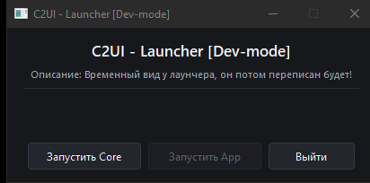

# C2UI लन्चर

<details align="center"><summary>&nbsp;🌐 <b>🇳🇵 नेपाली</b> &nbsp;·&nbsp; <sub>Language · Язык · 語言 · Idioma · Sprache · भाषा · لغة</sub></summary>

<table align="center">
<tr><td align="center"><a href="RU-ru.md">🇷🇺<br>Русский</a></td><td align="center"><a href="EN-en.md">🇬🇧<br>English</a></td><td align="center"><a href="PL-pl.md">🇵🇱<br>Polski</a></td><td align="center"><a href="UK-ua.md">🇺🇦<br>Українська</a></td><td align="center"><a href="DE-de.md">🇩🇪<br>Deutsch</a></td><td align="center"><a href="RO-md.md">🇲🇩<br>Moldovenească</a></td><td align="center"><a href="SL-si.md">🇸🇮<br>Slovenščina</a></td><td align="center"><a href="BE-by.md">🇧🇾<br>Беларуская</a></td></tr>
<tr><td align="center"><a href="KK-kz.md">🇰🇿<br>Қазақша</a></td><td align="center"><a href="JA-jp.md">🇯🇵<br>日本語</a></td><td align="center"><a href="ZH-cn.md">🇨🇳<br>中文</a></td><td align="center"><a href="SV-se.md">🇸🇪<br>Svenska</a></td><td align="center"><a href="ES-es.md">🇪🇸<br>Español</a></td><td align="center"><a href="HI-in.md">🇮🇳<br>हिन्दी</a></td><td align="center"><a href="PT-pt.md">🇵🇹<br>Português</a></td><td align="center"><a href="BN-bd.md">🇧🇩<br>বাংলা</a></td></tr>
<tr><td align="center"><a href="FR-fr.md">🇫🇷<br>Français</a></td><td align="center"><a href="TE-in.md">🇮🇳<br>తెలుగు</a></td><td align="center"><a href="MR-in.md">🇮🇳<br>मराठी</a></td><td align="center"><a href="TA-in.md">🇮🇳<br>தமிழ்</a></td><td align="center"><a href="TR-tr.md">🇹🇷<br>Türkçe</a></td><td align="center"><a href="UR-pk.md">🇵🇰<br>اردو</a></td><td align="center"><a href="VI-vn.md">🇻🇳<br>Tiếng Việt</a></td><td align="center"><a href="GU-in.md">🇮🇳<br>ગુજરાતી</a></td></tr>
<tr><td align="center"><a href="IT-it.md">🇮🇹<br>Italiano</a></td><td align="center"><a href="KO-kr.md">🇰🇷<br>한국어</a></td><td align="center"><a href="AR-sa.md">🇸🇦<br>العربية</a></td><td align="center"><a href="JV-id.md">🇮🇩<br>Basa Jawa</a></td><td align="center"><a href="ML-in.md">🇮🇳<br>മലയാളം</a></td><td align="center"><b>🇳🇵<br>नेपाली</b></td><td align="center"><a href="UZ-uz.md">🇺🇿<br>Oʻzbekcha</a></td><td align="center"><a href="OR-in.md">🇮🇳<br>ଓଡ଼ିଆ</a></td></tr>
</table>

</details>

`Launcher/` नै परियोजना सुरु हुने ठाउँ हो: शीर्षक, एक हरफको विवरण र तीन बटन भएको सानो गाढा विन्डो। यो Python इन्स्टल नचाहिने एउटै कार्यान्वयनयोग्य फाइलमा बन्छ, र परियोजना आफैँ फेला पार्छ — आफ्नो ठाउँबाट माथि जाँदै `App`, `Core` र `Launcher` सँगै देखिने ठाउँसम्म।

<p align="center"><br><sub>लन्चरको विन्डो: «Dev-mode» शीर्षक, विवरणको हरफ र तीन बटन।</sub></p>

> [!NOTE]
> **लन्चरको इन्टरफेस अहिले रुसी भाषामा मात्र छ — यो अस्थायी समाधान हो।** शीर्षक, विवरण र बटनका शब्द कोडमै लेखिएका छन्; अनुवाद सम्पादकको स्थानीयकरण (`Tools/Localization`) सँगै तब आउनेछ, जब तयार App का लागि लन्चर पुनः लेखिनेछ। परियोजनाका अन्य कागजात पहिले नै 32 भाषामा छन्।

## तीन बटन

| | |
|---|---|
| <code>Запустить Core</code> | सम्पादक सुरु गर्छ — भ्युपोर्ट, टाइमलाइन र प्यानलसहितको C2UI विन्डो। |
| <code>Запустить App</code> | निष्क्रिय: छुट्टै App अझै छैन। |
| <code>Выйти</code> | लन्चर बन्द गर्छ। |

## स्रोतबाट चलाउने

Windows, Python 3.13 र इन्स्टल गरिएको Source Filmmaker चाहिन्छ।

```bash
python -m venv .venv
.venv/Scripts/python.exe -m pip install -r Launcher/requirements.txt
.venv/Scripts/python.exe Launcher/launcher.py
```

एउटै फाइल `Launcher/Launcher-C2UI.exe` बनाउने (git मा राखिँदैन — स्रोतबाट पुनः बनाइन्छ):

```bash
.venv/Scripts/python.exe -m pip install pyinstaller
.venv/Scripts/python.exe Launcher/build_exe.py
```

## सम्पादकबिनाको इन्जिन

`Launcher/core.py` ले `Core` लाई एक्लै चलाउँछ: इन्स्टलेसन माउन्ट गर्छ, अनुक्रमणिका बनाउँछ र इन्जिनमाथि सानो सेल दिन्छ — मोडेल, सामग्री, टेक्स्चर, नक्सा, सत्र र तिनको गणना। यो पनि अस्थायी हो: App विन्डोबिना चल्न थालेपछि सम्पादक नै एक मात्र प्रवेशबिन्दु हुनेछ।

```bash
python Launcher/core.py
python Launcher/core.py model models/player/hwm/heavy.mdl
python Launcher/core.py map afd_warehouse
python Launcher/core.py eval <session.dmx> 6.0
```

## पछि के बदलिन्छ

- App आएपछि विन्डो पुनः लेखिनेछ — रूप र अनुवादसहित।
- «Запустить App» बटन काम गर्न थाल्नेछ।
- सम्पादक विन्डोबिना सुरु गर्न सकिएपछि `core.py` हट्नेछ।
- बनेको `.exe` GitHub का रिलिजसँग दिइनेछ।

<p align="center"><a href="../README/NE-np.md"></a></p>
