# Гатоўнасць C2UI — падрабязна

&nbsp;🌐 <b>🇧🇾 Беларуская</b> &nbsp;·&nbsp; Language · Язык · 語言 · Idioma · Sprache · भाषा · لغة

<table align="center">
<tr><td align="center"><a href="RU-ru.md">🇷🇺 Русский</a></td><td align="center"><a href="EN-en.md">🇬🇧 English</a></td><td align="center"><a href="PL-pl.md">🇵🇱 Polski</a></td><td align="center"><a href="UK-ua.md">🇺🇦 Українська</a></td><td align="center"><a href="DE-de.md">🇩🇪 Deutsch</a></td><td align="center"><a href="RO-md.md">🇲🇩 Moldovenească</a></td><td align="center"><a href="SL-si.md">🇸🇮 Slovenščina</a></td><td align="center"><b>🇧🇾 Беларуская</b></td></tr>
<tr><td align="center"><a href="KK-kz.md">🇰🇿 Қазақша</a></td><td align="center"><a href="JA-jp.md">🇯🇵 日本語</a></td><td align="center"><a href="ZH-cn.md">🇨🇳 中文</a></td><td align="center"><a href="SV-se.md">🇸🇪 Svenska</a></td><td align="center"><a href="ES-es.md">🇪🇸 Español</a></td><td align="center"><a href="HI-in.md">🇮🇳 हिन्दी</a></td><td align="center"><a href="PT-pt.md">🇵🇹 Português</a></td><td align="center"><a href="BN-bd.md">🇧🇩 বাংলা</a></td></tr>
<tr><td align="center"><a href="FR-fr.md">🇫🇷 Français</a></td><td align="center"><a href="TE-in.md">🇮🇳 తెలుగు</a></td><td align="center"><a href="MR-in.md">🇮🇳 मराठी</a></td><td align="center"><a href="TA-in.md">🇮🇳 தமிழ்</a></td><td align="center"><a href="TR-tr.md">🇹🇷 Türkçe</a></td><td align="center"><a href="UR-pk.md">🇵🇰 اردو</a></td><td align="center"><a href="VI-vn.md">🇻🇳 Tiếng Việt</a></td><td align="center"><a href="GU-in.md">🇮🇳 ગુજરાતી</a></td></tr>
<tr><td align="center"><a href="IT-it.md">🇮🇹 Italiano</a></td><td align="center"><a href="KO-kr.md">🇰🇷 한국어</a></td><td align="center"><a href="AR-sa.md">🇸🇦 العربية</a></td><td align="center"><a href="JV-id.md">🇮🇩 Basa Jawa</a></td><td align="center"><a href="ML-in.md">🇮🇳 മലയാളം</a></td><td align="center"><a href="NE-np.md">🇳🇵 नेपाली</a></td><td align="center"><a href="UZ-uz.md">🇺🇿 Oʻzbekcha</a></td><td align="center"><a href="OR-in.md">🇮🇳 ଓଡ଼ିଆ</a></td></tr>
</table>

 <b>Агульная гатоўнасць да рэлізу: 15%</b>

Кожная вобласць разгортваецца: што ўжо працуе і чаго пакуль няма. Працэнты — ацэнка адносна магчымасцей SFM.

Кожны працэнт — гэта **вобласць адносна таго, што робіць SFM у ёй**, а не адносна задуманага. Агульная лічба вымярае ўвесь прадукт побач з SFM і таму нашмат ніжэйшая: фарматы чытаюцца цалкам, але быць Source Filmmaker — гэта яшчэ каля 350 тыпаў элементаў `Dme*`, з якіх рухавік ведае 23.

###  Пошук і мантаванне SFM

Рэестр Steam → `libraryfolders.vdf` → шляхі з `gameinfo.txt` у парадку рухавіка. Шэсць мантаванняў на стандартнай устаноўцы. Нічога не пішацца па-за папкай праграмы.

###  Індэкс кантэнту

70 199 файлаў за 1,1 с холадна / 0,02 с з кэшу; перавызначэнні паміж мантаваннямі вырашаюцца як у рухавіку.

###  Мадэлі — <code>.mdl</code> <code>.vvd</code> <code>.vtx</code>

Версіі 44, 48, 49. Шкілет, мешы, усе ўзроўні дэталізацыі, body-групы. 1 500 мадэляў загружана, 0 збояў.

###  Матэрыялы — <code>.vmt</code>

Усе 19 554 матэрыялы ўстаноўкі чытаюцца; `patch`, DX-блокі, проксі.

###  Тэкстуры — <code>.vtf</code>

Версіі 7.0–7.5, DXT1/3/5 і ўсе несціснутыя фарматы, кубмапы, mip-узроўні. DXT ідзе ў GPU без распакоўкі.

###  Сесіі — <code>.dmx</code>

Binary 1–5 і KeyValues2. Кожная сесія і файл часціц устаноўкі запісваюцца назад **пабайтава ідэнтычна**.

###  Сесія на экране

Шоты і гукавыя дарожкі на таймлайне, дрэва элементаў, сцэна шота праз яго камеру, карта шота. Няма: часціц, гуку.

###  Анімацыя

Каналы і логі вылічаюцца на курсоры; скрабінг і прайграванне. Косткі, камеры, бачнасць ідуць за сесіяй.

###  Твары

Flex-кантролеры, скампіляваныя правілы і вяршынныя дэльты — персанажы гавораць і грымаснічаюць. Няма: wrinkle-карт.

###  Рыгі

Выразы, point/orient/parent/aim-канстрэйнты, двухзвённы IK. Няма: поўнага графа залежнасцей аператараў, стварэння рыгаў.

###  Рэдагаванне

Выбар клікам, маніпулятар перамяшчэння/павароту, інспектар любога атрыбута, ключ на курсоры, адмена/паўтор, пабайтава дакладнае захаванне.

###  Motion editor

Вылучэнне часу з hold і falloff на лінейцы; праўка расцякаецца па вылучэнні, як у SFM. Няма: прэсэтаў, слаёў.

###  Graph editor

Крывыя кожнага лога выбранага элемента: X/Y/Z, pitch/yaw/roll, скаляры. Ключы рухаюцца мышшу па часе і значэнні з жывым праглядам, устаўляюцца падвойным клікам, выдаляюцца; вось часу агульная з таймлайнам. Няма: датычных і тыпаў крывых, маштабавання групы ключоў.

###  Докінг панэляў

Перацягванне панэляў на крыжавіну мэт з папярэднім праглядам, як у UE5 і Visual Studio. Няма: захаваных раскладак, тэм.

###  Шэйдынг Source

Святло сесіі (DmeProjectedLight): фрустум, згасанне Source, спад да maxDistance; half-lambert, $lightwarptexture, phong, $rimlight, $selfillum. Свет карты — па лайтмапах; мадэлі асвятляюць ambient-кубы і world lights карты. Няма: ценяў, гобо-тэкстур, $bumpmap, $envmap.

###  Карты — <code>.bsp</code>

Версіі 19–21: геаметрыя свету, displacement-рэльеф, brush-энтыці, статычныя пропы, матэрыялы з pak-лампа карты, лайтмапы, скайбокс вакол камеры. Адсячэнне па пірамідзе камеры. Няма: вады, prop_dynamic.

###  Рэндэр у выяву і відэа

PNG/TGA-паслядоўнасці і AVI/MP4 з сесіі: уся сесія, бягучы шот або дыяпазон; прэсеты; File → Export, Ctrl+E. Няма: гуку ў відэа.

###  Плагіны <code>.c2plg</code>

Не пачата.

###  Тэмы і працоўныя прасторы

Свядома адкладзена: адна тэма, пакуль рэдактару няма чаго афармляць.

**Да рэлізу не гатовы.** Падмурак — кожны фармат SFM, прачытаны правільна і правераны на ўсёй устаноўцы, — ёсць і пакрыты тэстамі; сесію можна адкрыць, прайграць, змяніць і захаваць. Не хапае *зручнасці* працы: graph editor, шэйдынгу Source, карт, экспарту. Нумар версіі з'явіцца, калі аніматар зможа адпрацаваць у ім дзень.

