# C2UI-এর প্রস্তুতি — বিস্তারিত

&nbsp;🌐 <b>🇧🇩 বাংলা</b> &nbsp;·&nbsp; Language · Язык · 語言 · Idioma · Sprache · भाषा · لغة

<table align="center">
<tr><td align="center"><a href="RU-ru.md">🇷🇺 Русский</a></td><td align="center"><a href="EN-en.md">🇬🇧 English</a></td><td align="center"><a href="PL-pl.md">🇵🇱 Polski</a></td><td align="center"><a href="UK-ua.md">🇺🇦 Українська</a></td><td align="center"><a href="DE-de.md">🇩🇪 Deutsch</a></td><td align="center"><a href="RO-md.md">🇲🇩 Moldovenească</a></td><td align="center"><a href="SL-si.md">🇸🇮 Slovenščina</a></td><td align="center"><a href="BE-by.md">🇧🇾 Беларуская</a></td></tr>
<tr><td align="center"><a href="KK-kz.md">🇰🇿 Қазақша</a></td><td align="center"><a href="JA-jp.md">🇯🇵 日本語</a></td><td align="center"><a href="ZH-cn.md">🇨🇳 中文</a></td><td align="center"><a href="SV-se.md">🇸🇪 Svenska</a></td><td align="center"><a href="ES-es.md">🇪🇸 Español</a></td><td align="center"><a href="HI-in.md">🇮🇳 हिन्दी</a></td><td align="center"><a href="PT-pt.md">🇵🇹 Português</a></td><td align="center"><b>🇧🇩 বাংলা</b></td></tr>
<tr><td align="center"><a href="FR-fr.md">🇫🇷 Français</a></td><td align="center"><a href="TE-in.md">🇮🇳 తెలుగు</a></td><td align="center"><a href="MR-in.md">🇮🇳 मराठी</a></td><td align="center"><a href="TA-in.md">🇮🇳 தமிழ்</a></td><td align="center"><a href="TR-tr.md">🇹🇷 Türkçe</a></td><td align="center"><a href="UR-pk.md">🇵🇰 اردو</a></td><td align="center"><a href="VI-vn.md">🇻🇳 Tiếng Việt</a></td><td align="center"><a href="GU-in.md">🇮🇳 ગુજરાતી</a></td></tr>
<tr><td align="center"><a href="IT-it.md">🇮🇹 Italiano</a></td><td align="center"><a href="KO-kr.md">🇰🇷 한국어</a></td><td align="center"><a href="AR-sa.md">🇸🇦 العربية</a></td><td align="center"><a href="JV-id.md">🇮🇩 Basa Jawa</a></td><td align="center"><a href="ML-in.md">🇮🇳 മലയാളം</a></td><td align="center"><a href="NE-np.md">🇳🇵 नेपाली</a></td><td align="center"><a href="UZ-uz.md">🇺🇿 Oʻzbekcha</a></td><td align="center"><a href="OR-in.md">🇮🇳 ଓଡ଼ିଆ</a></td></tr>
</table>

 <b>রিলিজের জন্য সামগ্রিক প্রস্তুতি: 51%</b>

প্রতিটি ক্ষেত্র খোলা যায়: কী ইতিমধ্যে কাজ করে আর কী এখনো নেই। শতাংশ SFM-এর সক্ষমতার তুলনায় একটি অনুমান।

###  SFM খোঁজা ও মাউন্ট করা

Steam রেজিস্ট্রি → `libraryfolders.vdf` → `gameinfo.txt`-এর সার্চ পাথ, ইঞ্জিনের ক্রমে। স্ট্যান্ডার্ড ইনস্টলে ছয়টি মাউন্ট। অ্যাপ্লিকেশন ফোল্ডারের বাইরে কিছু লেখা হয় না।

###  কনটেন্ট ইনডেক্স

৭০ ১৯৯ ফাইল ১.১ সেকেন্ডে ঠান্ডা / ০.০২ সেকেন্ডে ক্যাশ থেকে; মাউন্টের মধ্যে ওভাররাইড ঠিক ইঞ্জিনের মতো সমাধান হয়।

###  মডেল — <code>.mdl</code> <code>.vvd</code> <code>.vtx</code>

সংস্করণ ৪৪, ৪৮, ৪৯। কঙ্কাল, মেশ, সব ডিটেইল লেভেল, বডি গ্রুপ। ১ ৫০০ মডেল লোড, ০ ব্যর্থতা।

###  ম্যাটেরিয়াল — <code>.vmt</code>

সব ১৯ ৫৫৪টি ম্যাটেরিয়াল পড়া যায়; `patch`, DX ব্লক, প্রক্সি।

###  টেক্সচার — <code>.vtf</code>

সংস্করণ ৭.০–৭.৫, DXT1/3/5 ও সব অসংকুচিত ফরম্যাট, কিউবম্যাপ, মিপ। DXT ডিকোড ছাড়াই GPU-তে যায়।

###  সেশন — <code>.dmx</code>

বাইনারি ১–৫ ও KeyValues2। ইনস্টলেশনের প্রতিটি সেশন ও পার্টিকল ফাইল **বাইটে বাইটে** ফিরে লেখা হয়।

###  পর্দায় সেশন

টাইমলাইনে শট ও সাউন্ড ট্র্যাক, এলিমেন্ট ট্রি, প্রতিটি শটের দৃশ্য তার ক্যামেরায়। এখনো নয়: ম্যাপ, পার্টিকল, শব্দ।

###  অ্যানিমেশন

কার্সরে চ্যানেল ও লগ মূল্যায়ন; স্ক্রাব ও প্লে। হাড়, ক্যামেরা ও দৃশ্যমানতা সেশন অনুসরণ করে।

###  মুখ

Flex কন্ট্রোলার, কম্পাইল করা নিয়ম ও ভার্টেক্স অ্যানিমেশন — চরিত্ররা কথা বলে ও অভিব্যক্তি দেখায়। এখনো নয়: রিঙ্কল ম্যাপ।

###  রিগ

এক্সপ্রেশন, point/orient/parent/aim কনস্ট্রেইন্ট, দুই-হাড় IK। এখনো নয়: পূর্ণ অপারেটর নির্ভরতা গ্রাফ, রিগ তৈরি।

###  সম্পাদনা

ক্লিকে নির্বাচন, মুভ/রোটেট ম্যানিপুলেটর, যেকোনো অ্যাট্রিবিউটের ইন্সপেক্টর, কার্সরে কী, আনডু/রিডু, বাইট-নিখুঁত সেভ।

###  মোশন এডিটর

রুলারে হোল্ড ও ফলঅফ সহ সময় নির্বাচন; সম্পাদনা SFM-এর মতো তার উপর ছড়ায়। এখনো নয়: প্রিসেট, লেয়ার।

###  গ্রাফ এডিটর

নির্বাচিত এলিমেন্ট চালানো প্রতিটি লগের কার্ভ: X/Y/Z, pitch/yaw/roll, স্কেলার। কী লাইভ প্রিভিউ সহ সময় ও মানে টানা যায়, ডাবল-ক্লিকে যোগ, Delete-এ মুছে; সময় অক্ষ টাইমলাইনের। এখনো নয়: ট্যানজেন্ট ও কার্ভ টাইপ, কী গ্রুপ স্কেলিং।

###  প্যানেল ডকিং

UE5 ও Visual Studio-র মতো, প্রিভিউ সহ লক্ষ্যের কম্পাসে প্যানেল টানুন। এখনো নয়: সংরক্ষিত লেআউট, থিম।

###  Source শেডিং

সেশন লাইট (DmeProjectedLight): ফ্রাস্টাম, Source ক্ষীণতা, maxDistance পর্যন্ত ম্লান; হাফ-ল্যাম্বার্ট, $lightwarptexture, phong ($phongexponent/boost/fresnelranges), $rimlight, $selfillum। ম্যাপের জগৎ লাইটম্যাপে। এখনো নয়: ছায়া, গোবো টেক্সচার, $bumpmap, $envmap, অ্যাম্বিয়েন্ট কিউব, স্কাইবক্স।

###  ম্যাপ — <code>.bsp</code>

সংস্করণ ১৯–২১: বিশ্ব জ্যামিতি, ডিসপ্লেসমেন্ট ভূমি, ব্রাশ এনটিটি, স্থির প্রপ, ম্যাপের নিজস্ব pak ম্যাটেরিয়াল। ফ্রাস্টাম কালিং। এখনো নয়: লাইটম্যাপ, স্কাইবক্স, জল, prop_dynamic।

###  ছবি ও ভিডিওতে রেন্ডার

শুরু হয়নি।

###  প্লাগইন <code>.c2plg</code>

শুরু হয়নি।

###  থিম ও ওয়ার্কস্পেস

ইচ্ছাকৃতভাবে পরে: এডিটরে সাজানোর মতো কিছু না হওয়া পর্যন্ত একটাই চেহারা।

**রিলিজের জন্য প্রস্তুত নয়।** ভিত্তি — SFM যে প্রতিটি ফাইল ফরম্যাট ব্যবহার করে, সঠিকভাবে পড়া ও পুরো ইনস্টলেশনে যাচাই করা — আছে ও পরীক্ষিত; সেশন খোলা, চালানো, বদলানো ও সেভ করা যায়। যা নেই তা কাজের *স্বাচ্ছন্দ্য*: গ্রাফ এডিটর, Source শেডিং, ম্যাপ, এক্সপোর্ট। একজন অ্যানিমেটর এতে এক দিনের কাজ করতে না পারা পর্যন্ত কোনো সংস্করণ নম্বর নয়।

