# C2UI readiness in detail

&nbsp;🌐 <b>🇬🇧 English</b> &nbsp;·&nbsp; Language · Язык · 語言 · Idioma · Sprache · भाषा · لغة

<table align="center">
<tr><td align="center"><a href="RU-ru.md">🇷🇺 Русский</a></td><td align="center"><b>🇬🇧 English</b></td><td align="center"><a href="PL-pl.md">🇵🇱 Polski</a></td><td align="center"><a href="UK-ua.md">🇺🇦 Українська</a></td><td align="center"><a href="DE-de.md">🇩🇪 Deutsch</a></td><td align="center"><a href="RO-md.md">🇲🇩 Moldovenească</a></td><td align="center"><a href="SL-si.md">🇸🇮 Slovenščina</a></td><td align="center"><a href="BE-by.md">🇧🇾 Беларуская</a></td></tr>
<tr><td align="center"><a href="KK-kz.md">🇰🇿 Қазақша</a></td><td align="center"><a href="JA-jp.md">🇯🇵 日本語</a></td><td align="center"><a href="ZH-cn.md">🇨🇳 中文</a></td><td align="center"><a href="SV-se.md">🇸🇪 Svenska</a></td><td align="center"><a href="ES-es.md">🇪🇸 Español</a></td><td align="center"><a href="HI-in.md">🇮🇳 हिन्दी</a></td><td align="center"><a href="PT-pt.md">🇵🇹 Português</a></td><td align="center"><a href="BN-bd.md">🇧🇩 বাংলা</a></td></tr>
<tr><td align="center"><a href="FR-fr.md">🇫🇷 Français</a></td><td align="center"><a href="TE-in.md">🇮🇳 తెలుగు</a></td><td align="center"><a href="MR-in.md">🇮🇳 मराठी</a></td><td align="center"><a href="TA-in.md">🇮🇳 தமிழ்</a></td><td align="center"><a href="TR-tr.md">🇹🇷 Türkçe</a></td><td align="center"><a href="UR-pk.md">🇵🇰 اردو</a></td><td align="center"><a href="VI-vn.md">🇻🇳 Tiếng Việt</a></td><td align="center"><a href="GU-in.md">🇮🇳 ગુજરાતી</a></td></tr>
<tr><td align="center"><a href="IT-it.md">🇮🇹 Italiano</a></td><td align="center"><a href="KO-kr.md">🇰🇷 한국어</a></td><td align="center"><a href="AR-sa.md">🇸🇦 العربية</a></td><td align="center"><a href="JV-id.md">🇮🇩 Basa Jawa</a></td><td align="center"><a href="ML-in.md">🇮🇳 മലയാളം</a></td><td align="center"><a href="NE-np.md">🇳🇵 नेपाली</a></td><td align="center"><a href="UZ-uz.md">🇺🇿 Oʻzbekcha</a></td><td align="center"><a href="OR-in.md">🇮🇳 ଓଡ଼ିଆ</a></td></tr>
</table>

 <b>Overall readiness for release: 55%</b>

Each area expands: what already works and what does not yet. The percentages are an estimate against what SFM can do.

###  Finding and mounting SFM

Steam registry → `libraryfolders.vdf` → the search paths of `gameinfo.txt`, in the engine's own order. Six mounts on a stock install. Nothing is written outside the application folder.

###  Content index

70 199 files in 1.1 s cold / 0.02 s warm; overrides between mounts resolved exactly as the engine does.

###  Models — <code>.mdl</code> <code>.vvd</code> <code>.vtx</code>

Versions 44, 48, 49. Skeleton, meshes, every level of detail, body groups. 1 500 models loaded, 0 failures.

###  Materials — <code>.vmt</code>

All 19 554 shipped materials parse; `patch`, DX-level blocks, proxies.

###  Textures — <code>.vtf</code>

Versions 7.0–7.5, DXT1/3/5 and every uncompressed format, cubemaps, mips. DXT goes to the GPU without decoding.

###  Sessions — <code>.dmx</code>

Binary 1–5 and KeyValues2. Every session and particle file in the install writes back **byte for byte**.

###  Session on screen

Shots and sound tracks on a timeline, the element tree, each shot's scene through its camera, the shot's map. Not yet: particles, sound.

###  Animation

Channels and logs evaluated at the cursor; scrub and play. Bones, cameras and visibility follow the session.

###  Faces

Flex controllers, the compiled rules and vertex animation — characters talk and emote. Not yet: wrinkle maps.

###  Rigs

Expressions, point/orient/parent/aim constraints, two-bone IK. Not yet: the full operator dependency graph, rig creation.

###  Editing

Click to select, a move/rotate manipulator, an inspector for any attribute, a key at the cursor, undo/redo, byte-exact save.

###  Motion editor

A time selection with hold and falloff on the ruler; an edit spreads over it as in SFM. Not yet: presets, layers.

###  Graph editor

Curves of every log driving the selected element: X/Y/Z, pitch/yaw/roll, scalars. Keys drag in time and value with a live preview, double-click inserts, Delete removes; the time axis is the timeline's. Not yet: tangents and curve types, scaling a group of keys.

###  Panel docking

Drag panels onto a compass of targets with a preview, as in UE5 and Visual Studio. Not yet: saved layouts, themes.

###  Source shading

Session lights (DmeProjectedLight): frustum, Source's attenuation, fade to maxDistance; half-lambert, $lightwarptexture, phong, $rimlight, $selfillum. The map's world by its lightmaps; models lit by the map's ambient cubes and world lights. Not yet: shadows, gobo textures, $bumpmap, $envmap.

###  Maps — <code>.bsp</code>

Versions 19–21: world geometry, displacement terrain, brush entities, static props, the map's own pak materials, lightmaps, the skybox around the camera. Frustum culling. Not yet: water, prop_dynamic.

###  Rendering to image and video

PNG/TGA sequences and AVI/MP4 movies from the session: the whole session, the current shot or a range; presets; File → Export, Ctrl+E. Not yet: sound in the movie.

###  Plugins <code>.c2plg</code>

Not started.

###  Themes and workspaces

Deliberately later: one look until the editor has something worth theming.

**Not ready for release.** The foundation — every file format SFM uses, read correctly and verified against the whole installation — is in place and tested, and a session can be opened, played, changed and saved. What is missing is the *comfort* of working: the graph editor, Source shading, maps, export. No version number until an animator can do a day's work in it.

