# Estado de C2UI en detalle

&nbsp;🌐 <b>🇪🇸 Español</b> &nbsp;·&nbsp; Language · Язык · 語言 · Idioma · Sprache · भाषा · لغة

<table align="center">
<tr><td align="center"><a href="RU-ru.md">🇷🇺 Русский</a></td><td align="center"><a href="EN-en.md">🇬🇧 English</a></td><td align="center"><a href="PL-pl.md">🇵🇱 Polski</a></td><td align="center"><a href="UK-ua.md">🇺🇦 Українська</a></td><td align="center"><a href="DE-de.md">🇩🇪 Deutsch</a></td><td align="center"><a href="RO-md.md">🇲🇩 Moldovenească</a></td><td align="center"><a href="SL-si.md">🇸🇮 Slovenščina</a></td><td align="center"><a href="BE-by.md">🇧🇾 Беларуская</a></td></tr>
<tr><td align="center"><a href="KK-kz.md">🇰🇿 Қазақша</a></td><td align="center"><a href="JA-jp.md">🇯🇵 日本語</a></td><td align="center"><a href="ZH-cn.md">🇨🇳 中文</a></td><td align="center"><a href="SV-se.md">🇸🇪 Svenska</a></td><td align="center"><b>🇪🇸 Español</b></td><td align="center"><a href="HI-in.md">🇮🇳 हिन्दी</a></td><td align="center"><a href="PT-pt.md">🇵🇹 Português</a></td><td align="center"><a href="BN-bd.md">🇧🇩 বাংলা</a></td></tr>
<tr><td align="center"><a href="FR-fr.md">🇫🇷 Français</a></td><td align="center"><a href="TE-in.md">🇮🇳 తెలుగు</a></td><td align="center"><a href="MR-in.md">🇮🇳 मराठी</a></td><td align="center"><a href="TA-in.md">🇮🇳 தமிழ்</a></td><td align="center"><a href="TR-tr.md">🇹🇷 Türkçe</a></td><td align="center"><a href="UR-pk.md">🇵🇰 اردو</a></td><td align="center"><a href="VI-vn.md">🇻🇳 Tiếng Việt</a></td><td align="center"><a href="GU-in.md">🇮🇳 ગુજરાતી</a></td></tr>
<tr><td align="center"><a href="IT-it.md">🇮🇹 Italiano</a></td><td align="center"><a href="KO-kr.md">🇰🇷 한국어</a></td><td align="center"><a href="AR-sa.md">🇸🇦 العربية</a></td><td align="center"><a href="JV-id.md">🇮🇩 Basa Jawa</a></td><td align="center"><a href="ML-in.md">🇮🇳 മലയാളം</a></td><td align="center"><a href="NE-np.md">🇳🇵 नेपाली</a></td><td align="center"><a href="UZ-uz.md">🇺🇿 Oʻzbekcha</a></td><td align="center"><a href="OR-in.md">🇮🇳 ଓଡ଼ିଆ</a></td></tr>
</table>

 <b>Preparación general para el lanzamiento: 15%</b>

Cada área se despliega: qué funciona ya y qué no existe todavía. Los porcentajes son una estimación frente a lo que puede hacer SFM.

Cada porcentaje mide **un área frente a lo que SFM hace en ella**, no frente a lo planeado. La cifra global mide todo el producto junto a SFM y es mucho más baja: los formatos se leen por completo, pero ser Source Filmmaker son unos 350 tipos de elementos `Dme*`, de los que el motor conoce 23.

###  Encontrar y montar SFM

Registro de Steam → `libraryfolders.vdf` → las rutas de búsqueda de `gameinfo.txt`, en el orden del motor. Seis montajes en una instalación estándar. No se escribe nada fuera de la carpeta de la aplicación.

###  Índice de contenido

70 199 archivos en 1,1 s en frío / 0,02 s en caliente; las sobrescrituras entre montajes se resuelven exactamente como el motor.

###  Modelos — <code>.mdl</code> <code>.vvd</code> <code>.vtx</code>

Versiones 44, 48, 49. Esqueleto, mallas, todos los niveles de detalle, grupos de cuerpo. 1 500 modelos cargados, 0 fallos.

###  Materiales — <code>.vmt</code>

Los 19 554 materiales incluidos se leen; `patch`, bloques DX, proxies.

###  Texturas — <code>.vtf</code>

Versiones 7.0–7.5, DXT1/3/5 y todos los formatos sin comprimir, cubemaps, mips. DXT va a la GPU sin decodificar.

###  Sesiones — <code>.dmx</code>

Binario 1–5 y KeyValues2. Cada sesión y archivo de partículas de la instalación se reescribe **byte a byte**.

###  Sesión en pantalla

Planos y pistas de sonido en la línea de tiempo, el árbol de elementos, la escena de cada plano a través de su cámara, el mapa del plano. Aún no: partículas, sonido.

###  Animación

Canales y logs evaluados en el cursor; scrub y reproducción. Huesos, cámaras y visibilidad siguen la sesión.

###  Caras

Controladores flex, las reglas compiladas y animación de vértices — los personajes hablan y gesticulan. Aún no: mapas de arrugas.

###  Rigs

Expresiones, restricciones point/orient/parent/aim, IK de dos huesos. Aún no: el grafo completo de dependencias de operadores, creación de rigs.

###  Edición

Clic para seleccionar, manipulador de mover/rotar, inspector de cualquier atributo, clave en el cursor, deshacer/rehacer, guardado exacto al byte.

###  Motion editor

Selección de tiempo con hold y falloff en la regla; una edición se extiende sobre ella como en SFM. Aún no: presets, capas.

###  Editor de gráficas

Curvas de cada log que mueve el elemento seleccionado: X/Y/Z, pitch/yaw/roll, escalares. Las claves se arrastran en tiempo y valor con vista previa en vivo, doble clic inserta, Supr borra; el eje de tiempo es el de la línea de tiempo. Aún no: tangentes y tipos de curva, escalar un grupo de claves.

###  Acoplamiento de paneles

Arrastra paneles a una brújula de destinos con vista previa, como en UE5 y Visual Studio. Aún no: diseños guardados, temas.

###  Sombreado Source

Luces de la sesión (DmeProjectedLight): frustum, atenuación de Source, desvanecimiento hasta maxDistance; half-lambert, $lightwarptexture, phong, $rimlight, $selfillum. El mundo del mapa por sus lightmaps; los modelos iluminados por los cubos ambientales y las luces del mapa. Aún no: sombras, texturas gobo, $bumpmap, $envmap.

###  Mapas — <code>.bsp</code>

Versiones 19–21: geometría del mundo, terreno displacement, brush entities, props estáticos, materiales pak del mapa, lightmaps, el skybox alrededor de la cámara. Recorte por frustum. Aún no: agua, prop_dynamic.

###  Renderizado a imagen y vídeo

Secuencias PNG/TGA y películas AVI/MP4 desde la sesión: toda la sesión, el plano actual o un rango; presets; File → Export, Ctrl+E. Aún no: sonido en la película.

###  Plugins <code>.c2plg</code>

No iniciado.

###  Temas y espacios de trabajo

Deliberadamente después: un solo aspecto hasta que el editor tenga algo que merezca tematizarse.

**No está listo para el lanzamiento.** La base — cada formato de archivo que usa SFM, leído correctamente y verificado contra toda la instalación — está y está probada; una sesión se puede abrir, reproducir, cambiar y guardar. Lo que falta es la *comodidad* del trabajo: el editor de gráficas, el sombreado Source, mapas, exportación. Sin número de versión hasta que un animador pueda hacer un día de trabajo en él.

