# Avancement de C2UI en détail

&nbsp;🌐 <b>🇫🇷 Français</b> &nbsp;·&nbsp; Language · Язык · 語言 · Idioma · Sprache · भाषा · لغة

<table align="center">
<tr><td align="center"><a href="RU-ru.md">🇷🇺 Русский</a></td><td align="center"><a href="EN-en.md">🇬🇧 English</a></td><td align="center"><a href="PL-pl.md">🇵🇱 Polski</a></td><td align="center"><a href="UK-ua.md">🇺🇦 Українська</a></td><td align="center"><a href="DE-de.md">🇩🇪 Deutsch</a></td><td align="center"><a href="RO-md.md">🇲🇩 Moldovenească</a></td><td align="center"><a href="SL-si.md">🇸🇮 Slovenščina</a></td><td align="center"><a href="BE-by.md">🇧🇾 Беларуская</a></td></tr>
<tr><td align="center"><a href="KK-kz.md">🇰🇿 Қазақша</a></td><td align="center"><a href="JA-jp.md">🇯🇵 日本語</a></td><td align="center"><a href="ZH-cn.md">🇨🇳 中文</a></td><td align="center"><a href="SV-se.md">🇸🇪 Svenska</a></td><td align="center"><a href="ES-es.md">🇪🇸 Español</a></td><td align="center"><a href="HI-in.md">🇮🇳 हिन्दी</a></td><td align="center"><a href="PT-pt.md">🇵🇹 Português</a></td><td align="center"><a href="BN-bd.md">🇧🇩 বাংলা</a></td></tr>
<tr><td align="center"><b>🇫🇷 Français</b></td><td align="center"><a href="TE-in.md">🇮🇳 తెలుగు</a></td><td align="center"><a href="MR-in.md">🇮🇳 मराठी</a></td><td align="center"><a href="TA-in.md">🇮🇳 தமிழ்</a></td><td align="center"><a href="TR-tr.md">🇹🇷 Türkçe</a></td><td align="center"><a href="UR-pk.md">🇵🇰 اردو</a></td><td align="center"><a href="VI-vn.md">🇻🇳 Tiếng Việt</a></td><td align="center"><a href="GU-in.md">🇮🇳 ગુજરાતી</a></td></tr>
<tr><td align="center"><a href="IT-it.md">🇮🇹 Italiano</a></td><td align="center"><a href="KO-kr.md">🇰🇷 한국어</a></td><td align="center"><a href="AR-sa.md">🇸🇦 العربية</a></td><td align="center"><a href="JV-id.md">🇮🇩 Basa Jawa</a></td><td align="center"><a href="ML-in.md">🇮🇳 മലയാളം</a></td><td align="center"><a href="NE-np.md">🇳🇵 नेपाली</a></td><td align="center"><a href="UZ-uz.md">🇺🇿 Oʻzbekcha</a></td><td align="center"><a href="OR-in.md">🇮🇳 ଓଡ଼ିଆ</a></td></tr>
</table>

 <b>Avancement global vers la sortie : 60%</b>

Chaque domaine se déplie : ce qui fonctionne déjà et ce qui n'existe pas encore. Les pourcentages sont une estimation par rapport à ce que sait faire SFM.

###  Trouver et monter SFM

Registre Steam → `libraryfolders.vdf` → les chemins de recherche de `gameinfo.txt`, dans l'ordre du moteur. Six montages sur une installation standard. Rien n'est écrit hors du dossier de l'application.

###  Index du contenu

70 199 fichiers en 1,1 s à froid / 0,02 s à chaud ; les surcharges entre montages sont résolues exactement comme le moteur.

###  Modèles — <code>.mdl</code> <code>.vvd</code> <code>.vtx</code>

Versions 44, 48, 49. Squelette, maillages, tous les niveaux de détail, groupes de corps. 1 500 modèles chargés, 0 échec.

###  Matériaux — <code>.vmt</code>

Les 19 554 matériaux fournis se lisent ; `patch`, blocs DX, proxies.

###  Textures — <code>.vtf</code>

Versions 7.0–7.5, DXT1/3/5 et tous les formats non compressés, cubemaps, mips. Le DXT part au GPU sans décodage.

###  Sessions — <code>.dmx</code>

Binaire 1–5 et KeyValues2. Chaque session et fichier de particules de l'installation se réécrit **octet pour octet**.

###  Session à l'écran

Plans et pistes son sur la timeline, l'arbre des éléments, la scène de chaque plan par sa caméra, la carte du plan. Pas encore : particules, son.

###  Animation

Canaux et logs évalués au curseur ; scrub et lecture. Os, caméras et visibilité suivent la session.

###  Visages

Contrôleurs flex, règles compilées et animation de sommets — les personnages parlent et expriment. Pas encore : cartes de rides.

###  Rigs

Expressions, contraintes point/orient/parent/aim, IK à deux os. Pas encore : le graphe complet de dépendances des opérateurs, la création de rigs.

###  Édition

Clic pour sélectionner, manipulateur de déplacement/rotation, inspecteur de tout attribut, clé au curseur, annuler/rétablir, sauvegarde exacte à l'octet.

###  Motion editor

Sélection temporelle avec hold et falloff sur la règle ; une édition se répand dessus comme dans SFM. Pas encore : presets, calques.

###  Éditeur de courbes

Courbes de chaque log pilotant l'élément sélectionné : X/Y/Z, pitch/yaw/roll, scalaires. Les clés se déplacent en temps et en valeur avec aperçu en direct, double-clic insère, Suppr efface ; l'axe du temps est celui de la timeline. Pas encore : tangentes et types de courbe, mise à l'échelle d'un groupe de clés.

###  Ancrage des panneaux

Glissez les panneaux sur une boussole de cibles avec aperçu, comme dans UE5 et Visual Studio. Pas encore : dispositions enregistrées, thèmes.

###  Ombrage Source

Lumières de session (DmeProjectedLight) : frustum, atténuation Source, fondu jusqu'à maxDistance ; half-lambert, $lightwarptexture, phong, $rimlight, $selfillum. Le monde de la carte par ses lightmaps ; les modèles éclairés par les cubes ambiants et les lumières de la carte. Pas encore : ombres, textures gobo, $bumpmap, $envmap.

###  Cartes — <code>.bsp</code>

Versions 19–21 : géométrie du monde, terrain displacement, brush entities, props statiques, matériaux pak de la carte, lightmaps, la skybox autour de la caméra. Élimination par frustum. Pas encore : l'eau, prop_dynamic.

###  Rendu en image et vidéo

Séquences PNG/TGA et films AVI/MP4 depuis la session : toute la session, le plan courant ou une plage ; presets ; File → Export, Ctrl+E. Pas encore : le son dans le film.

###  Plugins <code>.c2plg</code>

Pas commencé.

###  Thèmes et espaces de travail

Volontairement plus tard : une seule apparence tant que l'éditeur n'a rien qui mérite un thème.

**Pas prêt pour une sortie.** Les fondations — chaque format de fichier utilisé par SFM, lu correctement et vérifié sur toute l'installation — sont là et testées ; une session s'ouvre, se lit, se modifie et se sauvegarde. Ce qui manque, c'est le *confort* de travail : l'éditeur de courbes, l'ombrage Source, les cartes, l'export. Pas de numéro de version tant qu'un animateur ne peut pas y faire une journée de travail.

