# C2UI की तैयारी — विस्तार से

&nbsp;🌐 <b>🇮🇳 हिन्दी</b> &nbsp;·&nbsp; Language · Язык · 語言 · Idioma · Sprache · भाषा · لغة

<table align="center">
<tr><td align="center"><a href="RU-ru.md">🇷🇺 Русский</a></td><td align="center"><a href="EN-en.md">🇬🇧 English</a></td><td align="center"><a href="PL-pl.md">🇵🇱 Polski</a></td><td align="center"><a href="UK-ua.md">🇺🇦 Українська</a></td><td align="center"><a href="DE-de.md">🇩🇪 Deutsch</a></td><td align="center"><a href="RO-md.md">🇲🇩 Moldovenească</a></td><td align="center"><a href="SL-si.md">🇸🇮 Slovenščina</a></td><td align="center"><a href="BE-by.md">🇧🇾 Беларуская</a></td></tr>
<tr><td align="center"><a href="KK-kz.md">🇰🇿 Қазақша</a></td><td align="center"><a href="JA-jp.md">🇯🇵 日本語</a></td><td align="center"><a href="ZH-cn.md">🇨🇳 中文</a></td><td align="center"><a href="SV-se.md">🇸🇪 Svenska</a></td><td align="center"><a href="ES-es.md">🇪🇸 Español</a></td><td align="center"><b>🇮🇳 हिन्दी</b></td><td align="center"><a href="PT-pt.md">🇵🇹 Português</a></td><td align="center"><a href="BN-bd.md">🇧🇩 বাংলা</a></td></tr>
<tr><td align="center"><a href="FR-fr.md">🇫🇷 Français</a></td><td align="center"><a href="TE-in.md">🇮🇳 తెలుగు</a></td><td align="center"><a href="MR-in.md">🇮🇳 मराठी</a></td><td align="center"><a href="TA-in.md">🇮🇳 தமிழ்</a></td><td align="center"><a href="TR-tr.md">🇹🇷 Türkçe</a></td><td align="center"><a href="UR-pk.md">🇵🇰 اردو</a></td><td align="center"><a href="VI-vn.md">🇻🇳 Tiếng Việt</a></td><td align="center"><a href="GU-in.md">🇮🇳 ગુજરાતી</a></td></tr>
<tr><td align="center"><a href="IT-it.md">🇮🇹 Italiano</a></td><td align="center"><a href="KO-kr.md">🇰🇷 한국어</a></td><td align="center"><a href="AR-sa.md">🇸🇦 العربية</a></td><td align="center"><a href="JV-id.md">🇮🇩 Basa Jawa</a></td><td align="center"><a href="ML-in.md">🇮🇳 മലയാളം</a></td><td align="center"><a href="NE-np.md">🇳🇵 नेपाली</a></td><td align="center"><a href="UZ-uz.md">🇺🇿 Oʻzbekcha</a></td><td align="center"><a href="OR-in.md">🇮🇳 ଓଡ଼ିଆ</a></td></tr>
</table>

 <b>रिलीज़ के लिए कुल तैयारी: 23%</b>

> [!IMPORTANT]
> **विकास फ़िलहाल रोका गया है।** रिपॉज़िटरी खुली रहती है: कोड, दस्तावेज़ और इतिहास सब यहीं हैं, और नीचे बताया गया सब कुछ वैसे ही काम करता है। तैयारी के आँकड़े, issues और रोडमैप रुकने के समय की स्थिति दिखाते हैं।

हर क्षेत्र खुलता है: क्या पहले से काम करता है और क्या अभी नहीं है। प्रतिशत SFM की क्षमताओं के सापेक्ष अनुमान हैं।

हर प्रतिशत **उस क्षेत्र को मापता है जो SFM उसमें करता है**, न कि योजना को। कुल आँकड़ा पूरे उत्पाद को SFM के बगल में मापता है और इसीलिए कहीं कम है: फ़ॉर्मैट पूरी तरह पढ़े जाते हैं, पर Source Filmmaker होना मतलब लगभग 350 `Dme*` एलिमेंट प्रकार, जिनमें से इंजन 23 जानता है।

###  SFM खोजना और माउंट करना

Steam रजिस्ट्री → `libraryfolders.vdf` → `gameinfo.txt` के खोज पथ, इंजन के क्रम में। मानक इंस्टॉलेशन पर छह माउंट। एप्लिकेशन फ़ोल्डर के बाहर कुछ नहीं लिखा जाता।

###  कंटेंट इंडेक्स

70 199 फ़ाइलें 1.1 सेकंड ठंडा / 0.02 सेकंड कैश से; माउंट के बीच ओवरराइड ठीक इंजन की तरह हल होते हैं।

###  मॉडल — <code>.mdl</code> <code>.vvd</code> <code>.vtx</code>

संस्करण 44, 48, 49। कंकाल, मेश, हर विवरण स्तर, बॉडी ग्रुप। 1 500 मॉडल लोड, 0 विफलता।

###  मटीरियल — <code>.vmt</code>

सभी 19 554 शामिल मटीरियल पढ़े जाते हैं; `patch`, DX ब्लॉक, प्रॉक्सी।

###  टेक्सचर — <code>.vtf</code>

संस्करण 7.0–7.5, DXT1/3/5 और सभी असंपीड़ित फ़ॉर्मैट, क्यूबमैप, मिप। DXT बिना डिकोड किए GPU में जाता है।

###  सेशन — <code>.dmx</code>

बाइनरी 1–5 और KeyValues2। इंस्टॉलेशन का हर सेशन और पार्टिकल फ़ाइल **बाइट दर बाइट** वापस लिखी जाती है।

###  स्क्रीन पर सेशन

टाइमलाइन पर शॉट और साउंड ट्रैक, एलिमेंट ट्री, हर शॉट का दृश्य उसके कैमरे से, शॉट का मैप। अभी नहीं: पार्टिकल, ध्वनि।

###  एनिमेशन

चैनल और लॉग कर्सर पर मूल्यांकित; स्क्रब और प्ले। हड्डियाँ, कैमरे और दृश्यता सेशन का अनुसरण करते हैं।

###  चेहरे

Flex कंट्रोलर, संकलित नियम और वर्टेक्स एनिमेशन — किरदार बोलते और भाव दिखाते हैं। अभी नहीं: झुर्री मैप।

###  रिग

एक्सप्रेशन, point/orient/parent/aim कंस्ट्रेंट, दो-हड्डी IK। अभी नहीं: पूरा ऑपरेटर निर्भरता ग्राफ़, रिग निर्माण।

###  संपादन

क्लिक से चयन, मूव/रोटेट मैनिपुलेटर, किसी भी एट्रिब्यूट का इंस्पेक्टर, कर्सर पर की, अन्डू/रीडू, बाइट-सटीक सेव।

###  मोशन एडिटर

रूलर पर होल्ड और फ़ॉलऑफ़ के साथ समय चयन; संपादन SFM की तरह उस पर फैलता है। अभी नहीं: प्रीसेट, लेयर।

###  ग्राफ़ एडिटर

चुने एलिमेंट को चलाने वाले हर लॉग के कर्व: X/Y/Z, pitch/yaw/roll, स्केलर। की को समय और मान में लाइव पूर्वावलोकन के साथ खींचें, डबल-क्लिक जोड़ता है, Delete हटाता है; समय अक्ष टाइमलाइन का है। अभी नहीं: टैंजेंट और कर्व प्रकार, की समूह का स्केलिंग।

###  पैनल डॉकिंग

UE5 और Visual Studio की तरह, पूर्वावलोकन के साथ लक्ष्यों के कम्पास पर पैनल खींचें। अभी नहीं: सहेजे लेआउट, थीम।

###  Source शेडिंग

सेशन लाइटें (DmeProjectedLight): फ्रस्टम, Source क्षीणन, maxDistance तक फेड; half-lambert, $lightwarptexture, phong, $rimlight, $selfillum। मैप की दुनिया लाइटमैप से; मॉडल मैप के एम्बिएंट क्यूब और वर्ल्ड लाइट से रोशन। अभी नहीं: छायाएँ, गोबो टेक्सचर, $bumpmap, $envmap।

###  मैप — <code>.bsp</code>

संस्करण 19–21: वर्ल्ड ज्यामिति, डिस्प्लेसमेंट भूभाग, ब्रश एंटिटी, स्टैटिक प्रॉप्स, मैप के अपने pak मटेरियल, लाइटमैप, कैमरे के चारों ओर स्काईबॉक्स। फ्रस्टम कलिंग। अभी नहीं: पानी, prop_dynamic।

###  इमेज और वीडियो में रेंडर

सेशन से PNG/TGA सीक्वेंस और AVI/MP4 फ़िल्में: पूरा सेशन, वर्तमान शॉट या एक रेंज; प्रीसेट; File → Export, Ctrl+E। अभी नहीं: फ़िल्म में ध्वनि।

###  प्लगइन <code>.c2plg</code>

शुरू नहीं हुआ।

###  थीम और वर्कस्पेस

जानबूझकर बाद में: एक ही रूप, जब तक एडिटर में सजाने लायक कुछ न हो।

**रिलीज़ के लिए तैयार नहीं।** नींव — SFM का हर फ़ाइल फ़ॉर्मैट, सही पढ़ा और पूरे इंस्टॉलेशन पर जाँचा — मौजूद और परीक्षित है; सेशन खोला, चलाया, बदला और सहेजा जा सकता है। कमी है काम की *सुविधा* की: ग्राफ़ एडिटर, Source शेडिंग, मैप, एक्सपोर्ट। जब तक कोई एनिमेटर इसमें एक दिन का काम न कर सके, कोई संस्करण संख्या नहीं।

