# Avanzamento di C2UI in dettaglio

&nbsp;🌐 <b>🇮🇹 Italiano</b> &nbsp;·&nbsp; Language · Язык · 語言 · Idioma · Sprache · भाषा · لغة

<table align="center">
<tr><td align="center"><a href="RU-ru.md">🇷🇺 Русский</a></td><td align="center"><a href="EN-en.md">🇬🇧 English</a></td><td align="center"><a href="PL-pl.md">🇵🇱 Polski</a></td><td align="center"><a href="UK-ua.md">🇺🇦 Українська</a></td><td align="center"><a href="DE-de.md">🇩🇪 Deutsch</a></td><td align="center"><a href="RO-md.md">🇲🇩 Moldovenească</a></td><td align="center"><a href="SL-si.md">🇸🇮 Slovenščina</a></td><td align="center"><a href="BE-by.md">🇧🇾 Беларуская</a></td></tr>
<tr><td align="center"><a href="KK-kz.md">🇰🇿 Қазақша</a></td><td align="center"><a href="JA-jp.md">🇯🇵 日本語</a></td><td align="center"><a href="ZH-cn.md">🇨🇳 中文</a></td><td align="center"><a href="SV-se.md">🇸🇪 Svenska</a></td><td align="center"><a href="ES-es.md">🇪🇸 Español</a></td><td align="center"><a href="HI-in.md">🇮🇳 हिन्दी</a></td><td align="center"><a href="PT-pt.md">🇵🇹 Português</a></td><td align="center"><a href="BN-bd.md">🇧🇩 বাংলা</a></td></tr>
<tr><td align="center"><a href="FR-fr.md">🇫🇷 Français</a></td><td align="center"><a href="TE-in.md">🇮🇳 తెలుగు</a></td><td align="center"><a href="MR-in.md">🇮🇳 मराठी</a></td><td align="center"><a href="TA-in.md">🇮🇳 தமிழ்</a></td><td align="center"><a href="TR-tr.md">🇹🇷 Türkçe</a></td><td align="center"><a href="UR-pk.md">🇵🇰 اردو</a></td><td align="center"><a href="VI-vn.md">🇻🇳 Tiếng Việt</a></td><td align="center"><a href="GU-in.md">🇮🇳 ગુજરાતી</a></td></tr>
<tr><td align="center"><b>🇮🇹 Italiano</b></td><td align="center"><a href="KO-kr.md">🇰🇷 한국어</a></td><td align="center"><a href="AR-sa.md">🇸🇦 العربية</a></td><td align="center"><a href="JV-id.md">🇮🇩 Basa Jawa</a></td><td align="center"><a href="ML-in.md">🇮🇳 മലയാളം</a></td><td align="center"><a href="NE-np.md">🇳🇵 नेपाली</a></td><td align="center"><a href="UZ-uz.md">🇺🇿 Oʻzbekcha</a></td><td align="center"><a href="OR-in.md">🇮🇳 ଓଡ଼ିଆ</a></td></tr>
</table>

 <b>Avanzamento complessivo verso il rilascio: 60%</b>

Ogni area si espande: cosa funziona già e cosa non c'è ancora. Le percentuali sono una stima rispetto a ciò che sa fare SFM.

###  Trovare e montare SFM

Registro di Steam → `libraryfolders.vdf` → i percorsi di ricerca di `gameinfo.txt`, nell'ordine del motore. Sei montaggi su un'installazione standard. Nulla viene scritto fuori dalla cartella dell'applicazione.

###  Indice dei contenuti

70 199 file in 1,1 s a freddo / 0,02 s dalla cache; le sovrascritture tra montaggi risolte esattamente come fa il motore.

###  Modelli — <code>.mdl</code> <code>.vvd</code> <code>.vtx</code>

Versioni 44, 48, 49. Scheletro, mesh, ogni livello di dettaglio, gruppi del corpo. 1 500 modelli caricati, 0 errori.

###  Materiali — <code>.vmt</code>

Tutti i 19 554 materiali inclusi si leggono; `patch`, blocchi DX, proxy.

###  Texture — <code>.vtf</code>

Versioni 7.0–7.5, DXT1/3/5 e tutti i formati non compressi, cubemap, mip. Il DXT va alla GPU senza decodifica.

###  Sessioni — <code>.dmx</code>

Binario 1–5 e KeyValues2. Ogni sessione e file di particelle dell'installazione si riscrive **byte per byte**.

###  Sessione sullo schermo

Inquadrature e tracce audio sulla timeline, l'albero degli elementi, la scena di ogni inquadratura attraverso la sua camera, la mappa dell'inquadratura. Non ancora: particelle, audio.

###  Animazione

Canali e log valutati al cursore; scrub e riproduzione. Ossa, camere e visibilità seguono la sessione.

###  Volti

Controller flex, regole compilate e animazione dei vertici — i personaggi parlano e fanno espressioni. Non ancora: mappe delle rughe.

###  Rig

Espressioni, vincoli point/orient/parent/aim, IK a due ossa. Non ancora: il grafo completo delle dipendenze degli operatori, la creazione di rig.

###  Modifica

Clic per selezionare, manipolatore sposta/ruota, inspector per ogni attributo, chiave al cursore, annulla/ripeti, salvataggio esatto al byte.

###  Motion editor

Selezione temporale con hold e falloff sul righello; una modifica si distribuisce come in SFM. Non ancora: preset, livelli.

###  Graph editor

Curve di ogni log che muove l'elemento selezionato: X/Y/Z, pitch/yaw/roll, scalari. Le chiavi si trascinano in tempo e valore con anteprima dal vivo, doppio clic inserisce, Canc elimina; l'asse del tempo è quello della timeline. Non ancora: tangenti e tipi di curva, scalatura di un gruppo di chiavi.

###  Aggancio dei pannelli

Trascina i pannelli su una bussola di destinazioni con anteprima, come in UE5 e Visual Studio. Non ancora: layout salvati, temi.

###  Shading Source

Luci della sessione (DmeProjectedLight): frustum, attenuazione Source, dissolvenza fino a maxDistance; half-lambert, $lightwarptexture, phong, $rimlight, $selfillum. Il mondo della mappa tramite le lightmap; i modelli illuminati dai cubi ambientali e dalle luci della mappa. Non ancora: ombre, texture gobo, $bumpmap, $envmap.

###  Mappe — <code>.bsp</code>

Versioni 19–21: geometria del mondo, terreno displacement, brush entity, prop statici, materiali pak della mappa, lightmap, la skybox intorno alla camera. Frustum culling. Non ancora: acqua, prop_dynamic.

###  Rendering in immagine e video

Sequenze PNG/TGA e filmati AVI/MP4 dalla sessione: tutta la sessione, l'inquadratura corrente o un intervallo; preset; File → Export, Ctrl+E. Non ancora: l'audio nel filmato.

###  Plugin <code>.c2plg</code>

Non iniziato.

###  Temi e spazi di lavoro

Volutamente dopo: un solo aspetto finché l'editor non ha qualcosa che meriti un tema.

**Non pronto per il rilascio.** Le fondamenta — ogni formato di file usato da SFM, letto correttamente e verificato su tutta l'installazione — ci sono e sono testate; una sessione si apre, si riproduce, si modifica e si salva. Manca la *comodità* del lavoro: graph editor, shading Source, mappe, esportazione. Nessun numero di versione finché un animatore non può farci una giornata di lavoro.

