# Kesiapan C2UI — rinci

&nbsp;🌐 <b>🇮🇩 Basa Jawa</b> &nbsp;·&nbsp; Language · Язык · 語言 · Idioma · Sprache · भाषा · لغة

<table align="center">
<tr><td align="center"><a href="RU-ru.md">🇷🇺 Русский</a></td><td align="center"><a href="EN-en.md">🇬🇧 English</a></td><td align="center"><a href="PL-pl.md">🇵🇱 Polski</a></td><td align="center"><a href="UK-ua.md">🇺🇦 Українська</a></td><td align="center"><a href="DE-de.md">🇩🇪 Deutsch</a></td><td align="center"><a href="RO-md.md">🇲🇩 Moldovenească</a></td><td align="center"><a href="SL-si.md">🇸🇮 Slovenščina</a></td><td align="center"><a href="BE-by.md">🇧🇾 Беларуская</a></td></tr>
<tr><td align="center"><a href="KK-kz.md">🇰🇿 Қазақша</a></td><td align="center"><a href="JA-jp.md">🇯🇵 日本語</a></td><td align="center"><a href="ZH-cn.md">🇨🇳 中文</a></td><td align="center"><a href="SV-se.md">🇸🇪 Svenska</a></td><td align="center"><a href="ES-es.md">🇪🇸 Español</a></td><td align="center"><a href="HI-in.md">🇮🇳 हिन्दी</a></td><td align="center"><a href="PT-pt.md">🇵🇹 Português</a></td><td align="center"><a href="BN-bd.md">🇧🇩 বাংলা</a></td></tr>
<tr><td align="center"><a href="FR-fr.md">🇫🇷 Français</a></td><td align="center"><a href="TE-in.md">🇮🇳 తెలుగు</a></td><td align="center"><a href="MR-in.md">🇮🇳 मराठी</a></td><td align="center"><a href="TA-in.md">🇮🇳 தமிழ்</a></td><td align="center"><a href="TR-tr.md">🇹🇷 Türkçe</a></td><td align="center"><a href="UR-pk.md">🇵🇰 اردو</a></td><td align="center"><a href="VI-vn.md">🇻🇳 Tiếng Việt</a></td><td align="center"><a href="GU-in.md">🇮🇳 ગુજરાતી</a></td></tr>
<tr><td align="center"><a href="IT-it.md">🇮🇹 Italiano</a></td><td align="center"><a href="KO-kr.md">🇰🇷 한국어</a></td><td align="center"><a href="AR-sa.md">🇸🇦 العربية</a></td><td align="center"><b>🇮🇩 Basa Jawa</b></td><td align="center"><a href="ML-in.md">🇮🇳 മലയാളം</a></td><td align="center"><a href="NE-np.md">🇳🇵 नेपाली</a></td><td align="center"><a href="UZ-uz.md">🇺🇿 Oʻzbekcha</a></td><td align="center"><a href="OR-in.md">🇮🇳 ଓଡ଼ିଆ</a></td></tr>
</table>

 <b>Kesiapan sakabèhé kanggo rilis: 15%</b>

Saben wilayah bisa dibukak: apa sing wis mlaku lan apa sing durung ana. Persentase iku prakiraan dibandhing kemampuan SFM.

Saben persen ngukur **siji bidang tumrap apa sing ditindakake SFM ing bidang kuwi**, dudu tumrap rencana. Angka sakabehe ngukur kabeh produk jejer SFM lan mula luwih endhek: format wis diwaca kabeh, nanging dadi Source Filmmaker tegese kira-kira 350 jinis unsur `Dme*`, lan mesin ngerti 23 ing antarane.

###  Nemokake lan masang SFM

Registry Steam → `libraryfolders.vdf` → dalan telusur `gameinfo.txt`, miturut urutan mesin. Enem pasangan ing instalasi standar. Ora ana sing ditulis ing njaba folder aplikasi.

###  Indeks isi

70 199 file ing 1,1 dtk adhem / 0,02 dtk saka cache; timpa antarane pasangan dirampungake persis kaya mesin.

###  Model — <code>.mdl</code> <code>.vvd</code> <code>.vtx</code>

Versi 44, 48, 49. Balung, mesh, kabeh tingkat detail, klompok awak. 1 500 model dimuat, 0 gagal.

###  Materi — <code>.vmt</code>

Kabeh 19 554 materi bisa diwaca; `patch`, blok DX, proxy.

###  Tekstur — <code>.vtf</code>

Versi 7.0–7.5, DXT1/3/5 lan kabeh format tanpa kompresi, cubemap, mip. DXT menyang GPU tanpa dekode.

###  Sesi — <code>.dmx</code>

Binar 1–5 lan KeyValues2. Saben sesi lan file partikel ing instalasi ditulis bali **bait demi bait**.

###  Sesi ing layar

Shot lan trek swara ing garis wektu, wit unsur, adegan saben shot liwat kamerane, peta shot. Durung: partikel, swara.

###  Animasi

Kanal lan log dietung ing kursor; scrub lan muter. Balung, kamera lan katon melu sesi.

###  Rai

Pengontrol flex, aturan sing dikompilasi lan animasi verteks — karakter ngomong lan nuduhake ekspresi. Durung: peta kerut.

###  Rig

Ekspresi, batasan point/orient/parent/aim, IK rong balung. Durung: grafik ketergantungan operator lengkap, nggawe rig.

###  Nyunting

Klik kanggo milih, manipulator pindhah/puter, inspektur kanggo atribut apa wae, kunci ing kursor, batal/baleni, simpen presisi bait.

###  Motion editor

Pilihan wektu karo hold lan falloff ing garisan; suntingan nyebar kaya ing SFM. Durung: preset, lapisan.

###  Editor grafik

Kurva saben log sing nglakokake unsur sing dipilih: X/Y/Z, pitch/yaw/roll, skalar. Kunci diseret ing wektu lan nilai kanthi pratinjau langsung, klik kaping pindho nambah, Delete mbusak; sumbu wektu padha karo garis wektu. Durung: tangen lan jinis kurva, skala klompok kunci.

###  Docking panel

Seret panel menyang kompas target karo pratinjau, kaya ing UE5 lan Visual Studio. Durung: tata letak sing disimpen, tema.

###  Shading Source

Lampu sesi (DmeProjectedLight): frustum, atenuasi Source, luntur nganti maxDistance; half-lambert, $lightwarptexture, phong, $rimlight, $selfillum. Jagad peta liwat lightmap; model dipadhangi kubus ambient lan lampu jagad peta. Durung: bayangan, tekstur gobo, $bumpmap, $envmap.

###  Peta — <code>.bsp</code>

Versi 19–21: geometri jagad, lemah displacement, brush entity, prop statis, material pak peta dhewe, lightmap, skybox ngubengi kamera. Frustum culling. Durung: banyu, prop_dynamic.

###  Render dadi gambar lan video

Urutan PNG/TGA lan film AVI/MP4 saka sesi: kabeh sesi, shot saiki utawa jangkauan; preset; File → Export, Ctrl+E. Durung: swara ing film.

###  Plugin <code>.c2plg</code>

Durung diwiwiti.

###  Tema lan ruang kerja

Sengaja mengko: siji tampilan nganti editor duwe sing pantes ditemani.

**Durung siap dirilis.** Dhasaré — saben format file sing dienggo SFM, diwaca kanthi bener lan diverifikasi ing kabeh instalasi — wis ana lan dites; sesi bisa dibukak, diputer, diowahi lan disimpen. Sing kurang yaiku *kepenaké* nyambut gawe: editor grafik, shading Source, peta, ekspor. Ora ana nomer versi nganti animator bisa nyambut gawe sedina ing kono.

