# C2UI дайындығы — толығырақ

&nbsp;🌐 <b>🇰🇿 Қазақша</b> &nbsp;·&nbsp; Language · Язык · 語言 · Idioma · Sprache · भाषा · لغة

<table align="center">
<tr><td align="center"><a href="RU-ru.md">🇷🇺 Русский</a></td><td align="center"><a href="EN-en.md">🇬🇧 English</a></td><td align="center"><a href="PL-pl.md">🇵🇱 Polski</a></td><td align="center"><a href="UK-ua.md">🇺🇦 Українська</a></td><td align="center"><a href="DE-de.md">🇩🇪 Deutsch</a></td><td align="center"><a href="RO-md.md">🇲🇩 Moldovenească</a></td><td align="center"><a href="SL-si.md">🇸🇮 Slovenščina</a></td><td align="center"><a href="BE-by.md">🇧🇾 Беларуская</a></td></tr>
<tr><td align="center"><b>🇰🇿 Қазақша</b></td><td align="center"><a href="JA-jp.md">🇯🇵 日本語</a></td><td align="center"><a href="ZH-cn.md">🇨🇳 中文</a></td><td align="center"><a href="SV-se.md">🇸🇪 Svenska</a></td><td align="center"><a href="ES-es.md">🇪🇸 Español</a></td><td align="center"><a href="HI-in.md">🇮🇳 हिन्दी</a></td><td align="center"><a href="PT-pt.md">🇵🇹 Português</a></td><td align="center"><a href="BN-bd.md">🇧🇩 বাংলা</a></td></tr>
<tr><td align="center"><a href="FR-fr.md">🇫🇷 Français</a></td><td align="center"><a href="TE-in.md">🇮🇳 తెలుగు</a></td><td align="center"><a href="MR-in.md">🇮🇳 मराठी</a></td><td align="center"><a href="TA-in.md">🇮🇳 தமிழ்</a></td><td align="center"><a href="TR-tr.md">🇹🇷 Türkçe</a></td><td align="center"><a href="UR-pk.md">🇵🇰 اردو</a></td><td align="center"><a href="VI-vn.md">🇻🇳 Tiếng Việt</a></td><td align="center"><a href="GU-in.md">🇮🇳 ગુજરાતી</a></td></tr>
<tr><td align="center"><a href="IT-it.md">🇮🇹 Italiano</a></td><td align="center"><a href="KO-kr.md">🇰🇷 한국어</a></td><td align="center"><a href="AR-sa.md">🇸🇦 العربية</a></td><td align="center"><a href="JV-id.md">🇮🇩 Basa Jawa</a></td><td align="center"><a href="ML-in.md">🇮🇳 മലയാളം</a></td><td align="center"><a href="NE-np.md">🇳🇵 नेपाली</a></td><td align="center"><a href="UZ-uz.md">🇺🇿 Oʻzbekcha</a></td><td align="center"><a href="OR-in.md">🇮🇳 ଓଡ଼ିଆ</a></td></tr>
</table>

 <b>Релизге жалпы дайындық: 15%</b>

> [!IMPORTANT]
> **Әзірлеу уақытша тоқтатылды.** Репозиторий ашық қалады: код, құжаттама және тарих орнында, төменде сипатталғанның бәрі сипатталғандай жұмыс істейді. Дайындық сандары, issues және жол картасы үзіліс сәтіндегі жағдайды көрсетеді.

Әр аймақ ашылады: не жұмыс істейді және не әлі жоқ. Пайыздар — SFM мүмкіндіктеріне қатысты баға.

Әр пайыз — **сол саладағы SFM не істейтінімен салыстырылған сала**, жоспармен емес. Жалпы сан бүкіл өнімді SFM-мен қатар өлшейді, сондықтан әлдеқайда төмен: форматтар толық оқылады, бірақ Source Filmmaker болу — бұл шамамен 350 `Dme*` элемент түрі, оның 23-ін ғана қозғалтқыш біледі.

###  SFM-ді табу және жалғау

Steam реестрі → `libraryfolders.vdf` → `gameinfo.txt` жолдары қозғалтқыш ретімен. Стандартты орнатуда алты жалғау. Бағдарлама папкасынан тыс ештеңе жазылмайды.

###  Контент индексі

70 199 файл 1,1 с суық / 0,02 с кэштен; жалғаулар арасындағы қайта анықтаулар қозғалтқыштағыдай шешіледі.

###  Модельдер — <code>.mdl</code> <code>.vvd</code> <code>.vtx</code>

44, 48, 49 нұсқалары. Қаңқа, мештер, барлық детализация деңгейлері, body-топтар. 1 500 модель жүктелді, 0 сәтсіздік.

###  Материалдар — <code>.vmt</code>

Орнатудағы барлық 19 554 материал оқылады; `patch`, DX-блоктар, прокси.

###  Текстуралар — <code>.vtf</code>

7.0–7.5 нұсқалары, DXT1/3/5 және барлық сығылмаған форматтар, кубмаптар, mip-деңгейлер. DXT GPU-ға ашылмай кетеді.

###  Сессиялар — <code>.dmx</code>

Binary 1–5 және KeyValues2. Орнатудағы әрбір сессия мен бөлшектер файлы **байт-байтымен** бірдей қайта жазылады.

###  Экрандағы сессия

Таймлайндағы шоттар мен дыбыс жолдары, элементтер ағашы, шот сахнасы өз камерасы арқылы, шот картасы. Әзірге жоқ: бөлшектер, дыбыс.

###  Анимация

Арналар мен логтар курсорда есептеледі; скраббинг және ойнату. Сүйектер, камералар, көрінуі сессияға ереді.

###  Беттер

Flex-контроллерлер, компиляцияланған ережелер және төбе дельталары — кейіпкерлер сөйлейді және ым жасайды. Жоқ: wrinkle-карталар.

###  Ригтер

Өрнектер, point/orient/parent/aim-констрейнттер, екі сүйекті IK. Жоқ: операторлардың толық тәуелділік графы, риг жасау.

###  Өңдеу

Шертумен таңдау, жылжыту/бұру манипуляторы, кез келген атрибут инспекторы, курсордағы кілт, болдырмау/қайталау, байт-дәлдікпен сақтау.

###  Motion editor

Сызғыштағы hold және falloff бар уақыт бөлектеуі; өзгеріс SFM-дегідей бөлектеуге таралады. Жоқ: пресеттер, қабаттар.

###  Graph editor

Таңдалған элементтің әр логының қисықтары: X/Y/Z, pitch/yaw/roll, скалярлар. Кілттер уақыт пен мән бойынша тірі алдын ала қараумен сүйреледі, қос шерту кірістіреді, Delete өшіреді; уақыт осі таймлайнмен ортақ. Жоқ: жанамалар мен қисық түрлері, кілттер тобын масштабтау.

###  Панельдерді бекіту

UE5 және Visual Studio сияқты, панельдерді алдын ала қараумен мақсаттар крестовинасына сүйреу. Жоқ: сақталған орналасулар, тақырыптар.

###  Source шейдингі

Сессия жарығы (DmeProjectedLight): фрустум, Source өшуі, maxDistance-қа дейін бәсеңдеу; half-lambert, $lightwarptexture, phong, $rimlight, $selfillum. Карта әлемі лайтмаптармен; модельдерді картаның ambient-кубтары мен world lights жарықтандырады. Әзірге жоқ: көлеңкелер, гобо-текстуралар, $bumpmap, $envmap.

###  Карталар — <code>.bsp</code>

19–21 нұсқалары: әлем геометриясы, displacement рельефі, brush-энтитилер, статикалық проптар, картаның pak материалдары, лайтмаптар, камера айналасындағы скайбокс. Фрустум бойынша қиып тастау. Әзірге жоқ: су, prop_dynamic.

###  Суретке және видеоға рендер

Сессиядан PNG/TGA тізбектері мен AVI/MP4 фильмдер: бүкіл сессия, ағымдағы шот немесе аралық; пресеттер; File → Export, Ctrl+E. Әзірге жоқ: фильмдегі дыбыс.

###  Плагиндер <code>.c2plg</code>

Басталмаған.

###  Тақырыптар мен жұмыс кеңістіктері

Әдейі кейінге қалдырылған: редакторда безендіретін нәрсе болғанша бір тақырып.

**Релизге дайын емес.** Іргетас — SFM қолданатын әрбір файл форматы, дұрыс оқылып, бүкіл орнатуда тексерілген — бар және тесттермен жабылған; сессияны ашуға, ойнатуға, өзгертуге және сақтауға болады. Жұмыстың *ыңғайлылығы* жетіспейді: graph editor, Source шейдингі, карталар, экспорт. Аниматор онда бір күн жұмыс істей алғанша нұсқа нөмірі болмайды.

