# C2UI 완성도 — 상세

&nbsp;🌐 <b>🇰🇷 한국어</b> &nbsp;·&nbsp; Language · Язык · 語言 · Idioma · Sprache · भाषा · لغة

<table align="center">
<tr><td align="center"><a href="RU-ru.md">🇷🇺 Русский</a></td><td align="center"><a href="EN-en.md">🇬🇧 English</a></td><td align="center"><a href="PL-pl.md">🇵🇱 Polski</a></td><td align="center"><a href="UK-ua.md">🇺🇦 Українська</a></td><td align="center"><a href="DE-de.md">🇩🇪 Deutsch</a></td><td align="center"><a href="RO-md.md">🇲🇩 Moldovenească</a></td><td align="center"><a href="SL-si.md">🇸🇮 Slovenščina</a></td><td align="center"><a href="BE-by.md">🇧🇾 Беларуская</a></td></tr>
<tr><td align="center"><a href="KK-kz.md">🇰🇿 Қазақша</a></td><td align="center"><a href="JA-jp.md">🇯🇵 日本語</a></td><td align="center"><a href="ZH-cn.md">🇨🇳 中文</a></td><td align="center"><a href="SV-se.md">🇸🇪 Svenska</a></td><td align="center"><a href="ES-es.md">🇪🇸 Español</a></td><td align="center"><a href="HI-in.md">🇮🇳 हिन्दी</a></td><td align="center"><a href="PT-pt.md">🇵🇹 Português</a></td><td align="center"><a href="BN-bd.md">🇧🇩 বাংলা</a></td></tr>
<tr><td align="center"><a href="FR-fr.md">🇫🇷 Français</a></td><td align="center"><a href="TE-in.md">🇮🇳 తెలుగు</a></td><td align="center"><a href="MR-in.md">🇮🇳 मराठी</a></td><td align="center"><a href="TA-in.md">🇮🇳 தமிழ்</a></td><td align="center"><a href="TR-tr.md">🇹🇷 Türkçe</a></td><td align="center"><a href="UR-pk.md">🇵🇰 اردو</a></td><td align="center"><a href="VI-vn.md">🇻🇳 Tiếng Việt</a></td><td align="center"><a href="GU-in.md">🇮🇳 ગુજરાતી</a></td></tr>
<tr><td align="center"><a href="IT-it.md">🇮🇹 Italiano</a></td><td align="center"><b>🇰🇷 한국어</b></td><td align="center"><a href="AR-sa.md">🇸🇦 العربية</a></td><td align="center"><a href="JV-id.md">🇮🇩 Basa Jawa</a></td><td align="center"><a href="ML-in.md">🇮🇳 മലയാളം</a></td><td align="center"><a href="NE-np.md">🇳🇵 नेपाली</a></td><td align="center"><a href="UZ-uz.md">🇺🇿 Oʻzbekcha</a></td><td align="center"><a href="OR-in.md">🇮🇳 ଓଡ଼ିଆ</a></td></tr>
</table>

 <b>릴리스 전체 준비도: 15%</b>

각 영역을 펼치면 이미 동작하는 것과 아직 없는 것이 보입니다. 백분율은 SFM의 기능 대비 추정치입니다.

각 퍼센트는 **그 영역에서 SFM이 하는 일에 견준 값**이며, 계획에 견준 값이 아닙니다. 전체 수치는 제품 전체를 SFM 옆에 놓고 재기 때문에 훨씬 낮습니다. 포맷은 온전히 읽히지만, Source Filmmaker가 된다는 것은 약 350가지 `Dme*` 요소 타입을 뜻하고 엔진이 아는 것은 그중 23개입니다.

###  SFM 찾기와 마운트

Steam 레지스트리 → `libraryfolders.vdf` → `gameinfo.txt`의 검색 경로를 엔진 순서대로. 기본 설치에서 6개 마운트. 애플리케이션 폴더 밖에는 아무것도 쓰지 않습니다.

###  콘텐츠 인덱스

70 199개 파일을 콜드 1.1초 / 캐시 0.02초에; 마운트 간 재정의는 엔진과 똑같이 해결.

###  모델 — <code>.mdl</code> <code>.vvd</code> <code>.vtx</code>

버전 44, 48, 49. 스켈레톤, 메시, 모든 LOD, 바디 그룹. 1 500개 모델 로드, 실패 0.

###  머티리얼 — <code>.vmt</code>

포함된 19 554개 머티리얼 전부 파싱; `patch`, DX 블록, 프록시.

###  텍스처 — <code>.vtf</code>

버전 7.0–7.5, DXT1/3/5와 모든 비압축 형식, 큐브맵, 밉. DXT는 디코딩 없이 GPU로.

###  세션 — <code>.dmx</code>

바이너리 1–5와 KeyValues2. 설치의 모든 세션과 파티클 파일이 **바이트 단위로 동일하게** 다시 기록됩니다.

###  화면의 세션

타임라인의 샷과 사운드 트랙, 요소 트리, 각 샷의 카메라를 통한 장면, 샷의 맵. 아직 없음: 파티클, 사운드.

###  애니메이션

채널과 로그를 커서에서 평가; 스크럽과 재생. 본, 카메라, 가시성이 세션을 따릅니다.

###  얼굴

Flex 컨트롤러, 컴파일된 규칙, 정점 애니메이션 — 캐릭터가 말하고 표정을 짓습니다. 아직 없음: 주름 맵.

###  리그

표현식, point/orient/parent/aim 제약, 2본 IK. 아직 없음: 전체 연산자 의존 그래프, 리그 생성.

###  편집

클릭 선택, 이동/회전 매니퓰레이터, 모든 속성의 인스펙터, 커서 위치 키, 실행 취소/다시 실행, 바이트 정확 저장.

###  모션 편집기

룰러의 홀드·폴오프 시간 선택; 편집이 SFM처럼 선택 범위로 퍼집니다. 아직 없음: 프리셋, 레이어.

###  그래프 편집기

선택한 요소를 구동하는 모든 로그의 커브: X/Y/Z, pitch/yaw/roll, 스칼라. 키는 실시간 미리보기와 함께 시간·값으로 드래그, 더블클릭으로 삽입, Delete로 삭제; 시간 축은 타임라인과 공유. 아직 없음: 탄젠트와 커브 유형, 키 그룹 스케일링.

###  패널 도킹

UE5와 Visual Studio처럼 미리보기가 있는 대상 컴퍼스로 패널을 끌어다 놓기. 아직 없음: 저장된 레이아웃, 테마.

###  Source 셰이딩

세션 조명(DmeProjectedLight): 절두체, Source 감쇠, maxDistance까지 페이드; half-lambert, $lightwarptexture, phong, $rimlight, $selfillum. 맵 월드는 라이트맵으로, 모델은 맵의 앰비언트 큐브와 월드 라이트로 조명. 아직 없음: 그림자, 고보 텍스처, $bumpmap, $envmap.

###  맵 — <code>.bsp</code>

버전 19–21: 월드 지오메트리, 디스플레이스먼트 지형, 브러시 엔티티, 정적 프롭, 맵 자체 pak 재질, 라이트맵, 카메라를 둘러싼 스카이박스. 절두체 컬링. 아직 없음: 물, prop_dynamic.

###  이미지와 비디오로 렌더링

세션에서 PNG/TGA 시퀀스와 AVI/MP4 영상: 전체 세션, 현재 샷 또는 범위; 프리셋; File → Export, Ctrl+E. 아직 없음: 영상의 사운드.

###  플러그인 <code>.c2plg</code>

시작 안 함.

###  테마와 워크스페이스

의도적으로 나중에: 편집기에 꾸밀 가치가 있는 것이 생길 때까지 하나의 외관.

**릴리스 준비가 되지 않았습니다.** 기반 — SFM이 쓰는 모든 파일 형식을 올바르게 읽고 설치 전체에서 검증한 것 — 은 갖춰져 있고 테스트되었습니다. 세션을 열고, 재생하고, 수정하고, 저장할 수 있습니다. 부족한 것은 작업의 *편안함*: 그래프 편집기, Source 셰이딩, 맵, 내보내기. 애니메이터가 하루 일을 해낼 수 있을 때까지 버전 번호는 없습니다.

