# C2UI ची तयारी — सविस्तर

&nbsp;🌐 <b>🇮🇳 मराठी</b> &nbsp;·&nbsp; Language · Язык · 語言 · Idioma · Sprache · भाषा · لغة

<table align="center">
<tr><td align="center"><a href="RU-ru.md">🇷🇺 Русский</a></td><td align="center"><a href="EN-en.md">🇬🇧 English</a></td><td align="center"><a href="PL-pl.md">🇵🇱 Polski</a></td><td align="center"><a href="UK-ua.md">🇺🇦 Українська</a></td><td align="center"><a href="DE-de.md">🇩🇪 Deutsch</a></td><td align="center"><a href="RO-md.md">🇲🇩 Moldovenească</a></td><td align="center"><a href="SL-si.md">🇸🇮 Slovenščina</a></td><td align="center"><a href="BE-by.md">🇧🇾 Беларуская</a></td></tr>
<tr><td align="center"><a href="KK-kz.md">🇰🇿 Қазақша</a></td><td align="center"><a href="JA-jp.md">🇯🇵 日本語</a></td><td align="center"><a href="ZH-cn.md">🇨🇳 中文</a></td><td align="center"><a href="SV-se.md">🇸🇪 Svenska</a></td><td align="center"><a href="ES-es.md">🇪🇸 Español</a></td><td align="center"><a href="HI-in.md">🇮🇳 हिन्दी</a></td><td align="center"><a href="PT-pt.md">🇵🇹 Português</a></td><td align="center"><a href="BN-bd.md">🇧🇩 বাংলা</a></td></tr>
<tr><td align="center"><a href="FR-fr.md">🇫🇷 Français</a></td><td align="center"><a href="TE-in.md">🇮🇳 తెలుగు</a></td><td align="center"><b>🇮🇳 मराठी</b></td><td align="center"><a href="TA-in.md">🇮🇳 தமிழ்</a></td><td align="center"><a href="TR-tr.md">🇹🇷 Türkçe</a></td><td align="center"><a href="UR-pk.md">🇵🇰 اردو</a></td><td align="center"><a href="VI-vn.md">🇻🇳 Tiếng Việt</a></td><td align="center"><a href="GU-in.md">🇮🇳 ગુજરાતી</a></td></tr>
<tr><td align="center"><a href="IT-it.md">🇮🇹 Italiano</a></td><td align="center"><a href="KO-kr.md">🇰🇷 한국어</a></td><td align="center"><a href="AR-sa.md">🇸🇦 العربية</a></td><td align="center"><a href="JV-id.md">🇮🇩 Basa Jawa</a></td><td align="center"><a href="ML-in.md">🇮🇳 മലയാളം</a></td><td align="center"><a href="NE-np.md">🇳🇵 नेपाली</a></td><td align="center"><a href="UZ-uz.md">🇺🇿 Oʻzbekcha</a></td><td align="center"><a href="OR-in.md">🇮🇳 ଓଡ଼ିଆ</a></td></tr>
</table>

 <b>रिलीजसाठी एकूण तयारी: 23%</b>

> [!IMPORTANT]
> **विकास तात्पुरता थांबवला आहे.** रिपॉझिटरी खुली राहते: कोड, दस्तऐवज आणि इतिहास सगळे इथेच आहेत, आणि खाली वर्णन केलेले सर्व वर्णनाप्रमाणेच चालते. तयारीचे आकडे, issues आणि रोडमॅप थांबण्याच्या क्षणीची स्थिती दाखवतात.

प्रत्येक क्षेत्र उघडता येते: काय आधीच काम करते आणि काय अजून नाही. टक्केवारी SFM च्या क्षमतांच्या तुलनेत अंदाज आहे.

प्रत्येक टक्केवारी **त्या क्षेत्रात SFM काय करते याच्याशी त्या क्षेत्राची** तुलना करते, नियोजनाशी नाही. एकूण आकडा संपूर्ण उत्पादनाची SFM शेजारी तुलना करतो म्हणून तो खूपच कमी आहे: स्वरूपे पूर्णपणे वाचली जातात, पण Source Filmmaker असणे म्हणजे सुमारे 350 `Dme*` घटक प्रकार, त्यांपैकी इंजिनला 23 माहीत आहेत.

###  SFM शोधणे आणि माउंट करणे

Steam रजिस्ट्री → `libraryfolders.vdf` → `gameinfo.txt` चे शोध मार्ग, इंजिनच्या क्रमाने. मानक इन्स्टॉलवर सहा माउंट. अॅप्लिकेशन फोल्डरबाहेर काहीही लिहिले जात नाही.

###  कंटेंट इंडेक्स

७० १९९ फाइल्स १.१ से थंड / ०.०२ से कॅशमधून; माउंटमधील ओव्हरराइड इंजिनप्रमाणेच सोडवले जातात.

###  मॉडेल — <code>.mdl</code> <code>.vvd</code> <code>.vtx</code>

आवृत्त्या ४४, ४८, ४९. सांगाडा, मेश, सर्व तपशील स्तर, बॉडी ग्रुप. १ ५०० मॉडेल लोड, ० अपयश.

###  मटेरियल — <code>.vmt</code>

सर्व १९ ५५४ मटेरियल वाचली जातात; `patch`, DX ब्लॉक, प्रॉक्सी.

###  टेक्सचर — <code>.vtf</code>

आवृत्त्या ७.०–७.५, DXT1/3/5 आणि सर्व असंपीडित फॉरमॅट, क्यूबमॅप, मिप. DXT डिकोड न करता GPU कडे जाते.

###  सेशन — <code>.dmx</code>

बायनरी १–५ आणि KeyValues2. इन्स्टॉलमधील प्रत्येक सेशन आणि पार्टिकल फाइल **बाइट बाय बाइट** परत लिहिली जाते.

###  पडद्यावर सेशन

टाइमलाइनवर शॉट आणि साउंड ट्रॅक, घटक वृक्ष, प्रत्येक शॉटचे दृश्य त्याच्या कॅमेऱ्यातून, शॉटचा नकाशा. अजून नाही: पार्टिकल, ध्वनी.

###  अॅनिमेशन

कर्सरवर चॅनेल आणि लॉग मूल्यांकित; स्क्रब आणि प्ले. हाडे, कॅमेरे आणि दृश्यमानता सेशनचे अनुसरण करतात.

###  चेहरे

Flex कंट्रोलर, संकलित नियम आणि व्हर्टेक्स अॅनिमेशन — पात्रे बोलतात आणि भाव दाखवतात. अजून नाही: सुरकुत्या नकाशे.

###  रिग

एक्सप्रेशन, point/orient/parent/aim कन्स्ट्रेंट, दोन-हाडांचा IK. अजून नाही: पूर्ण ऑपरेटर अवलंबित्व आलेख, रिग निर्मिती.

###  संपादन

क्लिकने निवड, मूव्ह/रोटेट मॅनिप्युलेटर, कोणत्याही अॅट्रिब्यूटसाठी इन्स्पेक्टर, कर्सरवर की, अनडू/रीडू, बाइट-अचूक सेव्ह.

###  मोशन एडिटर

रूलरवर होल्ड आणि फॉलऑफसह वेळ निवड; संपादन SFM प्रमाणे त्यावर पसरते. अजून नाही: प्रीसेट, लेयर.

###  ग्राफ एडिटर

निवडलेल्या एलिमेंटला चालवणाऱ्या प्रत्येक लॉगचे वक्र: X/Y/Z, pitch/yaw/roll, स्केलर. की लाइव्ह पूर्वावलोकनासह वेळ आणि मूल्यात ओढता येतात, डबल-क्लिक जोडते, Delete काढते; वेळ अक्ष टाइमलाइनचा. अजून नाही: टँजंट आणि वक्र प्रकार, की गटाचे स्केलिंग.

###  पॅनेल डॉकिंग

UE5 आणि Visual Studio प्रमाणे, पूर्वावलोकनासह लक्ष्यांच्या कंपासवर पॅनेल ओढा. अजून नाही: जतन केलेली मांडणी, थीम.

###  Source शेडिंग

सेशनचे दिवे (DmeProjectedLight): फ्रस्टम, Source क्षीणन, maxDistance पर्यंत फेड; half-lambert, $lightwarptexture, phong, $rimlight, $selfillum. नकाशाचे जग लाइटमॅपने; मॉडेल नकाशाच्या अ‍ॅम्बियंट क्यूब आणि वर्ल्ड लाइटने उजळलेली. अजून नाही: सावल्या, गोबो टेक्स्चर, $bumpmap, $envmap.

###  नकाशे — <code>.bsp</code>

आवृत्त्या 19–21: जगाची भूमिती, डिस्प्लेसमेंट भूभाग, ब्रश एंटिटी, स्टॅटिक प्रॉप्स, नकाशाचे स्वतःचे pak मटेरियल, लाइटमॅप, कॅमेऱ्याभोवती स्कायबॉक्स. फ्रस्टम कलिंग. अजून नाही: पाणी, prop_dynamic.

###  प्रतिमा आणि व्हिडिओमध्ये रेंडर

सेशनमधून PNG/TGA अनुक्रम आणि AVI/MP4 चित्रपट: संपूर्ण सेशन, सध्याचा शॉट किंवा श्रेणी; प्रीसेट; File → Export, Ctrl+E. अजून नाही: चित्रपटात ध्वनी.

###  प्लगइन <code>.c2plg</code>

सुरू केले नाही.

###  थीम आणि वर्कस्पेस

मुद्दाम नंतर: एडिटरमध्ये सजवण्यासारखे काही येईपर्यंत एकच रूप.

**रिलीजसाठी तयार नाही.** पाया — SFM वापरणारा प्रत्येक फाइल फॉरमॅट, योग्य वाचलेला आणि संपूर्ण इन्स्टॉलेशनवर तपासलेला — आहे आणि चाचणी केलेला; सेशन उघडता, चालवता, बदलता आणि जतन करता येते. कमी आहे कामाची *सोय*: ग्राफ एडिटर, Source शेडिंग, नकाशे, निर्यात. अॅनिमेटर यात दिवसभर काम करू शकेपर्यंत आवृत्ती क्रमांक नाही.

