# C2UI ପ୍ରସ୍ତୁତି — ବିସ୍ତୃତ

&nbsp;🌐 <b>🇮🇳 ଓଡ଼ିଆ</b> &nbsp;·&nbsp; Language · Язык · 語言 · Idioma · Sprache · भाषा · لغة

<table align="center">
<tr><td align="center"><a href="RU-ru.md">🇷🇺 Русский</a></td><td align="center"><a href="EN-en.md">🇬🇧 English</a></td><td align="center"><a href="PL-pl.md">🇵🇱 Polski</a></td><td align="center"><a href="UK-ua.md">🇺🇦 Українська</a></td><td align="center"><a href="DE-de.md">🇩🇪 Deutsch</a></td><td align="center"><a href="RO-md.md">🇲🇩 Moldovenească</a></td><td align="center"><a href="SL-si.md">🇸🇮 Slovenščina</a></td><td align="center"><a href="BE-by.md">🇧🇾 Беларуская</a></td></tr>
<tr><td align="center"><a href="KK-kz.md">🇰🇿 Қазақша</a></td><td align="center"><a href="JA-jp.md">🇯🇵 日本語</a></td><td align="center"><a href="ZH-cn.md">🇨🇳 中文</a></td><td align="center"><a href="SV-se.md">🇸🇪 Svenska</a></td><td align="center"><a href="ES-es.md">🇪🇸 Español</a></td><td align="center"><a href="HI-in.md">🇮🇳 हिन्दी</a></td><td align="center"><a href="PT-pt.md">🇵🇹 Português</a></td><td align="center"><a href="BN-bd.md">🇧🇩 বাংলা</a></td></tr>
<tr><td align="center"><a href="FR-fr.md">🇫🇷 Français</a></td><td align="center"><a href="TE-in.md">🇮🇳 తెలుగు</a></td><td align="center"><a href="MR-in.md">🇮🇳 मराठी</a></td><td align="center"><a href="TA-in.md">🇮🇳 தமிழ்</a></td><td align="center"><a href="TR-tr.md">🇹🇷 Türkçe</a></td><td align="center"><a href="UR-pk.md">🇵🇰 اردو</a></td><td align="center"><a href="VI-vn.md">🇻🇳 Tiếng Việt</a></td><td align="center"><a href="GU-in.md">🇮🇳 ગુજરાતી</a></td></tr>
<tr><td align="center"><a href="IT-it.md">🇮🇹 Italiano</a></td><td align="center"><a href="KO-kr.md">🇰🇷 한국어</a></td><td align="center"><a href="AR-sa.md">🇸🇦 العربية</a></td><td align="center"><a href="JV-id.md">🇮🇩 Basa Jawa</a></td><td align="center"><a href="ML-in.md">🇮🇳 മലയാളം</a></td><td align="center"><a href="NE-np.md">🇳🇵 नेपाली</a></td><td align="center"><a href="UZ-uz.md">🇺🇿 Oʻzbekcha</a></td><td align="center"><b>🇮🇳 ଓଡ଼ିଆ</b></td></tr>
</table>

 <b>ରିଲିଜ ପାଇଁ ସମୁଦାୟ ପ୍ରସ୍ତୁତି: 15%</b>

> [!IMPORTANT]
> **ବିକାଶ ବର୍ତ୍ତମାନ ସ୍ଥଗିତ ରହିଛି।** ଭଣ୍ଡାର ଖୋଲା ରହିବ: କୋଡ୍, ଦଲିଲ ଓ ଇତିହାସ ସବୁ ଏଠାରେ ଅଛି, ଏବଂ ତଳେ ବର୍ଣ୍ଣିତ ସବୁ ବର୍ଣ୍ଣନା ଅନୁଯାୟୀ ଚାଲେ। ପ୍ରସ୍ତୁତିର ସଂଖ୍ୟା, issues ଓ ରୋଡ୍‌ମ୍ୟାପ୍ ସ୍ଥଗିତ ହେବା ସମୟର ଅବସ୍ଥା ଦେଖାଏ।

ପ୍ରତ୍ୟେକ କ୍ଷେତ୍ର ଖୋଲାଯାଏ: କଣ ପୂର୍ବରୁ କାମ କରେ ଓ କଣ ଏବେ ନାହିଁ। ପ୍ରତିଶତ SFM ର କ୍ଷମତା ତୁଳନାରେ ଆକଳନ।

ପ୍ରତ୍ୟେକ ଶତାଂଶ **ସେହି କ୍ଷେତ୍ରରେ SFM ଯାହା କରେ ତା ସହ ସେହି କ୍ଷେତ୍ରକୁ** ମାପେ, ଯୋଜନା ସହ ନୁହେଁ। ସାମଗ୍ରିକ ସଂଖ୍ୟା ସମ୍ପୂର୍ଣ୍ଣ ଉତ୍ପାଦକୁ SFM ପାଖରେ ମାପେ ଓ ସେଥିପାଇଁ ବହୁ କମ୍: ଫର୍ମାଟ୍ ସମ୍ପୂର୍ଣ୍ଣ ପଢ଼ାଯାଏ, କିନ୍ତୁ Source Filmmaker ହେବା ମାନେ ପ୍ରାୟ 350 ଟି `Dme*` ଉପାଦାନ ପ୍ରକାର, ଯେଉଁଥିରୁ ଇଞ୍ଜିନ୍ 23 ଟି ଜାଣେ।

###  SFM ଖୋଜିବା ଓ ମାଉଣ୍ଟ କରିବା

Steam ରେଜିଷ୍ଟ୍ରି → `libraryfolders.vdf` → `gameinfo.txt` ର ସର୍ଚ ପାଥ, ଇଞ୍ଜିନ କ୍ରମରେ। ମାନକ ଇନ୍‌ଷ୍ଟଲରେ ଛଅ ମାଉଣ୍ଟ। ଆପ୍ଲିକେସନ ଫୋଲ୍ଡର ବାହାରେ କିଛି ଲେଖା ହୁଏ ନାହିଁ।

###  କଣ୍ଟେଣ୍ଟ ଇଣ୍ଡେକ୍ସ

୭୦ ୧୯୯ ଫାଇଲ ୧.୧ ସେ ଥଣ୍ଡା / ୦.୦୨ ସେ କ୍ୟାସରୁ; ମାଉଣ୍ଟ ମଧ୍ୟରେ ଓଭରରାଇଡ ଇଞ୍ଜିନ ପରି ସମାଧାନ।

###  ମଡେଲ — <code>.mdl</code> <code>.vvd</code> <code>.vtx</code>

ସଂସ୍କରଣ ୪୪, ୪୮, ୪୯। କଙ୍କାଳ, ମେସ, ସବୁ ବିବରଣୀ ସ୍ତର, ବଡି ଗ୍ରୁପ। ୧ ୫୦୦ ମଡେଲ ଲୋଡ, ୦ ବିଫଳତା।

###  ମ୍ୟାଟେରିଆଲ — <code>.vmt</code>

ସବୁ ୧୯ ୫୫୪ ମ୍ୟାଟେରିଆଲ ପଢ଼ାହୁଏ; `patch`, DX ବ୍ଲକ, ପ୍ରକ୍ସି।

###  ଟେକ୍ସଚର — <code>.vtf</code>

ସଂସ୍କରଣ ୭.୦–୭.୫, DXT1/3/5 ଓ ସବୁ ଅସଙ୍କୁଚିତ ଫର୍ମାଟ, କ୍ୟୁବମ୍ୟାପ, ମିପ। DXT ଡିକୋଡ ବିନା GPU କୁ ଯାଏ।

###  ସେସନ — <code>.dmx</code>

ବାଇନାରୀ ୧–୫ ଓ KeyValues2। ଇନ୍‌ଷ୍ଟଲର ପ୍ରତ୍ୟେକ ସେସନ ଓ ପାର୍ଟିକଲ ଫାଇଲ **ବାଇଟ ବାଇଟ** ଫେରି ଲେଖାହୁଏ।

###  ପରଦାରେ ସେସନ୍

ଟାଇମ୍‌ଲାଇନ୍‌ରେ ଶଟ୍ ଓ ସାଉଣ୍ଡ ଟ୍ରାକ୍, ଉପାଦାନ ବୃକ୍ଷ, ପ୍ରତ୍ୟେକ ଶଟ୍‌ର ଦୃଶ୍ୟ ତା କ୍ୟାମେରା ଦେଇ, ଶଟ୍‌ର ମ୍ୟାପ୍। ଏବେ ନୁହେଁ: ପାର୍ଟିକଲ୍, ଶବ୍ଦ।

###  ଆନିମେସନ

କର୍ସରରେ ଚ୍ୟାନେଲ ଓ ଲଗ ମୂଲ୍ୟାୟନ; ସ୍କ୍ରବ ଓ ପ୍ଲେ। ହାଡ, କ୍ୟାମେରା ଓ ଦୃଶ୍ୟତା ସେସନ ଅନୁସରଣ କରେ।

###  ମୁହଁ

Flex କଣ୍ଟ୍ରୋଲର, କମ୍ପାଇଲ ନିୟମ ଓ ଭର୍ଟେକ୍ସ ଆନିମେସନ — ଚରିତ୍ର କଥା ହୁଅନ୍ତି ଓ ଭାବ ଦେଖାନ୍ତି। ଏବେ ନାହିଁ: ଲୋଚା ମ୍ୟାପ।

###  ରିଗ

ଏକ୍ସପ୍ରେସନ, point/orient/parent/aim କନ୍‌ଷ୍ଟ୍ରେଣ୍ଟ, ଦୁଇ-ହାଡ IK। ଏବେ ନାହିଁ: ପୂର୍ଣ୍ଣ ଅପରେଟର ନିର୍ଭରତା ଗ୍ରାଫ, ରିଗ ନିର୍ମାଣ।

###  ସମ୍ପାଦନା

କ୍ଲିକରେ ଚୟନ, ମୁଭ/ରୋଟେଟ ମ୍ୟାନିପୁଲେଟର, ଯେକୌଣସି ଆଟ୍ରିବ୍ୟୁଟର ଇନ୍‌ସ୍ପେକ୍ଟର, କର୍ସରରେ କି, ଅନଡୁ/ରିଡୁ, ବାଇଟ-ସଠିକ ସେଭ।

###  ମୋସନ ଏଡିଟର

ରୁଲରରେ ହୋଲ୍ଡ ଓ ଫଲଅଫ ସହ ସମୟ ଚୟନ; ସମ୍ପାଦନା SFM ପରି ତାହା ଉପରେ ବ୍ୟାପେ। ଏବେ ନାହିଁ: ପ୍ରିସେଟ, ଲେୟର।

###  ଗ୍ରାଫ ଏଡିଟର

ଚୟନିତ ଏଲିମେଣ୍ଟ ଚଳାଉଥିବା ପ୍ରତ୍ୟେକ ଲଗର ବକ୍ର: X/Y/Z, pitch/yaw/roll, ସ୍କେଲାର। କି ଲାଇଭ ପ୍ରିଭ୍ୟୁ ସହ ସମୟ ଓ ମୂଲ୍ୟରେ ଟଣାଯାଏ, ଡବଲ-କ୍ଲିକ ଯୋଡ଼େ, Delete ହଟାଏ; ସମୟ ଅକ୍ଷ ଟାଇମଲାଇନର। ଏବେ ନାହିଁ: ଟାଞ୍ଜେଣ୍ଟ ଓ ବକ୍ର ପ୍ରକାର, କି ଗୋଷ୍ଠୀ ସ୍କେଲିଂ।

###  ପ୍ୟାନେଲ ଡକିଂ

UE5 ଓ Visual Studio ପରି, ପ୍ରିଭ୍ୟୁ ସହ ଲକ୍ଷ୍ୟ କମ୍ପାସରେ ପ୍ୟାନେଲ ଟାଣନ୍ତୁ। ଏବେ ନାହିଁ: ସେଭ ଲେଆଉଟ, ଥିମ।

###  Source ସେଡିଂ

ସେସନ୍ ଆଲୋକ (DmeProjectedLight): ଫ୍ରଷ୍ଟମ୍, Source କ୍ଷୀଣନ, maxDistance ପର୍ଯ୍ୟନ୍ତ ଫେଡ୍; half-lambert, $lightwarptexture, phong, $rimlight, $selfillum। ମ୍ୟାପ୍ ଜଗତ ଲାଇଟ୍‌ମ୍ୟାପ୍ ଦ୍ୱାରା; ମଡେଲ୍ ମ୍ୟାପ୍‌ର ଆମ୍ବିଏଣ୍ଟ କ୍ୟୁବ୍ ଓ ୱାର୍ଲ୍ଡ ଲାଇଟ୍ ଦ୍ୱାରା ଆଲୋକିତ। ଏବେ ନୁହେଁ: ଛାୟା, ଗୋବୋ ଟେକ୍ସଚର୍, $bumpmap, $envmap।

###  ମ୍ୟାପ୍ — <code>.bsp</code>

ସଂସ୍କରଣ 19–21: ଜଗତ ଜ୍ୟାମିତି, ଡିସପ୍ଲେସମେଣ୍ଟ ଭୂଭାଗ, ବ୍ରଶ୍ ଏଣ୍ଟିଟି, ଷ୍ଟାଟିକ୍ ପ୍ରପ୍, ମ୍ୟାପ୍‌ର ନିଜ pak ମ୍ୟାଟେରିଆଲ୍, ଲାଇଟ୍‌ମ୍ୟାପ୍, କ୍ୟାମେରା ଚାରିପାଖେ ସ୍କାଇବକ୍ସ। ଫ୍ରଷ୍ଟମ୍ କଲିଂ। ଏବେ ନୁହେଁ: ପାଣି, prop_dynamic।

###  ଛବି ଓ ଭିଡିଓରେ ରେଣ୍ଡର

ସେସନ୍‌ରୁ PNG/TGA କ୍ରମ ଓ AVI/MP4 ଚଳଚ୍ଚିତ୍ର: ସମ୍ପୂର୍ଣ୍ଣ ସେସନ୍, ବର୍ତ୍ତମାନ ଶଟ୍ କିମ୍ବା ଏକ ପରିସର; ପ୍ରିସେଟ୍; File → Export, Ctrl+E। ଏବେ ନୁହେଁ: ଚଳଚ୍ଚିତ୍ରରେ ଶବ୍ଦ।

###  ପ୍ଲଗଇନ <code>.c2plg</code>

ଆରମ୍ଭ ହୋଇନାହିଁ।

###  ଥିମ ଓ ୱାର୍କସ୍ପେସ

ଜାଣିଶୁଣି ପରେ: ଏଡିଟରରେ ସଜାଇବା ଯୋଗ୍ୟ କିଛି ନ ଆସିବା ପର୍ଯ୍ୟନ୍ତ ଗୋଟିଏ ରୂପ।

**ରିଲିଜ ପାଇଁ ପ୍ରସ୍ତୁତ ନୁହେଁ।** ମୂଳଦୁଆ — SFM ବ୍ୟବହାର କରୁଥିବା ପ୍ରତ୍ୟେକ ଫାଇଲ ଫର୍ମାଟ, ଠିକ୍ ପଢ଼ା ଓ ସମ୍ପୂର୍ଣ୍ଣ ଇନ୍‌ଷ୍ଟଲେସନରେ ଯାଞ୍ଚ — ଅଛି ଓ ପରୀକ୍ଷିତ; ସେସନ ଖୋଲି, ଚଲାଇ, ବଦଳାଇ ଓ ସେଭ କରିହେବ। ଅଭାବ କାମର *ସୁବିଧା*: ଗ୍ରାଫ ଏଡିଟର, Source ସେଡିଂ, ମ୍ୟାପ, ଏକ୍ସପୋର୍ଟ। ଆନିମେଟର ଏଥିରେ ଏକ ଦିନର କାମ କରି ନ ପାରିବା ପର୍ଯ୍ୟନ୍ତ ସଂସ୍କରଣ ନମ୍ବର ନାହିଁ।

