# C2UI தயார்நிலை — விரிவாக

&nbsp;🌐 <b>🇮🇳 தமிழ்</b> &nbsp;·&nbsp; Language · Язык · 語言 · Idioma · Sprache · भाषा · لغة

<table align="center">
<tr><td align="center"><a href="RU-ru.md">🇷🇺 Русский</a></td><td align="center"><a href="EN-en.md">🇬🇧 English</a></td><td align="center"><a href="PL-pl.md">🇵🇱 Polski</a></td><td align="center"><a href="UK-ua.md">🇺🇦 Українська</a></td><td align="center"><a href="DE-de.md">🇩🇪 Deutsch</a></td><td align="center"><a href="RO-md.md">🇲🇩 Moldovenească</a></td><td align="center"><a href="SL-si.md">🇸🇮 Slovenščina</a></td><td align="center"><a href="BE-by.md">🇧🇾 Беларуская</a></td></tr>
<tr><td align="center"><a href="KK-kz.md">🇰🇿 Қазақша</a></td><td align="center"><a href="JA-jp.md">🇯🇵 日本語</a></td><td align="center"><a href="ZH-cn.md">🇨🇳 中文</a></td><td align="center"><a href="SV-se.md">🇸🇪 Svenska</a></td><td align="center"><a href="ES-es.md">🇪🇸 Español</a></td><td align="center"><a href="HI-in.md">🇮🇳 हिन्दी</a></td><td align="center"><a href="PT-pt.md">🇵🇹 Português</a></td><td align="center"><a href="BN-bd.md">🇧🇩 বাংলা</a></td></tr>
<tr><td align="center"><a href="FR-fr.md">🇫🇷 Français</a></td><td align="center"><a href="TE-in.md">🇮🇳 తెలుగు</a></td><td align="center"><a href="MR-in.md">🇮🇳 मराठी</a></td><td align="center"><b>🇮🇳 தமிழ்</b></td><td align="center"><a href="TR-tr.md">🇹🇷 Türkçe</a></td><td align="center"><a href="UR-pk.md">🇵🇰 اردو</a></td><td align="center"><a href="VI-vn.md">🇻🇳 Tiếng Việt</a></td><td align="center"><a href="GU-in.md">🇮🇳 ગુજરાતી</a></td></tr>
<tr><td align="center"><a href="IT-it.md">🇮🇹 Italiano</a></td><td align="center"><a href="KO-kr.md">🇰🇷 한국어</a></td><td align="center"><a href="AR-sa.md">🇸🇦 العربية</a></td><td align="center"><a href="JV-id.md">🇮🇩 Basa Jawa</a></td><td align="center"><a href="ML-in.md">🇮🇳 മലയാളം</a></td><td align="center"><a href="NE-np.md">🇳🇵 नेपाली</a></td><td align="center"><a href="UZ-uz.md">🇺🇿 Oʻzbekcha</a></td><td align="center"><a href="OR-in.md">🇮🇳 ଓଡ଼ିଆ</a></td></tr>
</table>

 <b>வெளியீட்டுக்கான மொத்த தயார்நிலை: 55%</b>

ஒவ்வொரு பகுதியும் விரிகிறது: ஏற்கனவே என்ன வேலை செய்கிறது, என்ன இன்னும் இல்லை. சதவீதங்கள் SFM திறன்களுக்கு ஒப்பிட்ட மதிப்பீடு.

###  SFM ஐக் கண்டறிந்து ஏற்றுதல்

Steam பதிவகம் → `libraryfolders.vdf` → `gameinfo.txt` தேடல் பாதைகள், எஞ்சின் வரிசையில். நிலையான நிறுவலில் ஆறு ஏற்றங்கள். பயன்பாட்டு கோப்புறைக்கு வெளியே எதுவும் எழுதப்படாது.

###  உள்ளடக்க அட்டவணை

70 199 கோப்புகள் 1.1 வி குளிர் / 0.02 வி கேஷிலிருந்து; ஏற்றங்களுக்கு இடையிலான மேலெழுதல்கள் எஞ்சின் போலவே தீர்க்கப்படுகின்றன.

###  மாதிரிகள் — <code>.mdl</code> <code>.vvd</code> <code>.vtx</code>

பதிப்புகள் 44, 48, 49. எலும்புக்கூடு, மெஷ்கள், எல்லா விவர நிலைகள், உடல் குழுக்கள். 1 500 மாதிரிகள் ஏற்றப்பட்டன, 0 தோல்விகள்.

###  பொருட்கள் — <code>.vmt</code>

எல்லா 19 554 பொருட்களும் படிக்கப்படுகின்றன; `patch`, DX தொகுதிகள், ப்ராக்ஸிகள்.

###  அமைப்புகள் — <code>.vtf</code>

பதிப்புகள் 7.0–7.5, DXT1/3/5 மற்றும் எல்லா அழுத்தப்படாத வடிவங்கள், கியூப்மேப்கள், மிப்கள். DXT டிகோட் இல்லாமல் GPU க்கு செல்கிறது.

###  அமர்வுகள் — <code>.dmx</code>

பைனரி 1–5 மற்றும் KeyValues2. நிறுவலின் ஒவ்வொரு அமர்வும் துகள் கோப்பும் **பைட் பைட்டாக** திரும்ப எழுதப்படுகிறது.

###  திரையில் அமர்வு

காலவரிசையில் ஷாட்களும் ஒலித் தடங்களும், உறுப்பு மரம், ஒவ்வொரு ஷாட்டின் காட்சி அதன் கேமரா வழியாக, ஷாட்டின் வரைபடம். இன்னும் இல்லை: துகள்கள், ஒலி.

###  அனிமேஷன்

கர்சரில் சேனல்கள் மற்றும் பதிவுகள் மதிப்பிடப்படுகின்றன; ஸ்க்ரப் மற்றும் ப்ளே. எலும்புகள், கேமராக்கள், தெரிவுநிலை அமர்வைப் பின்பற்றுகின்றன.

###  முகங்கள்

Flex கட்டுப்படுத்திகள், தொகுக்கப்பட்ட விதிகள் மற்றும் வெர்டெக்ஸ் அனிமேஷன் — கதாபாத்திரங்கள் பேசுகின்றன, உணர்ச்சிகளைக் காட்டுகின்றன. இன்னும் இல்லை: சுருக்க வரைபடங்கள்.

###  ரிக்குகள்

வெளிப்பாடுகள், point/orient/parent/aim கட்டுப்பாடுகள், இரு-எலும்பு IK. இன்னும் இல்லை: முழு ஆபரேட்டர் சார்பு வரைபடம், ரிக் உருவாக்கம்.

###  திருத்தம்

கிளிக் தேர்வு, நகர்த்து/சுழற்று மானிபுலேட்டர், எந்த பண்புக்கும் இன்ஸ்பெக்டர், கர்சரில் கீ, செயல்தவிர்/மீண்டும், பைட்-துல்லிய சேமிப்பு.

###  மோஷன் எடிட்டர்

ரூலரில் ஹோல்ட் மற்றும் ஃபால்ஆஃப் உடன் நேர தேர்வு; திருத்தம் SFM போல அதன் மேல் பரவுகிறது. இன்னும் இல்லை: முன்னமைவுகள், அடுக்குகள்.

###  கிராஃப் எடிட்டர்

தேர்ந்த உறுப்பை இயக்கும் ஒவ்வொரு பதிவின் வளைவுகள்: X/Y/Z, pitch/yaw/roll, ஸ்கேலர்கள். கீகள் நேரடி முன்னோட்டத்துடன் நேரம் மற்றும் மதிப்பில் இழுக்கப்படும், இரட்டை கிளிக் சேர்க்கும், Delete நீக்கும்; நேர அச்சு காலக்கோட்டினது. இன்னும் இல்லை: தொடுகோடுகள், வளைவு வகைகள், கீ குழு அளவிடல்.

###  பேனல் டாக்கிங்

UE5 மற்றும் Visual Studio போல, முன்னோட்டத்துடன் இலக்குகளின் திசைகாட்டியில் பேனல்களை இழுக்கவும். இன்னும் இல்லை: சேமித்த அமைப்புகள், தீம்கள்.

###  Source ஷேடிங்

அமர்வு விளக்குகள் (DmeProjectedLight): ஃப்ரஸ்டம், Source தேய்வு, maxDistance வரை மங்கல்; half-lambert, $lightwarptexture, phong, $rimlight, $selfillum. வரைபட உலகம் லைட்மேப்களால்; மாதிரிகள் வரைபடத்தின் சூழல் கனசதுரங்களாலும் உலக விளக்குகளாலும் ஒளிரும். இன்னும் இல்லை: நிழல்கள், கோபோ அமைப்புகள், $bumpmap, $envmap.

###  வரைபடங்கள் — <code>.bsp</code>

பதிப்புகள் 19–21: உலக வடிவியல், இடப்பெயர்ச்சி நிலப்பரப்பு, பிரஷ் என்டிட்டிகள், நிலையான ப்ராப்கள், வரைபடத்தின் சொந்த pak பொருட்கள், லைட்மேப்கள், கேமராவைச் சுற்றிய ஸ்கைபாக்ஸ். ஃப்ரஸ்டம் கல்லிங். இன்னும் இல்லை: நீர், prop_dynamic.

###  படமும் காணொளியுமாக ரெண்டர்

அமர்விலிருந்து PNG/TGA தொடர்களும் AVI/MP4 திரைப்படங்களும்: முழு அமர்வு, தற்போதைய ஷாட் அல்லது வரம்பு; முன்னமைவுகள்; File → Export, Ctrl+E. இன்னும் இல்லை: திரைப்படத்தில் ஒலி.

###  செருகுநிரல்கள் <code>.c2plg</code>

தொடங்கவில்லை.

###  தீம்கள் மற்றும் பணியிடங்கள்

வேண்டுமென்றே பின்னர்: எடிட்டரில் அலங்கரிக்கத் தகுந்தது வரும் வரை ஒரே தோற்றம்.

**வெளியீட்டுக்கு தயாராக இல்லை.** அடித்தளம் — SFM பயன்படுத்தும் ஒவ்வொரு கோப்பு வடிவமும், சரியாகப் படித்து முழு நிறுவலிலும் சரிபார்க்கப்பட்டது — உள்ளது மற்றும் சோதிக்கப்பட்டது; அமர்வைத் திறக்க, இயக்க, மாற்ற, சேமிக்க முடியும். இல்லாதது வேலையின் *வசதி*: கிராஃப் எடிட்டர், Source ஷேடிங், வரைபடங்கள், ஏற்றுமதி. ஒரு அனிமேட்டர் இதில் ஒரு நாள் வேலை செய்ய முடியும் வரை பதிப்பு எண் இல்லை.

