# Готовність C2UI — докладно

&nbsp;🌐 <b>🇺🇦 Українська</b> &nbsp;·&nbsp; Language · Язык · 語言 · Idioma · Sprache · भाषा · لغة

<table align="center">
<tr><td align="center"><a href="RU-ru.md">🇷🇺 Русский</a></td><td align="center"><a href="EN-en.md">🇬🇧 English</a></td><td align="center"><a href="PL-pl.md">🇵🇱 Polski</a></td><td align="center"><b>🇺🇦 Українська</b></td><td align="center"><a href="DE-de.md">🇩🇪 Deutsch</a></td><td align="center"><a href="RO-md.md">🇲🇩 Moldovenească</a></td><td align="center"><a href="SL-si.md">🇸🇮 Slovenščina</a></td><td align="center"><a href="BE-by.md">🇧🇾 Беларуская</a></td></tr>
<tr><td align="center"><a href="KK-kz.md">🇰🇿 Қазақша</a></td><td align="center"><a href="JA-jp.md">🇯🇵 日本語</a></td><td align="center"><a href="ZH-cn.md">🇨🇳 中文</a></td><td align="center"><a href="SV-se.md">🇸🇪 Svenska</a></td><td align="center"><a href="ES-es.md">🇪🇸 Español</a></td><td align="center"><a href="HI-in.md">🇮🇳 हिन्दी</a></td><td align="center"><a href="PT-pt.md">🇵🇹 Português</a></td><td align="center"><a href="BN-bd.md">🇧🇩 বাংলা</a></td></tr>
<tr><td align="center"><a href="FR-fr.md">🇫🇷 Français</a></td><td align="center"><a href="TE-in.md">🇮🇳 తెలుగు</a></td><td align="center"><a href="MR-in.md">🇮🇳 मराठी</a></td><td align="center"><a href="TA-in.md">🇮🇳 தமிழ்</a></td><td align="center"><a href="TR-tr.md">🇹🇷 Türkçe</a></td><td align="center"><a href="UR-pk.md">🇵🇰 اردو</a></td><td align="center"><a href="VI-vn.md">🇻🇳 Tiếng Việt</a></td><td align="center"><a href="GU-in.md">🇮🇳 ગુજરાતી</a></td></tr>
<tr><td align="center"><a href="IT-it.md">🇮🇹 Italiano</a></td><td align="center"><a href="KO-kr.md">🇰🇷 한국어</a></td><td align="center"><a href="AR-sa.md">🇸🇦 العربية</a></td><td align="center"><a href="JV-id.md">🇮🇩 Basa Jawa</a></td><td align="center"><a href="ML-in.md">🇮🇳 മലയാളം</a></td><td align="center"><a href="NE-np.md">🇳🇵 नेपाली</a></td><td align="center"><a href="UZ-uz.md">🇺🇿 Oʻzbekcha</a></td><td align="center"><a href="OR-in.md">🇮🇳 ଓଡ଼ିଆ</a></td></tr>
</table>

 <b>Загальна готовність до релізу: 51%</b>

Кожна область розгортається: що вже працює і чого поки немає. Відсотки — оцінка відносно можливостей SFM.

###  Пошук і монтування SFM

Реєстр Steam → `libraryfolders.vdf` → шляхи з `gameinfo.txt` у порядку рушія. Шість монтувань на стандартній інсталяції. Нічого не пишеться поза текою програми.

###  Індекс контенту

70 199 файлів за 1,1 с холодно / 0,02 с із кешу; перевизначення між монтуваннями розв'язуються як у рушії.

###  Моделі — <code>.mdl</code> <code>.vvd</code> <code>.vtx</code>

Версії 44, 48, 49. Скелет, меші, всі рівні деталізації, body-групи. 1 500 моделей завантажено, 0 збоїв.

###  Матеріали — <code>.vmt</code>

Усі 19 554 матеріали інсталяції читаються; `patch`, DX-блоки, проксі.

###  Текстури — <code>.vtf</code>

Версії 7.0–7.5, DXT1/3/5 і всі нестиснені формати, кубмапи, mip-рівні. DXT іде в GPU без розпакування.

###  Сесії — <code>.dmx</code>

Binary 1–5 і KeyValues2. Кожна сесія і файл частинок інсталяції записуються назад **побайтово ідентично**.

###  Сесія на екрані

Шоти і звукові доріжки на таймлайні, дерево елементів, сцена шота через його камеру. Немає: карт, частинок, звуку.

###  Анімація

Канали і логи обчислюються на курсорі; скрабінг і відтворення. Кістки, камери, видимість слідують сесії.

###  Обличчя

Flex-контролери, скомпільовані правила і вершинні дельти — персонажі говорять і гримасують. Немає: wrinkle-карт.

###  Риги

Вирази, point/orient/parent/aim-констрейнти, дволанковий IK. Немає: повного графа залежностей операторів, створення ригів.

###  Редагування

Вибір кліком, маніпулятор переміщення/повороту, інспектор будь-якого атрибута, ключ на курсорі, скасування/повтор, побайтово точне збереження.

###  Motion editor

Виділення часу з hold і falloff на лінійці; правка розтікається по виділенню, як у SFM. Немає: пресетів, шарів.

###  Graph editor

Криві кожного логу вибраного елемента: X/Y/Z, pitch/yaw/roll, скаляри. Ключі рухаються мишею за часом і значенням з живим переглядом, вставляються подвійним кліком, видаляються; вісь часу спільна з таймлайном. Немає: дотичних і типів кривих, масштабування групи ключів.

###  Докінг панелей

Перетягування панелей на хрестовину цілей з попереднім переглядом, як в UE5 і Visual Studio. Немає: збережених розкладок, тем.

###  Шейдинг Source

Світло сесії (DmeProjectedLight): фрустум, згасання Source, спад до maxDistance; half-lambert, $lightwarptexture, phong ($phongexponent/boost/fresnelranges), $rimlight, $selfillum. Світ карти — за лайтмапами. Немає: тіней, гобо-текстур, $bumpmap, $envmap, ambient-кубів, скайбоксу.

###  Карти — <code>.bsp</code>

Версії 19–21: геометрія світу, displacement-рельєф, brush-ентіті, статичні пропи, матеріали з pak-лампа карти. Відсікання за пірамідою камери. Немає: лайтмап, скайбоксу, води, prop_dynamic.

###  Рендер у зображення і відео

Не розпочато.

###  Плагіни <code>.c2plg</code>

Не розпочато.

###  Теми і робочі простори

Свідомо відкладено: одна тема, поки редактору нічого оформлювати.

**До релізу не готовий.** Фундамент — кожен формат SFM, прочитаний вірно і перевірений на всій інсталяції, — є і покритий тестами; сесію можна відкрити, програти, змінити і зберегти. Бракує *зручності* роботи: graph editor, шейдингу Source, карт, експорту. Номер версії з'явиться, коли аніматор зможе відпрацювати в ньому день.

