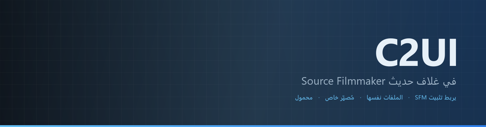
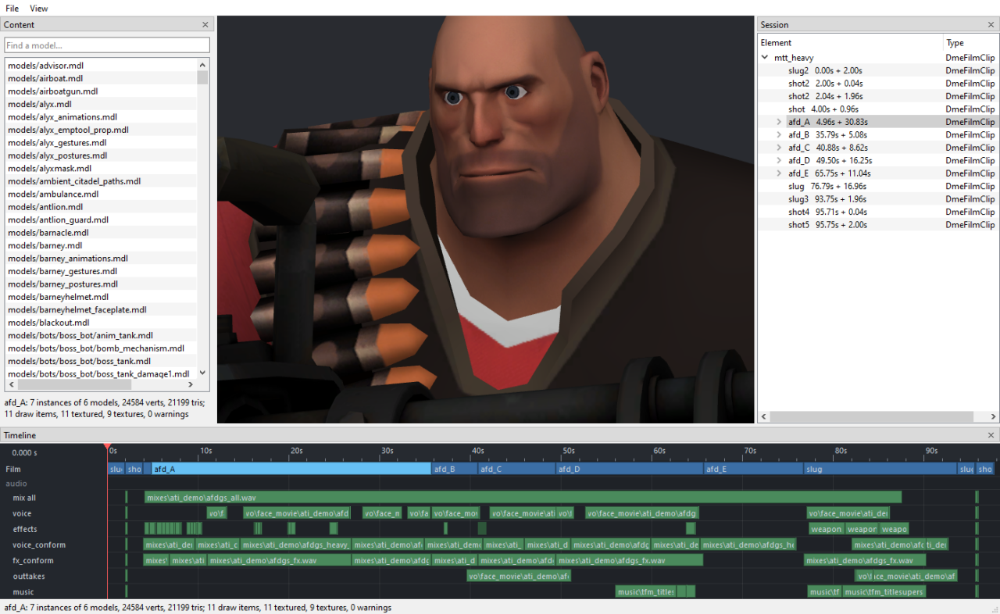

<p align="center"></p>

<p align="center"><a href="../../README.md">🇷🇺 Русский</a> · <a href="EN-en.md">🇬🇧 English</a> · <a href="PL-pl.md">🇵🇱 Polski</a> · <a href="UK-ua.md">🇺🇦 Українська</a> · <a href="DE-de.md">🇩🇪 Deutsch</a> · <a href="RO-md.md">🇲🇩 Moldovenească</a> · <a href="SL-si.md">🇸🇮 Slovenščina</a> · <a href="BE-by.md">🇧🇾 Беларуская</a> · <a href="KK-kz.md">🇰🇿 Қазақша</a> · <a href="JA-jp.md">🇯🇵 日本語</a> · <a href="ZH-cn.md">🇨🇳 中文</a> · <a href="SV-se.md">🇸🇪 Svenska</a> · <a href="ES-es.md">🇪🇸 Español</a> · <a href="HI-in.md">🇮🇳 हिन्दी</a> · <a href="PT-pt.md">🇵🇹 Português</a> · <a href="BN-bd.md">🇧🇩 বাংলা</a> · <a href="FR-fr.md">🇫🇷 Français</a> · <a href="TE-in.md">🇮🇳 తెలుగు</a> · <a href="MR-in.md">🇮🇳 मराठी</a> · <a href="TA-in.md">🇮🇳 தமிழ்</a> · <a href="TR-tr.md">🇹🇷 Türkçe</a> · <a href="UR-pk.md">🇵🇰 اردو</a> · <a href="VI-vn.md">🇻🇳 Tiếng Việt</a> · <a href="GU-in.md">🇮🇳 ગુજરાતી</a> · <a href="IT-it.md">🇮🇹 Italiano</a> · <a href="KO-kr.md">🇰🇷 한국어</a> · <b>🇸🇦 العربية</b> · <a href="JV-id.md">🇮🇩 Basa Jawa</a> · <a href="ML-in.md">🇮🇳 മലയാളം</a> · <a href="NE-np.md">🇳🇵 नेपाली</a> · <a href="UZ-uz.md">🇺🇿 Oʻzbekcha</a> · <a href="OR-in.md">🇮🇳 ଓଡ଼ିଆ</a></p>

<p align="center">
  
  
  
  
  <a href="../../Testing"></a>
  
</p>

<p align="center"><b>C2UI</b> — <i>Custom to User Interface</i> — — محرّر Source Filmmaker في غلاف حديث: المحتوى نفسه، صيغة الجلسات نفسها، نموذج البيانات نفسه، وواجهة بروح مكتبة Steam ومحرّر Unreal Engine 5.</p>

---

## الفكرة

Source Filmmaker أداة قوية بقيت واجهتها في عام 2012. لا يستبدله C2UI ولا يعيد صنعه: الهدف ببساطة جعل SFM أكثر حداثة وراحة قليلًا.

يجد المحرّر SFM المثبّت، ويربطه كمكتبة محتوى — النماذج والمواد والقوام والجلسات — ويعمل مع الملفات نفسها بالصيغة نفسها. كل ما صُنع في SFM يُفتح في C2UI، والعكس صحيح.

الهدف الأول هو التوافق الكامل مع SFM بما فيه العظام والريغات. بعد ذلك، ما كان ينقص SFM.

```
  ┌──────────────┐    "أين SFM؟"    ┌──────────────────────────────┐
  │   C2UI       │ ─────────────────────▶│  SourceFilmmaker/game/       │
  │              │                       │    usermod/gameinfo.txt      │
  │  واجهة خاصة  │ ◀─────   محمّل    ───────│    tf/  hl2/  tf_movies/ …   │
  │  عرض خاص     │       قراءة فقط       │    models/ materials/ dmx    │
  └──────────────┘                       └──────────────────────────────┘
```

## الجاهزية



 <b>الجاهزية الإجمالية للإصدار: 38%</b>

كل مجال قابل للفتح: ما يعمل بالفعل وما لم يوجد بعد. النسب تقدير مقابل ما يستطيعه SFM.

<details><summary> <b>إيجاد SFM وتحميله</b></summary>

سجل Steam ← `libraryfolders.vdf` ← مسارات البحث في `gameinfo.txt` بترتيب المحرّك نفسه. ستة تحميلات في تثبيت قياسي. لا يُكتب شيء خارج مجلد التطبيق.

</details>
<details><summary> <b>فهرس المحتوى</b></summary>

70 199 ملفًا في 1.1 ث على البارد / 0.02 ث من الذاكرة المخبأة؛ التجاوزات بين التحميلات تُحلّ تمامًا كما يفعل المحرّك.

</details>
<details><summary> <b>النماذج — <code>.mdl</code> <code>.vvd</code> <code>.vtx</code></b></summary>

الإصدارات 44 و48 و49. الهيكل، الشبكات، كل مستويات التفصيل، مجموعات الجسم. حُمّل 1 500 نموذج، 0 إخفاقات.

</details>
<details><summary> <b>المواد — <code>.vmt</code></b></summary>

كل المواد الـ 19 554 المرفقة تُقرأ؛ `patch`، كتل DX، الوكلاء.

</details>
<details><summary> <b>القوام — <code>.vtf</code></b></summary>

الإصدارات 7.0–7.5، DXT1/3/5 وكل الصيغ غير المضغوطة، خرائط المكعب، الـ mips. يذهب DXT إلى GPU دون فك تشفير.

</details>
<details><summary> <b>الجلسات — <code>.dmx</code></b></summary>

ثنائي 1–5 وKeyValues2. كل جلسة وملف جسيمات في التثبيت يُكتب مجددًا **بايتًا بايتًا**.

</details>
<details><summary> <b>الجلسة على الشاشة</b></summary>

اللقطات ومسارات الصوت على الخط الزمني، شجرة العناصر، مشهد كل لقطة من كاميرتها. ليس بعد: الخرائط، الجسيمات، الصوت.

</details>
<details><summary> <b>التحريك</b></summary>

القنوات والسجلات تُقيَّم عند المؤشر؛ التمرير والتشغيل. العظام والكاميرات والرؤية تتبع الجلسة.

</details>
<details><summary> <b>الوجوه</b></summary>

متحكمات Flex، القواعد المُجمَّعة وتحريك الرؤوس — الشخصيات تتكلم وتعبّر. ليس بعد: خرائط التجاعيد.

</details>
<details><summary> <b>الريغات</b></summary>

التعبيرات، قيود point/orient/parent/aim، IK بعظمتين. ليس بعد: مخطط اعتماديات المشغّلات الكامل، إنشاء الريغات.

</details>
<details><summary> <b>التحرير</b></summary>

النقر للتحديد، مُعالج تحريك/تدوير، مفتّش لأي خاصية، مفتاح عند المؤشر، تراجع/إعادة، حفظ دقيق بالبايت. ليس بعد: محرّر الرسوم.

</details>
<details><summary> <b>محرّر الحركة</b></summary>

تحديد زمني مع hold وfalloff على المسطرة؛ التعديل ينتشر عليه كما في SFM. ليس بعد: الإعدادات المسبقة، الطبقات.

</details>
<details><summary> <b>إرساء اللوحات</b></summary>

اسحب اللوحات إلى بوصلة أهداف مع معاينة، كما في UE5 وVisual Studio. ليس بعد: التخطيطات المحفوظة، السمات.

</details>
<details><summary> <b>تظليل Source</b></summary>

القوام وضوء بسيط فقط. ليس بعد: phong، rim، lightwarp، أضواء المشهد، الظلال.

</details>
<details><summary> <b>الخرائط — <code>.bsp</code></b></summary>

لم يبدأ.

</details>
<details><summary> <b>العرض إلى صورة وفيديو</b></summary>

لم يبدأ.

</details>
<details><summary> <b>الإضافات <code>.c2plg</code></b></summary>

لم يبدأ.

</details>
<details><summary> <b>السمات ومساحات العمل</b></summary>

مؤجّل عن قصد: مظهر واحد حتى يكون في المحرّر ما يستحق التزيين.

</details>

**غير جاهز للإصدار.** الأساس — كل صيغة ملف يستخدمها SFM، مقروءة بشكل صحيح ومُتحقَّق منها على التثبيت كله — موجود ومُختبَر؛ يمكن فتح جلسة وتشغيلها وتعديلها وحفظها. ما ينقص هو *راحة* العمل: محرّر الرسوم، تظليل Source، الخرائط، التصدير. لا رقم إصدار حتى يستطيع محرّك رسوم قضاء يوم عمل فيه.

<br clear="all">

<p align="center"><br><sub>المحرّر اليوم، وفيه Meet the Heavy من Valve مفتوح: اللقطات والصوت على الخط الزمني، شجرة الجلسة، اللقطة الأولى من كاميرتها، والشخصيات بوضعياتها وتعابيرها كما تقول الجلسة.</sub></p>

## ما الذي يميّزه

- **محمول.** لا يُكتب شيء خارج مجلد التطبيق: الإعدادات في `App/User`، الذاكرة المخبأة في `App/Cache`، المؤقت في `App/Temporary`. احذف المجلد ولا يبقى أثر.
- **لا يشغّل SFM أبدًا.** لا عملية تُقاد ولا نوافذ تُختطف. يُقرأ التثبيت كحزمة محتوى.
- **الصيغ مُتحقَّق منها، لا مُفترَضة.** كل قارئ قُورن بالتثبيت الحقيقي؛ حيث تفعل صيغة شيئًا مفاجئًا يقول الكود ذلك.
- **الحفظ دقيق.** الجلسة المقروءة والمكتوبة دون تغيير هي الملف نفسه.
- **المحرّك بلا اعتماديات.** `Core/` وكل الاختبارات تعمل على Python خام؛ النافذة وحدها تحتاج Qt وOpenGL.

## التشغيل

يتطلب Windows وPython 3.13 وتثبيت Source Filmmaker.

```bash
git clone https://github.com/Arkomiko/SFM_C2UI.git
cd SFM_C2UI
python -m venv .venv
.venv/Scripts/python.exe -m pip install -r requirements.txt
.venv/Scripts/python.exe c2ui.py
```

عند أول تشغيل يُبحث عن SFM عبر Steam؛ إن لم يُوجد يسأل البرنامج. <kbd>Ctrl</kbd>+<kbd>O</kbd> يفتح جلسة، <kbd>Space</kbd> تشغيل، <kbd>C</kbd> كاميرا اللقطة، <kbd>T</kbd>/<kbd>R</kbd> تحريك/تدوير، <kbd>M</kbd> محرّر الحركة، <kbd>Ctrl</kbd>+<kbd>Z</kbd> تراجع، <kbd>Ctrl</kbd>+<kbd>S</kbd> حفظ. تُسحب اللوحات من عنوانها. الاختبارات لا تحتاج شيئًا:

```bash
python Testing/run.py
```

## البنية

```
C2UI_SDK/
├── c2ui.py            المُشغِّل
├── Core/              المحرّك: الصيغ، نظام ملفات افتراضي، الفهرس، الجسور
├── App/               المحرّر: مكتبة المحتوى، المُصيِّر، النافذة
├── Tools/             التوطين، أدوات الواجهة، الإضافات (لاحقًا)
├── Testing/           الاختبارات، تجهيزات دقيقة بالبايت، مشغّل واحد
└── GIT&DOCK/README/   هذا الـ README بلغات أخرى
```

## خارطة الطريق

1. **محرّر الرسوم** — المنحنيات والمفاتيح أمام العين.
2. **تظليل Source** — VertexLitGeneric كما يرسمه SFM: phong، rim، lightwarp، أضواء المشهد.
3. **الخرائط** — `.bsp` للخلفيات.
4. **الإخراج** — تصدير صورة وفيديو.
5. **الإضافات** — صيغة `.c2plg`؛ ثم السمات ومساحات العمل.

## الترخيص والشكر

Source Filmmaker وTeam Fortress 2 ومحرّك Source ملك Valve. يقرأ هذا المشروع صيغ ملفاتها، ولا يرفق أي ملف منها، ويعمل فقط مع نسخة SFM التي تملكها عبر Steam.

لم يُختر ترخيص كود C2UI الخاص بعد — حتى ذلك الحين، جميع الحقوق محفوظة. المشكلات وطلبات السحب مرحّب بها.

<p align="center"><br><sub>أربعة وستون نموذجًا اختيرت عشوائيًا من التثبيت، رسمها مُصيِّر C2UI الخاص.</sub></p>
