<p align="center"></p>

<p align="center"><a href="../../README.md">🇷🇺 Русский</a> · <a href="EN-en.md">🇬🇧 English</a> · <a href="PL-pl.md">🇵🇱 Polski</a> · <a href="UK-ua.md">🇺🇦 Українська</a> · <a href="DE-de.md">🇩🇪 Deutsch</a> · <a href="RO-md.md">🇲🇩 Moldovenească</a> · <a href="SL-si.md">🇸🇮 Slovenščina</a> · <b>🇧🇾 Беларуская</b> · <a href="KK-kz.md">🇰🇿 Қазақша</a> · <a href="JA-jp.md">🇯🇵 日本語</a> · <a href="ZH-cn.md">🇨🇳 中文</a> · <a href="SV-se.md">🇸🇪 Svenska</a> · <a href="ES-es.md">🇪🇸 Español</a> · <a href="HI-in.md">🇮🇳 हिन्दी</a> · <a href="PT-pt.md">🇵🇹 Português</a> · <a href="BN-bd.md">🇧🇩 বাংলা</a> · <a href="FR-fr.md">🇫🇷 Français</a> · <a href="TE-in.md">🇮🇳 తెలుగు</a> · <a href="MR-in.md">🇮🇳 मराठी</a> · <a href="TA-in.md">🇮🇳 தமிழ்</a> · <a href="TR-tr.md">🇹🇷 Türkçe</a> · <a href="UR-pk.md">🇵🇰 اردو</a> · <a href="VI-vn.md">🇻🇳 Tiếng Việt</a> · <a href="GU-in.md">🇮🇳 ગુજરાતી</a> · <a href="IT-it.md">🇮🇹 Italiano</a> · <a href="KO-kr.md">🇰🇷 한국어</a> · <a href="AR-sa.md">🇸🇦 العربية</a> · <a href="JV-id.md">🇮🇩 Basa Jawa</a> · <a href="ML-in.md">🇮🇳 മലയാളം</a> · <a href="NE-np.md">🇳🇵 नेपाली</a> · <a href="UZ-uz.md">🇺🇿 Oʻzbekcha</a> · <a href="OR-in.md">🇮🇳 ଓଡ଼ିଆ</a></p>

<p align="center">
  
  
  
  
  <a href="../../Testing"></a>
  
</p>

<p align="center"><b>C2UI</b> — <i>Custom to User Interface</i> — — рэдактар Source Filmmaker у сучаснай абалонцы: той самы кантэнт, той самы фармат сесій, тая самая мадэль даных, інтэрфейс у духу бібліятэкі Steam і рэдактара Unreal Engine 5.</p>

---

## Гатоўнасць

<p align="center"></p>

<p align="center"> <b>Агульная гатоўнасць да рэлізу: 41%</b></p>

<p align="center"><a href="../assets/BE-by/sidebar.md"></a></p>

## Ідэя

Source Filmmaker — моцны інструмент, інтэрфейс якога застаўся ў 2012 годзе. C2UI не замяняе яго і не перарабляе: задача — зрабіць SFM крыху сучаснейшым і зручнейшым.

Рэдактар знаходзіць усталяваны SFM, падключае яго як бібліятэку кантэнту — мадэлі, матэрыялы, тэкстуры, сесіі — і працуе з тымі самымі файламі ў тым самым фармаце. Усё, што зроблена ў SFM, адкрываецца ў C2UI, і наадварот.

Першая мэта — поўная сумяшчальнасць з SFM, уключна з косткамі і рыгамі. Далей — тое, чаго ў SFM не хапала.

```
  ┌──────────────┐    "дзе SFM?"    ┌──────────────────────────────┐
  │   C2UI       │ ─────────────────────▶│  SourceFilmmaker/game/       │
  │              │                       │    usermod/gameinfo.txt      │
  │  свой UI     │ ◀─────  мантуе   ───────│    tf/  hl2/  tf_movies/ …   │
  │  свой рэндар │      толькі чытанне      │    models/ materials/ dmx    │
  └──────────────┘                       └──────────────────────────────┘
```

<p align="center"><br><sub>Рэдактар сёння: адкрыта сесія Valve «Meet the Heavy» — шоты і гук на таймлайне, дрэва сесіі, першы шот праз яго ўласную камеру, персанажы ў позах і з тварамі з сесіі.</sub></p>

## Чым адрозніваецца

- **Пераносны.** Нічога не пішацца па-за папкай праграмы: налады ў `App/User`, кэш у `App/Cache`, часовае ў `App/Temporary`. Выдалілі папку — следу не засталося.
- **Не запускае SFM.** Няма працэсу, якім трэба кіраваць, няма вокнаў, якія трэба перахапляць. Устаноўка чытаецца як пакет кантэнту.
- **Фарматы правераны, а не прадугаданы.** Кожная чыталка звераная з сапраўднай устаноўкай; там, дзе фармат робіць нешта нечаканае, код пра гэта кажа.
- **Захаванне дакладнае.** Сесія, прачытаная і запісаная без змен, — той самы файл.
- **Ядро без залежнасцей.** `Core/` і ўсе тэсты працуюць на голым Python; Qt і OpenGL патрэбныя толькі акну.

## Запуск

Патрэбныя Windows, Python 3.13 і ўсталяваны Source Filmmaker.

```bash
git clone https://github.com/Arkomiko/SFM_C2UI.git
cd SFM_C2UI
python -m venv .venv
.venv/Scripts/python.exe -m pip install -r Tools/Launcher/requirements.txt
.venv/Scripts/python.exe Tools/Launcher/c2ui.py
```

Пры першым запуску SFM шукаецца праз Steam; калі не знайшоўся — праграма спытае. <kbd>Ctrl</kbd>+<kbd>O</kbd> адкрывае сесію, <kbd>Space</kbd> — прайграванне, <kbd>C</kbd> — камера шота, <kbd>T</kbd>/<kbd>R</kbd> — перамяшчэнне/паварот, <kbd>M</kbd> — motion editor, <kbd>Ctrl</kbd>+<kbd>Z</kbd> — адмена, <kbd>Ctrl</kbd>+<kbd>S</kbd> — захаваць. Панэлі перацягваюцца за загаловак. Тэсты не патрабуюць нічога:

```bash
python Testing/run.py
```

## Структура

```
C2UI_SDK/
├── README.md
├── Core/              ядро: фарматы, віртуальная ФС, індэкс, масты да ўстановак
├── App/               рэдактар: бібліятэка кантэнту, рэндар, акно
├── Tools/             лакалізацыя, інструменты UI, плагіны (пазней)
│   └── Launcher/      лаўнчар
├── Testing/           тэсты, пабайтавыя фікстуры, адзін ранер
└── GIT&DOCK/          гэты README на іншых мовах
```

## Дарожная карта

1. **Шэйдынг Source** — VertexLitGeneric як малюе SFM: phong, rim, lightwarp, асвятленне сцэны.
2. **Карты** — `.bsp` для фону.
3. **Экспарт** — выява і відэа.
4. **Плагіны** — фармат `.c2plg`; затым тэмы і працоўныя прасторы.

## Ліцэнзія і падзякі

Уласны код C2UI распаўсюджваецца па **ліцэнзіі C2UI**: свабодна для асабістых і некамерцыйных патрэб; камерцыйнае выкарыстанне — толькі з пісьмовай згоды аўтара; змененыя версіі мусяць спасылацца на арыгінальны праект і яго аўтара Arkomiko. Плагіны і адоны — па ліцэнзіі **C2UI — Plugins & Addons (C2UI‑Pl&AD)**.

Source Filmmaker, Team Fortress 2 і рухавік Source належаць Valve; праект чытае іх фарматы, не змяшчае іх файлаў і працуе толькі з вашай копіяй SFM са Steam.

<p align="center"><a href="../LICENSE/BE-by.md"></a></p>

<p align="center"><br><sub>Шэсцьдзясят чатыры выпадковыя мадэлі з устаноўкі, намаляваныя ўласным рэндарарам C2UI.</sub></p>
