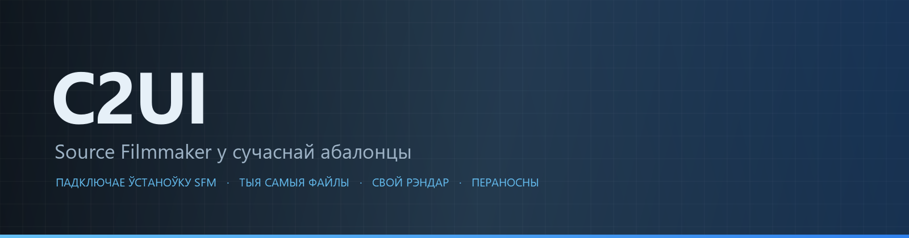

<details align="center"><summary>&nbsp;🌐 <b>🇧🇾 Беларуская</b> &nbsp;·&nbsp; <sub>Language · Язык · 語言 · Idioma · Sprache · भाषा · لغة</sub></summary>

<table align="center">
<tr><td align="center"><a href="../../README.md">🇷🇺<br>Русский</a></td><td align="center"><a href="../README/EN-en.md">🇬🇧<br>English</a></td><td align="center"><a href="../README/PL-pl.md">🇵🇱<br>Polski</a></td><td align="center"><a href="../README/UK-ua.md">🇺🇦<br>Українська</a></td><td align="center"><a href="../README/DE-de.md">🇩🇪<br>Deutsch</a></td><td align="center"><a href="../README/RO-md.md">🇲🇩<br>Moldovenească</a></td><td align="center"><a href="../README/SL-si.md">🇸🇮<br>Slovenščina</a></td><td align="center"><b>🇧🇾<br>Беларуская</b></td></tr>
<tr><td align="center"><a href="../README/KK-kz.md">🇰🇿<br>Қазақша</a></td><td align="center"><a href="../README/JA-jp.md">🇯🇵<br>日本語</a></td><td align="center"><a href="../README/ZH-cn.md">🇨🇳<br>中文</a></td><td align="center"><a href="../README/SV-se.md">🇸🇪<br>Svenska</a></td><td align="center"><a href="../README/ES-es.md">🇪🇸<br>Español</a></td><td align="center"><a href="../README/HI-in.md">🇮🇳<br>हिन्दी</a></td><td align="center"><a href="../README/PT-pt.md">🇵🇹<br>Português</a></td><td align="center"><a href="../README/BN-bd.md">🇧🇩<br>বাংলা</a></td></tr>
<tr><td align="center"><a href="../README/FR-fr.md">🇫🇷<br>Français</a></td><td align="center"><a href="../README/TE-in.md">🇮🇳<br>తెలుగు</a></td><td align="center"><a href="../README/MR-in.md">🇮🇳<br>मराठी</a></td><td align="center"><a href="../README/TA-in.md">🇮🇳<br>தமிழ்</a></td><td align="center"><a href="../README/TR-tr.md">🇹🇷<br>Türkçe</a></td><td align="center"><a href="../README/UR-pk.md">🇵🇰<br>اردو</a></td><td align="center"><a href="../README/VI-vn.md">🇻🇳<br>Tiếng Việt</a></td><td align="center"><a href="../README/GU-in.md">🇮🇳<br>ગુજરાતી</a></td></tr>
<tr><td align="center"><a href="../README/IT-it.md">🇮🇹<br>Italiano</a></td><td align="center"><a href="../README/KO-kr.md">🇰🇷<br>한국어</a></td><td align="center"><a href="../README/AR-sa.md">🇸🇦<br>العربية</a></td><td align="center"><a href="../README/JV-id.md">🇮🇩<br>Basa Jawa</a></td><td align="center"><a href="../README/ML-in.md">🇮🇳<br>മലയാളം</a></td><td align="center"><a href="../README/NE-np.md">🇳🇵<br>नेपाली</a></td><td align="center"><a href="../README/UZ-uz.md">🇺🇿<br>Oʻzbekcha</a></td><td align="center"><a href="../README/OR-in.md">🇮🇳<br>ଓଡ଼ିଆ</a></td></tr>
</table>

</details>

<p align="center"></p>

<p align="center">
  
  
  
  
  <a href="../../Testing"></a>
  
  <a href="../LICENSE/BE-by.md"></a>
</p>

<p align="center"><b>C2UI</b> — <i>Custom to User Interface</i> — рэдактар Source Filmmaker у сучаснай абалонцы: той самы кантэнт, той самы фармат сесій, тая самая мадэль даных, інтэрфейс у духу бібліятэкі Steam і рэдактара Unreal Engine 5.</p>

---

## Гатоўнасць

<p align="center"></p>

<p align="center"><a href="../READINESS/BE-by.md"></a></p>

## Ідэя

Source Filmmaker — моцны інструмент, інтэрфейс якога застаўся ў 2012 годзе. C2UI не замяняе яго і не перарабляе: задача — зрабіць SFM крыху сучаснейшым і зручнейшым.

Рэдактар знаходзіць усталяваны SFM, падключае яго як бібліятэку кантэнту — мадэлі, матэрыялы, тэкстуры, сесіі — і працуе з тымі самымі файламі ў тым самым фармаце. Усё, што зроблена ў SFM, адкрываецца ў C2UI, і наадварот.

Першая мэта — поўная сумяшчальнасць з SFM, уключна з косткамі і рыгамі. Далей — тое, чаго ў SFM не хапала.

```
  ┌──────────────┐                       ┌──────────────────────────────┐
  │   C2UI       │ ──── "дзе SFM?" ─────▶│  SourceFilmmaker/game/       │
  │              │                       │    usermod/gameinfo.txt      │
  │  свой UI     │ ◀────── мантуе ───────│    tf/  hl2/  tf_movies/ …   │
  │  свой рэндар │    толькі чытанне     │    models/ materials/ dmx    │
  └──────────────┘                       └──────────────────────────────┘
```

- **Пераносны.** Нічога не пішацца па-за папкай праграмы: налады ў `App/User`, кэш у `App/Cache`, часовае ў `App/Temporary`. Выдалілі папку — следу не засталося.
- **Не запускае SFM.** Няма працэсу, якім трэба кіраваць, няма вокнаў, якія трэба перахапляць. Устаноўка чытаецца як пакет кантэнту.
- **Фарматы правераны, а не прадугаданы.** Кожная чыталка звераная з сапраўднай устаноўкай; там, дзе фармат робіць нешта нечаканае, код пра гэта кажа.
- **Захаванне дакладнае.** Сесія, прачытаная і запісаная без змен, — той самы файл.
- **Ядро без залежнасцей.** `Core/` і ўсе тэсты працуюць на голым Python; Qt і OpenGL патрэбныя толькі акну.

<p align="center"><br><sub>Рэдактар сёння: адкрыта сесія Valve «Meet the Heavy» — шоты і гук на таймлайне, дрэва сесіі, першы шот праз яго ўласную камеру, персанажы ў позах і з тварамі з сесіі.</sub></p>

## Структура

```
C2UI_SDK/
├── README.md
├── Core/               ядро: фарматы, віртуальная ФС, індэкс, масты да ўстановак
│   ├── API/            кантракт для рэдактара, інструментаў і плагінаў
│   ├── Code/           рухавік: анімацыя, аператары, твары, праўкі
│   │   └── formats/    чытачы Valve: mdl vvd vtx vmt vtf dmx bsp
│   └── dev-kit/        слоты SDK (пустыя) і масты да ўсталёвак
├── App/                рэдактар: бібліятэка кантэнту, рэндар, акно
│   ├── Code/           бібліятэка кантэнту, акно, налады
│   │   ├── render/     сцэна, рэндэрар OpenGL, шэйдары, камера
│   │   └── ui/         таймлайн, дрэва сесіі, інспектар, graph editor, докінг
│   ├── Data/           рэсурсы праграмы, толькі чытанне
│   ├── User/           даныя карыстальніка — ніколі не выдаляюцца
│   └── Cache/          індэкс кантэнту, шэйдары, мініяцюры
├── Tools/              лакалізацыя, інструменты UI, плагіны (пазней)
│   ├── Launcher/       лаўнчар
│   ├── Market Load/    кліент маркетплэйсу плагінаў (пазней)
│   ├── Localization/   стварэнне перакладаў
│   ├── NewPlugins/     стварэнне плагінаў
│   └── UI/             тэмы і працоўныя прасторы
├── Testing/            тэсты, пабайтавыя фікстуры, адзін ранер
│   ├── core/           рухавік
│   ├── app/            рэдактар
│   └── fixtures/       падробленая ўсталёўка, мадэлі, тэкстуры
└── GIT&DOCK/           README, гатоўнасць і ліцэнзія на 32 мовах
```

### Як гэта працуе

Шлях ад «дзе Source Filmmaker?» да кадра на экране праходзіць праз пяць слаёў; кожны наступны ведае толькі пра папярэдні.

1. **Мост** (`Core/dev-kit/bridge_sfm`) знаходзіць усталёўку праз Steam, чытае `gameinfo.txt` і аддае шляхі кантэнту ў парадку рухавіка. `sfm.exe` не запускаецца.
2. **Віртуальная ФС і індэкс** (`Core/Code/vfs.py`, `content_index.py`) накладваюць гэтыя шляхі адзін на адзін, як Source: першы знойдзены файл перамагае. Індэкс — адзін файл SQLite у `App/Cache`, таму абход 70 000 файлаў робіцца адзін раз.
3. **Фарматы** (`Core/Code/formats`) чытаюць файлы Valve без старонніх бібліятэк: `.mdl` `.vvd` `.vtx` — мадэль, `.vmt` `.vtf` — матэрыял і тэкстура, `.dmx` — сесія, `.bsp` — карта. Кожны чытач правераны на ўсёй усталёўцы; сесія запісваецца назад байт у байт.
4. **Сесія** — граф элементаў DMX. `animation.py` вылічае каналы ў момант часу, `operators.py` выконвае выразы і канстрэйнты рыгаў, `flex.py` рухае твары, `pose.py` збірае матрыцы костак. Кожная праўка ідзе праз `editing.py` як каманда з адменай.
5. **Рэдактар** (`App/Code`) збірае з гэтага сцэну (`render/scene.py`) і малюе яе ўласным рэндэрарам на OpenGL 3.3 (`renderer.py`, `shaders.py`): святло сесіі, лайтмапы і асвятленне карты — як іх бачыць SFM. Панэлі (`ui/`) — таймлайн, дрэва сесіі, інспектар, graph editor, докінг у духу UE5.

Усё, што праграма піша, застаецца ў яе тэчцы: `App/User` — налады, `App/Cache` — індэкс і кэш, `App/Temporary` — журнал. `Core/` нічога не піша і не залежыць ад Qt, таму рухавік і тэсты працуюць на голым Python; Qt і OpenGL патрэбныя толькі акну. Інструменты ў `Tools/` збіраюцца строга па-над `Core/API` — так правяраецца, што API дастатковы і для старонніх плагінаў.

<p align="center"><br><sub>Шэсцьдзясят чатыры выпадковыя мадэлі з устаноўкі, намаляваныя ўласным рэндарарам C2UI.</sub></p>

### Запуск

Патрэбныя Windows, Python 3.13 і ўсталяваны Source Filmmaker.

```bash
git clone https://github.com/Arkomiko/SFM_C2UI.git
cd SFM_C2UI
python -m venv .venv
.venv/Scripts/python.exe -m pip install -r Tools/Launcher/requirements.txt
.venv/Scripts/python.exe Tools/Launcher/c2ui.py
```

Пры першым запуску SFM шукаецца праз Steam; калі не знайшоўся — праграма спытае. <kbd>Ctrl</kbd>+<kbd>O</kbd> адкрывае сесію, <kbd>Space</kbd> — прайграванне, <kbd>C</kbd> — камера шота, <kbd>T</kbd>/<kbd>R</kbd> — перамяшчэнне/паварот, <kbd>M</kbd> — motion editor, <kbd>Ctrl</kbd>+<kbd>Z</kbd> — адмена, <kbd>Ctrl</kbd>+<kbd>S</kbd> — захаваць. Панэлі перацягваюцца за загаловак. Тэсты не патрабуюць нічога:

```bash
python Testing/run.py
```

### У планах

**Бліжэйшае**
- Выгляд карты: скайбокс, вада, prop_dynamic, гобо-тэкстуры святла, `$bumpmap` і `$envmap`, цені ад святла сесіі.
- Экспарт: паслядоўнасць кадраў і відэа.
- Плагіны `.c2plg` і кліент маркетплэйсу ў `Tools/Market Load`; потым тэмы і працоўныя прасторы.
- Гук на таймлайне, часціцы, wrinkle-карты, прэсеты і слаі motion editor, датычныя ў graph editor.

**Далей**
- Прадукцыйнасць на поўных картах: інстансінг статычных пропаў, кэш поз.
- Перапрацоўка рухавіка: новыя параметры кампіляцыі карт для лепшага асвятлення і ценяў, ліміт карты 120 000 юнітаў.
- Упакаваны лаўнчар з уласным Python і аўтаабнаўленнем; лакалізацыя рэдактара.

## Ліцэнзія і падзякі

Уласны код C2UI распаўсюджваецца па **ліцэнзіі C2UI**: свабодна для асабістых і некамерцыйных патрэб; камерцыйнае выкарыстанне — толькі з пісьмовай згоды аўтара; змененыя версіі мусяць спасылацца на арыгінальны праект і яго аўтара Arkomiko. Плагіны і адоны — па ліцэнзіі **C2UI — Plugins & Addons (C2UI‑Pl&AD)**.

Source Filmmaker, Team Fortress 2 і рухавік Source належаць Valve; праект чытае іх фарматы, не змяшчае іх файлаў і працуе толькі з вашай копіяй SFM са Steam.

<p align="center"><a href="../LICENSE/BE-by.md"></a></p>
