<details align="center"><summary>&nbsp;🌐 <b>🇧🇩 বাংলা</b> &nbsp;·&nbsp; <sub>Language · Язык · 語言 · Idioma · Sprache · भाषा · لغة</sub></summary>

<table align="center">
<tr><td align="center"><a href="../../README.md">🇷🇺<br>Русский</a></td><td align="center"><a href="../README/EN-en.md">🇬🇧<br>English</a></td><td align="center"><a href="../README/PL-pl.md">🇵🇱<br>Polski</a></td><td align="center"><a href="../README/UK-ua.md">🇺🇦<br>Українська</a></td><td align="center"><a href="../README/DE-de.md">🇩🇪<br>Deutsch</a></td><td align="center"><a href="../README/RO-md.md">🇲🇩<br>Moldovenească</a></td><td align="center"><a href="../README/SL-si.md">🇸🇮<br>Slovenščina</a></td><td align="center"><a href="../README/BE-by.md">🇧🇾<br>Беларуская</a></td></tr>
<tr><td align="center"><a href="../README/KK-kz.md">🇰🇿<br>Қазақша</a></td><td align="center"><a href="../README/JA-jp.md">🇯🇵<br>日本語</a></td><td align="center"><a href="../README/ZH-cn.md">🇨🇳<br>中文</a></td><td align="center"><a href="../README/SV-se.md">🇸🇪<br>Svenska</a></td><td align="center"><a href="../README/ES-es.md">🇪🇸<br>Español</a></td><td align="center"><a href="../README/HI-in.md">🇮🇳<br>हिन्दी</a></td><td align="center"><a href="../README/PT-pt.md">🇵🇹<br>Português</a></td><td align="center"><b>🇧🇩<br>বাংলা</b></td></tr>
<tr><td align="center"><a href="../README/FR-fr.md">🇫🇷<br>Français</a></td><td align="center"><a href="../README/TE-in.md">🇮🇳<br>తెలుగు</a></td><td align="center"><a href="../README/MR-in.md">🇮🇳<br>मराठी</a></td><td align="center"><a href="../README/TA-in.md">🇮🇳<br>தமிழ்</a></td><td align="center"><a href="../README/TR-tr.md">🇹🇷<br>Türkçe</a></td><td align="center"><a href="../README/UR-pk.md">🇵🇰<br>اردو</a></td><td align="center"><a href="../README/VI-vn.md">🇻🇳<br>Tiếng Việt</a></td><td align="center"><a href="../README/GU-in.md">🇮🇳<br>ગુજરાતી</a></td></tr>
<tr><td align="center"><a href="../README/IT-it.md">🇮🇹<br>Italiano</a></td><td align="center"><a href="../README/KO-kr.md">🇰🇷<br>한국어</a></td><td align="center"><a href="../README/AR-sa.md">🇸🇦<br>العربية</a></td><td align="center"><a href="../README/JV-id.md">🇮🇩<br>Basa Jawa</a></td><td align="center"><a href="../README/ML-in.md">🇮🇳<br>മലയാളം</a></td><td align="center"><a href="../README/NE-np.md">🇳🇵<br>नेपाली</a></td><td align="center"><a href="../README/UZ-uz.md">🇺🇿<br>Oʻzbekcha</a></td><td align="center"><a href="../README/OR-in.md">🇮🇳<br>ଓଡ଼ିଆ</a></td></tr>
</table>

</details>

<p align="center"></p>

<p align="center">
  
  
  
  
  <a href="../../Testing"></a>
  
  <a href="../LICENSE/BN-bd.md"></a>
</p>

<p align="center"><b>C2UI</b> — <i>Custom to User Interface</i> — আধুনিক খোলসে Source Filmmaker-এর এডিটর: একই কনটেন্ট, একই সেশন ফরম্যাট, একই ডেটা মডেল, আর Steam লাইব্রেরি ও Unreal Engine 5 এডিটরের ধাঁচের ইন্টারফেস।</p>

---

## প্রস্তুতি

<p align="center"></p>

<p align="center"><a href="../READINESS/BN-bd.md"></a></p>

## ধারণা

Source Filmmaker একটি শক্তিশালী টুল, যার ইন্টারফেস ২০১২ সালেই রয়ে গেছে। C2UI তাকে প্রতিস্থাপন বা নতুন করে বানায় না: লক্ষ্য কেবল SFM-কে একটু আধুনিক ও সুবিধাজনক করা।

এডিটর ইনস্টল করা SFM খুঁজে নেয়, তাকে কনটেন্ট লাইব্রেরি হিসেবে যুক্ত করে — মডেল, ম্যাটেরিয়াল, টেক্সচার, সেশন — আর একই ফাইল একই ফরম্যাটে নিয়ে কাজ করে। SFM-এ যা বানানো হয়েছে সবই C2UI-তে খোলে, উল্টোটাও।

প্রথম লক্ষ্য হাড় ও রিগ সহ SFM-এর সাথে পূর্ণ সামঞ্জস্য। তারপর — SFM-এ যা ছিল না।

```
  ┌───────────────┐                        ┌──────────────────────────────┐
  │   C2UI        │ ──── "SFM কোথায়?" ────▶│  SourceFilmmaker/game/       │
  │               │                        │    usermod/gameinfo.txt      │
  │  নিজস্ব UI     │ ◀─────── মাউন্ট ────────│    tf/  hl2/  tf_movies/ …   │
  │  নিজস্ব রেন্ডার │        শুধু পড়া        │    models/ materials/ dmx    │
  └───────────────┘                        └──────────────────────────────┘
```

- **পোর্টেবল।** অ্যাপ্লিকেশন ফোল্ডারের বাইরে কিছু লেখা হয় না: সেটিংস `App/User`-এ, ক্যাশ `App/Cache`-এ, অস্থায়ী `App/Temporary`-তে। ফোল্ডার মুছুন, কোনো চিহ্ন নেই।
- **SFM কখনো চালায় না।** চালানোর কোনো প্রসেস নেই, দখলের কোনো উইন্ডো নেই। ইনস্টলেশন কনটেন্ট প্যাকের মতো পড়া হয়।
- **ফরম্যাট যাচাই করা, অনুমান নয়।** প্রতিটি রিডার আসল ইনস্টলেশনের সাথে মেলানো; যেখানে ফরম্যাট অপ্রত্যাশিত কিছু করে, কোড তা বলে।
- **সেভ নিখুঁত।** অপরিবর্তিত পড়া ও লেখা সেশন একই ফাইল।
- **ইঞ্জিনের কোনো নির্ভরতা নেই।** `Core/` ও পুরো টেস্ট সুট খাঁটি Python-এ চলে; শুধু উইন্ডোর Qt ও OpenGL লাগে।

## কাঠামো

```
C2UI_SDK/
├── README.md
├── Core/               ইঞ্জিন: ফরম্যাট, ভার্চুয়াল ফাইল সিস্টেম, ইনডেক্স, ব্রিজ
│   ├── API/            এডিটর, টুল ও প্লাগইনের চুক্তি
│   ├── Code/           ইঞ্জিন: অ্যানিমেশন, অপারেটর, মুখ, সম্পাদনা
│   │   └── formats/    Valve রিডার: mdl vvd vtx vmt vtf dmx bsp
│   └── dev-kit/        SDK স্লট (খালি) ও ইনস্টলেশনের ব্রিজ
├── Launcher/           লঞ্চার
├── App/                এডিটর: কনটেন্ট লাইব্রেরি, রেন্ডারার, উইন্ডো
│   ├── Code/           কনটেন্ট লাইব্রেরি, উইন্ডো, সেটিংস
│   │   ├── render/     দৃশ্য, OpenGL রেন্ডারার, শেডার, ক্যামেরা
│   │   └── ui/         টাইমলাইন, সেশন ট্রি, ইন্সপেক্টর, গ্রাফ এডিটর, ডকিং
│   ├── Data/           প্রোগ্রামের রিসোর্স, শুধু পড়ার জন্য
│   ├── User/           ব্যবহারকারীর ডেটা — কখনও মোছা হয় না
│   └── Cache/          কনটেন্ট ইনডেক্স, শেডার, থাম্বনেইল
├── Tools/              স্থানীয়করণ, UI টুল, প্লাগইন (পরে)
│   ├── Market Load/    প্লাগইন মার্কেটপ্লেস ক্লায়েন্ট (পরে)
│   ├── Localization/   অনুবাদ তৈরি
│   ├── NewPlugins/     প্লাগইন তৈরি
│   └── UI/             থিম ও ওয়ার্কস্পেস
├── Testing/            পরীক্ষা, বাইট-নিখুঁত ফিক্সচার, এক রানার
│   ├── core/           ইঞ্জিন
│   ├── app/            এডিটর
│   └── fixtures/       নকল ইনস্টলেশন, মডেল, টেক্সচার
└── GIT&DOCK/           README, প্রস্তুতি ও লাইসেন্স ৩২টি ভাষায়
```

### এটি কীভাবে কাজ করে

«Source Filmmaker কোথায়?» থেকে পর্দায় একটি ফ্রেম পর্যন্ত পথটি পাঁচটি স্তরের মধ্য দিয়ে যায়; প্রতিটি স্তর কেবল তার নিচের স্তরটিকে জানে।

1. **ব্রিজ** (`Core/dev-kit/bridge_sfm`) Steam-এর মাধ্যমে ইনস্টলেশন খুঁজে পায়, `gameinfo.txt` পড়ে এবং ইঞ্জিনের ক্রমে কনটেন্ট পাথ ফেরত দেয়। `sfm.exe` কখনও চালু হয় না।
2. **ভার্চুয়াল ফাইল সিস্টেম ও ইনডেক্স** (`Core/Code/vfs.py`, `content_index.py`) এই পাথগুলো Source-এর মতো স্তরে সাজায়: প্রথম পাওয়া ফাইলটি জেতে। ইনডেক্স `App/Cache`-এ একটি SQLite ফাইল, তাই ৭০ ০০০ ফাইল একবারই ঘোরা হয়।
3. **ফরম্যাট** (`Core/Code/formats`) কোনো তৃতীয় পক্ষের লাইব্রেরি ছাড়াই Valve-এর ফাইল পড়ে: `.mdl` `.vvd` `.vtx` একটি মডেল, `.vmt` `.vtf` ম্যাটেরিয়াল ও টেক্সচার, `.dmx` একটি সেশন, `.bsp` একটি ম্যাপ। প্রতিটি রিডার পুরো ইনস্টলেশনে যাচাই করা; সেশন বাইটে বাইটে হুবহু ফেরত লেখা হয়।
4. **সেশন** DMX উপাদানের একটি গ্রাফ। `animation.py` একটি মুহূর্তে চ্যানেলগুলো হিসাব করে, `operators.py` এক্সপ্রেশন ও রিগ কনস্ট্রেইন্ট চালায়, `flex.py` মুখ নাড়ায়, `pose.py` বোন ম্যাট্রিক্স তৈরি করে। প্রতিটি সম্পাদনা `editing.py`-এর মধ্য দিয়ে আনডু-যোগ্য কমান্ড হিসেবে যায়।
5. **এডিটর** (`App/Code`) এ থেকে একটি দৃশ্য (`render/scene.py`) গড়ে এবং নিজের OpenGL 3.3 রেন্ডারার (`renderer.py`, `shaders.py`) দিয়ে আঁকে: সেশনের আলো, লাইটম্যাপ ও ম্যাপের আলোকসজ্জা — ছবিটি এখনও SFM থেকে অনেক দূরে, কাজ চলছে। প্যানেলগুলো (`ui/`) হলো টাইমলাইন, সেশন ট্রি, ইন্সপেক্টর, গ্রাফ এডিটর ও UE5-ধাঁচের ডকিং।

প্রোগ্রাম যা লেখে তা তার ফোল্ডারেই থাকে: সেটিংস `App/User`-এ, ইনডেক্স ও ক্যাশ `App/Cache`-এ, লগ `App/Temporary`-এ। `Core/` কিছুই লেখে না এবং Qt-এর উপর নির্ভর করে না, তাই ইঞ্জিন ও টেস্ট খাঁটি Python-এ চলে; Qt ও OpenGL শুধু উইন্ডোর দরকার। `Tools/`-এর ইউটিলিটিগুলো কঠোরভাবে `Core/API`-এর উপর তৈরি — এভাবেই প্রমাণ হয় যে API তৃতীয় পক্ষের প্লাগইনের জন্যও যথেষ্ট।

### চালানো

Windows, Python 3.13 ও Source Filmmaker ইনস্টলেশন প্রয়োজন।

```bash
git clone https://github.com/Arkomiko/SFM_C2UI.git
cd SFM_C2UI
python -m venv .venv
.venv/Scripts/python.exe -m pip install -r Launcher/requirements.txt
.venv/Scripts/python.exe Launcher/launcher.py
```

এতে লঞ্চার খোলে: তিনটি বোতামসহ একটি ছোট উইন্ডো। এর চেহারা সাময়িক — App তৈরি হলে এটি নতুন করে লেখা হবে, আর এর উইন্ডো এখন কেবল রুশ ভাষায়।

<p align="center"><a href="../LAUNCHER/BN-bd.md"></a></p>

প্রথম চালুতে Steam-এর মাধ্যমে SFM খোঁজে; না পেলে জিজ্ঞেস করে। <kbd>Ctrl</kbd>+<kbd>O</kbd> সেশন খোলে, <kbd>Space</kbd> প্লে, <kbd>C</kbd> শট ক্যামেরা, <kbd>T</kbd>/<kbd>R</kbd> মুভ/রোটেট, <kbd>M</kbd> মোশন এডিটর, <kbd>Ctrl</kbd>+<kbd>Z</kbd> আনডু, <kbd>Ctrl</kbd>+<kbd>S</kbd> সেভ। প্যানেল শিরোনাম ধরে টানা হয়। পরীক্ষার কিছু লাগে না:

```bash
python Testing/run.py
```

### পরিকল্পনায়

**পরবর্তী**
- ম্যাপের চেহারা: পানি, prop_dynamic, আলোর গোবো টেক্সচার, `$bumpmap` ও `$envmap`, সেশনের আলো থেকে ছায়া।
- এক্সপোর্ট করা ফিল্মে শব্দ।
- `.c2plg` প্লাগইন ও `Tools/Market Load`-এ মার্কেটপ্লেস ক্লায়েন্ট; তারপর থিম ও ওয়ার্কস্পেস।
- টাইমলাইনে শব্দ, পার্টিকল, রিঙ্কল ম্যাপ, মোশন এডিটরের প্রিসেট ও লেয়ার, গ্রাফ এডিটরে ট্যানজেন্ট।

**পরে**
- পূর্ণ ম্যাপে পারফরম্যান্স: স্ট্যাটিক প্রপ ইনস্ট্যান্সিং, পোজ ক্যাশ।
- ইঞ্জিন পুনর্গঠন: উন্নত আলো ও ছায়ার জন্য নতুন ম্যাপ-কম্পাইল প্যারামিটার, ১২০ ০০০ ইউনিটের ম্যাপ সীমা।
- নিজস্ব Python ও স্বয়ংক্রিয় আপডেটসহ প্যাকেজড লঞ্চার; এডিটরের স্থানীয়করণ।

## লাইসেন্স ও কৃতজ্ঞতা

C2UI-এর নিজস্ব কোড **C2UI লাইসেন্সের** অধীনে: ব্যক্তিগত ও অবাণিজ্যিক ব্যবহারে মুক্ত; বাণিজ্যিক ব্যবহার কেবল লেখকের লিখিত সম্মতিতে; পরিবর্তিত সংস্করণে মূল প্রকল্প ও তার লেখক Arkomiko-র উল্লেখ বাধ্যতামূলক। প্লাগইন ও অ্যাডঅন **C2UI — Plugins & Addons (C2UI‑Pl&AD)** লাইসেন্সের অধীনে।

Source Filmmaker, Team Fortress 2 ও Source ইঞ্জিন Valve-এর; প্রকল্প তাদের ফরম্যাট পড়ে, তাদের কোনো ফাইল অন্তর্ভুক্ত করে না, আর শুধু Steam-এ আপনার নিজের SFM কপির সাথে কাজ করে।

<p align="center"><a href="../LICENSE/BN-bd.md"></a></p>
