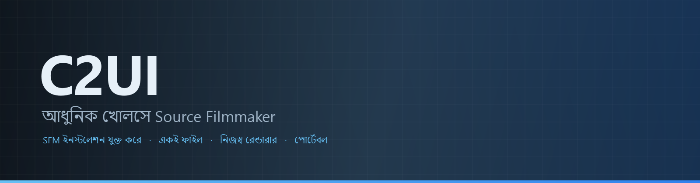

<p align="center"></p>

<details align="center"><summary>&nbsp;🌐 <b>🇧🇩 বাংলা</b> &nbsp;·&nbsp; <sub>Language · Язык · 語言 · Idioma · Sprache · भाषा · لغة</sub></summary>

<table align="center">
<tr><td align="center"><a href="../../README.md">🇷🇺<br>Русский</a></td><td align="center"><a href="EN-en.md">🇬🇧<br>English</a></td><td align="center"><a href="PL-pl.md">🇵🇱<br>Polski</a></td><td align="center"><a href="UK-ua.md">🇺🇦<br>Українська</a></td><td align="center"><a href="DE-de.md">🇩🇪<br>Deutsch</a></td><td align="center"><a href="RO-md.md">🇲🇩<br>Moldovenească</a></td><td align="center"><a href="SL-si.md">🇸🇮<br>Slovenščina</a></td><td align="center"><a href="BE-by.md">🇧🇾<br>Беларуская</a></td></tr>
<tr><td align="center"><a href="KK-kz.md">🇰🇿<br>Қазақша</a></td><td align="center"><a href="JA-jp.md">🇯🇵<br>日本語</a></td><td align="center"><a href="ZH-cn.md">🇨🇳<br>中文</a></td><td align="center"><a href="SV-se.md">🇸🇪<br>Svenska</a></td><td align="center"><a href="ES-es.md">🇪🇸<br>Español</a></td><td align="center"><a href="HI-in.md">🇮🇳<br>हिन्दी</a></td><td align="center"><a href="PT-pt.md">🇵🇹<br>Português</a></td><td align="center"><b>🇧🇩<br>বাংলা</b></td></tr>
<tr><td align="center"><a href="FR-fr.md">🇫🇷<br>Français</a></td><td align="center"><a href="TE-in.md">🇮🇳<br>తెలుగు</a></td><td align="center"><a href="MR-in.md">🇮🇳<br>मराठी</a></td><td align="center"><a href="TA-in.md">🇮🇳<br>தமிழ்</a></td><td align="center"><a href="TR-tr.md">🇹🇷<br>Türkçe</a></td><td align="center"><a href="UR-pk.md">🇵🇰<br>اردو</a></td><td align="center"><a href="VI-vn.md">🇻🇳<br>Tiếng Việt</a></td><td align="center"><a href="GU-in.md">🇮🇳<br>ગુજરાતી</a></td></tr>
<tr><td align="center"><a href="IT-it.md">🇮🇹<br>Italiano</a></td><td align="center"><a href="KO-kr.md">🇰🇷<br>한국어</a></td><td align="center"><a href="AR-sa.md">🇸🇦<br>العربية</a></td><td align="center"><a href="JV-id.md">🇮🇩<br>Basa Jawa</a></td><td align="center"><a href="ML-in.md">🇮🇳<br>മലയാളം</a></td><td align="center"><a href="NE-np.md">🇳🇵<br>नेपाली</a></td><td align="center"><a href="UZ-uz.md">🇺🇿<br>Oʻzbekcha</a></td><td align="center"><a href="OR-in.md">🇮🇳<br>ଓଡ଼ିଆ</a></td></tr>
</table>

</details>

<p align="center">
  
  
  
  
  <a href="../../Testing"></a>
  
</p>

<p align="center"><b>C2UI</b> — <i>Custom to User Interface</i> — — আধুনিক খোলসে Source Filmmaker-এর এডিটর: একই কনটেন্ট, একই সেশন ফরম্যাট, একই ডেটা মডেল, আর Steam লাইব্রেরি ও Unreal Engine 5 এডিটরের ধাঁচের ইন্টারফেস।</p>

---

## প্রস্তুতি

<p align="center"></p>

<p align="center"> <b>রিলিজের জন্য সামগ্রিক প্রস্তুতি: 44%</b></p>

<p align="center"><a href="../assets/BN-bd/sidebar.md"></a></p>

## ধারণা

Source Filmmaker একটি শক্তিশালী টুল, যার ইন্টারফেস ২০১২ সালেই রয়ে গেছে। C2UI তাকে প্রতিস্থাপন বা নতুন করে বানায় না: লক্ষ্য কেবল SFM-কে একটু আধুনিক ও সুবিধাজনক করা।

এডিটর ইনস্টল করা SFM খুঁজে নেয়, তাকে কনটেন্ট লাইব্রেরি হিসেবে যুক্ত করে — মডেল, ম্যাটেরিয়াল, টেক্সচার, সেশন — আর একই ফাইল একই ফরম্যাটে নিয়ে কাজ করে। SFM-এ যা বানানো হয়েছে সবই C2UI-তে খোলে, উল্টোটাও।

প্রথম লক্ষ্য হাড় ও রিগ সহ SFM-এর সাথে পূর্ণ সামঞ্জস্য। তারপর — SFM-এ যা ছিল না।

```
  ┌──────────────┐    "SFM কোথায়?"    ┌──────────────────────────────┐
  │   C2UI       │ ─────────────────────▶│  SourceFilmmaker/game/       │
  │              │                       │    usermod/gameinfo.txt      │
  │  নিজস্ব UI    │ ◀─────   মাউন্ট   ───────│    tf/  hl2/  tf_movies/ …   │
  │  নিজস্ব রেন্ডার │       শুধু পড়া        │    models/ materials/ dmx    │
  └──────────────┘                       └──────────────────────────────┘
```

<p align="center"><br><sub>আজকের এডিটর, Valve-এর Meet the Heavy খোলা: টাইমলাইনে শট আর শব্দ, সেশন ট্রি, প্রথম শট তার নিজের ক্যামেরায়, সেশন অনুযায়ী ভঙ্গি ও মুখভঙ্গিতে চরিত্ররা।</sub></p>

## কী একে আলাদা করে

- **পোর্টেবল।** অ্যাপ্লিকেশন ফোল্ডারের বাইরে কিছু লেখা হয় না: সেটিংস `App/User`-এ, ক্যাশ `App/Cache`-এ, অস্থায়ী `App/Temporary`-তে। ফোল্ডার মুছুন, কোনো চিহ্ন নেই।
- **SFM কখনো চালায় না।** চালানোর কোনো প্রসেস নেই, দখলের কোনো উইন্ডো নেই। ইনস্টলেশন কনটেন্ট প্যাকের মতো পড়া হয়।
- **ফরম্যাট যাচাই করা, অনুমান নয়।** প্রতিটি রিডার আসল ইনস্টলেশনের সাথে মেলানো; যেখানে ফরম্যাট অপ্রত্যাশিত কিছু করে, কোড তা বলে।
- **সেভ নিখুঁত।** অপরিবর্তিত পড়া ও লেখা সেশন একই ফাইল।
- **ইঞ্জিনের কোনো নির্ভরতা নেই।** `Core/` ও পুরো টেস্ট সুট খাঁটি Python-এ চলে; শুধু উইন্ডোর Qt ও OpenGL লাগে।

## চালানো

Windows, Python 3.13 ও Source Filmmaker ইনস্টলেশন প্রয়োজন।

```bash
git clone https://github.com/Arkomiko/SFM_C2UI.git
cd SFM_C2UI
python -m venv .venv
.venv/Scripts/python.exe -m pip install -r Tools/Launcher/requirements.txt
.venv/Scripts/python.exe Tools/Launcher/c2ui.py
```

প্রথম চালুতে Steam-এর মাধ্যমে SFM খোঁজে; না পেলে জিজ্ঞেস করে। <kbd>Ctrl</kbd>+<kbd>O</kbd> সেশন খোলে, <kbd>Space</kbd> প্লে, <kbd>C</kbd> শট ক্যামেরা, <kbd>T</kbd>/<kbd>R</kbd> মুভ/রোটেট, <kbd>M</kbd> মোশন এডিটর, <kbd>Ctrl</kbd>+<kbd>Z</kbd> আনডু, <kbd>Ctrl</kbd>+<kbd>S</kbd> সেভ। প্যানেল শিরোনাম ধরে টানা হয়। পরীক্ষার কিছু লাগে না:

```bash
python Testing/run.py
```

## কাঠামো

```
C2UI_SDK/
├── README.md
├── Core/              ইঞ্জিন: ফরম্যাট, ভার্চুয়াল ফাইল সিস্টেম, ইনডেক্স, ব্রিজ
├── App/               এডিটর: কনটেন্ট লাইব্রেরি, রেন্ডারার, উইন্ডো
├── Tools/             স্থানীয়করণ, UI টুল, প্লাগইন (পরে)
│   └── Launcher/      লঞ্চার
├── Testing/           পরীক্ষা, বাইট-নিখুঁত ফিক্সচার, এক রানার
└── GIT&DOCK/          এই README অন্য ভাষায়
```

## রোডম্যাপ

১. **Source শেডিং** — VertexLitGeneric যেভাবে SFM আঁকে: phong, rim, lightwarp, দৃশ্যের আলো।
২. **ম্যাপ** — পটভূমির জন্য `.bsp`।
৩. **আউটপুট** — ছবি ও ভিডিও এক্সপোর্ট।
৪. **প্লাগইন** — `.c2plg` ফরম্যাট; তারপর থিম ও ওয়ার্কস্পেস।

## লাইসেন্স ও কৃতজ্ঞতা

C2UI-এর নিজস্ব কোড **C2UI লাইসেন্সের** অধীনে: ব্যক্তিগত ও অবাণিজ্যিক ব্যবহারে মুক্ত; বাণিজ্যিক ব্যবহার কেবল লেখকের লিখিত সম্মতিতে; পরিবর্তিত সংস্করণে মূল প্রকল্প ও তার লেখক Arkomiko-র উল্লেখ বাধ্যতামূলক। প্লাগইন ও অ্যাডঅন **C2UI — Plugins & Addons (C2UI‑Pl&AD)** লাইসেন্সের অধীনে।

Source Filmmaker, Team Fortress 2 ও Source ইঞ্জিন Valve-এর; প্রকল্প তাদের ফরম্যাট পড়ে, তাদের কোনো ফাইল অন্তর্ভুক্ত করে না, আর শুধু Steam-এ আপনার নিজের SFM কপির সাথে কাজ করে।

<p align="center"><a href="../LICENSE/BN-bd.md"></a></p>

<p align="center"><br><sub>ইনস্টলেশন থেকে এলোমেলোভাবে বাছা চৌষট্টিটি মডেল, C2UI-এর নিজস্ব রেন্ডারারে আঁকা।</sub></p>
