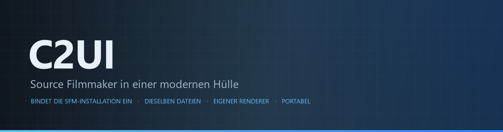

<details align="center"><summary>&nbsp;🌐 <b>🇩🇪 Deutsch</b> &nbsp;·&nbsp; <sub>Language · Язык · 語言 · Idioma · Sprache · भाषा · لغة</sub></summary>

<table align="center">
<tr><td align="center"><a href="../../README.md">🇷🇺<br>Русский</a></td><td align="center"><a href="../README/EN-en.md">🇬🇧<br>English</a></td><td align="center"><a href="../README/PL-pl.md">🇵🇱<br>Polski</a></td><td align="center"><a href="../README/UK-ua.md">🇺🇦<br>Українська</a></td><td align="center"><b>🇩🇪<br>Deutsch</b></td><td align="center"><a href="../README/RO-md.md">🇲🇩<br>Moldovenească</a></td><td align="center"><a href="../README/SL-si.md">🇸🇮<br>Slovenščina</a></td><td align="center"><a href="../README/BE-by.md">🇧🇾<br>Беларуская</a></td></tr>
<tr><td align="center"><a href="../README/KK-kz.md">🇰🇿<br>Қазақша</a></td><td align="center"><a href="../README/JA-jp.md">🇯🇵<br>日本語</a></td><td align="center"><a href="../README/ZH-cn.md">🇨🇳<br>中文</a></td><td align="center"><a href="../README/SV-se.md">🇸🇪<br>Svenska</a></td><td align="center"><a href="../README/ES-es.md">🇪🇸<br>Español</a></td><td align="center"><a href="../README/HI-in.md">🇮🇳<br>हिन्दी</a></td><td align="center"><a href="../README/PT-pt.md">🇵🇹<br>Português</a></td><td align="center"><a href="../README/BN-bd.md">🇧🇩<br>বাংলা</a></td></tr>
<tr><td align="center"><a href="../README/FR-fr.md">🇫🇷<br>Français</a></td><td align="center"><a href="../README/TE-in.md">🇮🇳<br>తెలుగు</a></td><td align="center"><a href="../README/MR-in.md">🇮🇳<br>मराठी</a></td><td align="center"><a href="../README/TA-in.md">🇮🇳<br>தமிழ்</a></td><td align="center"><a href="../README/TR-tr.md">🇹🇷<br>Türkçe</a></td><td align="center"><a href="../README/UR-pk.md">🇵🇰<br>اردو</a></td><td align="center"><a href="../README/VI-vn.md">🇻🇳<br>Tiếng Việt</a></td><td align="center"><a href="../README/GU-in.md">🇮🇳<br>ગુજરાતી</a></td></tr>
<tr><td align="center"><a href="../README/IT-it.md">🇮🇹<br>Italiano</a></td><td align="center"><a href="../README/KO-kr.md">🇰🇷<br>한국어</a></td><td align="center"><a href="../README/AR-sa.md">🇸🇦<br>العربية</a></td><td align="center"><a href="../README/JV-id.md">🇮🇩<br>Basa Jawa</a></td><td align="center"><a href="../README/ML-in.md">🇮🇳<br>മലയാളം</a></td><td align="center"><a href="../README/NE-np.md">🇳🇵<br>नेपाली</a></td><td align="center"><a href="../README/UZ-uz.md">🇺🇿<br>Oʻzbekcha</a></td><td align="center"><a href="../README/OR-in.md">🇮🇳<br>ଓଡ଼ିଆ</a></td></tr>
</table>

</details>

<p align="center"></p>

<p align="center">
  
  
  
  
  <a href="../../Testing"></a>
  
  <a href="../LICENSE/DE-de.md"></a>
</p>

<p align="center"><b>C2UI</b> — <i>Custom to User Interface</i> — der Source-Filmmaker-Editor in einer modernen Hülle: derselbe Inhalt, dasselbe Sitzungsformat, dasselbe Datenmodell, eine Oberfläche im Geist der Steam-Bibliothek und des Unreal-Engine-5-Editors.</p>

---

## Reifegrad

<p align="center"></p>

<p align="center"><a href="../READINESS/DE-de.md"></a></p>

## Die Idee

Source Filmmaker ist ein starkes Werkzeug, dessen Oberfläche im Jahr 2012 geblieben ist. C2UI ersetzt es nicht und baut es nicht um: Das Ziel ist schlicht, SFM etwas moderner und bequemer zu machen.

Der Editor findet das installierte SFM, bindet es als Inhaltsbibliothek ein — Modelle, Materialien, Texturen, Sitzungen — und arbeitet mit denselben Dateien im selben Format. Alles, was in SFM entstanden ist, öffnet sich in C2UI, und umgekehrt.

Das erste Ziel ist volle Kompatibilität mit SFM, Knochen und Rigs eingeschlossen. Danach das, was SFM gefehlt hat.

```
  ┌──────────────┐                         ┌──────────────────────────────┐
  │   C2UI       │ ──── "wo ist SFM?" ────▶│  SourceFilmmaker/game/       │
  │              │                         │    usermod/gameinfo.txt      │
  │  eigene UI   │ ◀───── eingebunden ─────│    tf/  hl2/  tf_movies/ …   │
  │  eig. Render │        nur lesen        │    models/ materials/ dmx    │
  └──────────────┘                         └──────────────────────────────┘
```

- **Portabel.** Nichts wird außerhalb des Programmordners geschrieben: Einstellungen unter `App/User`, Caches unter `App/Cache`, Temporäres unter `App/Temporary`. Ordner löschen — weg.
- **Startet nie SFM.** Kein Prozess zu steuern, keine Fenster zu kapern. Die Installation wird wie ein Inhaltspaket gelesen.
- **Formate geprüft, nicht angenommen.** Jeder Leser wurde an der echten Installation verglichen; wo ein Format etwas Überraschendes tut, sagt es der Code.
- **Speichern ist exakt.** Eine unverändert gelesene und geschriebene Sitzung ist dieselbe Datei.
- **Die Engine hat keine Abhängigkeiten.** `Core/` und alle Tests laufen auf nacktem Python; nur das Fenster braucht Qt und OpenGL.

## Aufbau

```
C2UI_SDK/
├── README.md
├── Core/               Engine: Formate, virtuelles Dateisystem, Index, Brücken
│   ├── API/            der Vertrag für Editor, Werkzeuge und Plugins
│   ├── Code/           Engine: Animation, Operatoren, Gesichter, Bearbeitung
│   │   └── formats/    Valve-Leser: mdl vvd vtx vmt vtf dmx bsp
│   └── dev-kit/        SDK-Slots (leer) und Brücken zu Installationen
├── Launcher/           der Starter
├── App/                der Editor: Inhaltsbibliothek, Renderer, Fenster
│   ├── Code/           Inhaltsbibliothek, Fenster, Einstellungen
│   │   ├── render/     Szene, OpenGL-Renderer, Shader, Kamera
│   │   └── ui/         Zeitleiste, Sitzungsbaum, Inspektor, Graph-Editor, Docking
│   ├── Data/           Programmressourcen, nur lesen
│   ├── User/           Nutzerdaten — werden nie gelöscht
│   └── Cache/          Inhaltsindex, Shader, Miniaturen
├── Tools/              Lokalisierung, UI-Werkzeuge, Plugins (später)
│   ├── Market Load/    Marktplatz-Client für Plugins (später)
│   ├── Localization/   Übersetzungen erstellen
│   ├── NewPlugins/     Plugins erstellen
│   └── UI/             Themes und Arbeitsbereiche
├── Testing/            Tests, byteexakte Fixtures, ein Runner
│   ├── core/           die Engine
│   ├── app/            der Editor
│   └── fixtures/       Fake-Installation, Modelle, Texturen
└── GIT&DOCK/           README, Bereitschaft und Lizenz in 32 Sprachen
```

### So funktioniert es

Der Weg von „Wo ist Source Filmmaker?“ bis zum Bild auf dem Schirm führt durch fünf Schichten; jede kennt nur die darunter.

1. **Die Brücke** (`Core/dev-kit/bridge_sfm`) findet die Installation über Steam, liest `gameinfo.txt` und liefert die Inhaltspfade in der Reihenfolge der Engine. `sfm.exe` wird nie gestartet.
2. **Virtuelles Dateisystem und Index** (`Core/Code/vfs.py`, `content_index.py`) schichten diese Pfade wie Source: die zuerst gefundene Datei gewinnt. Der Index ist eine SQLite-Datei in `App/Cache`, sodass der Durchlauf über 70 000 Dateien nur einmal anfällt.
3. **Die Formate** (`Core/Code/formats`) lesen Valves Dateien ohne Fremdbibliotheken: `.mdl` `.vvd` `.vtx` sind ein Modell, `.vmt` `.vtf` Material und Textur, `.dmx` eine Sitzung, `.bsp` eine Karte. Jeder Leser ist an der ganzen Installation geprüft; eine Sitzung wird Byte für Byte zurückgeschrieben.
4. **Die Sitzung** ist ein Graph aus DMX-Elementen. `animation.py` wertet die Kanäle zu einem Zeitpunkt aus, `operators.py` führt Ausdrücke und Rig-Constraints aus, `flex.py` bewegt die Gesichter, `pose.py` baut die Knochenmatrizen. Jede Änderung läuft als rückgängig machbarer Befehl durch `editing.py`.
5. **Der Editor** (`App/Code`) macht daraus eine Szene (`render/scene.py`) und zeichnet sie mit eigenem OpenGL-3.3-Renderer (`renderer.py`, `shaders.py`): Sitzungslichter, Lightmaps und die Beleuchtung der Karte — das Bild ist noch weit von SFM entfernt und in Arbeit. Die Panels (`ui/`) sind Zeitleiste, Sitzungsbaum, Inspektor, Graph-Editor und Docking im Stil von UE5.

Alles, was das Programm schreibt, bleibt in seinem Ordner: `App/User` für Einstellungen, `App/Cache` für Index und Caches, `App/Temporary` für das Protokoll. `Core/` schreibt nichts und hängt nicht von Qt ab, also laufen Engine und Tests auf blankem Python; Qt und OpenGL braucht nur das Fenster. Die Werkzeuge in `Tools/` bauen strikt auf `Core/API` — so wird geprüft, ob die API auch für fremde Plugins ausreicht.

### Starten

Benötigt Windows, Python 3.13 und eine Source-Filmmaker-Installation.

```bash
git clone https://github.com/Arkomiko/SFM_C2UI.git
cd SFM_C2UI
python -m venv .venv
.venv/Scripts/python.exe -m pip install -r Launcher/requirements.txt
.venv/Scripts/python.exe Launcher/launcher.py
```

Das öffnet den Launcher: ein kleines Fenster mit drei Schaltflächen. Sein Aussehen ist vorläufig — er wird neu geschrieben, sobald App existiert, und sein Fenster ist vorerst nur auf Russisch.

<p align="center"><a href="../LAUNCHER/DE-de.md"></a></p>

Beim ersten Start wird SFM über Steam gesucht; wird es nicht gefunden, fragt das Programm. <kbd>Strg</kbd>+<kbd>O</kbd> öffnet eine Sitzung, <kbd>Leertaste</kbd> spielt ab, <kbd>C</kbd> blickt durch die Shot-Kamera, <kbd>T</kbd>/<kbd>R</kbd> verschieben/drehen, <kbd>M</kbd> Motion-Editor, <kbd>Strg</kbd>+<kbd>Z</kbd> macht rückgängig, <kbd>Strg</kbd>+<kbd>S</kbd> speichert. Panels werden am Titel gezogen. Die Tests brauchen nichts:

```bash
python Testing/run.py
```

### Geplant

**Als Nächstes**
- Das Aussehen der Karte: Wasser, prop_dynamic, Gobo-Texturen der Lichter, `$bumpmap` und `$envmap`, Schatten von Sitzungslichtern.
- Ton im exportierten Film.
- `.c2plg`-Plugins und der Marktplatz-Client in `Tools/Market Load`; danach Themes und Arbeitsbereiche.
- Ton auf der Zeitleiste, Partikel, Wrinkle-Maps, Presets und Ebenen im Motion-Editor, Tangenten im Graph-Editor.

**Später**
- Leistung auf vollen Karten: instanzierte statische Props, gecachte Posen.
- Engine-Überarbeitung: neue Map-Compile-Parameter für bessere Beleuchtung und Schatten, ein Kartenlimit von 120 000 Einheiten.
- Ein gepackter Launcher mit eigenem Python und Selbstaktualisierung; Lokalisierung des Editors.

## Lizenz und Dank

Der eigene Code von C2UI steht unter der **C2UI-Lizenz**: frei für private und nicht-kommerzielle Zwecke; kommerzielle Nutzung nur mit schriftlicher Zustimmung des Autors; geänderte Versionen müssen auf das Originalprojekt und seinen Autor Arkomiko verweisen. Plugins und Addons stehen unter der Lizenz **C2UI — Plugins & Addons (C2UI‑Pl&AD)**.

Source Filmmaker, Team Fortress 2 und die Source-Engine gehören Valve; das Projekt liest ihre Formate, enthält keine ihrer Dateien und arbeitet nur mit deiner eigenen SFM-Kopie aus Steam.

<p align="center"><a href="../LICENSE/DE-de.md"></a></p>
