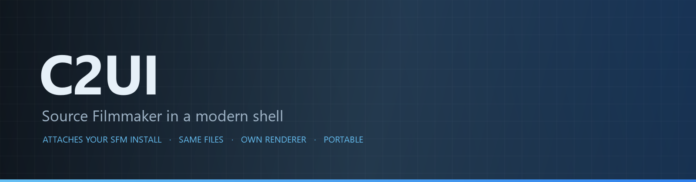

<details align="center"><summary>&nbsp;🌐 <b>🇬🇧 English</b> &nbsp;·&nbsp; <sub>Language · Язык · 語言 · Idioma · Sprache · भाषा · لغة</sub></summary>

<table align="center">
<tr><td align="center"><a href="../../README.md">🇷🇺<br>Русский</a></td><td align="center"><b>🇬🇧<br>English</b></td><td align="center"><a href="../README/PL-pl.md">🇵🇱<br>Polski</a></td><td align="center"><a href="../README/UK-ua.md">🇺🇦<br>Українська</a></td><td align="center"><a href="../README/DE-de.md">🇩🇪<br>Deutsch</a></td><td align="center"><a href="../README/RO-md.md">🇲🇩<br>Moldovenească</a></td><td align="center"><a href="../README/SL-si.md">🇸🇮<br>Slovenščina</a></td><td align="center"><a href="../README/BE-by.md">🇧🇾<br>Беларуская</a></td></tr>
<tr><td align="center"><a href="../README/KK-kz.md">🇰🇿<br>Қазақша</a></td><td align="center"><a href="../README/JA-jp.md">🇯🇵<br>日本語</a></td><td align="center"><a href="../README/ZH-cn.md">🇨🇳<br>中文</a></td><td align="center"><a href="../README/SV-se.md">🇸🇪<br>Svenska</a></td><td align="center"><a href="../README/ES-es.md">🇪🇸<br>Español</a></td><td align="center"><a href="../README/HI-in.md">🇮🇳<br>हिन्दी</a></td><td align="center"><a href="../README/PT-pt.md">🇵🇹<br>Português</a></td><td align="center"><a href="../README/BN-bd.md">🇧🇩<br>বাংলা</a></td></tr>
<tr><td align="center"><a href="../README/FR-fr.md">🇫🇷<br>Français</a></td><td align="center"><a href="../README/TE-in.md">🇮🇳<br>తెలుగు</a></td><td align="center"><a href="../README/MR-in.md">🇮🇳<br>मराठी</a></td><td align="center"><a href="../README/TA-in.md">🇮🇳<br>தமிழ்</a></td><td align="center"><a href="../README/TR-tr.md">🇹🇷<br>Türkçe</a></td><td align="center"><a href="../README/UR-pk.md">🇵🇰<br>اردو</a></td><td align="center"><a href="../README/VI-vn.md">🇻🇳<br>Tiếng Việt</a></td><td align="center"><a href="../README/GU-in.md">🇮🇳<br>ગુજરાતી</a></td></tr>
<tr><td align="center"><a href="../README/IT-it.md">🇮🇹<br>Italiano</a></td><td align="center"><a href="../README/KO-kr.md">🇰🇷<br>한국어</a></td><td align="center"><a href="../README/AR-sa.md">🇸🇦<br>العربية</a></td><td align="center"><a href="../README/JV-id.md">🇮🇩<br>Basa Jawa</a></td><td align="center"><a href="../README/ML-in.md">🇮🇳<br>മലയാളം</a></td><td align="center"><a href="../README/NE-np.md">🇳🇵<br>नेपाली</a></td><td align="center"><a href="../README/UZ-uz.md">🇺🇿<br>Oʻzbekcha</a></td><td align="center"><a href="../README/OR-in.md">🇮🇳<br>ଓଡ଼ିଆ</a></td></tr>
</table>

</details>

<p align="center"></p>

<p align="center">
  
  
  
  
  <a href="../../Testing"></a>
  
  <a href="../LICENSE/EN-en.md"></a>
</p>

<p align="center"><b>C2UI</b> — <i>Custom to User Interface</i> — the Source Filmmaker editor in a modern shell: the same content, the same session format, the same data model, with an interface in the spirit of the Steam library and the Unreal Engine 5 editor.</p>

---

## Readiness

<p align="center"></p>

<p align="center"><a href="../READINESS/EN-en.md"></a></p>

## The idea

Source Filmmaker is a strong tool whose interface stayed in 2012. C2UI does not replace or remake it: the goal is simply to make SFM a little more modern and more comfortable.

The editor finds the installed SFM, attaches it as a content library — models, materials, textures, sessions — and works with the same files in the same format. Anything made in SFM opens in C2UI, and the other way round.

The first goal is full compatibility with SFM, bones and rigs included. After that, what SFM was missing.

```
  ┌──────────────┐                           ┌──────────────────────────────┐
  │   C2UI       │ ──── "where is SFM?" ────▶│  SourceFilmmaker/game/       │
  │              │                           │    usermod/gameinfo.txt      │
  │  own UI      │ ◀──────── mounted ────────│    tf/  hl2/  tf_movies/ …   │
  │  own render  │         read only         │    models/ materials/ dmx    │
  └──────────────┘                           └──────────────────────────────┘
```

- **Portable.** Nothing is written outside the application folder: settings under `App/User`, caches under `App/Cache`, scratch under `App/Temporary`. Delete the folder and it is gone.
- **Never runs SFM.** No process to drive, no windows to hijack. The installation is read like a content pack.
- **Formats verified, not assumed.** Every reader was checked against the real installation; where a format does something surprising, the code says so.
- **Saving is exact.** A session read and written unchanged is the same file.
- **The engine has no dependencies.** `Core/` and the whole test suite run on a bare Python; only the window needs Qt and OpenGL.

## Layout

```
C2UI_SDK/
├── README.md
├── Core/               engine: formats, virtual file system, index, bridges
│   ├── API/            the contract for the editor, tools and plugins
│   ├── Code/           engine: animation, operators, faces, editing
│   │   └── formats/    Valve readers: mdl vvd vtx vmt vtf dmx bsp
│   └── dev-kit/        SDK slots (empty) and bridges to installations
├── Launcher/           the launcher
├── App/                the editor: content library, renderer, window
│   ├── Code/           content library, window, settings
│   │   ├── render/     scene, OpenGL renderer, shaders, camera
│   │   └── ui/         timeline, session tree, inspector, graph editor, docking
│   ├── Data/           program resources, read-only
│   ├── User/           user data — never deleted
│   └── Cache/          content index, shaders, thumbnails
├── Tools/              localisation, UI tooling, plugins (later)
│   ├── Market Load/    plugin marketplace client (later)
│   ├── Localization/   authoring translations
│   ├── NewPlugins/     authoring plugins
│   └── UI/             themes and workspaces
├── Testing/            tests, byte-exact fixtures, one runner
│   ├── core/           the engine
│   ├── app/            the editor
│   └── fixtures/       fake installation, models, textures
└── GIT&DOCK/           README, readiness and licence in 32 languages
```

### How it works

The path from "where is Source Filmmaker?" to a frame on screen runs through five layers; each one knows only about the one below it.

1. **The bridge** (`Core/dev-kit/bridge_sfm`) finds the installation through Steam, reads `gameinfo.txt` and returns the content paths in the engine's order. `sfm.exe` is never launched.
2. **The virtual file system and the index** (`Core/Code/vfs.py`, `content_index.py`) layer those paths the way Source does: the first file found wins. The index is one SQLite file in `App/Cache`, so the walk over 70 000 files is paid once.
3. **The formats** (`Core/Code/formats`) read Valve's files with no third-party libraries: `.mdl` `.vvd` `.vtx` are a model, `.vmt` `.vtf` a material and its texture, `.dmx` a session, `.bsp` a map. Every reader is checked against the whole installation; a session is written back byte for byte.
4. **The session** is a graph of DMX elements. `animation.py` evaluates the channels at a moment in time, `operators.py` runs expressions and rig constraints, `flex.py` moves the faces, `pose.py` builds the bone matrices. Every edit goes through `editing.py` as an undoable command.
5. **The editor** (`App/Code`) turns that into a scene (`render/scene.py`) and draws it with its own OpenGL 3.3 renderer (`renderer.py`, `shaders.py`): session lights, lightmaps and the map's lighting — the picture is still far from SFM's and is being worked on. The panels (`ui/`) are the timeline, the session tree, the inspector, the graph editor and UE5-style docking.

Everything the program writes stays inside its folder: `App/User` for settings, `App/Cache` for the index and caches, `App/Temporary` for the log. `Core/` writes nothing and does not depend on Qt, so the engine and the tests run on bare Python; Qt and OpenGL are needed only by the window. The utilities in `Tools/` are built strictly on `Core/API` — that is how the API is proven good enough for third-party plugins.

### Running it

Requires Windows, Python 3.13 and a Source Filmmaker installation.

```bash
git clone https://github.com/Arkomiko/SFM_C2UI.git
cd SFM_C2UI
python -m venv .venv
.venv/Scripts/python.exe -m pip install -r Launcher/requirements.txt
.venv/Scripts/python.exe Launcher/launcher.py
```

That opens the launcher: a small window with three buttons. Its look is temporary — it will be rewritten once App exists, and its own window is in Russian for now.

<p align="center"><a href="../LAUNCHER/EN-en.md"></a></p>

On first start it looks for SFM through Steam; if it cannot find it, it asks. <kbd>Ctrl</kbd>+<kbd>O</kbd> opens a session, <kbd>Space</kbd> plays, <kbd>C</kbd> looks through the shot camera, <kbd>T</kbd>/<kbd>R</kbd> move/rotate, <kbd>M</kbd> the motion editor, <kbd>G</kbd> the graph editor, <kbd>Ctrl</kbd>+<kbd>Z</kbd> undoes, <kbd>Ctrl</kbd>+<kbd>S</kbd> saves. The camera works as in SFM: right button looks around, with it held <kbd>W</kbd><kbd>A</kbd><kbd>S</kbd><kbd>D</kbd> <kbd>Z</kbd><kbd>X</kbd> fly (<kbd>Shift</kbd> faster), middle pans, the wheel dollies, <kbd>Alt</kbd>+left orbits. Clicking a character picks the bone under the cursor (or its rig handle). Panels are dragged by their title. The tests need nothing at all:

```bash
python Testing/run.py
```

### Planned

**Next**
- The map's look: water, prop_dynamic, light gobo textures, `$bumpmap` and `$envmap`, shadows from session lights.
- Sound in exported movies.
- `.c2plg` plugins and the marketplace client in `Tools/Market Load`; then themes and workspaces.
- Sound on the timeline, particles, wrinkle maps, motion-editor presets and layers, tangents in the graph editor.

**Later**
- Performance on full maps: instanced static props, cached poses.
- Engine rework: new map-compile parameters for improved lighting and shadows, a 120 000-unit map limit.
- A packaged launcher with its own Python and self-update; editor localisation.

## Licence and credits

C2UI's own code is under the **C2UI licence**: free for personal and non-commercial use; commercial use only with the author's written consent; modified versions must credit the original project and its author, Arkomiko. Plugins and addons are under the **C2UI — Plugins & Addons (C2UI‑Pl&AD)** licence.

Source Filmmaker, Team Fortress 2 and the Source engine are Valve's; this project reads their formats, ships none of their files and works only with your own copy of SFM from Steam.

<p align="center"><a href="../LICENSE/EN-en.md"></a></p>
