<p align="center"></p>

<p align="center"><a href="../../README.md">🇷🇺 Русский</a> · <b>🇬🇧 English</b> · <a href="PL-pl.md">🇵🇱 Polski</a> · <a href="UK-ua.md">🇺🇦 Українська</a> · <a href="DE-de.md">🇩🇪 Deutsch</a> · <a href="RO-md.md">🇲🇩 Moldovenească</a> · <a href="SL-si.md">🇸🇮 Slovenščina</a> · <a href="BE-by.md">🇧🇾 Беларуская</a> · <a href="KK-kz.md">🇰🇿 Қазақша</a> · <a href="JA-jp.md">🇯🇵 日本語</a> · <a href="ZH-cn.md">🇨🇳 中文</a> · <a href="SV-se.md">🇸🇪 Svenska</a> · <a href="ES-es.md">🇪🇸 Español</a> · <a href="HI-in.md">🇮🇳 हिन्दी</a> · <a href="PT-pt.md">🇵🇹 Português</a> · <a href="BN-bd.md">🇧🇩 বাংলা</a> · <a href="FR-fr.md">🇫🇷 Français</a> · <a href="TE-in.md">🇮🇳 తెలుగు</a> · <a href="MR-in.md">🇮🇳 मराठी</a> · <a href="TA-in.md">🇮🇳 தமிழ்</a> · <a href="TR-tr.md">🇹🇷 Türkçe</a> · <a href="UR-pk.md">🇵🇰 اردو</a> · <a href="VI-vn.md">🇻🇳 Tiếng Việt</a> · <a href="GU-in.md">🇮🇳 ગુજરાતી</a> · <a href="IT-it.md">🇮🇹 Italiano</a> · <a href="KO-kr.md">🇰🇷 한국어</a> · <a href="AR-sa.md">🇸🇦 العربية</a> · <a href="JV-id.md">🇮🇩 Basa Jawa</a> · <a href="ML-in.md">🇮🇳 മലയാളം</a> · <a href="NE-np.md">🇳🇵 नेपाली</a> · <a href="UZ-uz.md">🇺🇿 Oʻzbekcha</a> · <a href="OR-in.md">🇮🇳 ଓଡ଼ିଆ</a></p>

<p align="center">
  
  
  
  
  <a href="../../Testing"></a>
  
</p>

<p align="center"><b>C2UI</b> — <i>Custom to User Interface</i> — — the Source Filmmaker editor in a modern shell: the same content, the same session format, the same data model, with an interface in the spirit of the Steam library and the Unreal Engine 5 editor.</p>

---

## The idea

Source Filmmaker is a strong tool whose interface stayed in 2012. C2UI does not replace or remake it: the goal is simply to make SFM a little more modern and more comfortable.

The editor finds the installed SFM, attaches it as a content library — models, materials, textures, sessions — and works with the same files in the same format. Anything made in SFM opens in C2UI, and the other way round.

The first goal is full compatibility with SFM, bones and rigs included. After that, what SFM was missing.

```
  ┌──────────────┐    "where is SFM?"    ┌──────────────────────────────┐
  │   C2UI       │ ─────────────────────▶│  SourceFilmmaker/game/       │
  │              │                       │    usermod/gameinfo.txt      │
  │  own UI      │ ◀─────  mounted  ───────│    tf/  hl2/  tf_movies/ …   │
  │  own render  │       read only       │    models/ materials/ dmx    │
  └──────────────┘                       └──────────────────────────────┘
```

## Readiness



 <b>Overall readiness for release: 38%</b>

Each area expands: what already works and what does not yet. The percentages are an estimate against what SFM can do.

<details><summary> <b>Finding and mounting SFM</b></summary>

Steam registry → `libraryfolders.vdf` → the search paths of `gameinfo.txt`, in the engine's own order. Six mounts on a stock install. Nothing is written outside the application folder.

</details>
<details><summary> <b>Content index</b></summary>

70 199 files in 1.1 s cold / 0.02 s warm; overrides between mounts resolved exactly as the engine does.

</details>
<details><summary> <b>Models — <code>.mdl</code> <code>.vvd</code> <code>.vtx</code></b></summary>

Versions 44, 48, 49. Skeleton, meshes, every level of detail, body groups. 1 500 models loaded, 0 failures.

</details>
<details><summary> <b>Materials — <code>.vmt</code></b></summary>

All 19 554 shipped materials parse; `patch`, DX-level blocks, proxies.

</details>
<details><summary> <b>Textures — <code>.vtf</code></b></summary>

Versions 7.0–7.5, DXT1/3/5 and every uncompressed format, cubemaps, mips. DXT goes to the GPU without decoding.

</details>
<details><summary> <b>Sessions — <code>.dmx</code></b></summary>

Binary 1–5 and KeyValues2. Every session and particle file in the install writes back **byte for byte**.

</details>
<details><summary> <b>Session on screen</b></summary>

Shots and sound tracks on a timeline, the element tree, each shot's scene through its camera. Not yet: maps, particles, sound.

</details>
<details><summary> <b>Animation</b></summary>

Channels and logs evaluated at the cursor; scrub and play. Bones, cameras and visibility follow the session.

</details>
<details><summary> <b>Faces</b></summary>

Flex controllers, the compiled rules and vertex animation — characters talk and emote. Not yet: wrinkle maps.

</details>
<details><summary> <b>Rigs</b></summary>

Expressions, point/orient/parent/aim constraints, two-bone IK. Not yet: the full operator dependency graph, rig creation.

</details>
<details><summary> <b>Editing</b></summary>

Click to select, a move/rotate manipulator, an inspector for any attribute, a key at the cursor, undo/redo, byte-exact save. Not yet: the graph editor.

</details>
<details><summary> <b>Motion editor</b></summary>

A time selection with hold and falloff on the ruler; an edit spreads over it as in SFM. Not yet: presets, layers.

</details>
<details><summary> <b>Panel docking</b></summary>

Drag panels onto a compass of targets with a preview, as in UE5 and Visual Studio. Not yet: saved layouts, themes.

</details>
<details><summary> <b>Source shading</b></summary>

Texture and a simple light only. Not yet: phong, rim, lightwarp, scene lights, shadows.

</details>
<details><summary> <b>Maps — <code>.bsp</code></b></summary>

Not started.

</details>
<details><summary> <b>Rendering to image and video</b></summary>

Not started.

</details>
<details><summary> <b>Plugins <code>.c2plg</code></b></summary>

Not started.

</details>
<details><summary> <b>Themes and workspaces</b></summary>

Deliberately later: one look until the editor has something worth theming.

</details>

**Not ready for release.** The foundation — every file format SFM uses, read correctly and verified against the whole installation — is in place and tested, and a session can be opened, played, changed and saved. What is missing is the *comfort* of working: the graph editor, Source shading, maps, export. No version number until an animator can do a day's work in it.

<br clear="all">

<p align="center"><br><sub>The editor today, with Valve's Meet the Heavy open: shots and sound on the timeline, the session tree, the first shot seen through its own camera, characters posed and facing as the session says.</sub></p>

## What makes it different

- **Portable.** Nothing is written outside the application folder: settings under `App/User`, caches under `App/Cache`, scratch under `App/Temporary`. Delete the folder and it is gone.
- **Never runs SFM.** No process to drive, no windows to hijack. The installation is read like a content pack.
- **Formats verified, not assumed.** Every reader was checked against the real installation; where a format does something surprising, the code says so.
- **Saving is exact.** A session read and written unchanged is the same file.
- **The engine has no dependencies.** `Core/` and the whole test suite run on a bare Python; only the window needs Qt and OpenGL.

## Running it

Requires Windows, Python 3.13 and a Source Filmmaker installation.

```bash
git clone https://github.com/Arkomiko/SFM_C2UI.git
cd SFM_C2UI
python -m venv .venv
.venv/Scripts/python.exe -m pip install -r requirements.txt
.venv/Scripts/python.exe c2ui.py
```

On first start it looks for SFM through Steam; if it cannot find it, it asks. <kbd>Ctrl</kbd>+<kbd>O</kbd> opens a session, <kbd>Space</kbd> plays, <kbd>C</kbd> looks through the shot camera, <kbd>T</kbd>/<kbd>R</kbd> move/rotate, <kbd>M</kbd> the motion editor, <kbd>Ctrl</kbd>+<kbd>Z</kbd> undoes, <kbd>Ctrl</kbd>+<kbd>S</kbd> saves. Panels are dragged by their title. The tests need nothing at all:

```bash
python Testing/run.py
```

## Layout

```
C2UI_SDK/
├── c2ui.py            the launcher
├── Core/              engine: formats, virtual file system, index, bridges
├── App/               the editor: content library, renderer, window
├── Tools/             localisation, UI tooling, plugins (later)
├── Testing/           tests, byte-exact fixtures, one runner
└── GIT&DOCK/README/   this README in other languages
```

## Roadmap

1. **Graph editor** — curves and keys, seen.
2. **Source shading** — VertexLitGeneric as SFM draws it: phong, rim, lightwarp, scene lights.
3. **Maps** — `.bsp` for backgrounds.
4. **Output** — image and video export.
5. **Plugins** — the `.c2plg` format; then themes and workspaces.

## Licence and credits

Source Filmmaker, Team Fortress 2 and the Source engine are Valve's. This project reads their file formats, ships none of their files, and works only with a copy of SFM you already have through Steam.

The licence for C2UI's own code has not been chosen yet — until it is, all rights reserved. Issues and pull requests are welcome all the same.

<p align="center"><br><sub>Sixty-four models picked at random from the installation, rendered by C2UI's own renderer.</sub></p>
