<p align="center"></p>

<p align="center"><a href="../../README.md">🇷🇺 Русский</a> · <a href="EN-en.md">🇬🇧 English</a> · <a href="PL-pl.md">🇵🇱 Polski</a> · <a href="UK-ua.md">🇺🇦 Українська</a> · <a href="DE-de.md">🇩🇪 Deutsch</a> · <a href="RO-md.md">🇲🇩 Moldovenească</a> · <a href="SL-si.md">🇸🇮 Slovenščina</a> · <a href="BE-by.md">🇧🇾 Беларуская</a> · <a href="KK-kz.md">🇰🇿 Қазақша</a> · <a href="JA-jp.md">🇯🇵 日本語</a> · <a href="ZH-cn.md">🇨🇳 中文</a> · <a href="SV-se.md">🇸🇪 Svenska</a> · <b>🇪🇸 Español</b> · <a href="HI-in.md">🇮🇳 हिन्दी</a> · <a href="PT-pt.md">🇵🇹 Português</a> · <a href="BN-bd.md">🇧🇩 বাংলা</a> · <a href="FR-fr.md">🇫🇷 Français</a> · <a href="TE-in.md">🇮🇳 తెలుగు</a> · <a href="MR-in.md">🇮🇳 मराठी</a> · <a href="TA-in.md">🇮🇳 தமிழ்</a> · <a href="TR-tr.md">🇹🇷 Türkçe</a> · <a href="UR-pk.md">🇵🇰 اردو</a> · <a href="VI-vn.md">🇻🇳 Tiếng Việt</a> · <a href="GU-in.md">🇮🇳 ગુજરાતી</a> · <a href="IT-it.md">🇮🇹 Italiano</a> · <a href="KO-kr.md">🇰🇷 한국어</a> · <a href="AR-sa.md">🇸🇦 العربية</a> · <a href="JV-id.md">🇮🇩 Basa Jawa</a> · <a href="ML-in.md">🇮🇳 മലയാളം</a> · <a href="NE-np.md">🇳🇵 नेपाली</a> · <a href="UZ-uz.md">🇺🇿 Oʻzbekcha</a> · <a href="OR-in.md">🇮🇳 ଓଡ଼ିଆ</a></p>

<p align="center">
  
  
  
  
  <a href="../../Testing"></a>
  
</p>

<p align="center"><b>C2UI</b> — <i>Custom to User Interface</i> — — el editor de Source Filmmaker en una interfaz moderna: el mismo contenido, el mismo formato de sesión, el mismo modelo de datos, con un aspecto al estilo de la biblioteca de Steam y del editor de Unreal Engine 5.</p>

---

## Estado

<p align="center"></p>

<p align="center"> <b>Preparación general para el lanzamiento: 41%</b></p>

<p align="center"><a href="../assets/ES-es/sidebar.md"></a></p>

## La idea

Source Filmmaker es una herramienta potente cuya interfaz se quedó en 2012. C2UI no lo sustituye ni lo rehace: el objetivo es simplemente hacer SFM un poco más moderno y cómodo.

El editor encuentra el SFM instalado, lo conecta como biblioteca de contenido — modelos, materiales, texturas, sesiones — y trabaja con los mismos archivos en el mismo formato. Todo lo hecho en SFM se abre en C2UI, y viceversa.

El primer objetivo es la compatibilidad total con SFM, huesos y rigs incluidos. Después, lo que a SFM le faltaba.

```
  ┌──────────────┐    "¿dónde está SFM?"    ┌──────────────────────────────┐
  │   C2UI       │ ─────────────────────▶│  SourceFilmmaker/game/       │
  │              │                       │    usermod/gameinfo.txt      │
  │  UI propia   │ ◀─────  montado  ───────│    tf/  hl2/  tf_movies/ …   │
  │  render propio │      solo lectura      │    models/ materials/ dmx    │
  └──────────────┘                       └──────────────────────────────┘
```

<p align="center"><br><sub>El editor hoy, con Meet the Heavy de Valve abierto: planos y sonido en la línea de tiempo, el árbol de la sesión, el primer plano visto por su propia cámara, personajes posados y con las caras que dice la sesión.</sub></p>

## Qué lo hace diferente

- **Portátil.** No se escribe nada fuera de la carpeta de la aplicación: ajustes en `App/User`, cachés en `App/Cache`, temporales en `App/Temporary`. Borra la carpeta y desaparece.
- **Nunca ejecuta SFM.** No hay proceso que controlar ni ventanas que secuestrar. La instalación se lee como un paquete de contenido.
- **Formatos verificados, no supuestos.** Cada lector se comprobó contra la instalación real; donde un formato hace algo sorprendente, el código lo dice.
- **El guardado es exacto.** Una sesión leída y escrita sin cambios es el mismo archivo.
- **El motor no tiene dependencias.** `Core/` y toda la suite de pruebas corren en Python puro; solo la ventana necesita Qt y OpenGL.

## Ejecutar

Requiere Windows, Python 3.13 y una instalación de Source Filmmaker.

```bash
git clone https://github.com/Arkomiko/SFM_C2UI.git
cd SFM_C2UI
python -m venv .venv
.venv/Scripts/python.exe -m pip install -r Tools/Launcher/requirements.txt
.venv/Scripts/python.exe Tools/Launcher/c2ui.py
```

Al primer arranque busca SFM a través de Steam; si no lo encuentra, pregunta. <kbd>Ctrl</kbd>+<kbd>O</kbd> abre una sesión, <kbd>Espacio</kbd> reproduce, <kbd>C</kbd> mira por la cámara del plano, <kbd>T</kbd>/<kbd>R</kbd> mover/rotar, <kbd>M</kbd> motion editor, <kbd>Ctrl</kbd>+<kbd>Z</kbd> deshace, <kbd>Ctrl</kbd>+<kbd>S</kbd> guarda. Los paneles se arrastran por su título. Las pruebas no necesitan nada:

```bash
python Testing/run.py
```

## Estructura

```
C2UI_SDK/
├── README.md
├── Core/              motor: formatos, sistema de archivos virtual, índice, puentes
├── App/               el editor: biblioteca de contenido, renderizador, ventana
├── Tools/             localización, herramientas de UI, plugins (más adelante)
│   └── Launcher/      el lanzador
├── Testing/           pruebas, fixtures exactos al byte, un runner
└── GIT&DOCK/          este README en otros idiomas
```

## Hoja de ruta

1. **Sombreado Source** — VertexLitGeneric como lo dibuja SFM: phong, rim, lightwarp, luces de escena.
2. **Mapas** — `.bsp` para fondos.
3. **Salida** — exportación a imagen y vídeo.
4. **Plugins** — el formato `.c2plg`; después temas y espacios de trabajo.

## Licencia y créditos

El código propio de C2UI está bajo la **licencia C2UI**: libre para uso personal y no comercial; uso comercial solo con el consentimiento escrito del autor; las versiones modificadas deben citar el proyecto original y a su autor, Arkomiko. Los plugins y addons están bajo la licencia **C2UI — Plugins & Addons (C2UI‑Pl&AD)**.

Source Filmmaker, Team Fortress 2 y el motor Source son de Valve; el proyecto lee sus formatos, no incluye sus archivos y solo funciona con tu propia copia de SFM de Steam.

<p align="center"><a href="../LICENSE/ES-es.md"></a></p>

<p align="center"><br><sub>Sesenta y cuatro modelos elegidos al azar de la instalación, dibujados por el renderizador propio de C2UI.</sub></p>
