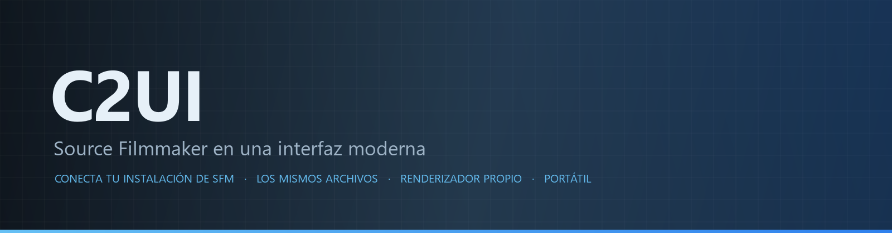

<details align="center"><summary>&nbsp;🌐 <b>🇪🇸 Español</b> &nbsp;·&nbsp; <sub>Language · Язык · 語言 · Idioma · Sprache · भाषा · لغة</sub></summary>

<table align="center">
<tr><td align="center"><a href="../../README.md">🇷🇺<br>Русский</a></td><td align="center"><a href="../README/EN-en.md">🇬🇧<br>English</a></td><td align="center"><a href="../README/PL-pl.md">🇵🇱<br>Polski</a></td><td align="center"><a href="../README/UK-ua.md">🇺🇦<br>Українська</a></td><td align="center"><a href="../README/DE-de.md">🇩🇪<br>Deutsch</a></td><td align="center"><a href="../README/RO-md.md">🇲🇩<br>Moldovenească</a></td><td align="center"><a href="../README/SL-si.md">🇸🇮<br>Slovenščina</a></td><td align="center"><a href="../README/BE-by.md">🇧🇾<br>Беларуская</a></td></tr>
<tr><td align="center"><a href="../README/KK-kz.md">🇰🇿<br>Қазақша</a></td><td align="center"><a href="../README/JA-jp.md">🇯🇵<br>日本語</a></td><td align="center"><a href="../README/ZH-cn.md">🇨🇳<br>中文</a></td><td align="center"><a href="../README/SV-se.md">🇸🇪<br>Svenska</a></td><td align="center"><b>🇪🇸<br>Español</b></td><td align="center"><a href="../README/HI-in.md">🇮🇳<br>हिन्दी</a></td><td align="center"><a href="../README/PT-pt.md">🇵🇹<br>Português</a></td><td align="center"><a href="../README/BN-bd.md">🇧🇩<br>বাংলা</a></td></tr>
<tr><td align="center"><a href="../README/FR-fr.md">🇫🇷<br>Français</a></td><td align="center"><a href="../README/TE-in.md">🇮🇳<br>తెలుగు</a></td><td align="center"><a href="../README/MR-in.md">🇮🇳<br>मराठी</a></td><td align="center"><a href="../README/TA-in.md">🇮🇳<br>தமிழ்</a></td><td align="center"><a href="../README/TR-tr.md">🇹🇷<br>Türkçe</a></td><td align="center"><a href="../README/UR-pk.md">🇵🇰<br>اردو</a></td><td align="center"><a href="../README/VI-vn.md">🇻🇳<br>Tiếng Việt</a></td><td align="center"><a href="../README/GU-in.md">🇮🇳<br>ગુજરાતી</a></td></tr>
<tr><td align="center"><a href="../README/IT-it.md">🇮🇹<br>Italiano</a></td><td align="center"><a href="../README/KO-kr.md">🇰🇷<br>한국어</a></td><td align="center"><a href="../README/AR-sa.md">🇸🇦<br>العربية</a></td><td align="center"><a href="../README/JV-id.md">🇮🇩<br>Basa Jawa</a></td><td align="center"><a href="../README/ML-in.md">🇮🇳<br>മലയാളം</a></td><td align="center"><a href="../README/NE-np.md">🇳🇵<br>नेपाली</a></td><td align="center"><a href="../README/UZ-uz.md">🇺🇿<br>Oʻzbekcha</a></td><td align="center"><a href="../README/OR-in.md">🇮🇳<br>ଓଡ଼ିଆ</a></td></tr>
</table>

</details>

<p align="center"></p>

<p align="center">
  
  
  
  
  <a href="../../Testing"></a>
  
  <a href="../LICENSE/ES-es.md"></a>
</p>

<p align="center"><b>C2UI</b> — <i>Custom to User Interface</i> — el editor de Source Filmmaker en una interfaz moderna: el mismo contenido, el mismo formato de sesión, el mismo modelo de datos, con un aspecto al estilo de la biblioteca de Steam y del editor de Unreal Engine 5.</p>

---

## Estado

<p align="center"></p>

<p align="center"><a href="../READINESS/ES-es.md"></a></p>

## La idea

Source Filmmaker es una herramienta potente cuya interfaz se quedó en 2012. C2UI no lo sustituye ni lo rehace: el objetivo es simplemente hacer SFM un poco más moderno y cómodo.

El editor encuentra el SFM instalado, lo conecta como biblioteca de contenido — modelos, materiales, texturas, sesiones — y trabaja con los mismos archivos en el mismo formato. Todo lo hecho en SFM se abre en C2UI, y viceversa.

El primer objetivo es la compatibilidad total con SFM, huesos y rigs incluidos. Después, lo que a SFM le faltaba.

```
  ┌────────────────┐                              ┌──────────────────────────────┐
  │   C2UI         │ ──── "¿dónde está SFM?" ────▶│  SourceFilmmaker/game/       │
  │                │                              │    usermod/gameinfo.txt      │
  │  UI propia     │ ◀───────── montado ──────────│    tf/  hl2/  tf_movies/ …   │
  │  render propio │         solo lectura         │    models/ materials/ dmx    │
  └────────────────┘                              └──────────────────────────────┘
```

- **Portátil.** No se escribe nada fuera de la carpeta de la aplicación: ajustes en `App/User`, cachés en `App/Cache`, temporales en `App/Temporary`. Borra la carpeta y desaparece.
- **Nunca ejecuta SFM.** No hay proceso que controlar ni ventanas que secuestrar. La instalación se lee como un paquete de contenido.
- **Formatos verificados, no supuestos.** Cada lector se comprobó contra la instalación real; donde un formato hace algo sorprendente, el código lo dice.
- **El guardado es exacto.** Una sesión leída y escrita sin cambios es el mismo archivo.
- **El motor no tiene dependencias.** `Core/` y toda la suite de pruebas corren en Python puro; solo la ventana necesita Qt y OpenGL.

## Estructura

```
C2UI_SDK/
├── README.md
├── Core/               motor: formatos, sistema de archivos virtual, índice, puentes
│   ├── API/            el contrato para el editor, las herramientas y los plugins
│   ├── Code/           motor: animación, operadores, caras, edición
│   │   └── formats/    lectores Valve: mdl vvd vtx vmt vtf dmx bsp
│   └── dev-kit/        ranuras SDK (vacías) y puentes a instalaciones
├── App/                el editor: biblioteca de contenido, renderizador, ventana
│   ├── Code/           biblioteca de contenido, ventana, ajustes
│   │   ├── render/     escena, renderizador OpenGL, shaders, cámara
│   │   └── ui/         línea de tiempo, árbol de sesión, inspector, graph editor, acoplamiento
│   ├── Data/           recursos del programa, solo lectura
│   ├── User/           datos del usuario — nunca se borran
│   └── Cache/          índice de contenido, shaders, miniaturas
├── Tools/              localización, herramientas de UI, plugins (más adelante)
│   ├── Launcher/       el lanzador
│   ├── Market Load/    cliente del marketplace de plugins (más adelante)
│   ├── Localization/   crear traducciones
│   ├── NewPlugins/     crear plugins
│   └── UI/             temas y espacios de trabajo
├── Testing/            pruebas, fixtures exactos al byte, un runner
│   ├── core/           el motor
│   ├── app/            el editor
│   └── fixtures/       instalación falsa, modelos, texturas
└── GIT&DOCK/           README, preparación y licencia en 32 idiomas
```

### Cómo funciona

El camino desde «¿dónde está Source Filmmaker?» hasta un fotograma en pantalla pasa por cinco capas; cada una conoce solo la que tiene debajo.

1. **El puente** (`Core/dev-kit/bridge_sfm`) encuentra la instalación a través de Steam, lee `gameinfo.txt` y devuelve las rutas de contenido en el orden del motor. `sfm.exe` nunca se ejecuta.
2. **El sistema de archivos virtual y el índice** (`Core/Code/vfs.py`, `content_index.py`) superponen esas rutas como lo hace Source: gana el primer archivo encontrado. El índice es un solo archivo SQLite en `App/Cache`, así que recorrer 70 000 archivos se paga una vez.
3. **Los formatos** (`Core/Code/formats`) leen los archivos de Valve sin bibliotecas de terceros: `.mdl` `.vvd` `.vtx` son un modelo, `.vmt` `.vtf` un material y su textura, `.dmx` una sesión, `.bsp` un mapa. Cada lector está comprobado contra toda la instalación; una sesión se reescribe byte a byte.
4. **La sesión** es un grafo de elementos DMX. `animation.py` evalúa los canales en un instante, `operators.py` ejecuta expresiones y restricciones de rig, `flex.py` mueve las caras, `pose.py` construye las matrices de huesos. Cada edición pasa por `editing.py` como un comando deshacible.
5. **El editor** (`App/Code`) convierte todo eso en una escena (`render/scene.py`) y la dibuja con su propio renderizador OpenGL 3.3 (`renderer.py`, `shaders.py`): luces de la sesión, lightmaps e iluminación del mapa; la imagen aún está lejos de la de SFM y se sigue trabajando. Los paneles (`ui/`) son la línea de tiempo, el árbol de la sesión, el inspector, el graph editor y el acoplamiento al estilo de UE5.

Todo lo que el programa escribe se queda en su carpeta: `App/User` para ajustes, `App/Cache` para el índice y las cachés, `App/Temporary` para el registro. `Core/` no escribe nada y no depende de Qt, así que el motor y las pruebas corren en Python puro; Qt y OpenGL solo los necesita la ventana. Las utilidades de `Tools/` se construyen estrictamente sobre `Core/API`: así se comprueba que la API basta también para plugins de terceros.

### Ejecutar

Requiere Windows, Python 3.13 y una instalación de Source Filmmaker.

```bash
git clone https://github.com/Arkomiko/SFM_C2UI.git
cd SFM_C2UI
python -m venv .venv
.venv/Scripts/python.exe -m pip install -r Tools/Launcher/requirements.txt
.venv/Scripts/python.exe Tools/Launcher/c2ui.py
```

Al primer arranque busca SFM a través de Steam; si no lo encuentra, pregunta. <kbd>Ctrl</kbd>+<kbd>O</kbd> abre una sesión, <kbd>Espacio</kbd> reproduce, <kbd>C</kbd> mira por la cámara del plano, <kbd>T</kbd>/<kbd>R</kbd> mover/rotar, <kbd>M</kbd> motion editor, <kbd>Ctrl</kbd>+<kbd>Z</kbd> deshace, <kbd>Ctrl</kbd>+<kbd>S</kbd> guarda. Los paneles se arrastran por su título. Las pruebas no necesitan nada:

```bash
python Testing/run.py
```

### En los planes

**Próximo**
- El aspecto del mapa: agua, prop_dynamic, texturas gobo de las luces, `$bumpmap` y `$envmap`, sombras de las luces de la sesión.
- Sonido en las películas exportadas.
- Plugins `.c2plg` y el cliente del marketplace en `Tools/Market Load`; después temas y espacios de trabajo.
- Sonido en la línea de tiempo, partículas, wrinkle maps, presets y capas del motion editor, tangentes en el graph editor.

**Más adelante**
- Rendimiento en mapas completos: props estáticos instanciados, poses en caché.
- Reelaboración del motor: nuevos parámetros de compilación de mapas para mejor iluminación y sombras, límite de mapa de 120 000 unidades.
- Un lanzador empaquetado con su propio Python y autoactualización; localización del editor.

## Licencia y créditos

El código propio de C2UI está bajo la **licencia C2UI**: libre para uso personal y no comercial; uso comercial solo con el consentimiento escrito del autor; las versiones modificadas deben citar el proyecto original y a su autor, Arkomiko. Los plugins y addons están bajo la licencia **C2UI — Plugins & Addons (C2UI‑Pl&AD)**.

Source Filmmaker, Team Fortress 2 y el motor Source son de Valve; el proyecto lee sus formatos, no incluye sus archivos y solo funciona con tu propia copia de SFM de Steam.

<p align="center"><a href="../LICENSE/ES-es.md"></a></p>
