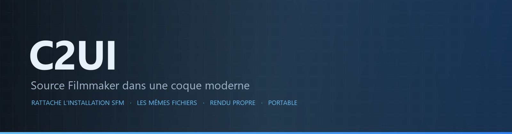

<p align="center"></p>

<p align="center"><a href="../../README.md">🇷🇺 Русский</a> · <a href="EN-en.md">🇬🇧 English</a> · <a href="PL-pl.md">🇵🇱 Polski</a> · <a href="UK-ua.md">🇺🇦 Українська</a> · <a href="DE-de.md">🇩🇪 Deutsch</a> · <a href="RO-md.md">🇲🇩 Moldovenească</a> · <a href="SL-si.md">🇸🇮 Slovenščina</a> · <a href="BE-by.md">🇧🇾 Беларуская</a> · <a href="KK-kz.md">🇰🇿 Қазақша</a> · <a href="JA-jp.md">🇯🇵 日本語</a> · <a href="ZH-cn.md">🇨🇳 中文</a> · <a href="SV-se.md">🇸🇪 Svenska</a> · <a href="ES-es.md">🇪🇸 Español</a> · <a href="HI-in.md">🇮🇳 हिन्दी</a> · <a href="PT-pt.md">🇵🇹 Português</a> · <a href="BN-bd.md">🇧🇩 বাংলা</a> · <b>🇫🇷 Français</b> · <a href="TE-in.md">🇮🇳 తెలుగు</a> · <a href="MR-in.md">🇮🇳 मराठी</a> · <a href="TA-in.md">🇮🇳 தமிழ்</a> · <a href="TR-tr.md">🇹🇷 Türkçe</a> · <a href="UR-pk.md">🇵🇰 اردو</a> · <a href="VI-vn.md">🇻🇳 Tiếng Việt</a> · <a href="GU-in.md">🇮🇳 ગુજરાતી</a> · <a href="IT-it.md">🇮🇹 Italiano</a> · <a href="KO-kr.md">🇰🇷 한국어</a> · <a href="AR-sa.md">🇸🇦 العربية</a> · <a href="JV-id.md">🇮🇩 Basa Jawa</a> · <a href="ML-in.md">🇮🇳 മലയാളം</a> · <a href="NE-np.md">🇳🇵 नेपाली</a> · <a href="UZ-uz.md">🇺🇿 Oʻzbekcha</a> · <a href="OR-in.md">🇮🇳 ଓଡ଼ିଆ</a></p>

<p align="center">
  
  
  
  
  <a href="../../Testing"></a>
  
</p>

<p align="center"><b>C2UI</b> — <i>Custom to User Interface</i> — — l'éditeur de Source Filmmaker dans une coque moderne : le même contenu, le même format de session, le même modèle de données, avec une interface dans l'esprit de la bibliothèque Steam et de l'éditeur d'Unreal Engine 5.</p>

---

## Avancement

<p align="center"></p>

<p align="center"> <b>Avancement global vers la sortie : 41%</b></p>

<p align="center"><a href="../assets/FR-fr/sidebar.md"></a></p>

## L'idée

Source Filmmaker est un outil solide dont l'interface est restée en 2012. C2UI ne le remplace pas et ne le refait pas : le but est simplement de rendre SFM un peu plus moderne et plus confortable.

L'éditeur trouve le SFM installé, le rattache comme bibliothèque de contenu — modèles, matériaux, textures, sessions — et travaille avec les mêmes fichiers au même format. Tout ce qui a été fait dans SFM s'ouvre dans C2UI, et inversement.

Le premier objectif est la compatibilité complète avec SFM, os et rigs compris. Ensuite, ce qui manquait à SFM.

```
  ┌──────────────┐    "où est SFM ?"    ┌──────────────────────────────┐
  │   C2UI       │ ─────────────────────▶│  SourceFilmmaker/game/       │
  │              │                       │    usermod/gameinfo.txt      │
  │  UI propre   │ ◀─────   monté   ───────│    tf/  hl2/  tf_movies/ …   │
  │  rendu propre │      lecture seule      │    models/ materials/ dmx    │
  └──────────────┘                       └──────────────────────────────┘
```

<p align="center"><br><sub>L'éditeur aujourd'hui, avec Meet the Heavy de Valve ouvert : plans et son sur la timeline, l'arbre de session, le premier plan vu par sa propre caméra, personnages posés et avec les visages que dicte la session.</sub></p>

## Ce qui le distingue

- **Portable.** Rien n'est écrit hors du dossier de l'application : réglages dans `App/User`, caches dans `App/Cache`, temporaires dans `App/Temporary`. Supprimez le dossier et il ne reste rien.
- **Ne lance jamais SFM.** Aucun processus à piloter, aucune fenêtre à détourner. L'installation est lue comme un pack de contenu.
- **Formats vérifiés, pas supposés.** Chaque lecteur a été confronté à la vraie installation ; là où un format fait quelque chose de surprenant, le code le dit.
- **La sauvegarde est exacte.** Une session lue puis écrite sans modification est le même fichier.
- **Le moteur n'a aucune dépendance.** `Core/` et toute la suite de tests tournent sur un Python nu ; seule la fenêtre a besoin de Qt et OpenGL.

## Lancer

Nécessite Windows, Python 3.13 et une installation de Source Filmmaker.

```bash
git clone https://github.com/Arkomiko/SFM_C2UI.git
cd SFM_C2UI
python -m venv .venv
.venv/Scripts/python.exe -m pip install -r Tools/Launcher/requirements.txt
.venv/Scripts/python.exe Tools/Launcher/c2ui.py
```

Au premier lancement, SFM est cherché via Steam ; s'il n'est pas trouvé, le programme demande. <kbd>Ctrl</kbd>+<kbd>O</kbd> ouvre une session, <kbd>Espace</kbd> lit, <kbd>C</kbd> regarde par la caméra du plan, <kbd>T</kbd>/<kbd>R</kbd> déplacer/tourner, <kbd>M</kbd> motion editor, <kbd>Ctrl</kbd>+<kbd>Z</kbd> annule, <kbd>Ctrl</kbd>+<kbd>S</kbd> sauvegarde. Les panneaux se déplacent par leur titre. Les tests n'ont besoin de rien :

```bash
python Testing/run.py
```

## Structure

```
C2UI_SDK/
├── README.md
├── Core/              moteur : formats, système de fichiers virtuel, index, ponts
├── App/               l'éditeur : bibliothèque de contenu, moteur de rendu, fenêtre
├── Tools/             localisation, outils UI, plugins (plus tard)
│   └── Launcher/      le lanceur
├── Testing/           tests, fixtures exactes à l'octet, un seul runner
└── GIT&DOCK/          ce README dans d'autres langues
```

## Feuille de route

1. **Ombrage Source** — VertexLitGeneric tel que SFM le dessine : phong, rim, lightwarp, lumières de scène.
2. **Cartes** — `.bsp` pour les décors.
3. **Sortie** — export image et vidéo.
4. **Plugins** — le format `.c2plg` ; puis thèmes et espaces de travail.

## Licence et crédits

Le code propre de C2UI est sous **licence C2UI** : libre pour un usage personnel et non commercial ; usage commercial uniquement avec l'accord écrit de l'auteur ; les versions modifiées doivent citer le projet d'origine et son auteur, Arkomiko. Les plugins et addons sont sous licence **C2UI — Plugins & Addons (C2UI‑Pl&AD)**.

Source Filmmaker, Team Fortress 2 et le moteur Source appartiennent à Valve ; le projet lit leurs formats, n'inclut aucun de leurs fichiers et ne fonctionne qu'avec votre propre copie de SFM via Steam.

<p align="center"><a href="../LICENSE/FR-fr.md"></a></p>

<p align="center"><br><sub>Soixante-quatre modèles tirés au hasard de l'installation, dessinés par le moteur de rendu de C2UI.</sub></p>
