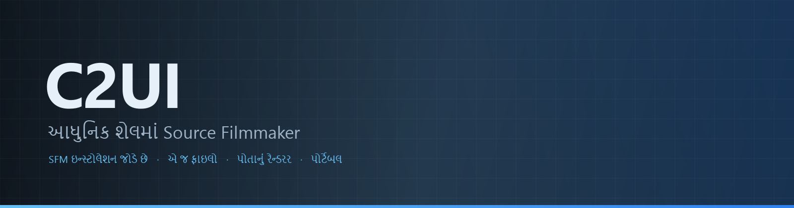

<p align="center"></p>

<p align="center"><a href="../../README.md">🇷🇺 Русский</a> · <a href="EN-en.md">🇬🇧 English</a> · <a href="PL-pl.md">🇵🇱 Polski</a> · <a href="UK-ua.md">🇺🇦 Українська</a> · <a href="DE-de.md">🇩🇪 Deutsch</a> · <a href="RO-md.md">🇲🇩 Moldovenească</a> · <a href="SL-si.md">🇸🇮 Slovenščina</a> · <a href="BE-by.md">🇧🇾 Беларуская</a> · <a href="KK-kz.md">🇰🇿 Қазақша</a> · <a href="JA-jp.md">🇯🇵 日本語</a> · <a href="ZH-cn.md">🇨🇳 中文</a> · <a href="SV-se.md">🇸🇪 Svenska</a> · <a href="ES-es.md">🇪🇸 Español</a> · <a href="HI-in.md">🇮🇳 हिन्दी</a> · <a href="PT-pt.md">🇵🇹 Português</a> · <a href="BN-bd.md">🇧🇩 বাংলা</a> · <a href="FR-fr.md">🇫🇷 Français</a> · <a href="TE-in.md">🇮🇳 తెలుగు</a> · <a href="MR-in.md">🇮🇳 मराठी</a> · <a href="TA-in.md">🇮🇳 தமிழ்</a> · <a href="TR-tr.md">🇹🇷 Türkçe</a> · <a href="UR-pk.md">🇵🇰 اردو</a> · <a href="VI-vn.md">🇻🇳 Tiếng Việt</a> · <b>🇮🇳 ગુજરાતી</b> · <a href="IT-it.md">🇮🇹 Italiano</a> · <a href="KO-kr.md">🇰🇷 한국어</a> · <a href="AR-sa.md">🇸🇦 العربية</a> · <a href="JV-id.md">🇮🇩 Basa Jawa</a> · <a href="ML-in.md">🇮🇳 മലയാളം</a> · <a href="NE-np.md">🇳🇵 नेपाली</a> · <a href="UZ-uz.md">🇺🇿 Oʻzbekcha</a> · <a href="OR-in.md">🇮🇳 ଓଡ଼ିଆ</a></p>

<p align="center">
  
  
  
  
  <a href="../../Testing"></a>
  
</p>

<p align="center"><b>C2UI</b> — <i>Custom to User Interface</i> — — આધુનિક શેલમાં Source Filmmaker નું એડિટર: એ જ કન્ટેન્ટ, એ જ સેશન ફોર્મેટ, એ જ ડેટા મોડેલ, અને Steam લાઇબ્રેરી તથા Unreal Engine 5 એડિટરની શૈલીનું ઇન્ટરફેસ.</p>

---

## વિચાર

Source Filmmaker એક મજબૂત સાધન છે જેનું ઇન્ટરફેસ 2012 માં જ રહી ગયું. C2UI તેને બદલતું કે ફરી બનાવતું નથી: લક્ષ્ય ફક્ત SFM ને થોડું આધુનિક અને સુવિધાજનક બનાવવાનું છે.

એડિટર ઇન્સ્ટોલ કરેલું SFM શોધે છે, તેને કન્ટેન્ટ લાઇબ્રેરી તરીકે જોડે છે — મોડેલ, મટીરિયલ, ટેક્સચર, સેશન — અને એ જ ફાઇલો સાથે એ જ ફોર્મેટમાં કામ કરે છે. SFM માં બનાવેલું બધું C2UI માં ખુલે છે, અને ઊલટું પણ.

પહેલું લક્ષ્ય હાડકાં અને રિગ સહિત SFM સાથે સંપૂર્ણ સુસંગતતા. પછી — જે SFM માં ખૂટતું હતું.

```
  ┌──────────────┐    "SFM ક્યાં?"    ┌──────────────────────────────┐
  │   C2UI       │ ─────────────────────▶│  SourceFilmmaker/game/       │
  │              │                       │    usermod/gameinfo.txt      │
  │  પોતાનું UI  │ ◀─────   માઉન્ટ   ───────│    tf/  hl2/  tf_movies/ …   │
  │  પોતાનું રેન્ડર │       ફક્ત વાંચન       │    models/ materials/ dmx    │
  └──────────────┘                       └──────────────────────────────┘
```

## તૈયારી


 <b>રિલીઝ માટે એકંદર તૈયારી: 41%</b>

દરેક ક્ષેત્ર ખુલે છે: શું પહેલેથી કામ કરે છે અને શું હજુ નથી. ટકાવારી SFM ની ક્ષમતાઓની સાપેક્ષ અંદાજ છે.

<details><summary> <b>SFM શોધવું અને માઉન્ટ કરવું</b></summary>

Steam રજિસ્ટ્રી → `libraryfolders.vdf` → `gameinfo.txt` ના સર્ચ પાથ, એન્જિનના ક્રમમાં. માનક ઇન્સ્ટોલ પર છ માઉન્ટ. એપ્લિકેશન ફોલ્ડર બહાર કંઈ લખાતું નથી.

</details>
<details><summary> <b>કન્ટેન્ટ ઇન્ડેક્સ</b></summary>

70 199 ફાઇલો 1.1 સે ઠંડું / 0.02 સે કેશમાંથી; માઉન્ટ વચ્ચેના ઓવરરાઇડ એન્જિન જેમ જ ઉકેલાય છે.

</details>
<details><summary> <b>મોડેલ — <code>.mdl</code> <code>.vvd</code> <code>.vtx</code></b></summary>

વર્ઝન 44, 48, 49. હાડપિંજર, મેશ, બધા વિગત સ્તર, બોડી ગ્રુપ. 1 500 મોડેલ લોડ, 0 નિષ્ફળતા.

</details>
<details><summary> <b>મટીરિયલ — <code>.vmt</code></b></summary>

બધા 19 554 મટીરિયલ વંચાય છે; `patch`, DX બ્લોક, પ્રોક્સી.

</details>
<details><summary> <b>ટેક્સચર — <code>.vtf</code></b></summary>

વર્ઝન 7.0–7.5, DXT1/3/5 અને બધા અસંકુચિત ફોર્મેટ, ક્યુબમેપ, મિપ. DXT ડીકોડ વિના GPU માં જાય છે.

</details>
<details><summary> <b>સેશન — <code>.dmx</code></b></summary>

બાઇનરી 1–5 અને KeyValues2. ઇન્સ્ટોલની દરેક સેશન અને પાર્ટિકલ ફાઇલ **બાઇટ બાય બાઇટ** પાછી લખાય છે.

</details>
<details><summary> <b>સ્ક્રીન પર સેશન</b></summary>

ટાઇમલાઇન પર શોટ અને સાઉન્ડ ટ્રેક, એલિમેન્ટ ટ્રી, દરેક શોટનું દૃશ્ય તેના કેમેરાથી. હજુ નહીં: નકશા, પાર્ટિકલ, અવાજ.

</details>
<details><summary> <b>એનિમેશન</b></summary>

કર્સર પર ચેનલ અને લોગ મૂલ્યાંકિત; સ્ક્રબ અને પ્લે. હાડકાં, કેમેરા અને દૃશ્યતા સેશનને અનુસરે છે.

</details>
<details><summary> <b>ચહેરા</b></summary>

Flex કંટ્રોલર, કમ્પાઇલ કરેલા નિયમો અને વર્ટેક્સ એનિમેશન — પાત્રો બોલે છે અને ભાવ બતાવે છે. હજુ નહીં: કરચલી નકશા.

</details>
<details><summary> <b>રિગ</b></summary>

એક્સપ્રેશન, point/orient/parent/aim કન્સ્ટ્રેન્ટ, બે-હાડકાં IK. હજુ નહીં: સંપૂર્ણ ઓપરેટર નિર્ભરતા ગ્રાફ, રિગ બનાવવું.

</details>
<details><summary> <b>એડિટિંગ</b></summary>

ક્લિકથી પસંદગી, મૂવ/રોટેટ મેનિપ્યુલેટર, કોઈપણ એટ્રિબ્યુટનો ઇન્સ્પેક્ટર, કર્સર પર કી, અનડુ/રીડુ, બાઇટ-ચોક્કસ સેવ.

</details>
<details><summary> <b>મોશન એડિટર</b></summary>

રૂલર પર હોલ્ડ અને ફોલઓફ સાથે સમય પસંદગી; ફેરફાર SFM જેમ તેના પર ફેલાય છે. હજુ નહીં: પ્રીસેટ, લેયર.

</details>
<details><summary> <b>ગ્રાફ એડિટર</b></summary>

પસંદ કરેલા એલિમેન્ટને ચલાવતા દરેક લોગના વળાંક: X/Y/Z, pitch/yaw/roll, સ્કેલર. કી લાઇવ પ્રીવ્યૂ સાથે સમય અને મૂલ્યમાં ખેંચાય છે, ડબલ-ક્લિક ઉમેરે છે, Delete દૂર કરે છે; સમય અક્ષ ટાઇમલાઇનનો. હજુ નહીં: ટેન્જન્ટ અને વળાંક પ્રકાર, કી જૂથનું સ્કેલિંગ.

</details>
<details><summary> <b>પેનલ ડોકિંગ</b></summary>

UE5 અને Visual Studio જેમ, પ્રીવ્યૂ સાથે લક્ષ્યોના કંપાસ પર પેનલ ખેંચો. હજુ નહીં: સાચવેલા લેઆઉટ, થીમ.

</details>
<details><summary> <b>Source શેડિંગ</b></summary>

ફક્ત ટેક્સચર અને સાદો પ્રકાશ. હજુ નહીં: phong, rim, lightwarp, દૃશ્યની લાઇટ, છાયા.

</details>
<details><summary> <b>નકશા — <code>.bsp</code></b></summary>

શરૂ થયું નથી.

</details>
<details><summary> <b>છબી અને વિડિયોમાં રેન્ડર</b></summary>

શરૂ થયું નથી.

</details>
<details><summary> <b>પ્લગઇન <code>.c2plg</code></b></summary>

શરૂ થયું નથી.

</details>
<details><summary> <b>થીમ અને વર્કસ્પેસ</b></summary>

જાણી જોઈને પછી: એડિટરમાં સજાવવા લાયક કંઈ આવે ત્યાં સુધી એક જ દેખાવ.

</details>

**રિલીઝ માટે તૈયાર નથી.** પાયો — SFM વાપરે તે દરેક ફાઇલ ફોર્મેટ, યોગ્ય રીતે વાંચેલો અને સંપૂર્ણ ઇન્સ્ટોલેશન પર ચકાસેલો — હાજર અને પરીક્ષિત છે; સેશન ખોલી, ચલાવી, બદલી અને સાચવી શકાય છે. ખૂટે છે કામની *સુવિધા*: ગ્રાફ એડિટર, Source શેડિંગ, નકશા, નિકાસ. એનિમેટર તેમાં એક દિવસનું કામ કરી શકે ત્યાં સુધી કોઈ વર્ઝન નંબર નહીં.

<br clear="all">

<p align="center"><br><sub>આજનું એડિટર, Valve નું Meet the Heavy ખુલ્લું: ટાઇમલાઇન પર શોટ અને અવાજ, સેશન ટ્રી, પહેલો શોટ તેના પોતાના કેમેરાથી, સેશન મુજબ પોઝ અને ચહેરા સાથે પાત્રો.</sub></p>

## શું અલગ છે

- **પોર્ટેબલ.** એપ્લિકેશન ફોલ્ડર બહાર કંઈ લખાતું નથી: સેટિંગ્સ `App/User` માં, કેશ `App/Cache` માં, કામચલાઉ `App/Temporary` માં. ફોલ્ડર કાઢી નાખો અને કોઈ નિશાન નહીં.
- **SFM ક્યારેય ચલાવતું નથી.** ચલાવવા માટે કોઈ પ્રોસેસ નહીં, કબજે કરવા કોઈ વિન્ડો નહીં. ઇન્સ્ટોલેશન કન્ટેન્ટ પેક જેમ વંચાય છે.
- **ફોર્મેટ ચકાસેલા, માનેલા નહીં.** દરેક રીડર વાસ્તવિક ઇન્સ્ટોલેશન સામે તપાસ્યો; જ્યાં ફોર્મેટ કંઈ અનપેક્ષિત કરે, કોડ કહે છે.
- **સેવ ચોક્કસ છે.** બદલ્યા વિના વાંચેલી અને લખેલી સેશન એ જ ફાઇલ છે.
- **એન્જિનને કોઈ નિર્ભરતા નથી.** `Core/` અને સંપૂર્ણ ટેસ્ટ સ્યુટ શુદ્ધ Python પર ચાલે છે; ફક્ત વિન્ડોને Qt અને OpenGL જોઈએ.

## ચલાવવું

Windows, Python 3.13 અને Source Filmmaker ઇન્સ્ટોલેશન જરૂરી.

```bash
git clone https://github.com/Arkomiko/SFM_C2UI.git
cd SFM_C2UI
python -m venv .venv
.venv/Scripts/python.exe -m pip install -r requirements.txt
.venv/Scripts/python.exe c2ui.py
```

પહેલી વાર Steam દ્વારા SFM શોધે છે; ન મળે તો પૂછે છે. <kbd>Ctrl</kbd>+<kbd>O</kbd> સેશન ખોલે છે, <kbd>Space</kbd> પ્લે, <kbd>C</kbd> શોટ કેમેરા, <kbd>T</kbd>/<kbd>R</kbd> મૂવ/રોટેટ, <kbd>M</kbd> મોશન એડિટર, <kbd>Ctrl</kbd>+<kbd>Z</kbd> અનડુ, <kbd>Ctrl</kbd>+<kbd>S</kbd> સેવ. પેનલ શીર્ષકથી ખેંચાય છે. પરીક્ષણોને કંઈ જોઈતું નથી:

```bash
python Testing/run.py
```

## રચના

```
C2UI_SDK/
├── c2ui.py            લોન્ચર
├── Core/              એન્જિન: ફોર્મેટ, વર્ચ્યુઅલ ફાઇલ સિસ્ટમ, ઇન્ડેક્સ, બ્રિજ
├── App/               એડિટર: કન્ટેન્ટ લાઇબ્રેરી, રેન્ડરર, વિન્ડો
├── Tools/             સ્થાનિકીકરણ, UI સાધનો, પ્લગઇન (પછી)
├── Testing/           પરીક્ષણો, બાઇટ-ચોક્કસ ફિક્સચર, એક રનર
└── GIT&DOCK/README/   આ README અન્ય ભાષાઓમાં
```

## રોડમેપ

1. **Source શેડિંગ** — VertexLitGeneric જેમ SFM દોરે છે: phong, rim, lightwarp, દૃશ્યની લાઇટ.
2. **નકશા** — પૃષ્ઠભૂમિ માટે `.bsp`.
3. **આઉટપુટ** — છબી અને વિડિયો નિકાસ.
4. **પ્લગઇન** — `.c2plg` ફોર્મેટ; પછી થીમ અને વર્કસ્પેસ.

## લાઇસન્સ અને આભાર

Source Filmmaker, Team Fortress 2 અને Source એન્જિન Valve ના છે. આ પ્રોજેક્ટ તેમના ફાઇલ ફોર્મેટ વાંચે છે, તેમની કોઈ ફાઇલ સમાવતો નથી, અને ફક્ત Steam દ્વારા તમારી પોતાની SFM નકલ સાથે કામ કરે છે.

C2UI ના પોતાના કોડનું લાઇસન્સ હજુ પસંદ થયું નથી — ત્યાં સુધી સર્વ હક્ક સુરક્ષિત. Issues અને pull requests તો પણ આવકાર્ય.

<p align="center"><br><sub>ઇન્સ્ટોલેશનમાંથી અવ્યવસ્થિત પસંદ કરેલા ચોસઠ મોડેલ, C2UI ના પોતાના રેન્ડરરે દોરેલા.</sub></p>
