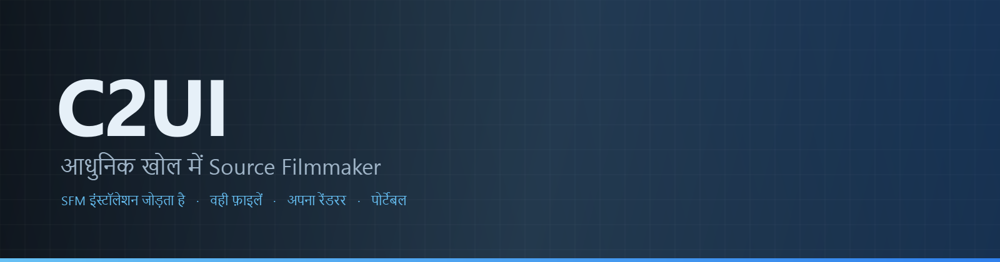

<details align="center"><summary>&nbsp;🌐 <b>🇮🇳 हिन्दी</b> &nbsp;·&nbsp; <sub>Language · Язык · 語言 · Idioma · Sprache · भाषा · لغة</sub></summary>

<table align="center">
<tr><td align="center"><a href="../../README.md">🇷🇺<br>Русский</a></td><td align="center"><a href="../README/EN-en.md">🇬🇧<br>English</a></td><td align="center"><a href="../README/PL-pl.md">🇵🇱<br>Polski</a></td><td align="center"><a href="../README/UK-ua.md">🇺🇦<br>Українська</a></td><td align="center"><a href="../README/DE-de.md">🇩🇪<br>Deutsch</a></td><td align="center"><a href="../README/RO-md.md">🇲🇩<br>Moldovenească</a></td><td align="center"><a href="../README/SL-si.md">🇸🇮<br>Slovenščina</a></td><td align="center"><a href="../README/BE-by.md">🇧🇾<br>Беларуская</a></td></tr>
<tr><td align="center"><a href="../README/KK-kz.md">🇰🇿<br>Қазақша</a></td><td align="center"><a href="../README/JA-jp.md">🇯🇵<br>日本語</a></td><td align="center"><a href="../README/ZH-cn.md">🇨🇳<br>中文</a></td><td align="center"><a href="../README/SV-se.md">🇸🇪<br>Svenska</a></td><td align="center"><a href="../README/ES-es.md">🇪🇸<br>Español</a></td><td align="center"><b>🇮🇳<br>हिन्दी</b></td><td align="center"><a href="../README/PT-pt.md">🇵🇹<br>Português</a></td><td align="center"><a href="../README/BN-bd.md">🇧🇩<br>বাংলা</a></td></tr>
<tr><td align="center"><a href="../README/FR-fr.md">🇫🇷<br>Français</a></td><td align="center"><a href="../README/TE-in.md">🇮🇳<br>తెలుగు</a></td><td align="center"><a href="../README/MR-in.md">🇮🇳<br>मराठी</a></td><td align="center"><a href="../README/TA-in.md">🇮🇳<br>தமிழ்</a></td><td align="center"><a href="../README/TR-tr.md">🇹🇷<br>Türkçe</a></td><td align="center"><a href="../README/UR-pk.md">🇵🇰<br>اردو</a></td><td align="center"><a href="../README/VI-vn.md">🇻🇳<br>Tiếng Việt</a></td><td align="center"><a href="../README/GU-in.md">🇮🇳<br>ગુજરાતી</a></td></tr>
<tr><td align="center"><a href="../README/IT-it.md">🇮🇹<br>Italiano</a></td><td align="center"><a href="../README/KO-kr.md">🇰🇷<br>한국어</a></td><td align="center"><a href="../README/AR-sa.md">🇸🇦<br>العربية</a></td><td align="center"><a href="../README/JV-id.md">🇮🇩<br>Basa Jawa</a></td><td align="center"><a href="../README/ML-in.md">🇮🇳<br>മലയാളം</a></td><td align="center"><a href="../README/NE-np.md">🇳🇵<br>नेपाली</a></td><td align="center"><a href="../README/UZ-uz.md">🇺🇿<br>Oʻzbekcha</a></td><td align="center"><a href="../README/OR-in.md">🇮🇳<br>ଓଡ଼ିଆ</a></td></tr>
</table>

</details>

<p align="center"></p>

<p align="center">
  
  
  
  
  
  <a href="../../Testing"></a>
  
  <a href="../LICENSE/HI-in.md"></a>
</p>

<p align="center"><b>C2UI</b> — <i>Custom to User Interface</i> — आधुनिक खोल में Source Filmmaker का एडिटर: वही कंटेंट, वही सेशन फ़ॉर्मैट, वही डेटा मॉडल, और Steam लाइब्रेरी व Unreal Engine 5 एडिटर की शैली का इंटरफ़ेस।</p>

> [!IMPORTANT]
> **विकास फ़िलहाल रोका गया है।** रिपॉज़िटरी खुली रहती है: कोड, दस्तावेज़ और इतिहास सब यहीं हैं, और नीचे बताया गया सब कुछ वैसे ही काम करता है। तैयारी के आँकड़े, issues और रोडमैप रुकने के समय की स्थिति दिखाते हैं।

---

## तैयारी

<p align="center"></p>

<p align="center"><a href="../READINESS/HI-in.md"></a></p>

## विचार

Source Filmmaker एक मज़बूत टूल है जिसका इंटरफ़ेस 2012 में ही रह गया। C2UI उसे बदलता या दोबारा नहीं बनाता: लक्ष्य बस SFM को थोड़ा आधुनिक और सुविधाजनक बनाना है।

एडिटर इंस्टॉल किए गए SFM को ढूँढता है, उसे कंटेंट लाइब्रेरी की तरह जोड़ता है — मॉडल, मटीरियल, टेक्सचर, सेशन — और उन्हीं फ़ाइलों के साथ उसी फ़ॉर्मैट में काम करता है। SFM में बनाई हर चीज़ C2UI में खुलती है, और इसके विपरीत भी।

पहला लक्ष्य SFM के साथ पूर्ण संगतता है, हड्डियों और रिग समेत। उसके बाद — जो SFM में कमी थी।

```
  ┌──────────────┐                          ┌──────────────────────────────┐
  │   C2UI       │ ──── "SFM कहाँ है?" ────▶│  SourceFilmmaker/game/       │
  │              │                          │    usermod/gameinfo.txt      │
  │  अपना UI     │ ◀──────── माउंट ─────────│    tf/  hl2/  tf_movies/ …   │
  │  अपना रेंडर  │        केवल पढ़ना         │    models/ materials/ dmx    │
  └──────────────┘                          └──────────────────────────────┘
```

- **पोर्टेबल।** एप्लिकेशन फ़ोल्डर के बाहर कुछ नहीं लिखा जाता: सेटिंग `App/User` में, कैश `App/Cache` में, अस्थायी `App/Temporary` में। फ़ोल्डर मिटाएँ और कोई निशान नहीं।
- **SFM कभी नहीं चलाता।** चलाने के लिए कोई प्रोसेस नहीं, हथियाने के लिए कोई विंडो नहीं। इंस्टॉलेशन कंटेंट पैक की तरह पढ़ा जाता है।
- **फ़ॉर्मैट सत्यापित, माने हुए नहीं।** हर रीडर असली इंस्टॉलेशन से जाँचा गया; जहाँ फ़ॉर्मैट कुछ अप्रत्याशित करता है, कोड बताता है।
- **सेव सटीक है।** बिना बदले पढ़ा और लिखा सेशन वही फ़ाइल है।
- **इंजन की कोई निर्भरता नहीं।** `Core/` और पूरा टेस्ट सूट शुद्ध Python पर चलता है; केवल विंडो को Qt और OpenGL चाहिए।

## संरचना

```
C2UI_SDK/
├── README.md
├── Core/               इंजन: फ़ॉर्मैट, वर्चुअल फ़ाइल सिस्टम, इंडेक्स, ब्रिज
│   ├── API/            एडिटर, टूल और प्लगइन के लिए अनुबंध
│   ├── Code/           इंजन: एनिमेशन, ऑपरेटर, चेहरे, संपादन
│   │   └── formats/    Valve रीडर: mdl vvd vtx vmt vtf dmx bsp
│   └── dev-kit/        SDK स्लॉट (खाली) और इंस्टॉलेशन के ब्रिज
├── Launcher/           लॉन्चर
├── App/                एडिटर: कंटेंट लाइब्रेरी, रेंडरर, विंडो
│   ├── Code/           कंटेंट लाइब्रेरी, विंडो, सेटिंग्स
│   │   ├── render/     सीन, OpenGL रेंडरर, शेडर, कैमरा
│   │   └── ui/         टाइमलाइन, सेशन ट्री, इंस्पेक्टर, ग्राफ़ एडिटर, डॉकिंग
│   ├── Data/           प्रोग्राम के संसाधन, केवल पढ़ने के लिए
│   ├── User/           उपयोगकर्ता डेटा — कभी नहीं हटाया जाता
│   └── Cache/          कंटेंट इंडेक्स, शेडर, थंबनेल
├── Tools/              स्थानीयकरण, UI टूल, प्लगइन (बाद में)
│   ├── Market Load/    प्लगइन मार्केटप्लेस क्लाइंट (बाद में)
│   ├── Localization/   अनुवाद बनाना
│   ├── NewPlugins/     प्लगइन बनाना
│   └── UI/             थीम और वर्कस्पेस
├── Testing/            परीक्षण, बाइट-सटीक फ़िक्सचर, एक रनर
│   ├── core/           इंजन
│   ├── app/            एडिटर
│   └── fixtures/       नकली इंस्टॉलेशन, मॉडल, टेक्सचर
└── GIT&DOCK/           README, तैयारी और लाइसेंस 32 भाषाओं में
```

### यह कैसे काम करता है

«Source Filmmaker कहाँ है?» से स्क्रीन पर एक फ़्रेम तक का रास्ता पाँच परतों से गुज़रता है; हर परत केवल अपने नीचे वाली परत को जानती है।

1. **ब्रिज** (`Core/dev-kit/bridge_sfm`) Steam के ज़रिये इंस्टॉलेशन ढूँढता है, `gameinfo.txt` पढ़ता है और इंजन के क्रम में कंटेंट पाथ लौटाता है। `sfm.exe` कभी लॉन्च नहीं होता।
2. **वर्चुअल फ़ाइल सिस्टम और इंडेक्स** (`Core/Code/vfs.py`, `content_index.py`) इन पाथों को Source की तरह परतों में रखते हैं: पहले मिली फ़ाइल जीतती है। इंडेक्स `App/Cache` में एक SQLite फ़ाइल है, इसलिए 70 000 फ़ाइलों की गिनती एक ही बार होती है।
3. **फ़ॉर्मैट** (`Core/Code/formats`) Valve की फ़ाइलें बिना किसी बाहरी लाइब्रेरी के पढ़ते हैं: `.mdl` `.vvd` `.vtx` मॉडल हैं, `.vmt` `.vtf` मटेरियल और टेक्सचर, `.dmx` सेशन, `.bsp` मैप। हर रीडर पूरे इंस्टॉलेशन पर जाँचा गया है; सेशन बाइट-दर-बाइट वैसा ही वापस लिखा जाता है।
4. **सेशन** DMX तत्वों का एक ग्राफ़ है। `animation.py` किसी क्षण पर चैनलों का मान निकालता है, `operators.py` एक्सप्रेशन और रिग कंस्ट्रेंट चलाता है, `flex.py` चेहरों को हिलाता है, `pose.py` बोन मैट्रिक्स बनाता है। हर संपादन `editing.py` से एक अन्डू-योग्य कमांड के रूप में गुज़रता है।
5. **एडिटर** (`App/Code`) इससे एक सीन (`render/scene.py`) बनाता है और उसे अपने OpenGL 3.3 रेंडरर (`renderer.py`, `shaders.py`) से बनाता है: सेशन की लाइटें, लाइटमैप और मैप की रोशनी — तस्वीर अभी SFM से बहुत दूर है और उस पर काम जारी है। पैनल (`ui/`) हैं टाइमलाइन, सेशन ट्री, इंस्पेक्टर, ग्राफ़ एडिटर और UE5 शैली की डॉकिंग।

प्रोग्राम जो कुछ लिखता है, वह उसके फ़ोल्डर में ही रहता है: सेटिंग्स `App/User` में, इंडेक्स और कैश `App/Cache` में, लॉग `App/Temporary` में। `Core/` कुछ नहीं लिखता और Qt पर निर्भर नहीं है, इसलिए इंजन और टेस्ट शुद्ध Python पर चलते हैं; Qt और OpenGL केवल विंडो को चाहिए। `Tools/` की उपयोगिताएँ सख़्ती से `Core/API` पर बनी हैं — इसी से साबित होता है कि यह API तीसरे पक्ष के प्लगइन के लिए भी पर्याप्त है।

### चलाना

Windows, Python 3.13 और Source Filmmaker इंस्टॉलेशन आवश्यक।

```bash
git clone https://github.com/Arkomiko/SFM_C2UI.git
cd SFM_C2UI
python -m venv .venv
.venv/Scripts/python.exe -m pip install -r Launcher/requirements.txt
.venv/Scripts/python.exe Launcher/launcher.py
```

इससे लॉन्चर खुलता है: तीन बटनों वाली एक छोटी विंडो। इसका रूप अस्थायी है — App बनने पर इसे फिर से लिखा जाएगा, और इसकी विंडो फ़िलहाल केवल रूसी में है।

<p align="center"><a href="../LAUNCHER/HI-in.md"></a></p>

पहली बार यह Steam से SFM खोजता है; न मिले तो पूछता है। <kbd>Ctrl</kbd>+<kbd>O</kbd> सेशन खोलता है, <kbd>Space</kbd> प्ले, <kbd>C</kbd> शॉट कैमरा, <kbd>T</kbd>/<kbd>R</kbd> मूव/रोटेट, <kbd>M</kbd> मोशन एडिटर, <kbd>Ctrl</kbd>+<kbd>Z</kbd> अन्डू, <kbd>Ctrl</kbd>+<kbd>S</kbd> सेव। पैनल शीर्षक से खींचे जाते हैं। परीक्षणों को कुछ नहीं चाहिए:

```bash
python Testing/run.py
```

### योजना में

**अगला**
- मैप का रूप: पानी, prop_dynamic, लाइट की गोबो टेक्सचर, `$bumpmap` और `$envmap`, सेशन लाइटों से छायाएँ।
- एक्सपोर्ट की गई फ़िल्म में ध्वनि।
- `.c2plg` प्लगइन और `Tools/Market Load` में मार्केटप्लेस क्लाइंट; फिर थीम और वर्कस्पेस।
- टाइमलाइन पर ध्वनि, पार्टिकल, रिंकल मैप, मोशन एडिटर के प्रीसेट और लेयर, ग्राफ़ एडिटर में टैंजेंट।

**बाद में**
- पूरे मैप पर प्रदर्शन: स्टैटिक प्रॉप्स का इंस्टेंसिंग, पोज़ कैश।
- इंजन का पुनर्निर्माण: बेहतर रोशनी और छाया के लिए नए मैप-कंपाइल पैरामीटर, 120 000 यूनिट की मैप सीमा।
- अपने Python और स्व-अपडेट वाला पैकेज्ड लॉन्चर; एडिटर का स्थानीयकरण।

## लाइसेंस और आभार

C2UI का अपना कोड **C2UI लाइसेंस** के अंतर्गत है: व्यक्तिगत और गैर-व्यावसायिक उपयोग के लिए मुक्त; व्यावसायिक उपयोग केवल लेखक की लिखित सहमति से; संशोधित संस्करणों में मूल प्रोजेक्ट और उसके लेखक Arkomiko का उल्लेख आवश्यक। प्लगइन और ऐडऑन **C2UI — Plugins & Addons (C2UI‑Pl&AD)** लाइसेंस के अंतर्गत हैं।

Source Filmmaker, Team Fortress 2 और Source इंजन Valve के हैं; यह प्रोजेक्ट उनके फ़ॉर्मैट पढ़ता है, उनकी कोई फ़ाइल शामिल नहीं करता, और केवल Steam से आपकी अपनी SFM प्रति के साथ काम करता है।

<p align="center"><a href="../LICENSE/HI-in.md"></a></p>
