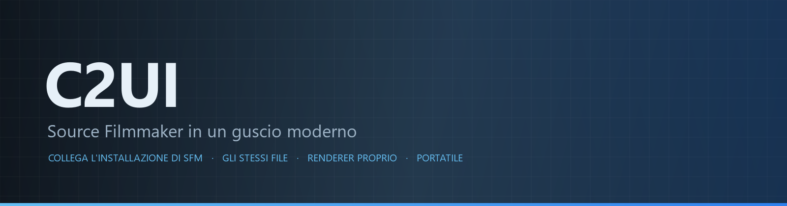

<details align="center"><summary>&nbsp;🌐 <b>🇮🇹 Italiano</b> &nbsp;·&nbsp; <sub>Language · Язык · 語言 · Idioma · Sprache · भाषा · لغة</sub></summary>

<table align="center">
<tr><td align="center"><a href="../../README.md">🇷🇺<br>Русский</a></td><td align="center"><a href="../README/EN-en.md">🇬🇧<br>English</a></td><td align="center"><a href="../README/PL-pl.md">🇵🇱<br>Polski</a></td><td align="center"><a href="../README/UK-ua.md">🇺🇦<br>Українська</a></td><td align="center"><a href="../README/DE-de.md">🇩🇪<br>Deutsch</a></td><td align="center"><a href="../README/RO-md.md">🇲🇩<br>Moldovenească</a></td><td align="center"><a href="../README/SL-si.md">🇸🇮<br>Slovenščina</a></td><td align="center"><a href="../README/BE-by.md">🇧🇾<br>Беларуская</a></td></tr>
<tr><td align="center"><a href="../README/KK-kz.md">🇰🇿<br>Қазақша</a></td><td align="center"><a href="../README/JA-jp.md">🇯🇵<br>日本語</a></td><td align="center"><a href="../README/ZH-cn.md">🇨🇳<br>中文</a></td><td align="center"><a href="../README/SV-se.md">🇸🇪<br>Svenska</a></td><td align="center"><a href="../README/ES-es.md">🇪🇸<br>Español</a></td><td align="center"><a href="../README/HI-in.md">🇮🇳<br>हिन्दी</a></td><td align="center"><a href="../README/PT-pt.md">🇵🇹<br>Português</a></td><td align="center"><a href="../README/BN-bd.md">🇧🇩<br>বাংলা</a></td></tr>
<tr><td align="center"><a href="../README/FR-fr.md">🇫🇷<br>Français</a></td><td align="center"><a href="../README/TE-in.md">🇮🇳<br>తెలుగు</a></td><td align="center"><a href="../README/MR-in.md">🇮🇳<br>मराठी</a></td><td align="center"><a href="../README/TA-in.md">🇮🇳<br>தமிழ்</a></td><td align="center"><a href="../README/TR-tr.md">🇹🇷<br>Türkçe</a></td><td align="center"><a href="../README/UR-pk.md">🇵🇰<br>اردو</a></td><td align="center"><a href="../README/VI-vn.md">🇻🇳<br>Tiếng Việt</a></td><td align="center"><a href="../README/GU-in.md">🇮🇳<br>ગુજરાતી</a></td></tr>
<tr><td align="center"><b>🇮🇹<br>Italiano</b></td><td align="center"><a href="../README/KO-kr.md">🇰🇷<br>한국어</a></td><td align="center"><a href="../README/AR-sa.md">🇸🇦<br>العربية</a></td><td align="center"><a href="../README/JV-id.md">🇮🇩<br>Basa Jawa</a></td><td align="center"><a href="../README/ML-in.md">🇮🇳<br>മലയാളം</a></td><td align="center"><a href="../README/NE-np.md">🇳🇵<br>नेपाली</a></td><td align="center"><a href="../README/UZ-uz.md">🇺🇿<br>Oʻzbekcha</a></td><td align="center"><a href="../README/OR-in.md">🇮🇳<br>ଓଡ଼ିଆ</a></td></tr>
</table>

</details>

<p align="center"></p>

<p align="center">
  
  
  
  
  <a href="../../Testing"></a>
  
  <a href="../LICENSE/IT-it.md"></a>
</p>

<p align="center"><b>C2UI</b> — <i>Custom to User Interface</i> — l'editor di Source Filmmaker in un guscio moderno: lo stesso contenuto, lo stesso formato di sessione, lo stesso modello di dati, un'interfaccia nello spirito della libreria di Steam e dell'editor di Unreal Engine 5.</p>

---

## Stato di avanzamento

<p align="center"></p>

<p align="center"><a href="../READINESS/IT-it.md"></a></p>

## L'idea

Source Filmmaker è uno strumento solido la cui interfaccia è rimasta al 2012. C2UI non lo sostituisce né lo rifà: l'obiettivo è semplicemente rendere SFM un po' più moderno e comodo.

L'editor trova l'SFM installato, lo collega come libreria di contenuti — modelli, materiali, texture, sessioni — e lavora con gli stessi file nello stesso formato. Tutto ciò che è stato fatto in SFM si apre in C2UI, e viceversa.

Il primo obiettivo è la piena compatibilità con SFM, ossa e rig compresi. Poi, ciò che a SFM mancava.

```
  ┌─────────────────┐                        ┌──────────────────────────────┐
  │   C2UI          │ ──── "dov'è SFM?" ────▶│  SourceFilmmaker/game/       │
  │                 │                        │    usermod/gameinfo.txt      │
  │  UI propria     │ ◀────── montato ───────│    tf/  hl2/  tf_movies/ …   │
  │  render proprio │      sola lettura      │    models/ materials/ dmx    │
  └─────────────────┘                        └──────────────────────────────┘
```

- **Portatile.** Nulla viene scritto fuori dalla cartella dell'applicazione: impostazioni in `App/User`, cache in `App/Cache`, temporanei in `App/Temporary`. Elimina la cartella e non resta nulla.
- **Non avvia mai SFM.** Nessun processo da pilotare, nessuna finestra da dirottare. L'installazione è letta come un pacchetto di contenuti.
- **Formati verificati, non presunti.** Ogni lettore è stato confrontato con l'installazione reale; dove un formato fa qualcosa di sorprendente, il codice lo dice.
- **Il salvataggio è esatto.** Una sessione letta e scritta senza modifiche è lo stesso file.
- **Il motore non ha dipendenze.** `Core/` e l'intera suite di test girano su Python puro; solo la finestra richiede Qt e OpenGL.

<p align="center"><br><sub>L'editor oggi, con Meet the Heavy di Valve aperto: inquadrature e audio sulla timeline, l'albero della sessione, la prima inquadratura vista dalla sua camera, personaggi in posa e con le espressioni dettate dalla sessione.</sub></p>

## Struttura

```
C2UI_SDK/
├── README.md
├── Core/               motore: formati, file system virtuale, indice, ponti
│   ├── API/            il contratto per editor, strumenti e plugin
│   ├── Code/           motore: animazione, operatori, volti, modifica
│   │   └── formats/    lettori Valve: mdl vvd vtx vmt vtf dmx bsp
│   └── dev-kit/        slot SDK (vuoti) e ponti verso le installazioni
├── App/                l'editor: libreria dei contenuti, renderer, finestra
│   ├── Code/           libreria dei contenuti, finestra, impostazioni
│   │   ├── render/     scena, renderer OpenGL, shader, camera
│   │   └── ui/         timeline, albero della sessione, inspector, graph editor, docking
│   ├── Data/           risorse del programma, sola lettura
│   ├── User/           dati dell'utente — mai cancellati
│   └── Cache/          indice dei contenuti, shader, miniature
├── Tools/              localizzazione, strumenti UI, plugin (più avanti)
│   ├── Launcher/       il launcher
│   ├── Market Load/    client del marketplace dei plugin (più avanti)
│   ├── Localization/   creazione delle traduzioni
│   ├── NewPlugins/     creazione dei plugin
│   └── UI/             temi e spazi di lavoro
├── Testing/            test, fixture esatte al byte, un solo runner
│   ├── core/           il motore
│   ├── app/            l'editor
│   └── fixtures/       installazione finta, modelli, texture
└── GIT&DOCK/           README, avanzamento e licenza in 32 lingue
```

### Come funziona

Il percorso da «dov'è Source Filmmaker?» a un fotogramma sullo schermo attraversa cinque strati; ognuno conosce solo quello sotto di sé.

1. **Il ponte** (`Core/dev-kit/bridge_sfm`) trova l'installazione tramite Steam, legge `gameinfo.txt` e restituisce i percorsi dei contenuti nell'ordine del motore. `sfm.exe` non viene mai avviato.
2. **Il file system virtuale e l'indice** (`Core/Code/vfs.py`, `content_index.py`) sovrappongono quei percorsi come fa Source: vince il primo file trovato. L'indice è un unico file SQLite in `App/Cache`, quindi la scansione di 70 000 file si paga una sola volta.
3. **I formati** (`Core/Code/formats`) leggono i file di Valve senza librerie di terze parti: `.mdl` `.vvd` `.vtx` sono un modello, `.vmt` `.vtf` un materiale e la sua texture, `.dmx` una sessione, `.bsp` una mappa. Ogni lettore è verificato sull'intera installazione; una sessione viene riscritta byte per byte.
4. **La sessione** è un grafo di elementi DMX. `animation.py` valuta i canali in un istante, `operators.py` esegue espressioni e vincoli dei rig, `flex.py` muove i volti, `pose.py` costruisce le matrici delle ossa. Ogni modifica passa da `editing.py` come comando annullabile.
5. **L'editor** (`App/Code`) ne ricava una scena (`render/scene.py`) e la disegna con il proprio renderer OpenGL 3.3 (`renderer.py`, `shaders.py`): luci della sessione, lightmap e illuminazione della mappa come le mostra SFM. I pannelli (`ui/`) sono la timeline, l'albero della sessione, l'inspector, il graph editor e il docking in stile UE5.

Tutto ciò che il programma scrive resta nella sua cartella: `App/User` per le impostazioni, `App/Cache` per indice e cache, `App/Temporary` per il registro. `Core/` non scrive nulla e non dipende da Qt, quindi motore e test girano su Python puro; Qt e OpenGL servono solo alla finestra. Le utilità in `Tools/` sono costruite rigorosamente su `Core/API` — così si verifica che l'API basti anche ai plugin di terze parti.

<p align="center"><br><sub>Sessantaquattro modelli scelti a caso dall'installazione, disegnati dal renderer di C2UI.</sub></p>

### Avvio

Richiede Windows, Python 3.13 e un'installazione di Source Filmmaker.

```bash
git clone https://github.com/Arkomiko/SFM_C2UI.git
cd SFM_C2UI
python -m venv .venv
.venv/Scripts/python.exe -m pip install -r Tools/Launcher/requirements.txt
.venv/Scripts/python.exe Tools/Launcher/c2ui.py
```

Al primo avvio SFM viene cercato tramite Steam; se non lo trova, il programma chiede. <kbd>Ctrl</kbd>+<kbd>O</kbd> apre una sessione, <kbd>Spazio</kbd> riproduce, <kbd>C</kbd> guarda dalla camera dell'inquadratura, <kbd>T</kbd>/<kbd>R</kbd> sposta/ruota, <kbd>M</kbd> motion editor, <kbd>Ctrl</kbd>+<kbd>Z</kbd> annulla, <kbd>Ctrl</kbd>+<kbd>S</kbd> salva. I pannelli si trascinano dal titolo. I test non richiedono nulla:

```bash
python Testing/run.py
```

### In programma

**Prossimamente**
- L'aspetto della mappa: skybox, acqua, prop_dynamic, texture gobo delle luci, `$bumpmap` e `$envmap`, ombre dalle luci della sessione.
- Esportazione: sequenze di immagini e video.
- Plugin `.c2plg` e il client del marketplace in `Tools/Market Load`; poi temi e spazi di lavoro.
- Audio sulla timeline, particelle, wrinkle map, preset e livelli del motion editor, tangenti nel graph editor.

**Più avanti**
- Prestazioni su mappe complete: prop statici istanziati, pose in cache.
- Rifacimento del motore: nuovi parametri di compilazione delle mappe per luci e ombre migliori, limite mappa di 120 000 unità.
- Un launcher pacchettizzato con il proprio Python e aggiornamento automatico; localizzazione dell'editor.

## Licenza e crediti

Il codice proprio di C2UI è sotto la **licenza C2UI**: libero per uso personale e non commerciale; uso commerciale solo con il consenso scritto dell'autore; le versioni modificate devono citare il progetto originale e il suo autore, Arkomiko. Plugin e addon sono sotto la licenza **C2UI — Plugins & Addons (C2UI‑Pl&AD)**.

Source Filmmaker, Team Fortress 2 e il motore Source appartengono a Valve; il progetto legge i loro formati, non include alcun loro file e funziona solo con la tua copia di SFM da Steam.

<p align="center"><a href="../LICENSE/IT-it.md"></a></p>
