<p align="center"></p>

<p align="center"><a href="../../README.md">🇷🇺 Русский</a> · <a href="EN-en.md">🇬🇧 English</a> · <a href="PL-pl.md">🇵🇱 Polski</a> · <a href="UK-ua.md">🇺🇦 Українська</a> · <a href="DE-de.md">🇩🇪 Deutsch</a> · <a href="RO-md.md">🇲🇩 Moldovenească</a> · <a href="SL-si.md">🇸🇮 Slovenščina</a> · <a href="BE-by.md">🇧🇾 Беларуская</a> · <a href="KK-kz.md">🇰🇿 Қазақша</a> · <b>🇯🇵 日本語</b> · <a href="ZH-cn.md">🇨🇳 中文</a> · <a href="SV-se.md">🇸🇪 Svenska</a> · <a href="ES-es.md">🇪🇸 Español</a> · <a href="HI-in.md">🇮🇳 हिन्दी</a> · <a href="PT-pt.md">🇵🇹 Português</a> · <a href="BN-bd.md">🇧🇩 বাংলা</a> · <a href="FR-fr.md">🇫🇷 Français</a> · <a href="TE-in.md">🇮🇳 తెలుగు</a> · <a href="MR-in.md">🇮🇳 मराठी</a> · <a href="TA-in.md">🇮🇳 தமிழ்</a> · <a href="TR-tr.md">🇹🇷 Türkçe</a> · <a href="UR-pk.md">🇵🇰 اردو</a> · <a href="VI-vn.md">🇻🇳 Tiếng Việt</a> · <a href="GU-in.md">🇮🇳 ગુજરાતી</a> · <a href="IT-it.md">🇮🇹 Italiano</a> · <a href="KO-kr.md">🇰🇷 한국어</a> · <a href="AR-sa.md">🇸🇦 العربية</a> · <a href="JV-id.md">🇮🇩 Basa Jawa</a> · <a href="ML-in.md">🇮🇳 മലയാളം</a> · <a href="NE-np.md">🇳🇵 नेपाली</a> · <a href="UZ-uz.md">🇺🇿 Oʻzbekcha</a> · <a href="OR-in.md">🇮🇳 ଓଡ଼ିଆ</a></p>

<p align="center">
  
  
  
  
  <a href="../../Testing"></a>
  
</p>

<p align="center"><b>C2UI</b> — <i>Custom to User Interface</i> — は、モダンなシェルに収めた Source Filmmaker のエディタです。同じコンテンツ、同じセッション形式、同じデータモデルに、Steam ライブラリと Unreal Engine 5 エディタの雰囲気を持つインターフェースを組み合わせています。</p>

---

## 完成度

<p align="center"></p>

<p align="center"> <b>リリースへの全体的な完成度: 41%</b></p>

<p align="center"><a href="../assets/JA-jp/sidebar.md"></a></p>

## アイデア

Source Filmmaker は強力なツールですが、インターフェースは 2012 年のままです。C2UI はそれを置き換えたり作り直したりはしません。目的は、SFM を少しだけ現代的で使いやすくすることです。

エディタはインストール済みの SFM を見つけ、コンテンツライブラリとして接続し — モデル、マテリアル、テクスチャ、セッション — 同じファイルを同じ形式のまま扱います。SFM で作ったものは C2UI で開け、その逆も同じです。

最初の目標はボーンとリグを含む SFM との完全な互換性。その先に、SFM に足りなかったものを加えます。

```
  ┌──────────────┐    "SFM はどこ?"    ┌──────────────────────────────┐
  │   C2UI       │ ─────────────────────▶│  SourceFilmmaker/game/       │
  │              │                       │    usermod/gameinfo.txt      │
  │  独自 UI     │ ◀───── マウント  ───────│    tf/  hl2/  tf_movies/ …   │
  │  独自描画    │      読み取り専用      │    models/ materials/ dmx    │
  └──────────────┘                       └──────────────────────────────┘
```

<p align="center"><br><sub>現在のエディタ。Valve の「Meet the Heavy」を開いた状態: タイムラインにショットと音声、セッションツリー、最初のショットを自身のカメラから、セッション通りのポーズと表情のキャラクター。</sub></p>

## 何が違うのか

- **ポータブル。** アプリケーションフォルダの外には何も書きません: 設定は `App/User`、キャッシュは `App/Cache`、一時ファイルは `App/Temporary`。フォルダを消せば跡形もありません。
- **SFM を起動しない。** 操作するプロセスも乗っ取るウィンドウもありません。インストールはコンテンツパックとして読まれます。
- **形式は検証済み、推測ではない。** すべてのリーダーを実際のインストールと照合しました。形式が意外なことをする箇所はコードがそう述べています。
- **保存は正確。** 変更せずに読んで書いたセッションは同じファイルです。
- **エンジンに依存関係なし。** `Core/` とテスト全体は素の Python で動きます。Qt と OpenGL が必要なのはウィンドウだけです。

## 実行

Windows、Python 3.13、Source Filmmaker のインストールが必要です。

```bash
git clone https://github.com/Arkomiko/SFM_C2UI.git
cd SFM_C2UI
python -m venv .venv
.venv/Scripts/python.exe -m pip install -r Tools/Launcher/requirements.txt
.venv/Scripts/python.exe Tools/Launcher/c2ui.py
```

初回起動時に Steam 経由で SFM を探します。見つからなければ尋ねます。<kbd>Ctrl</kbd>+<kbd>O</kbd> でセッションを開く、<kbd>Space</kbd> で再生、<kbd>C</kbd> でショットカメラ、<kbd>T</kbd>/<kbd>R</kbd> で移動/回転、<kbd>M</kbd> でモーションエディタ、<kbd>Ctrl</kbd>+<kbd>Z</kbd> で元に戻す、<kbd>Ctrl</kbd>+<kbd>S</kbd> で保存。パネルはタイトルをドラッグします。テストには何も必要ありません:

```bash
python Testing/run.py
```

## 構成

```
C2UI_SDK/
├── README.md
├── Core/              エンジン: 形式、仮想ファイルシステム、インデックス、ブリッジ
├── App/               エディタ: コンテンツライブラリ、レンダラ、ウィンドウ
├── Tools/             ローカライズ、UI ツール、プラグイン (後日)
│   └── Launcher/      ランチャー
├── Testing/           テスト、バイト単位のフィクスチャ、単一ランナー
└── GIT&DOCK/          この README の他言語版
```

## ロードマップ

1. **Source シェーディング** — SFM が描く VertexLitGeneric: phong、rim、lightwarp、シーンライト。
2. **マップ** — 背景用の `.bsp`。
3. **出力** — 画像と動画の書き出し。
4. **プラグイン** — `.c2plg` 形式。その後テーマとワークスペース。

## ライセンスとクレジット

C2UI 自身のコードは **C2UI ライセンス** に従います: 個人的・非商用利用は自由、商用利用は作者の書面による同意が必要、改変版は元プロジェクトと作者 Arkomiko を明記すること。プラグインとアドオンは **C2UI — Plugins & Addons (C2UI‑Pl&AD)** ライセンスに従います。

Source Filmmaker、Team Fortress 2、Source エンジンは Valve のものです。本プロジェクトはそれらの形式を読むだけで、ファイルは一切同梱せず、Steam で所有する自分の SFM とのみ動作します。

<p align="center"><a href="../LICENSE/JA-jp.md"></a></p>

<p align="center"><br><sub>インストールから無作為に選んだ 64 のモデルを C2UI 独自のレンダラで描画。</sub></p>
