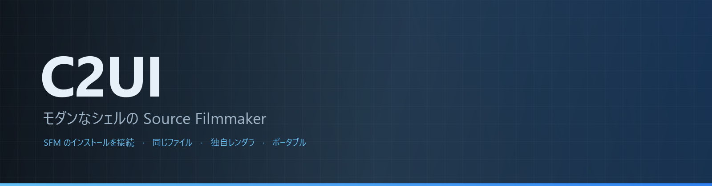

<details align="center"><summary>&nbsp;🌐 <b>🇯🇵 日本語</b> &nbsp;·&nbsp; <sub>Language · Язык · 語言 · Idioma · Sprache · भाषा · لغة</sub></summary>

<table align="center">
<tr><td align="center"><a href="../../README.md">🇷🇺<br>Русский</a></td><td align="center"><a href="../README/EN-en.md">🇬🇧<br>English</a></td><td align="center"><a href="../README/PL-pl.md">🇵🇱<br>Polski</a></td><td align="center"><a href="../README/UK-ua.md">🇺🇦<br>Українська</a></td><td align="center"><a href="../README/DE-de.md">🇩🇪<br>Deutsch</a></td><td align="center"><a href="../README/RO-md.md">🇲🇩<br>Moldovenească</a></td><td align="center"><a href="../README/SL-si.md">🇸🇮<br>Slovenščina</a></td><td align="center"><a href="../README/BE-by.md">🇧🇾<br>Беларуская</a></td></tr>
<tr><td align="center"><a href="../README/KK-kz.md">🇰🇿<br>Қазақша</a></td><td align="center"><b>🇯🇵<br>日本語</b></td><td align="center"><a href="../README/ZH-cn.md">🇨🇳<br>中文</a></td><td align="center"><a href="../README/SV-se.md">🇸🇪<br>Svenska</a></td><td align="center"><a href="../README/ES-es.md">🇪🇸<br>Español</a></td><td align="center"><a href="../README/HI-in.md">🇮🇳<br>हिन्दी</a></td><td align="center"><a href="../README/PT-pt.md">🇵🇹<br>Português</a></td><td align="center"><a href="../README/BN-bd.md">🇧🇩<br>বাংলা</a></td></tr>
<tr><td align="center"><a href="../README/FR-fr.md">🇫🇷<br>Français</a></td><td align="center"><a href="../README/TE-in.md">🇮🇳<br>తెలుగు</a></td><td align="center"><a href="../README/MR-in.md">🇮🇳<br>मराठी</a></td><td align="center"><a href="../README/TA-in.md">🇮🇳<br>தமிழ்</a></td><td align="center"><a href="../README/TR-tr.md">🇹🇷<br>Türkçe</a></td><td align="center"><a href="../README/UR-pk.md">🇵🇰<br>اردو</a></td><td align="center"><a href="../README/VI-vn.md">🇻🇳<br>Tiếng Việt</a></td><td align="center"><a href="../README/GU-in.md">🇮🇳<br>ગુજરાતી</a></td></tr>
<tr><td align="center"><a href="../README/IT-it.md">🇮🇹<br>Italiano</a></td><td align="center"><a href="../README/KO-kr.md">🇰🇷<br>한국어</a></td><td align="center"><a href="../README/AR-sa.md">🇸🇦<br>العربية</a></td><td align="center"><a href="../README/JV-id.md">🇮🇩<br>Basa Jawa</a></td><td align="center"><a href="../README/ML-in.md">🇮🇳<br>മലയാളം</a></td><td align="center"><a href="../README/NE-np.md">🇳🇵<br>नेपाली</a></td><td align="center"><a href="../README/UZ-uz.md">🇺🇿<br>Oʻzbekcha</a></td><td align="center"><a href="../README/OR-in.md">🇮🇳<br>ଓଡ଼ିଆ</a></td></tr>
</table>

</details>

<p align="center"></p>

<p align="center">
  
  
  
  
  <a href="../../Testing"></a>
  
  <a href="../LICENSE/JA-jp.md"></a>
</p>

<p align="center"><b>C2UI</b> — <i>Custom to User Interface</i> — は、モダンなシェルに収めた Source Filmmaker のエディタです。同じコンテンツ、同じセッション形式、同じデータモデルに、Steam ライブラリと Unreal Engine 5 エディタの雰囲気を持つインターフェースを組み合わせています。</p>

---

## 完成度

<p align="center"></p>

<p align="center"><a href="../READINESS/JA-jp.md"></a></p>

## アイデア

Source Filmmaker は強力なツールですが、インターフェースは 2012 年のままです。C2UI はそれを置き換えたり作り直したりはしません。目的は、SFM を少しだけ現代的で使いやすくすることです。

エディタはインストール済みの SFM を見つけ、コンテンツライブラリとして接続し — モデル、マテリアル、テクスチャ、セッション — 同じファイルを同じ形式のまま扱います。SFM で作ったものは C2UI で開け、その逆も同じです。

最初の目標はボーンとリグを含む SFM との完全な互換性。その先に、SFM に足りなかったものを加えます。

```
  ┌──────────────┐                         ┌──────────────────────────────┐
  │   C2UI       │ ──── "SFM はどこ?" ────▶│  SourceFilmmaker/game/       │
  │              │                         │    usermod/gameinfo.txt      │
  │  独自 UI     │ ◀────── マウント ───────│    tf/  hl2/  tf_movies/ …   │
  │  独自描画    │      読み取り専用       │    models/ materials/ dmx    │
  └──────────────┘                         └──────────────────────────────┘
```

- **ポータブル。** アプリケーションフォルダの外には何も書きません: 設定は `App/User`、キャッシュは `App/Cache`、一時ファイルは `App/Temporary`。フォルダを消せば跡形もありません。
- **SFM を起動しない。** 操作するプロセスも乗っ取るウィンドウもありません。インストールはコンテンツパックとして読まれます。
- **形式は検証済み、推測ではない。** すべてのリーダーを実際のインストールと照合しました。形式が意外なことをする箇所はコードがそう述べています。
- **保存は正確。** 変更せずに読んで書いたセッションは同じファイルです。
- **エンジンに依存関係なし。** `Core/` とテスト全体は素の Python で動きます。Qt と OpenGL が必要なのはウィンドウだけです。

<p align="center"><br><sub>現在のエディタ。Valve の「Meet the Heavy」を開いた状態: タイムラインにショットと音声、セッションツリー、最初のショットを自身のカメラから、セッション通りのポーズと表情のキャラクター。</sub></p>

## 構成

```
C2UI_SDK/
├── README.md
├── Core/               エンジン: 形式、仮想ファイルシステム、インデックス、ブリッジ
│   ├── API/            エディター・ツール・プラグインとの契約
│   ├── Code/           エンジン：アニメーション、オペレーター、顔、編集
│   │   └── formats/    Valve リーダー：mdl vvd vtx vmt vtf dmx bsp
│   └── dev-kit/        SDK スロット（空）とインストールへのブリッジ
├── App/                エディタ: コンテンツライブラリ、レンダラ、ウィンドウ
│   ├── Code/           コンテンツライブラリ、ウィンドウ、設定
│   │   ├── render/     シーン、OpenGL レンダラー、シェーダー、カメラ
│   │   └── ui/         タイムライン、セッションツリー、インスペクター、グラフエディター、ドッキング
│   ├── Data/           プログラムのリソース、読み取り専用
│   ├── User/           ユーザーデータ — 決して削除されない
│   └── Cache/          コンテンツインデックス、シェーダー、サムネイル
├── Tools/              ローカライズ、UI ツール、プラグイン (後日)
│   ├── Launcher/       ランチャー
│   ├── Market Load/    プラグインマーケットプレイスのクライアント（後日）
│   ├── Localization/   翻訳の作成
│   ├── NewPlugins/     プラグインの作成
│   └── UI/             テーマとワークスペース
├── Testing/            テスト、バイト単位のフィクスチャ、単一ランナー
│   ├── core/           エンジン
│   ├── app/            エディター
│   └── fixtures/       偽のインストール、モデル、テクスチャ
└── GIT&DOCK/           README・進捗・ライセンス、32 言語
```

### 仕組み

「Source Filmmaker はどこ？」から画面上の 1 フレームまでの道のりは 5 つの層を通り、各層は自分の下の層だけを知っています。

1. **ブリッジ**（`Core/dev-kit/bridge_sfm`）が Steam 経由でインストールを見つけ、`gameinfo.txt` を読み、エンジンと同じ順序でコンテンツのパスを返します。`sfm.exe` は決して起動しません。
2. **仮想ファイルシステムとインデックス**（`Core/Code/vfs.py`、`content_index.py`）が Source と同じようにそれらのパスを重ねます。最初に見つかったファイルが優先されます。インデックスは `App/Cache` 内の SQLite ファイル 1 つで、70 000 ファイルの走査は一度だけです。
3. **フォーマット**（`Core/Code/formats`）は外部ライブラリなしで Valve のファイルを読みます。`.mdl` `.vvd` `.vtx` はモデル、`.vmt` `.vtf` はマテリアルとテクスチャ、`.dmx` はセッション、`.bsp` はマップです。すべてのリーダーはインストール全体で検証済みで、セッションはバイト単位で同一に書き戻されます。
4. **セッション**は DMX 要素のグラフです。`animation.py` がある時刻のチャンネルを評価し、`operators.py` が式とリグの拘束を実行し、`flex.py` が顔を動かし、`pose.py` がボーン行列を組み立てます。すべての編集は `editing.py` を通り、取り消し可能なコマンドになります。
5. **エディター**（`App/Code`）はそれをシーン（`render/scene.py`）にまとめ、独自の OpenGL 3.3 レンダラー（`renderer.py`、`shaders.py`）で描きます。セッションのライト、ライトマップ、マップの照明を SFM と同じように表示します。パネル（`ui/`）はタイムライン、セッションツリー、インスペクター、グラフエディター、UE5 風のドッキングです。

プログラムが書き込むものはすべて自分のフォルダー内に留まります。設定は `App/User`、インデックスとキャッシュは `App/Cache`、ログは `App/Temporary` です。`Core/` は何も書き込まず Qt に依存しないため、エンジンとテストは素の Python で動きます。Qt と OpenGL が必要なのはウィンドウだけです。`Tools/` のユーティリティは厳密に `Core/API` の上に作られ、その API がサードパーティのプラグインにも十分であることを証明します。

<p align="center"><br><sub>インストールから無作為に選んだ 64 のモデルを C2UI 独自のレンダラで描画。</sub></p>

### 実行

Windows、Python 3.13、Source Filmmaker のインストールが必要です。

```bash
git clone https://github.com/Arkomiko/SFM_C2UI.git
cd SFM_C2UI
python -m venv .venv
.venv/Scripts/python.exe -m pip install -r Tools/Launcher/requirements.txt
.venv/Scripts/python.exe Tools/Launcher/c2ui.py
```

初回起動時に Steam 経由で SFM を探します。見つからなければ尋ねます。<kbd>Ctrl</kbd>+<kbd>O</kbd> でセッションを開く、<kbd>Space</kbd> で再生、<kbd>C</kbd> でショットカメラ、<kbd>T</kbd>/<kbd>R</kbd> で移動/回転、<kbd>M</kbd> でモーションエディタ、<kbd>Ctrl</kbd>+<kbd>Z</kbd> で元に戻す、<kbd>Ctrl</kbd>+<kbd>S</kbd> で保存。パネルはタイトルをドラッグします。テストには何も必要ありません:

```bash
python Testing/run.py
```

### 今後の予定

**次に**
- マップの見た目：スカイボックス、水、prop_dynamic、ライトのゴボテクスチャ、`$bumpmap` と `$envmap`、セッションライトによる影。
- 書き出し：連番画像と動画。
- `.c2plg` プラグインと `Tools/Market Load` のマーケットプレイスクライアント。その後テーマとワークスペース。
- タイムライン上のサウンド、パーティクル、しわマップ、モーションエディターのプリセットとレイヤー、グラフエディターの接線。

**その後**
- フルマップでの性能：静的プロップのインスタンス描画、ポーズのキャッシュ。
- エンジンの再構築：照明と影を改善する新しいマップコンパイルパラメーター、120 000 ユニットのマップ上限。
- 独自の Python と自動更新を持つパッケージ化されたランチャー、エディターのローカライズ。

## ライセンスとクレジット

C2UI 自身のコードは **C2UI ライセンス** に従います: 個人的・非商用利用は自由、商用利用は作者の書面による同意が必要、改変版は元プロジェクトと作者 Arkomiko を明記すること。プラグインとアドオンは **C2UI — Plugins & Addons (C2UI‑Pl&AD)** ライセンスに従います。

Source Filmmaker、Team Fortress 2、Source エンジンは Valve のものです。本プロジェクトはそれらの形式を読むだけで、ファイルは一切同梱せず、Steam で所有する自分の SFM とのみ動作します。

<p align="center"><a href="../LICENSE/JA-jp.md"></a></p>
