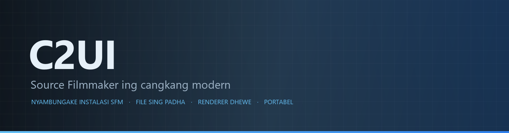

<details align="center"><summary>&nbsp;🌐 <b>🇮🇩 Basa Jawa</b> &nbsp;·&nbsp; <sub>Language · Язык · 語言 · Idioma · Sprache · भाषा · لغة</sub></summary>

<table align="center">
<tr><td align="center"><a href="../../README.md">🇷🇺<br>Русский</a></td><td align="center"><a href="../README/EN-en.md">🇬🇧<br>English</a></td><td align="center"><a href="../README/PL-pl.md">🇵🇱<br>Polski</a></td><td align="center"><a href="../README/UK-ua.md">🇺🇦<br>Українська</a></td><td align="center"><a href="../README/DE-de.md">🇩🇪<br>Deutsch</a></td><td align="center"><a href="../README/RO-md.md">🇲🇩<br>Moldovenească</a></td><td align="center"><a href="../README/SL-si.md">🇸🇮<br>Slovenščina</a></td><td align="center"><a href="../README/BE-by.md">🇧🇾<br>Беларуская</a></td></tr>
<tr><td align="center"><a href="../README/KK-kz.md">🇰🇿<br>Қазақша</a></td><td align="center"><a href="../README/JA-jp.md">🇯🇵<br>日本語</a></td><td align="center"><a href="../README/ZH-cn.md">🇨🇳<br>中文</a></td><td align="center"><a href="../README/SV-se.md">🇸🇪<br>Svenska</a></td><td align="center"><a href="../README/ES-es.md">🇪🇸<br>Español</a></td><td align="center"><a href="../README/HI-in.md">🇮🇳<br>हिन्दी</a></td><td align="center"><a href="../README/PT-pt.md">🇵🇹<br>Português</a></td><td align="center"><a href="../README/BN-bd.md">🇧🇩<br>বাংলা</a></td></tr>
<tr><td align="center"><a href="../README/FR-fr.md">🇫🇷<br>Français</a></td><td align="center"><a href="../README/TE-in.md">🇮🇳<br>తెలుగు</a></td><td align="center"><a href="../README/MR-in.md">🇮🇳<br>मराठी</a></td><td align="center"><a href="../README/TA-in.md">🇮🇳<br>தமிழ்</a></td><td align="center"><a href="../README/TR-tr.md">🇹🇷<br>Türkçe</a></td><td align="center"><a href="../README/UR-pk.md">🇵🇰<br>اردو</a></td><td align="center"><a href="../README/VI-vn.md">🇻🇳<br>Tiếng Việt</a></td><td align="center"><a href="../README/GU-in.md">🇮🇳<br>ગુજરાતી</a></td></tr>
<tr><td align="center"><a href="../README/IT-it.md">🇮🇹<br>Italiano</a></td><td align="center"><a href="../README/KO-kr.md">🇰🇷<br>한국어</a></td><td align="center"><a href="../README/AR-sa.md">🇸🇦<br>العربية</a></td><td align="center"><b>🇮🇩<br>Basa Jawa</b></td><td align="center"><a href="../README/ML-in.md">🇮🇳<br>മലയാളം</a></td><td align="center"><a href="../README/NE-np.md">🇳🇵<br>नेपाली</a></td><td align="center"><a href="../README/UZ-uz.md">🇺🇿<br>Oʻzbekcha</a></td><td align="center"><a href="../README/OR-in.md">🇮🇳<br>ଓଡ଼ିଆ</a></td></tr>
</table>

</details>

<p align="center"></p>

<p align="center">
  
  
  
  
  <a href="../../Testing"></a>
  
  <a href="../LICENSE/JV-id.md"></a>
</p>

<p align="center"><b>C2UI</b> — <i>Custom to User Interface</i> — editor Source Filmmaker ing cangkang modern: isi sing padha, format sesi sing padha, model data sing padha, antarmuka kanthi semangat pustaka Steam lan editor Unreal Engine 5.</p>

---

## Kesiapan

<p align="center"></p>

<p align="center"><a href="../READINESS/JV-id.md"></a></p>

## Gagasan

Source Filmmaker iku piranti kuwat sing antarmukané kandheg ing taun 2012. C2UI ora ngganti lan ora mbangun ulang: tujuané mung nggawé SFM luwih modern lan luwih kepenak sithik.

Editor nemokake SFM sing wis dipasang, nyambungake minangka pustaka isi — model, materi, tekstur, sesi — lan nyambut gawe karo file sing padha ing format sing padha. Kabeh sing digawé ing SFM bisa dibukak ing C2UI, lan sewaliké.

Tujuan pisanan yaiku kompatibilitas lengkap karo SFM, kalebu balung lan rig. Sabanjuré, apa sing kurang ing SFM.

```
  ┌───────────────┐                           ┌──────────────────────────────┐
  │   C2UI        │ ──── "SFM ing endi?" ────▶│  SourceFilmmaker/game/       │
  │               │                           │    usermod/gameinfo.txt      │
  │  UI dhewe     │ ◀─────── dipasang ────────│    tf/  hl2/  tf_movies/ …   │
  │  render dhewe │         mung waca         │    models/ materials/ dmx    │
  └───────────────┘                           └──────────────────────────────┘
```

- **Portabel.** Ora ana sing ditulis ing njaba folder aplikasi: setelan ing `App/User`, cache ing `App/Cache`, sauntara ing `App/Temporary`. Busak folderé lan ora ana tilas.
- **Ora tau mbukak SFM.** Ora ana proses sing dikendhaleni, ora ana jendhela sing direbut. Instalasi diwaca kaya paket isi.
- **Format diverifikasi, ora diandhakake.** Saben pamaca dipriksa karo instalasi nyata; yen format nindakake sing nggumunake, kodené ngomong.
- **Nyimpen presisi.** Sesi sing diwaca lan ditulis tanpa owah iku file sing padha.
- **Mesin ora duwe ketergantungan.** `Core/` lan kabeh tes mlaku ing Python murni; mung jendhela sing butuh Qt lan OpenGL.

## Struktur

```
C2UI_SDK/
├── README.md
├── Core/               mesin: format, sistem file virtual, indeks, jembatan
│   ├── API/            kontrak kanggo editor, piranti lan plugin
│   ├── Code/           mesin: animasi, operator, rai, panyuntingan
│   │   └── formats/    pamaca Valve: mdl vvd vtx vmt vtf dmx bsp
│   └── dev-kit/        slot SDK (kosong) lan jembatan menyang instalasi
├── App/                editor: pustaka isi, renderer, jendhela
│   ├── Code/           pustaka konten, jendhela, setelan
│   │   ├── render/     adegan, renderer OpenGL, shader, kamera
│   │   └── ui/         garis wektu, wit sesi, inspektur, graph editor, docking
│   ├── Data/           sumber daya program, mung diwaca
│   ├── User/           data panganggo — ora tau dibusak
│   └── Cache/          indeks konten, shader, gambar cilik
├── Tools/              lokalisasi, piranti UI, plugin (mengko)
│   ├── Launcher/       peluncur
│   ├── Market Load/    klien pasar plugin (mengko)
│   ├── Localization/   nggawe terjemahan
│   ├── NewPlugins/     nggawe plugin
│   └── UI/             tema lan ruang kerja
├── Testing/            tes, fixture presisi bait, siji runner
│   ├── core/           mesin
│   ├── app/            editor
│   └── fixtures/       instalasi palsu, model, tekstur
└── GIT&DOCK/           README, kesiapan lan lisènsi ing 32 basa
```

### Carane kerjane

Dalan saka «Source Filmmaker ana ngendi?» tekan siji frame ing layar liwat limang lapisan; saben lapisan mung ngerti lapisan sangisore.

1. **Jembatan** (`Core/dev-kit/bridge_sfm`) nemokake instalasi liwat Steam, maca `gameinfo.txt` lan mbalekake dalan konten miturut urutan mesin. `sfm.exe` ora tau diuripake.
2. **Sistem berkas virtual lan indeks** (`Core/Code/vfs.py`, `content_index.py`) nyusun dalan-dalan kasebut kaya Source: berkas sing ditemokake dhisik menang. Indeks iku siji berkas SQLite ing `App/Cache`, dadi nglakoni 70 000 berkas mung sepisan.
3. **Format** (`Core/Code/formats`) maca berkas Valve tanpa pustaka pihak katelu: `.mdl` `.vvd` `.vtx` iku model, `.vmt` `.vtf` material lan tekstur, `.dmx` sesi, `.bsp` peta. Saben maca wis dipriksa ing kabeh instalasi; sesi ditulis maneh bait demi bait.
4. **Sesi** iku grafik unsur DMX. `animation.py` ngitung saluran ing sawijining wektu, `operators.py` nglakokake ekspresi lan watesan rig, `flex.py` ngobahake rai, `pose.py` nggawe matriks balung. Saben owah-owahan liwat `editing.py` minangka prentah sing bisa dibatalake.
5. **Editor** (`App/Code`) nggawe adegan (`render/scene.py`) saka iku lan nggambar nganggo renderer OpenGL 3.3 dhewe (`renderer.py`, `shaders.py`): lampu sesi, lightmap lan cahya peta — gambare isih adoh saka SFM lan isih digarap. Panel (`ui/`) yaiku garis wektu, wit sesi, inspektur, graph editor lan docking gaya UE5.

Kabeh sing ditulis program tetep ing folder dhewe: `App/User` kanggo setelan, `App/Cache` kanggo indeks lan cache, `App/Temporary` kanggo log. `Core/` ora nulis apa-apa lan ora gumantung Qt, dadi mesin lan tes mlaku ing Python murni; Qt lan OpenGL mung dibutuhake jendhela. Piranti ing `Tools/` dibangun ketat ing `Core/API` — mangkono dibuktekake yen API cukup uga kanggo plugin pihak katelu.

### Mbukak

Mbutuhake Windows, Python 3.13 lan instalasi Source Filmmaker.

```bash
git clone https://github.com/Arkomiko/SFM_C2UI.git
cd SFM_C2UI
python -m venv .venv
.venv/Scripts/python.exe -m pip install -r Tools/Launcher/requirements.txt
.venv/Scripts/python.exe Tools/Launcher/c2ui.py
```

Nalika pisanan mbukak, SFM digoleki liwat Steam; yen ora ketemu, program takon. <kbd>Ctrl</kbd>+<kbd>O</kbd> mbukak sesi, <kbd>Space</kbd> muter, <kbd>C</kbd> kamera shot, <kbd>T</kbd>/<kbd>R</kbd> pindhah/puter, <kbd>M</kbd> motion editor, <kbd>Ctrl</kbd>+<kbd>Z</kbd> batal, <kbd>Ctrl</kbd>+<kbd>S</kbd> simpen. Panel diseret saka judhulé. Tes ora butuh apa-apa:

```bash
python Testing/run.py
```

### Rencana

**Sabanjure**
- Rupa peta: banyu, prop_dynamic, tekstur gobo lampu, `$bumpmap` lan `$envmap`, bayangan saka lampu sesi.
- Swara ing film sing diekspor.
- Plugin `.c2plg` lan klien pasar ing `Tools/Market Load`; banjur tema lan ruang kerja.
- Swara ing garis wektu, partikel, wrinkle map, preset lan lapisan motion editor, tangen ing graph editor.

**Mengko**
- Kinerja ing peta lengkap: instancing prop statis, cache pose.
- Mbangun maneh mesin: parameter kompilasi peta anyar kanggo cahya lan bayangan sing luwih apik, wates peta 120 000 unit.
- Launcher sing dikemas nganggo Python dhewe lan nganyari dhewe; lokalisasi editor.

## Lisensi lan panuwun

Kode dhewe C2UI ana ing **lisensi C2UI**: bebas kanggo panggunaan pribadi lan non-komersial; panggunaan komersial mung kanthi persetujuan tinulis saka penulis; versi sing diowahi kudu nyebutake proyek asli lan penulisé, Arkomiko. Plugin lan addon ana ing lisensi **C2UI — Plugins & Addons (C2UI‑Pl&AD)**.

Source Filmmaker, Team Fortress 2 lan mesin Source iku duweké Valve; proyek maca formaté, ora nyertakake file apa wae saka dheweke, lan mung bisa karo salinan SFM sampeyan dhewe saka Steam.

<p align="center"><a href="../LICENSE/JV-id.md"></a></p>
