<p align="center"></p>

<p align="center"><a href="../../README.md">🇷🇺 Русский</a> · <a href="EN-en.md">🇬🇧 English</a> · <a href="PL-pl.md">🇵🇱 Polski</a> · <a href="UK-ua.md">🇺🇦 Українська</a> · <a href="DE-de.md">🇩🇪 Deutsch</a> · <a href="RO-md.md">🇲🇩 Moldovenească</a> · <a href="SL-si.md">🇸🇮 Slovenščina</a> · <a href="BE-by.md">🇧🇾 Беларуская</a> · <a href="KK-kz.md">🇰🇿 Қазақша</a> · <a href="JA-jp.md">🇯🇵 日本語</a> · <a href="ZH-cn.md">🇨🇳 中文</a> · <a href="SV-se.md">🇸🇪 Svenska</a> · <a href="ES-es.md">🇪🇸 Español</a> · <a href="HI-in.md">🇮🇳 हिन्दी</a> · <a href="PT-pt.md">🇵🇹 Português</a> · <a href="BN-bd.md">🇧🇩 বাংলা</a> · <a href="FR-fr.md">🇫🇷 Français</a> · <a href="TE-in.md">🇮🇳 తెలుగు</a> · <a href="MR-in.md">🇮🇳 मराठी</a> · <a href="TA-in.md">🇮🇳 தமிழ்</a> · <a href="TR-tr.md">🇹🇷 Türkçe</a> · <a href="UR-pk.md">🇵🇰 اردو</a> · <a href="VI-vn.md">🇻🇳 Tiếng Việt</a> · <a href="GU-in.md">🇮🇳 ગુજરાતી</a> · <a href="IT-it.md">🇮🇹 Italiano</a> · <a href="KO-kr.md">🇰🇷 한국어</a> · <a href="AR-sa.md">🇸🇦 العربية</a> · <b>🇮🇩 Basa Jawa</b> · <a href="ML-in.md">🇮🇳 മലയാളം</a> · <a href="NE-np.md">🇳🇵 नेपाली</a> · <a href="UZ-uz.md">🇺🇿 Oʻzbekcha</a> · <a href="OR-in.md">🇮🇳 ଓଡ଼ିଆ</a></p>

<p align="center">
  
  
  
  
  <a href="../../Testing"></a>
  
</p>

<p align="center"><b>C2UI</b> — <i>Custom to User Interface</i> — — editor Source Filmmaker ing cangkang modern: isi sing padha, format sesi sing padha, model data sing padha, antarmuka kanthi semangat pustaka Steam lan editor Unreal Engine 5.</p>

---

## Gagasan

Source Filmmaker iku piranti kuwat sing antarmukané kandheg ing taun 2012. C2UI ora ngganti lan ora mbangun ulang: tujuané mung nggawé SFM luwih modern lan luwih kepenak sithik.

Editor nemokake SFM sing wis dipasang, nyambungake minangka pustaka isi — model, materi, tekstur, sesi — lan nyambut gawe karo file sing padha ing format sing padha. Kabeh sing digawé ing SFM bisa dibukak ing C2UI, lan sewaliké.

Tujuan pisanan yaiku kompatibilitas lengkap karo SFM, kalebu balung lan rig. Sabanjuré, apa sing kurang ing SFM.

```
  ┌──────────────┐    "SFM ing endi?"    ┌──────────────────────────────┐
  │   C2UI       │ ─────────────────────▶│  SourceFilmmaker/game/       │
  │              │                       │    usermod/gameinfo.txt      │
  │  UI dhewe    │ ◀───── dipasang  ───────│    tf/  hl2/  tf_movies/ …   │
  │  render dhewe │       mung waca       │    models/ materials/ dmx    │
  └──────────────┘                       └──────────────────────────────┘
```

## Kesiapan



 <b>Kesiapan sakabèhé kanggo rilis: 38%</b>

Saben wilayah bisa dibukak: apa sing wis mlaku lan apa sing durung ana. Persentase iku prakiraan dibandhing kemampuan SFM.

<details><summary> <b>Nemokake lan masang SFM</b></summary>

Registry Steam → `libraryfolders.vdf` → dalan telusur `gameinfo.txt`, miturut urutan mesin. Enem pasangan ing instalasi standar. Ora ana sing ditulis ing njaba folder aplikasi.

</details>
<details><summary> <b>Indeks isi</b></summary>

70 199 file ing 1,1 dtk adhem / 0,02 dtk saka cache; timpa antarane pasangan dirampungake persis kaya mesin.

</details>
<details><summary> <b>Model — <code>.mdl</code> <code>.vvd</code> <code>.vtx</code></b></summary>

Versi 44, 48, 49. Balung, mesh, kabeh tingkat detail, klompok awak. 1 500 model dimuat, 0 gagal.

</details>
<details><summary> <b>Materi — <code>.vmt</code></b></summary>

Kabeh 19 554 materi bisa diwaca; `patch`, blok DX, proxy.

</details>
<details><summary> <b>Tekstur — <code>.vtf</code></b></summary>

Versi 7.0–7.5, DXT1/3/5 lan kabeh format tanpa kompresi, cubemap, mip. DXT menyang GPU tanpa dekode.

</details>
<details><summary> <b>Sesi — <code>.dmx</code></b></summary>

Binar 1–5 lan KeyValues2. Saben sesi lan file partikel ing instalasi ditulis bali **bait demi bait**.

</details>
<details><summary> <b>Sesi ing layar</b></summary>

Shot lan trek swara ing garis wektu, wit unsur, pemandangan saben shot liwat kamerané. Durung: peta, partikel, swara.

</details>
<details><summary> <b>Animasi</b></summary>

Kanal lan log dietung ing kursor; scrub lan muter. Balung, kamera lan katon melu sesi.

</details>
<details><summary> <b>Rai</b></summary>

Pengontrol flex, aturan sing dikompilasi lan animasi verteks — karakter ngomong lan nuduhake ekspresi. Durung: peta kerut.

</details>
<details><summary> <b>Rig</b></summary>

Ekspresi, batasan point/orient/parent/aim, IK rong balung. Durung: grafik ketergantungan operator lengkap, nggawe rig.

</details>
<details><summary> <b>Nyunting</b></summary>

Klik kanggo milih, manipulator pindhah/puter, inspektur kanggo atribut apa wae, kunci ing kursor, batal/baleni, simpen presisi bait. Durung: editor grafik.

</details>
<details><summary> <b>Motion editor</b></summary>

Pilihan wektu karo hold lan falloff ing garisan; suntingan nyebar kaya ing SFM. Durung: preset, lapisan.

</details>
<details><summary> <b>Docking panel</b></summary>

Seret panel menyang kompas target karo pratinjau, kaya ing UE5 lan Visual Studio. Durung: tata letak sing disimpen, tema.

</details>
<details><summary> <b>Shading Source</b></summary>

Mung tekstur lan cahya prasaja. Durung: phong, rim, lightwarp, cahya adegan, ayang-ayang.

</details>
<details><summary> <b>Peta — <code>.bsp</code></b></summary>

Durung diwiwiti.

</details>
<details><summary> <b>Render menyang gambar lan video</b></summary>

Durung diwiwiti.

</details>
<details><summary> <b>Plugin <code>.c2plg</code></b></summary>

Durung diwiwiti.

</details>
<details><summary> <b>Tema lan ruang kerja</b></summary>

Sengaja mengko: siji tampilan nganti editor duwe sing pantes ditemani.

</details>

**Durung siap dirilis.** Dhasaré — saben format file sing dienggo SFM, diwaca kanthi bener lan diverifikasi ing kabeh instalasi — wis ana lan dites; sesi bisa dibukak, diputer, diowahi lan disimpen. Sing kurang yaiku *kepenaké* nyambut gawe: editor grafik, shading Source, peta, ekspor. Ora ana nomer versi nganti animator bisa nyambut gawe sedina ing kono.

<br clear="all">

<p align="center"><br><sub>Editor saiki, karo Meet the Heavy saka Valve dibukak: shot lan swara ing garis wektu, wit sesi, shot pisanan liwat kamerané dhewe, karakter mapan lan raine kaya sing diomongake sesi.</sub></p>

## Apa bedané

- **Portabel.** Ora ana sing ditulis ing njaba folder aplikasi: setelan ing `App/User`, cache ing `App/Cache`, sauntara ing `App/Temporary`. Busak folderé lan ora ana tilas.
- **Ora tau mbukak SFM.** Ora ana proses sing dikendhaleni, ora ana jendhela sing direbut. Instalasi diwaca kaya paket isi.
- **Format diverifikasi, ora diandhakake.** Saben pamaca dipriksa karo instalasi nyata; yen format nindakake sing nggumunake, kodené ngomong.
- **Nyimpen presisi.** Sesi sing diwaca lan ditulis tanpa owah iku file sing padha.
- **Mesin ora duwe ketergantungan.** `Core/` lan kabeh tes mlaku ing Python murni; mung jendhela sing butuh Qt lan OpenGL.

## Mbukak

Mbutuhake Windows, Python 3.13 lan instalasi Source Filmmaker.

```bash
git clone https://github.com/Arkomiko/SFM_C2UI.git
cd SFM_C2UI
python -m venv .venv
.venv/Scripts/python.exe -m pip install -r requirements.txt
.venv/Scripts/python.exe c2ui.py
```

Nalika pisanan mbukak, SFM digoleki liwat Steam; yen ora ketemu, program takon. <kbd>Ctrl</kbd>+<kbd>O</kbd> mbukak sesi, <kbd>Space</kbd> muter, <kbd>C</kbd> kamera shot, <kbd>T</kbd>/<kbd>R</kbd> pindhah/puter, <kbd>M</kbd> motion editor, <kbd>Ctrl</kbd>+<kbd>Z</kbd> batal, <kbd>Ctrl</kbd>+<kbd>S</kbd> simpen. Panel diseret saka judhulé. Tes ora butuh apa-apa:

```bash
python Testing/run.py
```

## Struktur

```
C2UI_SDK/
├── c2ui.py            peluncur
├── Core/              mesin: format, sistem file virtual, indeks, jembatan
├── App/               editor: pustaka isi, renderer, jendhela
├── Tools/             lokalisasi, piranti UI, plugin (mengko)
├── Testing/           tes, fixture presisi bait, siji runner
└── GIT&DOCK/README/   README iki ing basa liya
```

## Peta dalan

1. **Editor grafik** — kurva lan kunci, katon.
2. **Shading Source** — VertexLitGeneric kaya sing digambar SFM: phong, rim, lightwarp, cahya adegan.
3. **Peta** — `.bsp` kanggo latar.
4. **Output** — ekspor gambar lan video.
5. **Plugin** — format `.c2plg`; banjur tema lan ruang kerja.

## Lisensi lan panuwun

Source Filmmaker, Team Fortress 2 lan mesin Source iku duweké Valve. Proyek iki maca format filené, ora nyertakake file apa wae saka dheweke, lan mung bisa karo salinan SFM sing wis kokduweni liwat Steam.

Lisensi kode C2UI dhewe durung dipilih — nganti kuwi, kabeh hak dilindhungi. Issue lan pull request tetep ditampa.

<p align="center"><br><sub>Sewidak papat model dipilih acak saka instalasi, digambar dening renderer C2UI dhewe.</sub></p>
