<details align="center"><summary>&nbsp;🌐 <b>🇰🇿 Қазақша</b> &nbsp;·&nbsp; <sub>Language · Язык · 語言 · Idioma · Sprache · भाषा · لغة</sub></summary>

<table align="center">
<tr><td align="center"><a href="../../README.md">🇷🇺<br>Русский</a></td><td align="center"><a href="../README/EN-en.md">🇬🇧<br>English</a></td><td align="center"><a href="../README/PL-pl.md">🇵🇱<br>Polski</a></td><td align="center"><a href="../README/UK-ua.md">🇺🇦<br>Українська</a></td><td align="center"><a href="../README/DE-de.md">🇩🇪<br>Deutsch</a></td><td align="center"><a href="../README/RO-md.md">🇲🇩<br>Moldovenească</a></td><td align="center"><a href="../README/SL-si.md">🇸🇮<br>Slovenščina</a></td><td align="center"><a href="../README/BE-by.md">🇧🇾<br>Беларуская</a></td></tr>
<tr><td align="center"><b>🇰🇿<br>Қазақша</b></td><td align="center"><a href="../README/JA-jp.md">🇯🇵<br>日本語</a></td><td align="center"><a href="../README/ZH-cn.md">🇨🇳<br>中文</a></td><td align="center"><a href="../README/SV-se.md">🇸🇪<br>Svenska</a></td><td align="center"><a href="../README/ES-es.md">🇪🇸<br>Español</a></td><td align="center"><a href="../README/HI-in.md">🇮🇳<br>हिन्दी</a></td><td align="center"><a href="../README/PT-pt.md">🇵🇹<br>Português</a></td><td align="center"><a href="../README/BN-bd.md">🇧🇩<br>বাংলা</a></td></tr>
<tr><td align="center"><a href="../README/FR-fr.md">🇫🇷<br>Français</a></td><td align="center"><a href="../README/TE-in.md">🇮🇳<br>తెలుగు</a></td><td align="center"><a href="../README/MR-in.md">🇮🇳<br>मराठी</a></td><td align="center"><a href="../README/TA-in.md">🇮🇳<br>தமிழ்</a></td><td align="center"><a href="../README/TR-tr.md">🇹🇷<br>Türkçe</a></td><td align="center"><a href="../README/UR-pk.md">🇵🇰<br>اردو</a></td><td align="center"><a href="../README/VI-vn.md">🇻🇳<br>Tiếng Việt</a></td><td align="center"><a href="../README/GU-in.md">🇮🇳<br>ગુજરાતી</a></td></tr>
<tr><td align="center"><a href="../README/IT-it.md">🇮🇹<br>Italiano</a></td><td align="center"><a href="../README/KO-kr.md">🇰🇷<br>한국어</a></td><td align="center"><a href="../README/AR-sa.md">🇸🇦<br>العربية</a></td><td align="center"><a href="../README/JV-id.md">🇮🇩<br>Basa Jawa</a></td><td align="center"><a href="../README/ML-in.md">🇮🇳<br>മലയാളം</a></td><td align="center"><a href="../README/NE-np.md">🇳🇵<br>नेपाली</a></td><td align="center"><a href="../README/UZ-uz.md">🇺🇿<br>Oʻzbekcha</a></td><td align="center"><a href="../README/OR-in.md">🇮🇳<br>ଓଡ଼ିଆ</a></td></tr>
</table>

</details>

<p align="center"></p>

<p align="center">
  
  
  
  
  
  <a href="../../Testing"></a>
  
  <a href="../LICENSE/KK-kz.md"></a>
</p>

<p align="center"><b>C2UI</b> — <i>Custom to User Interface</i> — заманауи қабықтағы Source Filmmaker редакторы: сол контент, сол сессия форматы, сол деректер моделі, Steam кітапханасы мен Unreal Engine 5 редакторы рухындағы интерфейс.</p>

> [!IMPORTANT]
> **Әзірлеу уақытша тоқтатылды.** Репозиторий ашық қалады: код, құжаттама және тарих орнында, төменде сипатталғанның бәрі сипатталғандай жұмыс істейді. Дайындық сандары, issues және жол картасы үзіліс сәтіндегі жағдайды көрсетеді.

---

## Дайындық

<p align="center"></p>

<p align="center"><a href="../READINESS/KK-kz.md"></a></p>

## Идея

Source Filmmaker — интерфейсі 2012 жылда қалған күшті құрал. C2UI оны алмастырмайды және қайта жасамайды: мақсат — SFM-ді сәл заманауи әрі ыңғайлы ету.

Редактор орнатылған SFM-ді тауып, оны контент кітапханасы ретінде қосады — модельдер, материалдар, текстуралар, сессиялар — және сол файлдармен сол форматта жұмыс істейді. SFM-де жасалғанның бәрі C2UI-де ашылады, керісінше де.

Бірінші мақсат — сүйектер мен ригтерді қоса, SFM-мен толық үйлесімділік. Одан кейін — SFM-де жетіспегендер.

```
  ┌──────────────┐                        ┌──────────────────────────────┐
  │   C2UI       │ ──── "SFM қайда?" ────▶│  SourceFilmmaker/game/       │
  │              │                        │    usermod/gameinfo.txt      │
  │  өз UI       │ ◀────── жалғайды ──────│    tf/  hl2/  tf_movies/ …   │
  │  өз рендер   │        тек оқу         │    models/ materials/ dmx    │
  └──────────────┘                        └──────────────────────────────┘
```

- **Тасымалы.** Бағдарлама папкасынан тыс ештеңе жазылмайды: параметрлер `App/User`, кэш `App/Cache`, уақытша `App/Temporary`. Папканы өшірсеңіз — із қалмайды.
- **SFM-ді іске қоспайды.** Басқаратын процесс жоқ, ұстайтын терезелер жоқ. Орнату контент пакеті ретінде оқылады.
- **Форматтар тексерілген, болжанбаған.** Әрбір оқығыш нақты орнатумен салыстырылған; формат күтпеген нәрсе істесе, код бұл туралы айтады.
- **Сақтау дәл.** Өзгеріссіз оқылып жазылған сессия — сол файл.
- **Ядро тәуелділіксіз.** `Core/` және барлық тесттер таза Python-да жұмыс істейді; Qt мен OpenGL тек терезеге керек.

## Құрылымы

```
C2UI_SDK/
├── README.md
├── Core/               ядро: форматтар, виртуалды ФЖ, индекс, көпірлер
│   ├── API/            редактор, құралдар мен плагиндерге арналған келісім
│   ├── Code/           қозғалтқыш: анимация, операторлар, беттер, өңдеу
│   │   └── formats/    Valve оқығыштары: mdl vvd vtx vmt vtf dmx bsp
│   └── dev-kit/        SDK ұялары (бос) және орнатуларға көпірлер
├── Launcher/           іске қосқыш
├── App/                редактор: контент кітапханасы, рендер, терезе
│   ├── Code/           контент кітапханасы, терезе, баптаулар
│   │   ├── render/     сахна, OpenGL рендерері, шейдерлер, камера
│   │   └── ui/         таймлайн, сессия ағашы, инспектор, graph editor, докинг
│   ├── Data/           бағдарлама ресурстары, тек оқу
│   ├── User/           пайдаланушы деректері — ешқашан өшірілмейді
│   └── Cache/          контент индексі, шейдерлер, нобайлар
├── Tools/              локализация, UI құралдары, плагиндер (кейін)
│   ├── Market Load/    плагин маркетплейсінің клиенті (кейін)
│   ├── Localization/   аудармалар жасау
│   ├── NewPlugins/     плагиндер жасау
│   └── UI/             тақырыптар мен жұмыс кеңістіктері
├── Testing/            тесттер, байт-дәл фикстуралар, бір раннер
│   ├── core/           қозғалтқыш
│   ├── app/            редактор
│   └── fixtures/       жалған орнату, модельдер, текстуралар
└── GIT&DOCK/           README, дайындық және лицензия 32 тілде
```

### Бұл қалай жұмыс істейді

«Source Filmmaker қайда?» деген сұрақтан экрандағы кадрға дейінгі жол бес қабаттан өтеді; әр қабат тек өзінен төменгісін біледі.

1. **Көпір** (`Core/dev-kit/bridge_sfm`) орнатуды Steam арқылы табады, `gameinfo.txt` оқиды және контент жолдарын қозғалтқыш ретімен қайтарады. `sfm.exe` ешқашан іске қосылмайды.
2. **Виртуалды файлдық жүйе мен индекс** (`Core/Code/vfs.py`, `content_index.py`) бұл жолдарды Source сияқты қабаттайды: бірінші табылған файл жеңеді. Индекс — `App/Cache` ішіндегі бір SQLite файлы, сондықтан 70 000 файлды аралау бір рет қана жасалады.
3. **Форматтар** (`Core/Code/formats`) Valve файлдарын бөгде кітапханасыз оқиды: `.mdl` `.vvd` `.vtx` — модель, `.vmt` `.vtf` — материал мен текстура, `.dmx` — сессия, `.bsp` — карта. Әр оқығыш бүкіл орнатуда тексерілген; сессия байт-байтымен қайта жазылады.
4. **Сессия** — DMX элементтерінің графы. `animation.py` каналдарды уақыт сәтінде есептейді, `operators.py` өрнектер мен риг шектеулерін орындайды, `flex.py` беттерді қозғалтады, `pose.py` сүйек матрицаларын құрады. Әр өзгеріс `editing.py` арқылы болдырмауға болатын команда ретінде өтеді.
5. **Редактор** (`App/Code`) осыдан сахна құрайды (`render/scene.py`) және оны өз OpenGL 3.3 рендерерімен салады (`renderer.py`, `shaders.py`): сессия жарығы, лайтмаптар және карта жарықтандыруы — сурет әзірге SFM-нен алыс, жетілдірілуде. Панельдер (`ui/`) — таймлайн, сессия ағашы, инспектор, graph editor және UE5 үлгісіндегі докинг.

Бағдарлама жазатынның бәрі өз қалтасында қалады: `App/User` — баптаулар, `App/Cache` — индекс пен кэш, `App/Temporary` — журнал. `Core/` ештеңе жазбайды және Qt-ға тәуелді емес, сондықтан қозғалтқыш пен тесттер таза Python-да жұмыс істейді; Qt мен OpenGL тек терезеге қажет. `Tools/` ішіндегі құралдар тек `Core/API` үстінде құрылады — осылай API бөгде плагиндерге де жеткілікті екені тексеріледі.

### Іске қосу

Windows, Python 3.13 және орнатылған Source Filmmaker қажет.

```bash
git clone https://github.com/Arkomiko/SFM_C2UI.git
cd SFM_C2UI
python -m venv .venv
.venv/Scripts/python.exe -m pip install -r Launcher/requirements.txt
.venv/Scripts/python.exe Launcher/launcher.py
```

Үш түймесі бар лаунчер терезесі ашылады. Оның көрінісі уақытша — App пайда болғанда қайта жазылады; терезесі әзірге тек орысша.

<p align="center"><a href="../LAUNCHER/KK-kz.md"></a></p>

Алғашқы іске қосуда SFM Steam арқылы ізделеді; табылмаса — бағдарлама сұрайды. <kbd>Ctrl</kbd>+<kbd>O</kbd> сессияны ашады, <kbd>Space</kbd> — ойнату, <kbd>C</kbd> — шот камерасы, <kbd>T</kbd>/<kbd>R</kbd> — жылжыту/бұру, <kbd>M</kbd> — motion editor, <kbd>Ctrl</kbd>+<kbd>Z</kbd> — болдырмау, <kbd>Ctrl</kbd>+<kbd>S</kbd> — сақтау. Панельдер тақырыбынан сүйреледі. Тесттерге ештеңе керек емес:

```bash
python Testing/run.py
```

### Жоспарда

**Жақын арада**
- Карта көрінісі: су, prop_dynamic, жарықтың гобо-текстуралары, `$bumpmap` және `$envmap`, сессия жарығынан көлеңкелер.
- Экспортталған видеодағы дыбыс.
- `.c2plg` плагиндері және `Tools/Market Load` ішіндегі маркетплейс клиенті; содан кейін тақырыптар мен жұмыс кеңістіктері.
- Таймлайндағы дыбыс, бөлшектер, wrinkle-карталар, motion editor пресеттері мен қабаттары, graph editor-дағы жанамалар.

**Кейінірек**
- Толық карталардағы өнімділік: статикалық проптарды инстанстау, поза кэші.
- Қозғалтқышты қайта өңдеу: жақсартылған жарық пен көлеңке үшін жаңа карта компиляциясы параметрлері, 120 000 бірлік карта шегі.
- Өз Python-ы мен автожаңартуы бар қапталған лаунчер; редакторды локализациялау.

## Лицензия және алғыс

C2UI-дің өз коды **C2UI лицензиясымен** таратылады: жеке және коммерциялық емес мақсаттарға еркін; коммерциялық пайдалану — тек автордың жазбаша келісімімен; өзгертілген нұсқалар түпнұсқа жобаға және оның авторы Arkomiko-ға сілтеме жасауы тиіс. Плагиндер мен аддондар — **C2UI — Plugins & Addons (C2UI‑Pl&AD)** лицензиясымен.

Source Filmmaker, Team Fortress 2 және Source қозғалтқышы Valve-қа тиесілі; жоба олардың форматтарын оқиды, файлдарын қамтымайды және тек Steam-дегі өз SFM көшірмеңізбен жұмыс істейді.

<p align="center"><a href="../LICENSE/KK-kz.md"></a></p>
