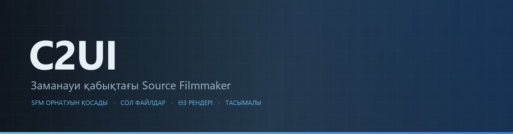

<p align="center"></p>

<p align="center"><a href="../../README.md">🇷🇺 Русский</a> · <a href="EN-en.md">🇬🇧 English</a> · <a href="PL-pl.md">🇵🇱 Polski</a> · <a href="UK-ua.md">🇺🇦 Українська</a> · <a href="DE-de.md">🇩🇪 Deutsch</a> · <a href="RO-md.md">🇲🇩 Moldovenească</a> · <a href="SL-si.md">🇸🇮 Slovenščina</a> · <a href="BE-by.md">🇧🇾 Беларуская</a> · <b>🇰🇿 Қазақша</b> · <a href="JA-jp.md">🇯🇵 日本語</a> · <a href="ZH-cn.md">🇨🇳 中文</a> · <a href="SV-se.md">🇸🇪 Svenska</a> · <a href="ES-es.md">🇪🇸 Español</a> · <a href="HI-in.md">🇮🇳 हिन्दी</a> · <a href="PT-pt.md">🇵🇹 Português</a> · <a href="BN-bd.md">🇧🇩 বাংলা</a> · <a href="FR-fr.md">🇫🇷 Français</a> · <a href="TE-in.md">🇮🇳 తెలుగు</a> · <a href="MR-in.md">🇮🇳 मराठी</a> · <a href="TA-in.md">🇮🇳 தமிழ்</a> · <a href="TR-tr.md">🇹🇷 Türkçe</a> · <a href="UR-pk.md">🇵🇰 اردو</a> · <a href="VI-vn.md">🇻🇳 Tiếng Việt</a> · <a href="GU-in.md">🇮🇳 ગુજરાતી</a> · <a href="IT-it.md">🇮🇹 Italiano</a> · <a href="KO-kr.md">🇰🇷 한국어</a> · <a href="AR-sa.md">🇸🇦 العربية</a> · <a href="JV-id.md">🇮🇩 Basa Jawa</a> · <a href="ML-in.md">🇮🇳 മലയാളം</a> · <a href="NE-np.md">🇳🇵 नेपाली</a> · <a href="UZ-uz.md">🇺🇿 Oʻzbekcha</a> · <a href="OR-in.md">🇮🇳 ଓଡ଼ିଆ</a></p>

<p align="center">
  
  
  
  
  <a href="../../Testing"></a>
  
</p>

<p align="center"><b>C2UI</b> — <i>Custom to User Interface</i> — — заманауи қабықтағы Source Filmmaker редакторы: сол контент, сол сессия форматы, сол деректер моделі, Steam кітапханасы мен Unreal Engine 5 редакторы рухындағы интерфейс.</p>

---

## Дайындық

<p align="center"></p>

<p align="center"> <b>Релизге жалпы дайындық: 41%</b></p>

<p align="center"><a href="../assets/KK-kz/sidebar.md"></a></p>

## Идея

Source Filmmaker — интерфейсі 2012 жылда қалған күшті құрал. C2UI оны алмастырмайды және қайта жасамайды: мақсат — SFM-ді сәл заманауи әрі ыңғайлы ету.

Редактор орнатылған SFM-ді тауып, оны контент кітапханасы ретінде қосады — модельдер, материалдар, текстуралар, сессиялар — және сол файлдармен сол форматта жұмыс істейді. SFM-де жасалғанның бәрі C2UI-де ашылады, керісінше де.

Бірінші мақсат — сүйектер мен ригтерді қоса, SFM-мен толық үйлесімділік. Одан кейін — SFM-де жетіспегендер.

```
  ┌──────────────┐    "SFM қайда?"    ┌──────────────────────────────┐
  │   C2UI       │ ─────────────────────▶│  SourceFilmmaker/game/       │
  │              │                       │    usermod/gameinfo.txt      │
  │  өз UI       │ ◀───── жалғайды  ───────│    tf/  hl2/  tf_movies/ …   │
  │  өз рендер   │        тек оқу        │    models/ materials/ dmx    │
  └──────────────┘                       └──────────────────────────────┘
```

<p align="center"><br><sub>Бүгінгі редактор: Valve-тың «Meet the Heavy» сессиясы ашық — таймлайндағы шоттар мен дыбыс, сессия ағашы, өз камерасы арқылы бірінші шот, сессиядағы позалар мен беттердегі кейіпкерлер.</sub></p>

## Айырмашылығы неде

- **Тасымалы.** Бағдарлама папкасынан тыс ештеңе жазылмайды: параметрлер `App/User`, кэш `App/Cache`, уақытша `App/Temporary`. Папканы өшірсеңіз — із қалмайды.
- **SFM-ді іске қоспайды.** Басқаратын процесс жоқ, ұстайтын терезелер жоқ. Орнату контент пакеті ретінде оқылады.
- **Форматтар тексерілген, болжанбаған.** Әрбір оқығыш нақты орнатумен салыстырылған; формат күтпеген нәрсе істесе, код бұл туралы айтады.
- **Сақтау дәл.** Өзгеріссіз оқылып жазылған сессия — сол файл.
- **Ядро тәуелділіксіз.** `Core/` және барлық тесттер таза Python-да жұмыс істейді; Qt мен OpenGL тек терезеге керек.

## Іске қосу

Windows, Python 3.13 және орнатылған Source Filmmaker қажет.

```bash
git clone https://github.com/Arkomiko/SFM_C2UI.git
cd SFM_C2UI
python -m venv .venv
.venv/Scripts/python.exe -m pip install -r Tools/Launcher/requirements.txt
.venv/Scripts/python.exe Tools/Launcher/c2ui.py
```

Алғашқы іске қосуда SFM Steam арқылы ізделеді; табылмаса — бағдарлама сұрайды. <kbd>Ctrl</kbd>+<kbd>O</kbd> сессияны ашады, <kbd>Space</kbd> — ойнату, <kbd>C</kbd> — шот камерасы, <kbd>T</kbd>/<kbd>R</kbd> — жылжыту/бұру, <kbd>M</kbd> — motion editor, <kbd>Ctrl</kbd>+<kbd>Z</kbd> — болдырмау, <kbd>Ctrl</kbd>+<kbd>S</kbd> — сақтау. Панельдер тақырыбынан сүйреледі. Тесттерге ештеңе керек емес:

```bash
python Testing/run.py
```

## Құрылымы

```
C2UI_SDK/
├── README.md
├── Core/              ядро: форматтар, виртуалды ФЖ, индекс, көпірлер
├── App/               редактор: контент кітапханасы, рендер, терезе
├── Tools/             локализация, UI құралдары, плагиндер (кейін)
│   └── Launcher/      іске қосқыш
├── Testing/           тесттер, байт-дәл фикстуралар, бір раннер
└── GIT&DOCK/          осы README басқа тілдерде
```

## Жол картасы

1. **Source шейдингі** — VertexLitGeneric SFM салғандай: phong, rim, lightwarp, сахна жарығы.
2. **Карталар** — фон үшін `.bsp`.
3. **Экспорт** — сурет және бейне.
4. **Плагиндер** — `.c2plg` форматы; содан кейін тақырыптар мен жұмыс кеңістіктері.

## Лицензия және алғыс

C2UI-дің өз коды **C2UI лицензиясымен** таратылады: жеке және коммерциялық емес мақсаттарға еркін; коммерциялық пайдалану — тек автордың жазбаша келісімімен; өзгертілген нұсқалар түпнұсқа жобаға және оның авторы Arkomiko-ға сілтеме жасауы тиіс. Плагиндер мен аддондар — **C2UI — Plugins & Addons (C2UI‑Pl&AD)** лицензиясымен.

Source Filmmaker, Team Fortress 2 және Source қозғалтқышы Valve-қа тиесілі; жоба олардың форматтарын оқиды, файлдарын қамтымайды және тек Steam-дегі өз SFM көшірмеңізбен жұмыс істейді.

<p align="center"><a href="../LICENSE/KK-kz.md"></a></p>

<p align="center"><br><sub>Орнатудан кездейсоқ алынған алпыс төрт модель, C2UI-дің өз рендерерімен салынған.</sub></p>
