<p align="center"></p>

<details align="center"><summary>&nbsp;🌐 <b>🇰🇷 한국어</b> &nbsp;·&nbsp; <sub>Language · Язык · 語言 · Idioma · Sprache · भाषा · لغة</sub></summary>

<table align="center">
<tr><td align="center"><a href="../../README.md">🇷🇺<br>Русский</a></td><td align="center"><a href="EN-en.md">🇬🇧<br>English</a></td><td align="center"><a href="PL-pl.md">🇵🇱<br>Polski</a></td><td align="center"><a href="UK-ua.md">🇺🇦<br>Українська</a></td><td align="center"><a href="DE-de.md">🇩🇪<br>Deutsch</a></td><td align="center"><a href="RO-md.md">🇲🇩<br>Moldovenească</a></td><td align="center"><a href="SL-si.md">🇸🇮<br>Slovenščina</a></td><td align="center"><a href="BE-by.md">🇧🇾<br>Беларуская</a></td></tr>
<tr><td align="center"><a href="KK-kz.md">🇰🇿<br>Қазақша</a></td><td align="center"><a href="JA-jp.md">🇯🇵<br>日本語</a></td><td align="center"><a href="ZH-cn.md">🇨🇳<br>中文</a></td><td align="center"><a href="SV-se.md">🇸🇪<br>Svenska</a></td><td align="center"><a href="ES-es.md">🇪🇸<br>Español</a></td><td align="center"><a href="HI-in.md">🇮🇳<br>हिन्दी</a></td><td align="center"><a href="PT-pt.md">🇵🇹<br>Português</a></td><td align="center"><a href="BN-bd.md">🇧🇩<br>বাংলা</a></td></tr>
<tr><td align="center"><a href="FR-fr.md">🇫🇷<br>Français</a></td><td align="center"><a href="TE-in.md">🇮🇳<br>తెలుగు</a></td><td align="center"><a href="MR-in.md">🇮🇳<br>मराठी</a></td><td align="center"><a href="TA-in.md">🇮🇳<br>தமிழ்</a></td><td align="center"><a href="TR-tr.md">🇹🇷<br>Türkçe</a></td><td align="center"><a href="UR-pk.md">🇵🇰<br>اردو</a></td><td align="center"><a href="VI-vn.md">🇻🇳<br>Tiếng Việt</a></td><td align="center"><a href="GU-in.md">🇮🇳<br>ગુજરાતી</a></td></tr>
<tr><td align="center"><a href="IT-it.md">🇮🇹<br>Italiano</a></td><td align="center"><b>🇰🇷<br>한국어</b></td><td align="center"><a href="AR-sa.md">🇸🇦<br>العربية</a></td><td align="center"><a href="JV-id.md">🇮🇩<br>Basa Jawa</a></td><td align="center"><a href="ML-in.md">🇮🇳<br>മലയാളം</a></td><td align="center"><a href="NE-np.md">🇳🇵<br>नेपाली</a></td><td align="center"><a href="UZ-uz.md">🇺🇿<br>Oʻzbekcha</a></td><td align="center"><a href="OR-in.md">🇮🇳<br>ଓଡ଼ିଆ</a></td></tr>
</table>

</details>

<p align="center">
  
  
  
  
  <a href="../../Testing"></a>
  
</p>

<p align="center"><b>C2UI</b> — <i>Custom to User Interface</i> — — 현대적인 셸에 담은 Source Filmmaker 편집기: 같은 콘텐츠, 같은 세션 형식, 같은 데이터 모델에 Steam 라이브러리와 Unreal Engine 5 편집기 분위기의 인터페이스.</p>

---

## 완성도

<p align="center"></p>

<p align="center"> <b>릴리스 전체 준비도: 51%</b></p>

<p align="center"><a href="../assets/KO-kr/sidebar.md"></a></p>

## 아이디어

Source Filmmaker는 강력한 도구이지만 인터페이스는 2012년에 머물러 있습니다. C2UI는 그것을 대체하거나 다시 만들지 않습니다. 목표는 SFM을 조금 더 현대적이고 편하게 만드는 것뿐입니다.

편집기는 설치된 SFM을 찾아 콘텐츠 라이브러리로 연결하고 — 모델, 머티리얼, 텍스처, 세션 — 같은 파일을 같은 형식 그대로 다룹니다. SFM에서 만든 모든 것이 C2UI에서 열리고, 그 반대도 마찬가지입니다.

첫 번째 목표는 본과 리그를 포함한 SFM과의 완전한 호환입니다. 그다음은 SFM에 부족했던 것들입니다.

```
  ┌──────────────┐    "SFM은 어디?"    ┌──────────────────────────────┐
  │   C2UI       │ ─────────────────────▶│  SourceFilmmaker/game/       │
  │              │                       │    usermod/gameinfo.txt      │
  │  자체 UI     │ ◀─────  마운트   ───────│    tf/  hl2/  tf_movies/ …   │
  │  자체 렌더   │       읽기 전용       │    models/ materials/ dmx    │
  └──────────────┘                       └──────────────────────────────┘
```

<p align="center"><br><sub>오늘의 편집기, Valve의 Meet the Heavy를 연 모습: 타임라인의 샷과 사운드, 세션 트리, 자체 카메라로 본 첫 샷, 세션대로 포즈와 표정을 취한 캐릭터.</sub></p>

## 무엇이 다른가

- **포터블.** 애플리케이션 폴더 밖에는 아무것도 쓰지 않습니다: 설정은 `App/User`, 캐시는 `App/Cache`, 임시는 `App/Temporary`. 폴더를 지우면 흔적이 없습니다.
- **SFM을 절대 실행하지 않음.** 조종할 프로세스도, 가로챌 창도 없습니다. 설치는 콘텐츠 팩처럼 읽힙니다.
- **형식은 검증됨, 가정 아님.** 모든 리더를 실제 설치와 대조했습니다. 형식이 의외의 동작을 하는 곳은 코드가 그렇게 말합니다.
- **저장은 정확함.** 변경 없이 읽고 쓴 세션은 같은 파일입니다.
- **엔진에 의존성 없음.** `Core/`와 전체 테스트는 순수 Python에서 돌아갑니다. 창만 Qt와 OpenGL이 필요합니다.

## 실행

Windows, Python 3.13, Source Filmmaker 설치가 필요합니다.

```bash
git clone https://github.com/Arkomiko/SFM_C2UI.git
cd SFM_C2UI
python -m venv .venv
.venv/Scripts/python.exe -m pip install -r Tools/Launcher/requirements.txt
.venv/Scripts/python.exe Tools/Launcher/c2ui.py
```

첫 실행 시 Steam을 통해 SFM을 찾습니다. 못 찾으면 묻습니다. <kbd>Ctrl</kbd>+<kbd>O</kbd> 세션 열기, <kbd>Space</kbd> 재생, <kbd>C</kbd> 샷 카메라, <kbd>T</kbd>/<kbd>R</kbd> 이동/회전, <kbd>M</kbd> 모션 편집기, <kbd>Ctrl</kbd>+<kbd>Z</kbd> 실행 취소, <kbd>Ctrl</kbd>+<kbd>S</kbd> 저장. 패널은 제목을 잡아 끕니다. 테스트에는 아무것도 필요 없습니다:

```bash
python Testing/run.py
```

## 구조

```
C2UI_SDK/
├── README.md
├── Core/              엔진: 형식, 가상 파일 시스템, 인덱스, 브리지
├── App/               편집기: 콘텐츠 라이브러리, 렌더러, 창
├── Tools/             현지화, UI 도구, 플러그인 (나중에)
│   └── Launcher/      런처
├── Testing/           테스트, 바이트 정확 픽스처, 단일 러너
└── GIT&DOCK/          이 README의 다른 언어 버전
```

## 로드맵

1. **Source 셰이딩** — SFM이 그리는 VertexLitGeneric: phong, rim, lightwarp, 씬 라이트.
2. **맵** — 배경용 `.bsp`.
3. **출력** — 이미지와 비디오 내보내기.
4. **플러그인** — `.c2plg` 형식; 그다음 테마와 워크스페이스.

## 라이선스와 크레딧

C2UI 자체 코드는 **C2UI 라이선스**를 따릅니다: 개인적·비상업적 용도는 자유; 상업적 이용은 저자의 서면 동의가 있을 때만; 수정본은 원본 프로젝트와 저자 Arkomiko를 명시해야 합니다. 플러그인과 애드온은 **C2UI — Plugins & Addons (C2UI‑Pl&AD)** 라이선스를 따릅니다.

Source Filmmaker, Team Fortress 2, Source 엔진은 Valve의 것입니다. 이 프로젝트는 그 형식을 읽기만 하고, 파일을 전혀 포함하지 않으며, Steam으로 보유한 자신의 SFM 사본과만 작동합니다.

<p align="center"><a href="../LICENSE/KO-kr.md"></a></p>

<p align="center"><br><sub>설치에서 무작위로 고른 64개 모델을 C2UI 자체 렌더러로 그린 것.</sub></p>
