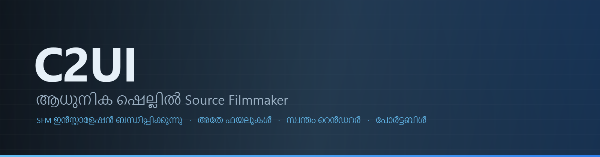

<p align="center"></p>

<details align="center"><summary>&nbsp;🌐 <b>🇮🇳 മലയാളം</b> &nbsp;·&nbsp; <sub>Language · Язык · 語言 · Idioma · Sprache · भाषा · لغة</sub></summary>

<table align="center">
<tr><td align="center"><a href="../../README.md">🇷🇺<br>Русский</a></td><td align="center"><a href="EN-en.md">🇬🇧<br>English</a></td><td align="center"><a href="PL-pl.md">🇵🇱<br>Polski</a></td><td align="center"><a href="UK-ua.md">🇺🇦<br>Українська</a></td><td align="center"><a href="DE-de.md">🇩🇪<br>Deutsch</a></td><td align="center"><a href="RO-md.md">🇲🇩<br>Moldovenească</a></td><td align="center"><a href="SL-si.md">🇸🇮<br>Slovenščina</a></td><td align="center"><a href="BE-by.md">🇧🇾<br>Беларуская</a></td></tr>
<tr><td align="center"><a href="KK-kz.md">🇰🇿<br>Қазақша</a></td><td align="center"><a href="JA-jp.md">🇯🇵<br>日本語</a></td><td align="center"><a href="ZH-cn.md">🇨🇳<br>中文</a></td><td align="center"><a href="SV-se.md">🇸🇪<br>Svenska</a></td><td align="center"><a href="ES-es.md">🇪🇸<br>Español</a></td><td align="center"><a href="HI-in.md">🇮🇳<br>हिन्दी</a></td><td align="center"><a href="PT-pt.md">🇵🇹<br>Português</a></td><td align="center"><a href="BN-bd.md">🇧🇩<br>বাংলা</a></td></tr>
<tr><td align="center"><a href="FR-fr.md">🇫🇷<br>Français</a></td><td align="center"><a href="TE-in.md">🇮🇳<br>తెలుగు</a></td><td align="center"><a href="MR-in.md">🇮🇳<br>मराठी</a></td><td align="center"><a href="TA-in.md">🇮🇳<br>தமிழ்</a></td><td align="center"><a href="TR-tr.md">🇹🇷<br>Türkçe</a></td><td align="center"><a href="UR-pk.md">🇵🇰<br>اردو</a></td><td align="center"><a href="VI-vn.md">🇻🇳<br>Tiếng Việt</a></td><td align="center"><a href="GU-in.md">🇮🇳<br>ગુજરાતી</a></td></tr>
<tr><td align="center"><a href="IT-it.md">🇮🇹<br>Italiano</a></td><td align="center"><a href="KO-kr.md">🇰🇷<br>한국어</a></td><td align="center"><a href="AR-sa.md">🇸🇦<br>العربية</a></td><td align="center"><a href="JV-id.md">🇮🇩<br>Basa Jawa</a></td><td align="center"><b>🇮🇳<br>മലയാളം</b></td><td align="center"><a href="NE-np.md">🇳🇵<br>नेपाली</a></td><td align="center"><a href="UZ-uz.md">🇺🇿<br>Oʻzbekcha</a></td><td align="center"><a href="OR-in.md">🇮🇳<br>ଓଡ଼ିଆ</a></td></tr>
</table>

</details>

<p align="center">
  
  
  
  
  <a href="../../Testing"></a>
  
</p>

<p align="center"><b>C2UI</b> — <i>Custom to User Interface</i> — — ആധുനിക ഷെല്ലിലുള്ള Source Filmmaker എഡിറ്റർ: അതേ ഉള്ളടക്കം, അതേ സെഷൻ ഫോർമാറ്റ്, അതേ ഡേറ്റാ മോഡൽ, Steam ലൈബ്രറിയുടെയും Unreal Engine 5 എഡിറ്ററിന്റെയും ശൈലിയിലുള്ള ഇന്റർഫേസ്.</p>

---

## തയ്യാറെടുപ്പ്

<p align="center"></p>

<p align="center"> <b>റിലീസിനുള്ള മൊത്തം തയ്യാറെടുപ്പ്: 44%</b></p>

<p align="center"><a href="../assets/ML-in/sidebar.md"></a></p>

## ആശയം

Source Filmmaker ശക്തമായ ഒരു ഉപകരണമാണ്, പക്ഷേ അതിന്റെ ഇന്റർഫേസ് 2012-ൽ തന്നെ നിൽക്കുന്നു. C2UI അതിനെ മാറ്റിസ്ഥാപിക്കുകയോ പുനർനിർമ്മിക്കുകയോ ചെയ്യുന്നില്ല: ലക്ഷ്യം SFM-നെ അൽപ്പം കൂടി ആധുനികവും സൗകര്യപ്രദവുമാക്കുക മാത്രം.

എഡിറ്റർ ഇൻസ്റ്റാൾ ചെയ്ത SFM കണ്ടെത്തി, അതിനെ ഉള്ളടക്ക ലൈബ്രറിയായി ബന്ധിപ്പിക്കുന്നു — മോഡലുകൾ, മെറ്റീരിയലുകൾ, ടെക്സ്ചറുകൾ, സെഷനുകൾ — അതേ ഫയലുകളുമായി അതേ ഫോർമാറ്റിൽ പ്രവർത്തിക്കുന്നു. SFM-ൽ ഉണ്ടാക്കിയതെല്ലാം C2UI-ൽ തുറക്കും, തിരിച്ചും.

ആദ്യ ലക്ഷ്യം എല്ലുകളും റിഗുകളും ഉൾപ്പെടെ SFM-മായി പൂർണ്ണ അനുയോജ്യത. പിന്നെ — SFM-ൽ ഇല്ലാതിരുന്നവ.

```
  ┌──────────────┐    "SFM എവിടെ?"    ┌──────────────────────────────┐
  │   C2UI       │ ─────────────────────▶│  SourceFilmmaker/game/       │
  │              │                       │    usermod/gameinfo.txt      │
  │  സ്വന്തം UI    │ ◀─────   മൗണ്ട്    ───────│    tf/  hl2/  tf_movies/ …   │
  │  സ്വന്തം റെൻഡർ │      വായന മാത്രം       │    models/ materials/ dmx    │
  └──────────────┘                       └──────────────────────────────┘
```

<p align="center"><br><sub>ഇന്നത്തെ എഡിറ്റർ, Valve-ന്റെ Meet the Heavy തുറന്ന്: ടൈംലൈനിൽ ഷോട്ടുകളും ശബ്ദവും, സെഷൻ ട്രീ, സ്വന്തം കാമറയിലൂടെ ആദ്യ ഷോട്ട്, സെഷൻ പറയുന്നതുപോലെ പോസും മുഖഭാവവുമുള്ള കഥാപാത്രങ്ങൾ.</sub></p>

## വ്യത്യാസം എന്ത്

- **പോർട്ടബിൾ.** ആപ്ലിക്കേഷൻ ഫോൾഡറിന് പുറത്ത് ഒന്നും എഴുതുന്നില്ല: സെറ്റിംഗുകൾ `App/User`, കാഷ് `App/Cache`, താൽക്കാലികം `App/Temporary`. ഫോൾഡർ ഇല്ലാതാക്കൂ, ഒരു അടയാളവുമില്ല.
- **SFM ഒരിക്കലും പ്രവർത്തിപ്പിക്കുന്നില്ല.** നിയന്ത്രിക്കാൻ പ്രോസസ്സില്ല, പിടിച്ചെടുക്കാൻ വിൻഡോകളില്ല. ഇൻസ്റ്റാളേഷൻ ഒരു ഉള്ളടക്ക പാക്ക് പോലെ വായിക്കുന്നു.
- **ഫോർമാറ്റുകൾ പരിശോധിച്ചത്, ഊഹിച്ചതല്ല.** ഓരോ റീഡറും യഥാർത്ഥ ഇൻസ്റ്റാളേഷനുമായി ഒത്തുനോക്കി; ഫോർമാറ്റ് അപ്രതീക്ഷിതമായത് ചെയ്യുന്നിടത്ത് കോഡ് പറയുന്നു.
- **സേവ് കൃത്യമാണ്.** മാറ്റമില്ലാതെ വായിച്ച് എഴുതിയ സെഷൻ അതേ ഫയലാണ്.
- **എഞ്ചിന് ആശ്രിതത്വങ്ങളില്ല.** `Core/` ഉം മുഴുവൻ ടെസ്റ്റ് സ്യൂട്ടും ശുദ്ധ Python-ൽ ഓടുന്നു; വിൻഡോയ്ക്ക് മാത്രം Qt ഉം OpenGL ഉം വേണം.

## പ്രവർത്തിപ്പിക്കൽ

Windows, Python 3.13, Source Filmmaker ഇൻസ്റ്റാളേഷൻ ആവശ്യമാണ്.

```bash
git clone https://github.com/Arkomiko/SFM_C2UI.git
cd SFM_C2UI
python -m venv .venv
.venv/Scripts/python.exe -m pip install -r Tools/Launcher/requirements.txt
.venv/Scripts/python.exe Tools/Launcher/c2ui.py
```

ആദ്യ തുടക്കത്തിൽ Steam വഴി SFM തിരയുന്നു; കിട്ടിയില്ലെങ്കിൽ ചോദിക്കുന്നു. <kbd>Ctrl</kbd>+<kbd>O</kbd> സെഷൻ തുറക്കുന്നു, <kbd>Space</kbd> പ്ലേ, <kbd>C</kbd> ഷോട്ട് കാമറ, <kbd>T</kbd>/<kbd>R</kbd> മൂവ്/റൊട്ടേറ്റ്, <kbd>M</kbd> മോഷൻ എഡിറ്റർ, <kbd>Ctrl</kbd>+<kbd>Z</kbd> അൻഡു, <kbd>Ctrl</kbd>+<kbd>S</kbd> സേവ്. പാനലുകൾ തലക്കെട്ടിൽ പിടിച്ച് വലിക്കുന്നു. ടെസ്റ്റുകൾക്ക് ഒന്നും വേണ്ട:

```bash
python Testing/run.py
```

## ഘടന

```
C2UI_SDK/
├── README.md
├── Core/              എഞ്ചിൻ: ഫോർമാറ്റുകൾ, വെർച്വൽ ഫയൽ സിസ്റ്റം, സൂചിക, പാലങ്ങൾ
├── App/               എഡിറ്റർ: ഉള്ളടക്ക ലൈബ്രറി, റെൻഡറർ, വിൻഡോ
├── Tools/             പ്രാദേശികവൽക്കരണം, UI ഉപകരണങ്ങൾ, പ്ലഗിനുകൾ (പിന്നീട്)
│   └── Launcher/      ലോഞ്ചർ
├── Testing/           ടെസ്റ്റുകൾ, ബൈറ്റ്-കൃത്യ ഫിക്സ്ചറുകൾ, ഒരു റണ്ണർ
└── GIT&DOCK/          ഈ README മറ്റ് ഭാഷകളിൽ
```

## റോഡ്‌മാപ്പ്

1. **Source ഷേഡിംഗ്** — SFM വരയ്ക്കുന്നതുപോലെ VertexLitGeneric: phong, rim, lightwarp, രംഗ വെളിച്ചങ്ങൾ.
2. **മാപ്പുകൾ** — പശ്ചാത്തലത്തിന് `.bsp`.
3. **ഔട്ട്‌പുട്ട്** — ചിത്രവും വീഡിയോയും എക്സ്പോർട്ട്.
4. **പ്ലഗിനുകൾ** — `.c2plg` ഫോർമാറ്റ്; പിന്നെ തീമുകളും വർക്ക്‌സ്‌പേസുകളും.

## ലൈസൻസും കടപ്പാടും

C2UI-യുടെ സ്വന്തം കോഡ് **C2UI ലൈസൻസിന്** കീഴിലാണ്: വ്യക്തിഗതവും വാണിജ്യേതരവുമായ ഉപയോഗത്തിന് സ്വതന്ത്രം; വാണിജ്യ ഉപയോഗം രചയിതാവിന്റെ രേഖാമൂലമുള്ള സമ്മതത്തോടെ മാത്രം; പരിഷ്കരിച്ച പതിപ്പുകൾ യഥാർത്ഥ പ്രോജക്റ്റിനെയും രചയിതാവ് Arkomiko-യെയും പരാമർശിക്കണം. പ്ലഗിനുകളും ആഡ്ഓണുകളും **C2UI — Plugins & Addons (C2UI‑Pl&AD)** ലൈസൻസിന് കീഴിൽ.

Source Filmmaker, Team Fortress 2, Source എഞ്ചിൻ Valve-ന്റേതാണ്; പ്രോജക്റ്റ് അവയുടെ ഫോർമാറ്റുകൾ വായിക്കുന്നു, അവയുടെ ഫയലുകൾ ഉൾപ്പെടുത്തുന്നില്ല, Steam-ൽ നിന്നുള്ള നിങ്ങളുടെ സ്വന്തം SFM പകർപ്പുമായി മാത്രം പ്രവർത്തിക്കുന്നു.

<p align="center"><a href="../LICENSE/ML-in.md"></a></p>

<p align="center"><br><sub>ഇൻസ്റ്റാളേഷനിൽ നിന്ന് ക്രമരഹിതമായി തിരഞ്ഞെടുത്ത അറുപത്തിനാല് മോഡലുകൾ, C2UI-യുടെ സ്വന്തം റെൻഡറർ വരച്ചത്.</sub></p>
