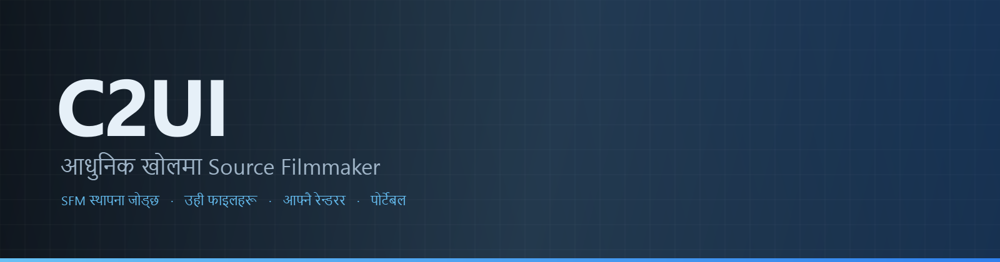

<p align="center"></p>

<p align="center"><a href="../../README.md">🇷🇺 Русский</a> · <a href="EN-en.md">🇬🇧 English</a> · <a href="PL-pl.md">🇵🇱 Polski</a> · <a href="UK-ua.md">🇺🇦 Українська</a> · <a href="DE-de.md">🇩🇪 Deutsch</a> · <a href="RO-md.md">🇲🇩 Moldovenească</a> · <a href="SL-si.md">🇸🇮 Slovenščina</a> · <a href="BE-by.md">🇧🇾 Беларуская</a> · <a href="KK-kz.md">🇰🇿 Қазақша</a> · <a href="JA-jp.md">🇯🇵 日本語</a> · <a href="ZH-cn.md">🇨🇳 中文</a> · <a href="SV-se.md">🇸🇪 Svenska</a> · <a href="ES-es.md">🇪🇸 Español</a> · <a href="HI-in.md">🇮🇳 हिन्दी</a> · <a href="PT-pt.md">🇵🇹 Português</a> · <a href="BN-bd.md">🇧🇩 বাংলা</a> · <a href="FR-fr.md">🇫🇷 Français</a> · <a href="TE-in.md">🇮🇳 తెలుగు</a> · <a href="MR-in.md">🇮🇳 मराठी</a> · <a href="TA-in.md">🇮🇳 தமிழ்</a> · <a href="TR-tr.md">🇹🇷 Türkçe</a> · <a href="UR-pk.md">🇵🇰 اردو</a> · <a href="VI-vn.md">🇻🇳 Tiếng Việt</a> · <a href="GU-in.md">🇮🇳 ગુજરાતી</a> · <a href="IT-it.md">🇮🇹 Italiano</a> · <a href="KO-kr.md">🇰🇷 한국어</a> · <a href="AR-sa.md">🇸🇦 العربية</a> · <a href="JV-id.md">🇮🇩 Basa Jawa</a> · <a href="ML-in.md">🇮🇳 മലയാളം</a> · <b>🇳🇵 नेपाली</b> · <a href="UZ-uz.md">🇺🇿 Oʻzbekcha</a> · <a href="OR-in.md">🇮🇳 ଓଡ଼ିଆ</a></p>

<p align="center">
  
  
  
  
  <a href="../../Testing"></a>
  
</p>

<p align="center"><b>C2UI</b> — <i>Custom to User Interface</i> — — आधुनिक खोलमा Source Filmmaker को सम्पादक: उही सामग्री, उही सेसन ढाँचा, उही डेटा मोडेल, र Steam पुस्तकालय तथा Unreal Engine 5 सम्पादकको शैलीको इन्टरफेस।</p>

---

## तयारी

<p align="center"></p>

<p align="center"> <b>रिलिजका लागि समग्र तयारी: 41%</b></p>

<p align="center"><a href="../assets/NE-np/sidebar.md"></a></p>

## विचार

Source Filmmaker एक बलियो उपकरण हो जसको इन्टरफेस २०१२ मै रह्यो। C2UI ले यसलाई प्रतिस्थापन वा पुनर्निर्माण गर्दैन: लक्ष्य केवल SFM लाई अलि आधुनिक र सहज बनाउनु हो।

सम्पादकले स्थापित SFM फेला पार्छ, यसलाई सामग्री पुस्तकालयका रूपमा जोड्छ — मोडेल, सामग्री, टेक्सचर, सेसन — र उही फाइलहरूसँग उही ढाँचामा काम गर्छ। SFM मा बनेको सबै C2UI मा खुल्छ, र उल्टो पनि।

पहिलो लक्ष्य हड्डी र रिगसहित SFM सँग पूर्ण अनुकूलता हो। त्यसपछि — SFM मा जे कमी थियो।

```
  ┌──────────────┐    "SFM कहाँ?"    ┌──────────────────────────────┐
  │   C2UI       │ ─────────────────────▶│  SourceFilmmaker/game/       │
  │              │                       │    usermod/gameinfo.txt      │
  │  आफ्नै UI     │ ◀─────   माउन्ट   ───────│    tf/  hl2/  tf_movies/ …   │
  │  आफ्नै रेन्डर  │       पढ्ने मात्र       │    models/ materials/ dmx    │
  └──────────────┘                       └──────────────────────────────┘
```

<p align="center"><br><sub>आजको सम्पादक, Valve को Meet the Heavy खोलिएको: टाइमलाइनमा शट र आवाज, सेसन ट्री, पहिलो शट आफ्नै क्यामेराबाट, सेसनअनुसार पोज र अनुहार भएका पात्रहरू।</sub></p>

## के फरक छ

- **पोर्टेबल।** एप्लिकेसन फोल्डरबाहिर केही लेखिँदैन: सेटिङ `App/User` मा, क्यास `App/Cache` मा, अस्थायी `App/Temporary` मा। फोल्डर मेट्नुहोस्, कुनै छाप छैन।
- **SFM कहिल्यै चलाउँदैन।** चलाउने प्रोसेस छैन, कब्जा गर्ने विन्डो छैन। स्थापना सामग्री प्याकजस्तै पढिन्छ।
- **ढाँचा प्रमाणित, अनुमानित होइन।** हरेक रिडर वास्तविक स्थापनासँग जाँचिएको; ढाँचाले अनपेक्षित गर्ने ठाउँमा कोड बताउँछ।
- **सेभ सटीक छ।** नबदलेर पढिएको र लेखिएको सेसन उही फाइल हो।
- **इन्जिनको कुनै निर्भरता छैन।** `Core/` र सम्पूर्ण परीक्षण सुइट शुद्ध Python मा चल्छ; विन्डोलाई मात्र Qt र OpenGL चाहिन्छ।

## चलाउने

Windows, Python 3.13 र Source Filmmaker स्थापना आवश्यक।

```bash
git clone https://github.com/Arkomiko/SFM_C2UI.git
cd SFM_C2UI
python -m venv .venv
.venv/Scripts/python.exe -m pip install -r Tools/Launcher/requirements.txt
.venv/Scripts/python.exe Tools/Launcher/c2ui.py
```

पहिलो पटक Steam मार्फत SFM खोज्छ; नपाए सोध्छ। <kbd>Ctrl</kbd>+<kbd>O</kbd> सेसन खोल्छ, <kbd>Space</kbd> प्ले, <kbd>C</kbd> शट क्यामेरा, <kbd>T</kbd>/<kbd>R</kbd> मुभ/रोटेट, <kbd>M</kbd> मोशन सम्पादक, <kbd>Ctrl</kbd>+<kbd>Z</kbd> अन्डु, <kbd>Ctrl</kbd>+<kbd>S</kbd> सेभ। प्यानल शीर्षकबाट तानिन्छन्। परीक्षणलाई केही चाहिँदैन:

```bash
python Testing/run.py
```

## संरचना

```
C2UI_SDK/
├── README.md
├── Core/              इन्जिन: ढाँचा, भर्चुअल फाइल प्रणाली, सूचकांक, पुल
├── App/               सम्पादक: सामग्री पुस्तकालय, रेन्डरर, विन्डो
├── Tools/             स्थानीयकरण, UI उपकरण, प्लगइन (पछि)
│   └── Launcher/      लन्चर
├── Testing/           परीक्षण, बाइट-सटीक फिक्स्चर, एक रनर
└── GIT&DOCK/          यो README अन्य भाषामा
```

## रोडम्याप

१. **Source शेडिङ** — SFM ले कोरेजस्तै VertexLitGeneric: phong, rim, lightwarp, दृश्य प्रकाश।
२. **नक्सा** — पृष्ठभूमिका लागि `.bsp`।
३. **आउटपुट** — तस्बिर र भिडियो निर्यात।
४. **प्लगइन** — `.c2plg` ढाँचा; त्यसपछि थिम र कार्यस्थान।

## इजाजतपत्र र आभार

C2UI को आफ्नै कोड **C2UI इजाजतपत्र** अन्तर्गत छ: व्यक्तिगत र गैर-व्यावसायिक प्रयोगका लागि स्वतन्त्र; व्यावसायिक प्रयोग लेखकको लिखित सहमतिमा मात्र; परिमार्जित संस्करणहरूले मूल परियोजना र यसका लेखक Arkomiko उल्लेख गर्नुपर्छ। प्लगइन र एडअन **C2UI — Plugins & Addons (C2UI‑Pl&AD)** इजाजतपत्र अन्तर्गत।

Source Filmmaker, Team Fortress 2 र Source इन्जिन Valve का हुन्; परियोजनाले तिनका ढाँचा पढ्छ, तिनको कुनै फाइल समावेश गर्दैन, र Steam बाट तपाईंको आफ्नै SFM प्रतिसँग मात्र काम गर्छ।

<p align="center"><a href="../LICENSE/NE-np.md"></a></p>

<p align="center"><br><sub>स्थापनाबाट अनियमित छानिएका चौसठ्ठी मोडेल, C2UI को आफ्नै रेन्डररले कोरेका।</sub></p>
