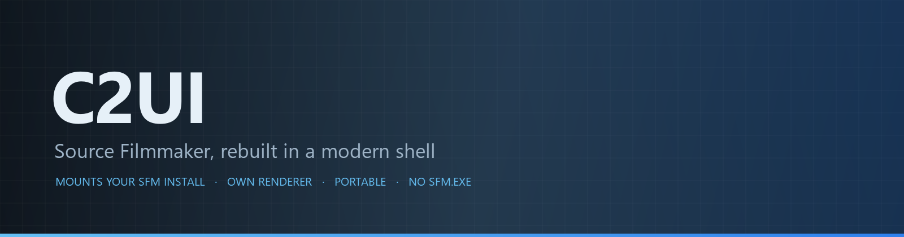
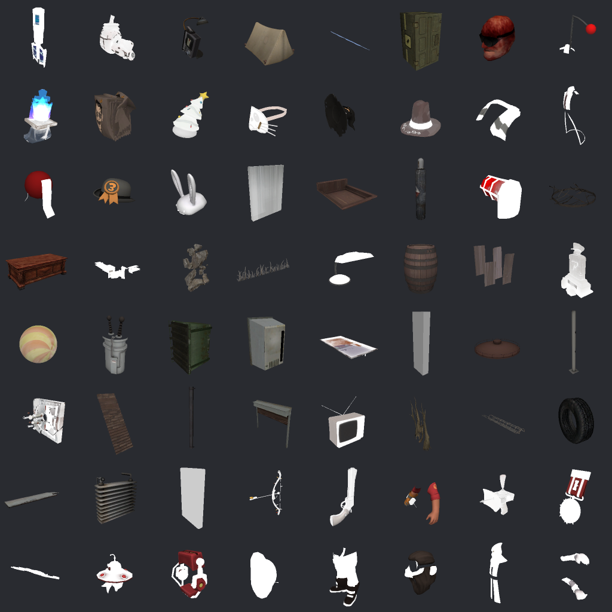

<p align="center"></p>

<p align="center"><a href="../../README.md">🇷🇺 Русский</a> · <a href="EN-en.md">🇬🇧 English</a> · <a href="PL-pl.md">🇵🇱 Polski</a> · <a href="UK-ua.md">🇺🇦 Українська</a> · <a href="DE-de.md">🇩🇪 Deutsch</a> · <a href="RO-md.md">🇲🇩 Moldovenească</a> · <a href="SL-si.md">🇸🇮 Slovenščina</a> · <a href="BE-by.md">🇧🇾 Беларуская</a> · <a href="KK-kz.md">🇰🇿 Қазақша</a> · <a href="JA-jp.md">🇯🇵 日本語</a> · <a href="ZH-cn.md">🇨🇳 中文</a> · <a href="SV-se.md">🇸🇪 Svenska</a> · <a href="ES-es.md">🇪🇸 Español</a> · <a href="HI-in.md">🇮🇳 हिन्दी</a> · <a href="PT-pt.md">🇵🇹 Português</a> · <a href="BN-bd.md">🇧🇩 বাংলা</a> · <a href="FR-fr.md">🇫🇷 Français</a> · <a href="TE-in.md">🇮🇳 తెలుగు</a> · <a href="MR-in.md">🇮🇳 मराठी</a> · <a href="TA-in.md">🇮🇳 தமிழ்</a> · <a href="TR-tr.md">🇹🇷 Türkçe</a> · <a href="UR-pk.md">🇵🇰 اردو</a> · <a href="VI-vn.md">🇻🇳 Tiếng Việt</a> · <a href="GU-in.md">🇮🇳 ગુજરાતી</a> · <a href="IT-it.md">🇮🇹 Italiano</a> · <a href="KO-kr.md">🇰🇷 한국어</a> · <a href="AR-sa.md">🇸🇦 العربية</a> · <a href="JV-id.md">🇮🇩 Basa Jawa</a> · <a href="ML-in.md">🇮🇳 മലയാളം</a> · <a href="NE-np.md">🇳🇵 नेपाली</a> · <a href="UZ-uz.md">🇺🇿 Oʻzbekcha</a> · <b>🇮🇳 ଓଡ଼ିଆ</b></p>

<p align="center">
  
  
  
  
  <a href="../../Testing"></a>
  
</p>

<p align="center"><b>C2UI</b> — <i>Custom to User Interface</i> — Source Filmmaker ଏଡିଟରର ମୋର ପୁନଃନିର୍ମାଣ: ସମାନ କଣ୍ଟେଣ୍ଟ, ସମାନ ସେସନ ଫର୍ମାଟ, ସମାନ ଡାଟା ମଡେଲ — ଏକ ଶେଲ ଭିତରେ ଯାହା Steam ଲାଇବ୍ରେରୀରୁ ରୂପ ଏବଂ Unreal Engine 5 ଏଡିଟରରୁ ଲେଆଉଟ ନେଇଛି।</p>

---

## ଧାରଣା

Source Filmmaker ୨୦୧୨ ଇଣ୍ଟରଫେସରେ ଏକ ଉତ୍ତମ ଉପକରଣ। ମୁଁ `sfm.exe` ଉପରେ ସ୍କିନ ଲଗାଇବାକୁ ଚାହେଁ ନାହିଁ, ଏବଂ ଏହାର ୱିଣ୍ଡୋ ଗୋଟିଏ ଗୋଟିଏ କରି ଅଧିକାର କରିବାକୁ ମଧ୍ୟ ଚାହେଁ ନାହିଁ। ମୁଁ ଏପରି ଏଡିଟର ଚାହେଁ ଯାହା **SFM କେଉଁଠି ଇନ୍‌ଷ୍ଟଲ ଅଛି ପଚାରେ**, ସେହି ଇନ୍‌ଷ୍ଟଲେସନକୁ Garry's Mod ଯେପରି Counter-Strike ମାଉଣ୍ଟ କରେ ସେପରି ମାଉଣ୍ଟ କରେ, ଏବଂ ସେହି ଫାଇଲ ଉପରେ ସବୁ ନିଜେ କରେ — ମଡେଲ, ମ୍ୟାଟେରିଆଲ, ଟେକ୍ସଚର, ସେସନ, ଆନିମେସନ — SFM କେବେ ଚଲାଇ ନ ଦେଇ।

ଲକ୍ଷ୍ୟ **SFM ସହ ଏକ-ଏକ ଫିଚର ସମାନତା** (ହାଡ ଓ ରିଗ ସହିତ), ତାପରେ ଯାହା SFM କେବେ ପାଇନଥିଲା।

```
  ┌──────────────┐    "SFM କେଉଁଠି?"    ┌──────────────────────────────┐
  │   C2UI       │ ─────────────────────▶│  SourceFilmmaker/game/       │
  │              │                       │    usermod/gameinfo.txt      │
  │  ନିଜ UI      │ ◀─────   ମାଉଣ୍ଟ   ───────│    tf/  hl2/  tf_movies/ …   │
  │  ନିଜ ରେଣ୍ଡର   │      କେବଳ ପଢ଼ିବା       │    models/ materials/ dmx    │
  └──────────────┘                       └──────────────────────────────┘
```

## ପ୍ରସ୍ତୁତି

<p align="center"> <b>ରିଲିଜ ପାଇଁ ସମୁଦାୟ ପ୍ରସ୍ତୁତି: 38%</b></p>

<p align="center"><br><sub>ଆଜିର ଏଡିଟର, Valve ର Meet the Heavy ଖୋଲା: ଟାଇମଲାଇନରେ ଶଟ ଓ ଶବ୍ଦ, ସେସନ ଟ୍ରୀ, ପ୍ରଥମ ଶଟ ନିଜ କ୍ୟାମେରାରୁ, ସେସନ ଅନୁସାରେ ପୋଜ ଓ ମୁହଁ ସହ ଚରିତ୍ର।</sub></p>

ଠିକ୍ କଣ ହୋଇଛି ଓ କଣ ହୋଇନାହିଁ ଦେଖିବାକୁ ଏକ କ୍ଷେତ୍ର ଖୋଲନ୍ତୁ। ପ୍ରତିଶତ SFM କଣ କରିପାରେ ତାହା ତୁଳନାରେ ମୋର ସଚ୍ଚୋଟ ଆକଳନ।

<details><summary> <b>SFM ଖୋଜିବା ଓ ମାଉଣ୍ଟ କରିବା</b></summary>

Steam ରେଜିଷ୍ଟ୍ରି → `libraryfolders.vdf` → `gameinfo.txt` ର ସର୍ଚ ପାଥ, ଇଞ୍ଜିନ କ୍ରମରେ। ମାନକ ଇନ୍‌ଷ୍ଟଲରେ ଛଅ ମାଉଣ୍ଟ। ଆପ୍ଲିକେସନ ଫୋଲ୍ଡର ବାହାରେ କିଛି ଲେଖା ହୁଏ ନାହିଁ।

</details>
<details><summary> <b>କଣ୍ଟେଣ୍ଟ ଇଣ୍ଡେକ୍ସ</b></summary>

୭୦ ୧୯୯ ଫାଇଲ ୧.୧ ସେ ଥଣ୍ଡା / ୦.୦୨ ସେ କ୍ୟାସରୁ; ମାଉଣ୍ଟ ମଧ୍ୟରେ ଓଭରରାଇଡ ଇଞ୍ଜିନ ପରି ସମାଧାନ।

</details>
<details><summary> <b>ମଡେଲ — <code></code> <code></code> <code></code></b></summary>

ସଂସ୍କରଣ ୪୪, ୪୮, ୪୯। କଙ୍କାଳ, ମେସ, ସବୁ ବିବରଣୀ ସ୍ତର, ବଡି ଗ୍ରୁପ। ୧ ୫୦୦ ମଡେଲ ଲୋଡ, ୦ ବିଫଳତା।

</details>
<details><summary> <b>ମ୍ୟାଟେରିଆଲ — <code></code></b></summary>

ସବୁ ୧୯ ୫୫୪ ମ୍ୟାଟେରିଆଲ ପଢ଼ାହୁଏ; `patch`, DX ବ୍ଲକ, ପ୍ରକ୍ସି।

</details>
<details><summary> <b>ଟେକ୍ସଚର — <code></code></b></summary>

ସଂସ୍କରଣ ୭.୦–୭.୫, DXT1/3/5 ଓ ସବୁ ଅସଙ୍କୁଚିତ ଫର୍ମାଟ, କ୍ୟୁବମ୍ୟାପ, ମିପ। DXT ଡିକୋଡ ବିନା GPU କୁ ଯାଏ।

</details>
<details><summary> <b>ସେସନ — <code></code></b></summary>

ବାଇନାରୀ ୧–୫ ଓ KeyValues2। ଇନ୍‌ଷ୍ଟଲର ପ୍ରତ୍ୟେକ ସେସନ ଓ ପାର୍ଟିକଲ ଫାଇଲ **ବାଇଟ ବାଇଟ** ଫେରି ଲେଖାହୁଏ।

</details>
<details><summary> <b>ସ୍କ୍ରିନରେ ସେସନ</b></summary>

ଟାଇମଲାଇନରେ ଶଟ ଓ ସାଉଣ୍ଡ ଟ୍ରାକ, ଏଲିମେଣ୍ଟ ଟ୍ରୀ, ପ୍ରତ୍ୟେକ ଶଟର ଦୃଶ୍ୟ ନିଜ କ୍ୟାମେରାରୁ। ଏବେ ନାହିଁ: ମ୍ୟାପ, ପାର୍ଟିକଲ, ଶବ୍ଦ।

</details>
<details><summary> <b>ଆନିମେସନ</b></summary>

କର୍ସରରେ ଚ୍ୟାନେଲ ଓ ଲଗ ମୂଲ୍ୟାୟନ; ସ୍କ୍ରବ ଓ ପ୍ଲେ। ହାଡ, କ୍ୟାମେରା ଓ ଦୃଶ୍ୟତା ସେସନ ଅନୁସରଣ କରେ।

</details>
<details><summary> <b>ମୁହଁ</b></summary>

Flex କଣ୍ଟ୍ରୋଲର, କମ୍ପାଇଲ ନିୟମ ଓ ଭର୍ଟେକ୍ସ ଆନିମେସନ — ଚରିତ୍ର କଥା ହୁଅନ୍ତି ଓ ଭାବ ଦେଖାନ୍ତି। ଏବେ ନାହିଁ: ଲୋଚା ମ୍ୟାପ।

</details>
<details><summary> <b>ରିଗ</b></summary>

ଏକ୍ସପ୍ରେସନ, point/orient/parent/aim କନ୍‌ଷ୍ଟ୍ରେଣ୍ଟ, ଦୁଇ-ହାଡ IK। ଏବେ ନାହିଁ: ପୂର୍ଣ୍ଣ ଅପରେଟର ନିର୍ଭରତା ଗ୍ରାଫ, ରିଗ ନିର୍ମାଣ।

</details>
<details><summary> <b>ସମ୍ପାଦନା</b></summary>

କ୍ଲିକରେ ଚୟନ, ମୁଭ/ରୋଟେଟ ମ୍ୟାନିପୁଲେଟର, ଯେକୌଣସି ଆଟ୍ରିବ୍ୟୁଟର ଇନ୍‌ସ୍ପେକ୍ଟର, କର୍ସରରେ କି, ଅନଡୁ/ରିଡୁ, ବାଇଟ-ସଠିକ ସେଭ। ଏବେ ନାହିଁ: ଗ୍ରାଫ ଏଡିଟର।

</details>
<details><summary> <b>ମୋସନ ଏଡିଟର</b></summary>

ରୁଲରରେ ହୋଲ୍ଡ ଓ ଫଲଅଫ ସହ ସମୟ ଚୟନ; ସମ୍ପାଦନା SFM ପରି ତାହା ଉପରେ ବ୍ୟାପେ। ଏବେ ନାହିଁ: ପ୍ରିସେଟ, ଲେୟର।

</details>
<details><summary> <b>ପ୍ୟାନେଲ ଡକିଂ</b></summary>

UE5 ଓ Visual Studio ପରି, ପ୍ରିଭ୍ୟୁ ସହ ଲକ୍ଷ୍ୟ କମ୍ପାସରେ ପ୍ୟାନେଲ ଟାଣନ୍ତୁ। ଏବେ ନାହିଁ: ସେଭ ଲେଆଉଟ, ଥିମ।

</details>
<details><summary> <b>Source ସେଡିଂ</b></summary>

କେବଳ ଟେକ୍ସଚର ଓ ସରଳ ଆଲୋକ। ଏବେ ନାହିଁ: phong, rim, lightwarp, ଦୃଶ୍ୟ ଆଲୋକ, ଛାଇ।

</details>
<details><summary> <b>ମ୍ୟାପ — <code></code></b></summary>

ଆରମ୍ଭ ହୋଇନାହିଁ।

</details>
<details><summary> <b>ଚିତ୍ର ଓ ଭିଡିଓରେ ରେଣ୍ଡର</b></summary>

ଆରମ୍ଭ ହୋଇନାହିଁ।

</details>
<details><summary> <b>ପ୍ଲଗଇନ <code></code></b></summary>

ଆରମ୍ଭ ହୋଇନାହିଁ।

</details>
<details><summary> <b>ଥିମ ଓ ୱାର୍କସ୍ପେସ</b></summary>

ଜାଣିଶୁଣି ପରେ: ଏଡିଟରରେ ସଜାଇବା ଯୋଗ୍ୟ କିଛି ନ ଆସିବା ପର୍ଯ୍ୟନ୍ତ ଗୋଟିଏ ରୂପ।

</details>

**ରିଲିଜ ପାଇଁ ପ୍ରସ୍ତୁତ ନୁହେଁ।** ମୂଳଦୁଆ — SFM ବ୍ୟବହାର କରୁଥିବା ପ୍ରତ୍ୟେକ ଫାଇଲ ଫର୍ମାଟ, ଠିକ୍ ପଢ଼ା ଓ ସମ୍ପୂର୍ଣ୍ଣ ଇନ୍‌ଷ୍ଟଲେସନରେ ଯାଞ୍ଚ — ଅଛି ଓ ପରୀକ୍ଷିତ; ସେସନ ଖୋଲି, ଚଲାଇ, ବଦଳାଇ ଓ ସେଭ କରିହେବ। ଅଭାବ କାମର *ସୁବିଧା*: ଗ୍ରାଫ ଏଡିଟର, Source ସେଡିଂ, ମ୍ୟାପ, ଏକ୍ସପୋର୍ଟ। ଆନିମେଟର ଏଥିରେ ଏକ ଦିନର କାମ କରି ନ ପାରିବା ପର୍ଯ୍ୟନ୍ତ ସଂସ୍କରଣ ନମ୍ବର ନାହିଁ।

## କଣ ଭିନ୍ନ

- **ପୋର୍ଟେବଲ।** ଆପ୍ଲିକେସନ ଫୋଲ୍ଡର ବାହାରେ କିଛି ଲେଖା ହୁଏ ନାହିଁ: ସେଟିଂ `App/User`, କ୍ୟାସ `App/Cache`, ଅସ୍ଥାୟୀ `App/Temporary`। ଫୋଲ୍ଡର ଡିଲିଟ କରନ୍ତୁ, କୌଣସି ଚିହ୍ନ ନାହିଁ।
- **SFM କେବେ ଚଲାଏ ନାହିଁ।** ଚଲାଇବାକୁ ପ୍ରୋସେସ ନାହିଁ, ଅଧିକାର କରିବାକୁ ୱିଣ୍ଡୋ ନାହିଁ। ଇନ୍‌ଷ୍ଟଲେସନ କଣ୍ଟେଣ୍ଟ ପ୍ୟାକ ପରି ପଢ଼ାହୁଏ।
- **ଫର୍ମାଟ ଯାଞ୍ଚିତ, ଅନୁମାନିତ ନୁହେଁ।** ପ୍ରତ୍ୟେକ ରିଡର ପ୍ରକୃତ ଇନ୍‌ଷ୍ଟଲେସନ ସହ ଯାଞ୍ଚ; ଫର୍ମାଟ ଅପ୍ରତ୍ୟାଶିତ କଲେ କୋଡ କହେ।
- **ସେଭ ସଠିକ।** ନ ବଦଳାଇ ପଢ଼ା ଓ ଲେଖା ସେସନ ସମାନ ଫାଇଲ।
- **ଇଞ୍ଜିନର ନିର୍ଭରତା ନାହିଁ।** `Core/` ଓ ସମ୍ପୂର୍ଣ୍ଣ ଟେଷ୍ଟ ସୁଟ ଶୁଦ୍ଧ Python ରେ ଚଳେ; କେବଳ ୱିଣ୍ଡୋକୁ Qt ଓ OpenGL ଦରକାର।

## ଚଲାଇବା

Windows, Python 3.13 ଓ Source Filmmaker ଇନ୍‌ଷ୍ଟଲେସନ ଆବଶ୍ୟକ।

```bash
git clone https://github.com/Arkomiko/SFM_C2UI.git
cd SFM_C2UI
python -m venv .venv
.venv/Scripts/python.exe -m pip install -r requirements.txt
.venv/Scripts/python.exe c2ui.py
```

ପ୍ରଥମ ଥର Steam ଦ୍ୱାରା SFM ଖୋଜେ; ନ ମିଳିଲେ ପଚାରେ। <kbd>Ctrl</kbd>+<kbd>O</kbd> ସେସନ ଖୋଲେ, <kbd>Space</kbd> ପ୍ଲେ, <kbd>C</kbd> ଶଟ କ୍ୟାମେରା, <kbd>T</kbd>/<kbd>R</kbd> ମୁଭ/ରୋଟେଟ, <kbd>M</kbd> ମୋସନ ଏଡିଟର, <kbd>Ctrl</kbd>+<kbd>Z</kbd> ଅନଡୁ, <kbd>Ctrl</kbd>+<kbd>S</kbd> ସେଭ। ପ୍ୟାନେଲ ଶୀର୍ଷକରୁ ଟାଣାହୁଏ। ପରୀକ୍ଷାକୁ କିଛି ଦରକାର ନାହିଁ:

```bash
python Testing/run.py
```

## ଗଠନ

```
C2UI_SDK/
├── c2ui.py            ଲଞ୍ଚର
├── Core/              ଇଞ୍ଜିନ: ଫର୍ମାଟ, ଭର୍ଚୁଆଲ ଫାଇଲ ସିଷ୍ଟମ, ଇଣ୍ଡେକ୍ସ, ବ୍ରିଜ
├── App/               ଏଡିଟର: କଣ୍ଟେଣ୍ଟ ଲାଇବ୍ରେରୀ, ରେଣ୍ଡରର, ୱିଣ୍ଡୋ
├── Tools/             ସ୍ଥାନୀୟକରଣ, UI ଉପକରଣ, ପ୍ଲଗଇନ (ପରେ)
├── Testing/           ପରୀକ୍ଷା, ବାଇଟ-ସଠିକ ଫିକ୍ସଚର, ଏକ ରନର
└── GIT&DOCK/README/   ଏହି README ଅନ୍ୟ ଭାଷାରେ
```

## ରୋଡମ୍ୟାପ

୧. **ଗ୍ରାଫ ଏଡିଟର** — ବକ୍ର ଓ କି, ଆଖି ଆଗରେ।
୨. **Source ସେଡିଂ** — SFM ଆଙ୍କିବା ପରି VertexLitGeneric: phong, rim, lightwarp, ଦୃଶ୍ୟ ଆଲୋକ।
୩. **ମ୍ୟାପ** — ପୃଷ୍ଠଭୂମି ପାଇଁ `.bsp`।
୪. **ଆଉଟପୁଟ** — ଚିତ୍ର ଓ ଭିଡିଓ ଏକ୍ସପୋର୍ଟ।
୫. **ପ୍ଲଗଇନ** — `.c2plg` ଫର୍ମାଟ; ତାପରେ ଥିମ ଓ ୱାର୍କସ୍ପେସ।

## ଲାଇସେନ୍ସ ଓ କୃତଜ୍ଞତା

Source Filmmaker, Team Fortress 2 ଓ Source ଇଞ୍ଜିନ Valve ର। ଏହି ପ୍ରୋଜେକ୍ଟ ସେମାନଙ୍କ ଫାଇଲ ଫର୍ମାଟ ପଢ଼େ, ସେମାନଙ୍କ କୌଣସି ଫାଇଲ ଅନ୍ତର୍ଭୁକ୍ତ କରେ ନାହିଁ, ଓ କେବଳ Steam ଦ୍ୱାରା ଆପଣଙ୍କ ନିଜ SFM କପି ସହ କାମ କରେ।

C2UI ର ନିଜ କୋଡର ଲାଇସେନ୍ସ ଏବେ ବଛା ହୋଇନାହିଁ — ସେ ପର୍ଯ୍ୟନ୍ତ ସର୍ବସ୍ୱତ୍ୱ ସଂରକ୍ଷିତ। Issues ଓ pull requests ସ୍ୱାଗତ।

<p align="center"><br><sub>ଇନ୍‌ଷ୍ଟଲେସନରୁ ଅନିୟମିତ ବଛା ଚଉଷଠି ମଡେଲ, C2UI ର ନିଜ ରେଣ୍ଡରର ଆଙ୍କିଛି।</sub></p>
