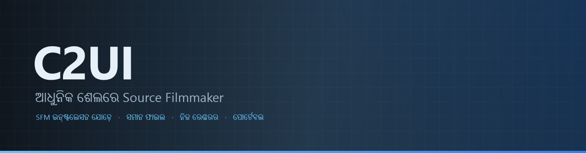

<details align="center"><summary>&nbsp;🌐 <b>🇮🇳 ଓଡ଼ିଆ</b> &nbsp;·&nbsp; <sub>Language · Язык · 語言 · Idioma · Sprache · भाषा · لغة</sub></summary>

<table align="center">
<tr><td align="center"><a href="../../README.md">🇷🇺<br>Русский</a></td><td align="center"><a href="../README/EN-en.md">🇬🇧<br>English</a></td><td align="center"><a href="../README/PL-pl.md">🇵🇱<br>Polski</a></td><td align="center"><a href="../README/UK-ua.md">🇺🇦<br>Українська</a></td><td align="center"><a href="../README/DE-de.md">🇩🇪<br>Deutsch</a></td><td align="center"><a href="../README/RO-md.md">🇲🇩<br>Moldovenească</a></td><td align="center"><a href="../README/SL-si.md">🇸🇮<br>Slovenščina</a></td><td align="center"><a href="../README/BE-by.md">🇧🇾<br>Беларуская</a></td></tr>
<tr><td align="center"><a href="../README/KK-kz.md">🇰🇿<br>Қазақша</a></td><td align="center"><a href="../README/JA-jp.md">🇯🇵<br>日本語</a></td><td align="center"><a href="../README/ZH-cn.md">🇨🇳<br>中文</a></td><td align="center"><a href="../README/SV-se.md">🇸🇪<br>Svenska</a></td><td align="center"><a href="../README/ES-es.md">🇪🇸<br>Español</a></td><td align="center"><a href="../README/HI-in.md">🇮🇳<br>हिन्दी</a></td><td align="center"><a href="../README/PT-pt.md">🇵🇹<br>Português</a></td><td align="center"><a href="../README/BN-bd.md">🇧🇩<br>বাংলা</a></td></tr>
<tr><td align="center"><a href="../README/FR-fr.md">🇫🇷<br>Français</a></td><td align="center"><a href="../README/TE-in.md">🇮🇳<br>తెలుగు</a></td><td align="center"><a href="../README/MR-in.md">🇮🇳<br>मराठी</a></td><td align="center"><a href="../README/TA-in.md">🇮🇳<br>தமிழ்</a></td><td align="center"><a href="../README/TR-tr.md">🇹🇷<br>Türkçe</a></td><td align="center"><a href="../README/UR-pk.md">🇵🇰<br>اردو</a></td><td align="center"><a href="../README/VI-vn.md">🇻🇳<br>Tiếng Việt</a></td><td align="center"><a href="../README/GU-in.md">🇮🇳<br>ગુજરાતી</a></td></tr>
<tr><td align="center"><a href="../README/IT-it.md">🇮🇹<br>Italiano</a></td><td align="center"><a href="../README/KO-kr.md">🇰🇷<br>한국어</a></td><td align="center"><a href="../README/AR-sa.md">🇸🇦<br>العربية</a></td><td align="center"><a href="../README/JV-id.md">🇮🇩<br>Basa Jawa</a></td><td align="center"><a href="../README/ML-in.md">🇮🇳<br>മലയാളം</a></td><td align="center"><a href="../README/NE-np.md">🇳🇵<br>नेपाली</a></td><td align="center"><a href="../README/UZ-uz.md">🇺🇿<br>Oʻzbekcha</a></td><td align="center"><b>🇮🇳<br>ଓଡ଼ିଆ</b></td></tr>
</table>

</details>

<p align="center"></p>

<p align="center">
  
  
  
  
  <a href="../../Testing"></a>
  
  <a href="../LICENSE/OR-in.md"></a>
</p>

<p align="center"><b>C2UI</b> — <i>Custom to User Interface</i> — ଆଧୁନିକ ଶେଲରେ Source Filmmaker ଏଡିଟର: ସମାନ କଣ୍ଟେଣ୍ଟ, ସମାନ ସେସନ ଫର୍ମାଟ, ସମାନ ଡାଟା ମଡେଲ, ଏବଂ Steam ଲାଇବ୍ରେରୀ ଓ Unreal Engine 5 ଏଡିଟର ଶୈଳୀର ଇଣ୍ଟରଫେସ।</p>

---

## ପ୍ରସ୍ତୁତି

<p align="center"></p>

<p align="center"><a href="../READINESS/OR-in.md"></a></p>

## ଧାରଣା

Source Filmmaker ଏକ ଶକ୍ତିଶାଳୀ ଉପକରଣ ଯାହାର ଇଣ୍ଟରଫେସ ୨୦୧୨ ରେ ରହିଗଲା। C2UI ଏହାକୁ ବଦଳାଏ ନାହିଁ କି ପୁଣି ତିଆରି କରେ ନାହିଁ: ଲକ୍ଷ୍ୟ କେବଳ SFM କୁ ଟିକିଏ ଆଧୁନିକ ଓ ସୁବିଧାଜନକ କରିବା।

ଏଡିଟର ଇନ୍‌ଷ୍ଟଲ ହୋଇଥିବା SFM ଖୋଜେ, ଏହାକୁ କଣ୍ଟେଣ୍ଟ ଲାଇବ୍ରେରୀ ଭାବେ ଯୋଡ଼େ — ମଡେଲ, ମ୍ୟାଟେରିଆଲ, ଟେକ୍ସଚର, ସେସନ — ଏବଂ ସମାନ ଫାଇଲ ସହ ସମାନ ଫର୍ମାଟରେ କାମ କରେ। SFM ରେ ତିଆରି ସବୁ C2UI ରେ ଖୋଲେ, ଓ ଓଲଟା ମଧ୍ୟ।

ପ୍ରଥମ ଲକ୍ଷ୍ୟ ହାଡ ଓ ରିଗ ସହିତ SFM ସହ ପୂର୍ଣ୍ଣ ସୁସଙ୍ଗତତା। ତାପରେ — SFM ରେ ଯାହା ଅଭାବ ଥିଲା।

```
  ┌──────────────┐                         ┌──────────────────────────────┐
  │   C2UI       │ ──── "SFM କେଉଁଠି?" ────▶│  SourceFilmmaker/game/       │
  │              │                         │    usermod/gameinfo.txt      │
  │  ନିଜ UI      │ ◀──────── ମାଉଣ୍ଟ ────────│    tf/  hl2/  tf_movies/ …   │
  │  ନିଜ ରେଣ୍ଡର   │       କେବଳ ପଢ଼ିବା        │    models/ materials/ dmx    │
  └──────────────┘                         └──────────────────────────────┘
```

- **ପୋର୍ଟେବଲ।** ଆପ୍ଲିକେସନ ଫୋଲ୍ଡର ବାହାରେ କିଛି ଲେଖା ହୁଏ ନାହିଁ: ସେଟିଂ `App/User`, କ୍ୟାସ `App/Cache`, ଅସ୍ଥାୟୀ `App/Temporary`। ଫୋଲ୍ଡର ଡିଲିଟ କରନ୍ତୁ, କୌଣସି ଚିହ୍ନ ନାହିଁ।
- **SFM କେବେ ଚଲାଏ ନାହିଁ।** ଚଲାଇବାକୁ ପ୍ରୋସେସ ନାହିଁ, ଅଧିକାର କରିବାକୁ ୱିଣ୍ଡୋ ନାହିଁ। ଇନ୍‌ଷ୍ଟଲେସନ କଣ୍ଟେଣ୍ଟ ପ୍ୟାକ ପରି ପଢ଼ାହୁଏ।
- **ଫର୍ମାଟ ଯାଞ୍ଚିତ, ଅନୁମାନିତ ନୁହେଁ।** ପ୍ରତ୍ୟେକ ରିଡର ପ୍ରକୃତ ଇନ୍‌ଷ୍ଟଲେସନ ସହ ଯାଞ୍ଚ; ଫର୍ମାଟ ଅପ୍ରତ୍ୟାଶିତ କଲେ କୋଡ କହେ।
- **ସେଭ ସଠିକ।** ନ ବଦଳାଇ ପଢ଼ା ଓ ଲେଖା ସେସନ ସମାନ ଫାଇଲ।
- **ଇଞ୍ଜିନର ନିର୍ଭରତା ନାହିଁ।** `Core/` ଓ ସମ୍ପୂର୍ଣ୍ଣ ଟେଷ୍ଟ ସୁଟ ଶୁଦ୍ଧ Python ରେ ଚଳେ; କେବଳ ୱିଣ୍ଡୋକୁ Qt ଓ OpenGL ଦରକାର।

## ଗଠନ

```
C2UI_SDK/
├── README.md
├── Core/               ଇଞ୍ଜିନ: ଫର୍ମାଟ, ଭର୍ଚୁଆଲ ଫାଇଲ ସିଷ୍ଟମ, ଇଣ୍ଡେକ୍ସ, ବ୍ରିଜ
│   ├── API/            ଏଡିଟର୍, ଉପକରଣ ଓ ପ୍ଲଗଇନ୍ ପାଇଁ ଚୁକ୍ତି
│   ├── Code/           ଇଞ୍ଜିନ୍: ଆନିମେସନ୍, ଅପରେଟର୍, ମୁହଁ, ସମ୍ପାଦନା
│   │   └── formats/    Valve ରିଡର୍: mdl vvd vtx vmt vtf dmx bsp
│   └── dev-kit/        SDK ସ୍ଲଟ୍ (ଖାଲି) ଓ ଇନ୍‌ଷ୍ଟଲେସନ୍ ବ୍ରିଜ୍
├── App/                ଏଡିଟର: କଣ୍ଟେଣ୍ଟ ଲାଇବ୍ରେରୀ, ରେଣ୍ଡରର, ୱିଣ୍ଡୋ
│   ├── Code/           ବିଷୟବସ୍ତୁ ଲାଇବ୍ରେରୀ, ୱିଣ୍ଡୋ, ସେଟିଂ
│   │   ├── render/     ଦୃଶ୍ୟ, OpenGL ରେଣ୍ଡରର୍, ସେଡର୍, କ୍ୟାମେରା
│   │   └── ui/         ଟାଇମ୍‌ଲାଇନ୍, ସେସନ୍ ଟ୍ରୀ, ଇନ୍‌ସ୍ପେକ୍ଟର୍, ଗ୍ରାଫ୍ ଏଡିଟର୍, ଡକିଂ
│   ├── Data/           ପ୍ରୋଗ୍ରାମ୍ ସମ୍ବଳ, କେବଳ ପଢ଼ିବା
│   ├── User/           ବ୍ୟବହାରକାରୀ ତଥ୍ୟ — କେବେ ଲିଭାଯାଏ ନାହିଁ
│   └── Cache/          ବିଷୟବସ୍ତୁ ସୂଚକାଙ୍କ, ସେଡର୍, ଥମ୍ବନେଲ୍
├── Tools/              ସ୍ଥାନୀୟକରଣ, UI ଉପକରଣ, ପ୍ଲଗଇନ (ପରେ)
│   ├── Launcher/       ଲଞ୍ଚର
│   ├── Market Load/    ପ୍ଲଗଇନ୍ ମାର୍କେଟପ୍ଲେସ୍ କ୍ଲାଏଣ୍ଟ (ପରେ)
│   ├── Localization/   ଅନୁବାଦ ପ୍ରସ୍ତୁତି
│   ├── NewPlugins/     ପ୍ଲଗଇନ୍ ପ୍ରସ୍ତୁତି
│   └── UI/             ଥିମ୍ ଓ ୱାର୍କସ୍ପେସ୍
├── Testing/            ପରୀକ୍ଷା, ବାଇଟ-ସଠିକ ଫିକ୍ସଚର, ଏକ ରନର
│   ├── core/           ଇଞ୍ଜିନ୍
│   ├── app/            ଏଡିଟର୍
│   └── fixtures/       ନକଲି ଇନ୍‌ଷ୍ଟଲେସନ୍, ମଡେଲ୍, ଟେକ୍ସଚର୍
└── GIT&DOCK/           README, ପ୍ରସ୍ତୁତି ଓ ଲାଇସେନ୍ସ 32 ଭାଷାରେ
```

### ଏହା କିପରି କାମ କରେ

«Source Filmmaker କେଉଁଠି?» ଠାରୁ ପରଦାରେ ଗୋଟିଏ ଫ୍ରେମ୍ ପର୍ଯ୍ୟନ୍ତ ବାଟ ପାଞ୍ଚଟି ସ୍ତର ଦେଇ ଯାଏ; ପ୍ରତ୍ୟେକ ସ୍ତର କେବଳ ତା ତଳର ସ୍ତରକୁ ଜାଣେ।

1. **ବ୍ରିଜ୍** (`Core/dev-kit/bridge_sfm`) Steam ମାଧ୍ୟମରେ ଇନ୍‌ଷ୍ଟଲେସନ୍ ଖୋଜେ, `gameinfo.txt` ପଢ଼େ ଏବଂ ଇଞ୍ଜିନ୍ କ୍ରମରେ ବିଷୟବସ୍ତୁ ପଥ ଫେରାଏ। `sfm.exe` କେବେ ଚଳାଯାଏ ନାହିଁ।
2. **ଭର୍ଚୁଆଲ୍ ଫାଇଲ୍ ସିଷ୍ଟମ୍ ଓ ସୂଚକାଙ୍କ** (`Core/Code/vfs.py`, `content_index.py`) ସେହି ପଥଗୁଡ଼ିକୁ Source ପରି ସ୍ତରରେ ସଜାଏ: ପ୍ରଥମେ ମିଳିଥିବା ଫାଇଲ୍ ଜିତେ। ସୂଚକାଙ୍କ `App/Cache` ରେ ଗୋଟିଏ SQLite ଫାଇଲ୍, ତେଣୁ 70 000 ଫାଇଲ୍ ବୁଲିବା ଥରେ ମାତ୍ର ହୁଏ।
3. **ଫର୍ମାଟ୍** (`Core/Code/formats`) ତୃତୀୟ ପକ୍ଷ ଲାଇବ୍ରେରୀ ବିନା Valve ଫାଇଲ୍ ପଢ଼େ: `.mdl` `.vvd` `.vtx` ଏକ ମଡେଲ୍, `.vmt` `.vtf` ମ୍ୟାଟେରିଆଲ୍ ଓ ଟେକ୍ସଚର୍, `.dmx` ଏକ ସେସନ୍, `.bsp` ଏକ ମ୍ୟାପ୍। ପ୍ରତ୍ୟେକ ରିଡର୍ ସମ୍ପୂର୍ଣ୍ଣ ଇନ୍‌ଷ୍ଟଲେସନ୍‌ରେ ଯାଞ୍ଚ ହୋଇଛି; ସେସନ୍ ବାଇଟ୍-ବାଇଟ୍ ସମାନ ଭାବେ ପୁଣି ଲେଖାଯାଏ।
4. **ସେସନ୍** DMX ଉପାଦାନର ଏକ ଗ୍ରାଫ୍। `animation.py` ଏକ ମୁହୂର୍ତ୍ତରେ ଚ୍ୟାନେଲ୍ ଗଣନା କରେ, `operators.py` ଅଭିବ୍ୟକ୍ତି ଓ ରିଗ୍ କନ୍‌ଷ୍ଟ୍ରେଣ୍ଟ୍ ଚଳାଏ, `flex.py` ମୁହଁ ହଲାଏ, `pose.py` ହାଡ଼ ମ୍ୟାଟ୍ରିକ୍ସ ଗଢ଼େ। ପ୍ରତ୍ୟେକ ସମ୍ପାଦନା `editing.py` ଦେଇ ପୂର୍ବାବସ୍ଥାକୁ ଫେରାଇ ହେଉଥିବା ନିର୍ଦ୍ଦେଶ ଭାବେ ଯାଏ।
5. **ଏଡିଟର୍** (`App/Code`) ଏଥିରୁ ଏକ ଦୃଶ୍ୟ (`render/scene.py`) ଗଢ଼େ ଏବଂ ନିଜ OpenGL 3.3 ରେଣ୍ଡରର୍ (`renderer.py`, `shaders.py`) ଦ୍ୱାରା ଆଙ୍କେ: ସେସନ୍ ଆଲୋକ, ଲାଇଟ୍‌ମ୍ୟାପ୍ ଓ ମ୍ୟାପ୍ ଆଲୋକ — ଛବି ଏବେ ବି SFM ଠାରୁ ବହୁ ଦୂର, କାମ ଚାଲିଛି। ପ୍ୟାନେଲ୍ (`ui/`) ହେଲା ଟାଇମ୍‌ଲାଇନ୍, ସେସନ୍ ଟ୍ରୀ, ଇନ୍‌ସ୍ପେକ୍ଟର୍, ଗ୍ରାଫ୍ ଏଡିଟର୍ ଓ UE5 ଶୈଳୀର ଡକିଂ।

ପ୍ରୋଗ୍ରାମ୍ ଯାହା ଲେଖେ ତାହା ତା ଫୋଲ୍ଡରରେ ହିଁ ରହେ: ସେଟିଂ `App/User` ରେ, ସୂଚକାଙ୍କ ଓ କ୍ୟାଶ୍ `App/Cache` ରେ, ଲଗ୍ `App/Temporary` ରେ। `Core/` କିଛି ଲେଖେ ନାହିଁ ଓ Qt ଉପରେ ନିର୍ଭର କରେ ନାହିଁ, ତେଣୁ ଇଞ୍ଜିନ୍ ଓ ପରୀକ୍ଷା ଶୁଦ୍ଧ Python ରେ ଚଳେ; Qt ଓ OpenGL କେବଳ ୱିଣ୍ଡୋକୁ ଦରକାର। `Tools/` ର ଉପକରଣ କଡ଼ା ଭାବେ `Core/API` ଉପରେ ଗଢ଼ା — ଏହିପରି ପ୍ରମାଣିତ ହୁଏ ଯେ ଏହି API ତୃତୀୟ ପକ୍ଷ ପ୍ଲଗଇନ୍ ପାଇଁ ମଧ୍ୟ ଯଥେଷ୍ଟ।

### ଚଲାଇବା

Windows, Python 3.13 ଓ Source Filmmaker ଇନ୍‌ଷ୍ଟଲେସନ ଆବଶ୍ୟକ।

```bash
git clone https://github.com/Arkomiko/SFM_C2UI.git
cd SFM_C2UI
python -m venv .venv
.venv/Scripts/python.exe -m pip install -r Tools/Launcher/requirements.txt
.venv/Scripts/python.exe Tools/Launcher/c2ui.py
```

ପ୍ରଥମ ଥର Steam ଦ୍ୱାରା SFM ଖୋଜେ; ନ ମିଳିଲେ ପଚାରେ। <kbd>Ctrl</kbd>+<kbd>O</kbd> ସେସନ ଖୋଲେ, <kbd>Space</kbd> ପ୍ଲେ, <kbd>C</kbd> ଶଟ କ୍ୟାମେରା, <kbd>T</kbd>/<kbd>R</kbd> ମୁଭ/ରୋଟେଟ, <kbd>M</kbd> ମୋସନ ଏଡିଟର, <kbd>Ctrl</kbd>+<kbd>Z</kbd> ଅନଡୁ, <kbd>Ctrl</kbd>+<kbd>S</kbd> ସେଭ। ପ୍ୟାନେଲ ଶୀର୍ଷକରୁ ଟାଣାହୁଏ। ପରୀକ୍ଷାକୁ କିଛି ଦରକାର ନାହିଁ:

```bash
python Testing/run.py
```

### ଯୋଜନାରେ

**ପରବର୍ତ୍ତୀ**
- ମ୍ୟାପ୍ ରୂପ: ପାଣି, prop_dynamic, ଆଲୋକର ଗୋବୋ ଟେକ୍ସଚର୍, `$bumpmap` ଓ `$envmap`, ସେସନ୍ ଆଲୋକରୁ ଛାୟା।
- ରପ୍ତାନି ହୋଇଥିବା ଚଳଚ୍ଚିତ୍ରରେ ଶବ୍ଦ।
- `.c2plg` ପ୍ଲଗଇନ୍ ଓ `Tools/Market Load` ରେ ମାର୍କେଟପ୍ଲେସ୍ କ୍ଲାଏଣ୍ଟ; ତାପରେ ଥିମ୍ ଓ ୱାର୍କସ୍ପେସ୍।
- ଟାଇମ୍‌ଲାଇନ୍‌ରେ ଶବ୍ଦ, ପାର୍ଟିକଲ୍, ରିଙ୍କଲ୍ ମ୍ୟାପ୍, ମୋସନ୍ ଏଡିଟର୍ ପ୍ରିସେଟ୍ ଓ ଲେୟାର୍, ଗ୍ରାଫ୍ ଏଡିଟର୍‌ରେ ଟ୍ୟାଞ୍ଜେଣ୍ଟ।

**ପରେ**
- ପୂର୍ଣ୍ଣ ମ୍ୟାପ୍‌ରେ କାର୍ଯ୍ୟଦକ୍ଷତା: ଷ୍ଟାଟିକ୍ ପ୍ରପ୍ ଇନ୍‌ଷ୍ଟାନ୍ସିଂ, ପୋଜ୍ କ୍ୟାଶ୍।
- ଇଞ୍ଜିନ୍ ପୁନର୍ନିର୍ମାଣ: ଉନ୍ନତ ଆଲୋକ ଓ ଛାୟା ପାଇଁ ନୂଆ ମ୍ୟାପ୍-କମ୍ପାଇଲ୍ ପାରାମିଟର୍, 120 000 ୟୁନିଟ୍ ମ୍ୟାପ୍ ସୀମା।
- ନିଜ Python ଓ ସ୍ୱୟଂ-ଅପଡେଟ୍ ସହ ପ୍ୟାକେଜ୍ ଲଞ୍ଚର୍; ଏଡିଟର୍ ସ୍ଥାନୀୟକରଣ।

## ଲାଇସେନ୍ସ ଓ କୃତଜ୍ଞତା

C2UI ର ନିଜ କୋଡ **C2UI ଲାଇସେନ୍ସ** ଅଧୀନରେ: ବ୍ୟକ୍ତିଗତ ଓ ଅଣ-ବାଣିଜ୍ୟିକ ବ୍ୟବହାର ପାଇଁ ମୁକ୍ତ; ବାଣିଜ୍ୟିକ ବ୍ୟବହାର କେବଳ ଲେଖକଙ୍କ ଲିଖିତ ସମ୍ମତିରେ; ପରିବର୍ତ୍ତିତ ସଂସ୍କରଣରେ ମୂଳ ପ୍ରୋଜେକ୍ଟ ଓ ଏହାର ଲେଖକ Arkomiko ଙ୍କ ଉଲ୍ଲେଖ ଆବଶ୍ୟକ। ପ୍ଲଗଇନ ଓ ଆଡଅନ **C2UI — Plugins & Addons (C2UI‑Pl&AD)** ଲାଇସେନ୍ସ ଅଧୀନରେ।

Source Filmmaker, Team Fortress 2 ଓ Source ଇଞ୍ଜିନ Valve ର; ପ୍ରୋଜେକ୍ଟ ସେମାନଙ୍କ ଫର୍ମାଟ ପଢ଼େ, ସେମାନଙ୍କ କୌଣସି ଫାଇଲ ଅନ୍ତର୍ଭୁକ୍ତ କରେ ନାହିଁ, ଓ କେବଳ Steam ରୁ ଆପଣଙ୍କ ନିଜ SFM କପି ସହ କାମ କରେ।

<p align="center"><a href="../LICENSE/OR-in.md"></a></p>
