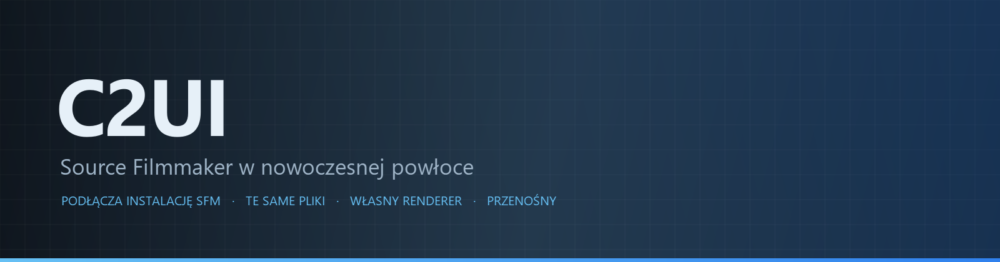

<p align="center"></p>

<details align="center"><summary>&nbsp;🌐 <b>🇵🇱 Polski</b> &nbsp;·&nbsp; <sub>Language · Язык · 語言 · Idioma · Sprache · भाषा · لغة</sub></summary>

<table align="center">
<tr><td align="center"><a href="../../README.md">🇷🇺<br>Русский</a></td><td align="center"><a href="EN-en.md">🇬🇧<br>English</a></td><td align="center"><b>🇵🇱<br>Polski</b></td><td align="center"><a href="UK-ua.md">🇺🇦<br>Українська</a></td><td align="center"><a href="DE-de.md">🇩🇪<br>Deutsch</a></td><td align="center"><a href="RO-md.md">🇲🇩<br>Moldovenească</a></td><td align="center"><a href="SL-si.md">🇸🇮<br>Slovenščina</a></td><td align="center"><a href="BE-by.md">🇧🇾<br>Беларуская</a></td></tr>
<tr><td align="center"><a href="KK-kz.md">🇰🇿<br>Қазақша</a></td><td align="center"><a href="JA-jp.md">🇯🇵<br>日本語</a></td><td align="center"><a href="ZH-cn.md">🇨🇳<br>中文</a></td><td align="center"><a href="SV-se.md">🇸🇪<br>Svenska</a></td><td align="center"><a href="ES-es.md">🇪🇸<br>Español</a></td><td align="center"><a href="HI-in.md">🇮🇳<br>हिन्दी</a></td><td align="center"><a href="PT-pt.md">🇵🇹<br>Português</a></td><td align="center"><a href="BN-bd.md">🇧🇩<br>বাংলা</a></td></tr>
<tr><td align="center"><a href="FR-fr.md">🇫🇷<br>Français</a></td><td align="center"><a href="TE-in.md">🇮🇳<br>తెలుగు</a></td><td align="center"><a href="MR-in.md">🇮🇳<br>मराठी</a></td><td align="center"><a href="TA-in.md">🇮🇳<br>தமிழ்</a></td><td align="center"><a href="TR-tr.md">🇹🇷<br>Türkçe</a></td><td align="center"><a href="UR-pk.md">🇵🇰<br>اردو</a></td><td align="center"><a href="VI-vn.md">🇻🇳<br>Tiếng Việt</a></td><td align="center"><a href="GU-in.md">🇮🇳<br>ગુજરાતી</a></td></tr>
<tr><td align="center"><a href="IT-it.md">🇮🇹<br>Italiano</a></td><td align="center"><a href="KO-kr.md">🇰🇷<br>한국어</a></td><td align="center"><a href="AR-sa.md">🇸🇦<br>العربية</a></td><td align="center"><a href="JV-id.md">🇮🇩<br>Basa Jawa</a></td><td align="center"><a href="ML-in.md">🇮🇳<br>മലയാളം</a></td><td align="center"><a href="NE-np.md">🇳🇵<br>नेपाली</a></td><td align="center"><a href="UZ-uz.md">🇺🇿<br>Oʻzbekcha</a></td><td align="center"><a href="OR-in.md">🇮🇳<br>ଓଡ଼ିଆ</a></td></tr>
</table>

</details>

<p align="center">
  
  
  
  
  <a href="../../Testing"></a>
  
</p>

<p align="center"><b>C2UI</b> — <i>Custom to User Interface</i> — — edytor Source Filmmaker w nowoczesnej powłoce: ta sama zawartość, ten sam format sesji, ten sam model danych, interfejs w duchu biblioteki Steam i edytora Unreal Engine 5.</p>

---

## Gotowość

<p align="center"></p>

<p align="center"> <b>Ogólna gotowość do wydania: 51%</b></p>

<p align="center"><a href="../assets/PL-pl/sidebar.md"></a></p>

## Idea

Source Filmmaker to mocne narzędzie, którego interfejs został w 2012 roku. C2UI go nie zastępuje ani nie przerabia: celem jest po prostu uczynić SFM nieco nowocześniejszym i wygodniejszym.

Edytor znajduje zainstalowany SFM, podłącza go jako bibliotekę zawartości — modele, materiały, tekstury, sesje — i pracuje na tych samych plikach w tym samym formacie. Wszystko, co powstało w SFM, otwiera się w C2UI, i odwrotnie.

Pierwszy cel to pełna zgodność z SFM, łącznie z kośćmi i rigami. Potem — to, czego w SFM brakowało.

```
  ┌──────────────┐    "gdzie jest SFM?"    ┌──────────────────────────────┐
  │   C2UI       │ ─────────────────────▶│  SourceFilmmaker/game/       │
  │              │                       │    usermod/gameinfo.txt      │
  │  własne UI   │ ◀─────  montuje  ───────│    tf/  hl2/  tf_movies/ …   │
  │  własny render │      tylko odczyt      │    models/ materials/ dmx    │
  └──────────────┘                       └──────────────────────────────┘
```

<p align="center"><br><sub>Edytor dzisiaj: otwarta sesja Valve „Meet the Heavy” — ujęcia i dźwięk na osi czasu, drzewo sesji, pierwsze ujęcie przez jego własną kamerę, postacie w pozach i z twarzami z sesji.</sub></p>

## Czym się różni

- **Przenośny.** Nic nie jest zapisywane poza folderem programu: ustawienia w `App/User`, pamięć podręczna w `App/Cache`, pliki tymczasowe w `App/Temporary`. Usuń folder i nie ma śladu.
- **Nigdy nie uruchamia SFM.** Nie ma procesu do sterowania ani okien do przechwytywania. Instalacja jest czytana jak pakiet zawartości.
- **Formaty sprawdzone, nie założone.** Każdy czytnik porównano z prawdziwą instalacją; gdzie format robi coś zaskakującego, kod o tym mówi.
- **Zapis jest dokładny.** Sesja odczytana i zapisana bez zmian to ten sam plik.
- **Silnik bez zależności.** `Core/` i wszystkie testy działają na czystym Pythonie; tylko okno potrzebuje Qt i OpenGL.

## Uruchamianie

Wymaga Windows, Pythona 3.13 i zainstalowanego Source Filmmakera.

```bash
git clone https://github.com/Arkomiko/SFM_C2UI.git
cd SFM_C2UI
python -m venv .venv
.venv/Scripts/python.exe -m pip install -r Tools/Launcher/requirements.txt
.venv/Scripts/python.exe Tools/Launcher/c2ui.py
```

Przy pierwszym uruchomieniu SFM jest szukany przez Steam; jeśli go nie znajdzie — zapyta. <kbd>Ctrl</kbd>+<kbd>O</kbd> otwiera sesję, <kbd>Space</kbd> odtwarza, <kbd>C</kbd> patrzy przez kamerę ujęcia, <kbd>T</kbd>/<kbd>R</kbd> przesuwa/obraca, <kbd>M</kbd> motion editor, <kbd>Ctrl</kbd>+<kbd>Z</kbd> cofa, <kbd>Ctrl</kbd>+<kbd>S</kbd> zapisuje. Panele przeciąga się za tytuł. Testy nie wymagają niczego:

```bash
python Testing/run.py
```

## Struktura

```
C2UI_SDK/
├── README.md
├── Core/              silnik: formaty, wirtualny system plików, indeks, mosty
├── App/               edytor: biblioteka zawartości, renderer, okno
├── Tools/             lokalizacja, narzędzia UI, wtyczki (później)
│   └── Launcher/      program uruchamiający
├── Testing/           testy, fixtury bajt w bajt, jeden runner
└── GIT&DOCK/          ten README w innych językach
```

## Plan

1. **Cieniowanie Source** — VertexLitGeneric tak, jak rysuje SFM: phong, rim, lightwarp, światła sceny.
2. **Mapy** — `.bsp` jako tło.
3. **Eksport** — obraz i wideo.
4. **Wtyczki** — format `.c2plg`; potem motywy i przestrzenie robocze.

## Licencja i podziękowania

Własny kod C2UI jest na **licencji C2UI**: swobodnie do użytku osobistego i niekomercyjnego; użycie komercyjne tylko za pisemną zgodą autora; wersje zmodyfikowane muszą wskazywać oryginalny projekt i jego autora, Arkomiko. Wtyczki i dodatki — na licencji **C2UI — Plugins & Addons (C2UI‑Pl&AD)**.

Source Filmmaker, Team Fortress 2 i silnik Source należą do Valve; projekt czyta ich formaty, nie zawiera ich plików i działa tylko z twoją kopią SFM ze Steam.

<p align="center"><a href="../LICENSE/PL-pl.md"></a></p>

<p align="center"><br><sub>Sześćdziesiąt cztery losowe modele z instalacji, narysowane przez własny renderer C2UI.</sub></p>
