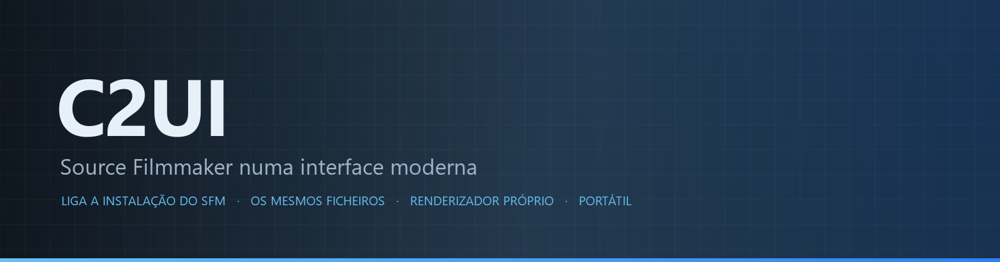

<p align="center"></p>

<p align="center"><a href="../../README.md">🇷🇺 Русский</a> · <a href="EN-en.md">🇬🇧 English</a> · <a href="PL-pl.md">🇵🇱 Polski</a> · <a href="UK-ua.md">🇺🇦 Українська</a> · <a href="DE-de.md">🇩🇪 Deutsch</a> · <a href="RO-md.md">🇲🇩 Moldovenească</a> · <a href="SL-si.md">🇸🇮 Slovenščina</a> · <a href="BE-by.md">🇧🇾 Беларуская</a> · <a href="KK-kz.md">🇰🇿 Қазақша</a> · <a href="JA-jp.md">🇯🇵 日本語</a> · <a href="ZH-cn.md">🇨🇳 中文</a> · <a href="SV-se.md">🇸🇪 Svenska</a> · <a href="ES-es.md">🇪🇸 Español</a> · <a href="HI-in.md">🇮🇳 हिन्दी</a> · <b>🇵🇹 Português</b> · <a href="BN-bd.md">🇧🇩 বাংলা</a> · <a href="FR-fr.md">🇫🇷 Français</a> · <a href="TE-in.md">🇮🇳 తెలుగు</a> · <a href="MR-in.md">🇮🇳 मराठी</a> · <a href="TA-in.md">🇮🇳 தமிழ்</a> · <a href="TR-tr.md">🇹🇷 Türkçe</a> · <a href="UR-pk.md">🇵🇰 اردو</a> · <a href="VI-vn.md">🇻🇳 Tiếng Việt</a> · <a href="GU-in.md">🇮🇳 ગુજરાતી</a> · <a href="IT-it.md">🇮🇹 Italiano</a> · <a href="KO-kr.md">🇰🇷 한국어</a> · <a href="AR-sa.md">🇸🇦 العربية</a> · <a href="JV-id.md">🇮🇩 Basa Jawa</a> · <a href="ML-in.md">🇮🇳 മലയാളം</a> · <a href="NE-np.md">🇳🇵 नेपाली</a> · <a href="UZ-uz.md">🇺🇿 Oʻzbekcha</a> · <a href="OR-in.md">🇮🇳 ଓଡ଼ିଆ</a></p>

<p align="center">
  
  
  
  
  <a href="../../Testing"></a>
  
</p>

<p align="center"><b>C2UI</b> — <i>Custom to User Interface</i> — — o editor do Source Filmmaker numa interface moderna: o mesmo conteúdo, o mesmo formato de sessão, o mesmo modelo de dados, com um aspeto no espírito da biblioteca do Steam e do editor do Unreal Engine 5.</p>

---

## A ideia

O Source Filmmaker é uma ferramenta forte cuja interface ficou em 2012. O C2UI não o substitui nem o refaz: o objetivo é simplesmente tornar o SFM um pouco mais moderno e confortável.

O editor encontra o SFM instalado, liga-o como biblioteca de conteúdo — modelos, materiais, texturas, sessões — e trabalha com os mesmos ficheiros no mesmo formato. Tudo o que foi feito no SFM abre no C2UI, e vice-versa.

O primeiro objetivo é a compatibilidade total com o SFM, ossos e rigs incluídos. Depois, o que faltava ao SFM.

```
  ┌──────────────┐    "onde está o SFM?"    ┌──────────────────────────────┐
  │   C2UI       │ ─────────────────────▶│  SourceFilmmaker/game/       │
  │              │                       │    usermod/gameinfo.txt      │
  │  UI própria  │ ◀─────  montado  ───────│    tf/  hl2/  tf_movies/ …   │
  │  render próprio │      só leitura       │    models/ materials/ dmx    │
  └──────────────┘                       └──────────────────────────────┘
```

## Estado



 <b>Prontidão geral para lançamento: 38%</b>

Cada área expande-se: o que já funciona e o que ainda não existe. As percentagens são uma estimativa face ao que o SFM consegue.

<details><summary> <b>Encontrar e montar o SFM</b></summary>

Registo do Steam → `libraryfolders.vdf` → os caminhos de pesquisa do `gameinfo.txt`, na ordem do motor. Seis montagens numa instalação normal. Nada é escrito fora da pasta da aplicação.

</details>
<details><summary> <b>Índice de conteúdo</b></summary>

70 199 ficheiros em 1,1 s a frio / 0,02 s em cache; as sobreposições entre montagens são resolvidas exatamente como o motor faz.

</details>
<details><summary> <b>Modelos — <code>.mdl</code> <code>.vvd</code> <code>.vtx</code></b></summary>

Versões 44, 48, 49. Esqueleto, malhas, todos os níveis de detalhe, grupos de corpo. 1 500 modelos carregados, 0 falhas.

</details>
<details><summary> <b>Materiais — <code>.vmt</code></b></summary>

Todos os 19 554 materiais incluídos são lidos; `patch`, blocos DX, proxies.

</details>
<details><summary> <b>Texturas — <code>.vtf</code></b></summary>

Versões 7.0–7.5, DXT1/3/5 e todos os formatos não comprimidos, cubemaps, mips. O DXT vai para a GPU sem descodificação.

</details>
<details><summary> <b>Sessões — <code>.dmx</code></b></summary>

Binário 1–5 e KeyValues2. Cada sessão e ficheiro de partículas da instalação é reescrito **byte a byte**.

</details>
<details><summary> <b>Sessão no ecrã</b></summary>

Planos e faixas de som numa linha temporal, a árvore de elementos, a cena de cada plano pela sua câmara. Ainda não: mapas, partículas, som.

</details>
<details><summary> <b>Animação</b></summary>

Canais e logs avaliados no cursor; scrub e reprodução. Ossos, câmaras e visibilidade seguem a sessão.

</details>
<details><summary> <b>Caras</b></summary>

Controladores flex, as regras compiladas e animação de vértices — as personagens falam e fazem expressões. Ainda não: mapas de rugas.

</details>
<details><summary> <b>Rigs</b></summary>

Expressões, restrições point/orient/parent/aim, IK de dois ossos. Ainda não: o grafo completo de dependências de operadores, criação de rigs.

</details>
<details><summary> <b>Edição</b></summary>

Clique para selecionar, manipulador de mover/rodar, inspetor de qualquer atributo, chave no cursor, anular/refazer, gravação exata ao byte. Ainda não: o editor de gráficos.

</details>
<details><summary> <b>Motion editor</b></summary>

Seleção de tempo com hold e falloff na régua; uma edição espalha-se sobre ela como no SFM. Ainda não: presets, camadas.

</details>
<details><summary> <b>Ancoragem de painéis</b></summary>

Arraste painéis para uma bússola de alvos com pré-visualização, como no UE5 e no Visual Studio. Ainda não: disposições guardadas, temas.

</details>
<details><summary> <b>Sombreamento Source</b></summary>

Só textura e uma luz simples. Ainda não: phong, rim, lightwarp, luzes de cena, sombras.

</details>
<details><summary> <b>Mapas — <code>.bsp</code></b></summary>

Não iniciado.

</details>
<details><summary> <b>Render para imagem e vídeo</b></summary>

Não iniciado.

</details>
<details><summary> <b>Plugins <code>.c2plg</code></b></summary>

Não iniciado.

</details>
<details><summary> <b>Temas e espaços de trabalho</b></summary>

Deliberadamente mais tarde: um só aspeto até o editor ter algo que valha a pena tematizar.

</details>

**Não está pronto para lançamento.** A base — cada formato de ficheiro que o SFM usa, lido corretamente e verificado contra toda a instalação — está feita e testada; uma sessão pode ser aberta, reproduzida, alterada e gravada. O que falta é o *conforto* do trabalho: o editor de gráficos, o sombreamento Source, mapas, exportação. Sem número de versão até um animador conseguir fazer um dia de trabalho nele.

<br clear="all">

<p align="center"><br><sub>O editor hoje, com o Meet the Heavy da Valve aberto: planos e som na linha temporal, a árvore da sessão, o primeiro plano visto pela sua própria câmara, personagens em pose e com as caras que a sessão dita.</sub></p>

## O que o torna diferente

- **Portátil.** Nada é escrito fora da pasta da aplicação: definições em `App/User`, caches em `App/Cache`, temporários em `App/Temporary`. Apague a pasta e desaparece.
- **Nunca corre o SFM.** Não há processo a controlar nem janelas a sequestrar. A instalação é lida como um pacote de conteúdo.
- **Formatos verificados, não presumidos.** Cada leitor foi comparado com a instalação real; onde um formato faz algo surpreendente, o código diz-o.
- **A gravação é exata.** Uma sessão lida e escrita sem alterações é o mesmo ficheiro.
- **O motor não tem dependências.** `Core/` e toda a suíte de testes correm em Python puro; só a janela precisa de Qt e OpenGL.

## Executar

Requer Windows, Python 3.13 e uma instalação do Source Filmmaker.

```bash
git clone https://github.com/Arkomiko/SFM_C2UI.git
cd SFM_C2UI
python -m venv .venv
.venv/Scripts/python.exe -m pip install -r requirements.txt
.venv/Scripts/python.exe c2ui.py
```

No primeiro arranque procura o SFM através do Steam; se não o encontrar, pergunta. <kbd>Ctrl</kbd>+<kbd>O</kbd> abre uma sessão, <kbd>Espaço</kbd> reproduz, <kbd>C</kbd> vê pela câmara do plano, <kbd>T</kbd>/<kbd>R</kbd> mover/rodar, <kbd>M</kbd> motion editor, <kbd>Ctrl</kbd>+<kbd>Z</kbd> anula, <kbd>Ctrl</kbd>+<kbd>S</kbd> grava. Os painéis arrastam-se pelo título. Os testes não precisam de nada:

```bash
python Testing/run.py
```

## Estrutura

```
C2UI_SDK/
├── c2ui.py            o lançador
├── Core/              motor: formatos, sistema de ficheiros virtual, índice, pontes
├── App/               o editor: biblioteca de conteúdo, renderizador, janela
├── Tools/             localização, ferramentas de UI, plugins (mais tarde)
├── Testing/           testes, fixtures exatas ao byte, um runner
└── GIT&DOCK/README/   este README noutras línguas
```

## Plano

1. **Editor de gráficos** — curvas e chaves, à vista.
2. **Sombreamento Source** — VertexLitGeneric como o SFM o desenha: phong, rim, lightwarp, luzes de cena.
3. **Mapas** — `.bsp` para fundos.
4. **Saída** — exportação de imagem e vídeo.
5. **Plugins** — o formato `.c2plg`; depois temas e espaços de trabalho.

## Licença e créditos

O Source Filmmaker, o Team Fortress 2 e o motor Source são da Valve. Este projeto lê os seus formatos de ficheiro, não inclui nenhum dos seus ficheiros e só funciona com a cópia do SFM que já tem através do Steam.

A licença do código próprio do C2UI ainda não foi escolhida — até lá, todos os direitos reservados. Issues e pull requests são bem-vindos na mesma.

<p align="center"><br><sub>Sessenta e quatro modelos escolhidos ao acaso da instalação, desenhados pelo renderizador próprio do C2UI.</sub></p>
