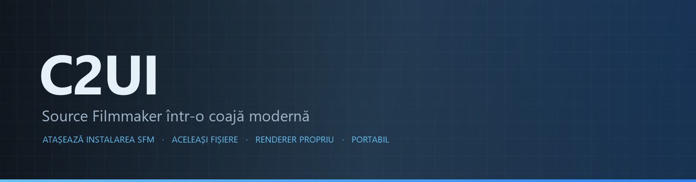

<p align="center"></p>

<details align="center"><summary>&nbsp;🌐 <b>🇲🇩 Moldovenească</b> &nbsp;·&nbsp; <sub>Language · Язык · 語言 · Idioma · Sprache · भाषा · لغة</sub></summary>

<table align="center">
<tr><td align="center"><a href="../../README.md">🇷🇺<br>Русский</a></td><td align="center"><a href="EN-en.md">🇬🇧<br>English</a></td><td align="center"><a href="PL-pl.md">🇵🇱<br>Polski</a></td><td align="center"><a href="UK-ua.md">🇺🇦<br>Українська</a></td><td align="center"><a href="DE-de.md">🇩🇪<br>Deutsch</a></td><td align="center"><b>🇲🇩<br>Moldovenească</b></td><td align="center"><a href="SL-si.md">🇸🇮<br>Slovenščina</a></td><td align="center"><a href="BE-by.md">🇧🇾<br>Беларуская</a></td></tr>
<tr><td align="center"><a href="KK-kz.md">🇰🇿<br>Қазақша</a></td><td align="center"><a href="JA-jp.md">🇯🇵<br>日本語</a></td><td align="center"><a href="ZH-cn.md">🇨🇳<br>中文</a></td><td align="center"><a href="SV-se.md">🇸🇪<br>Svenska</a></td><td align="center"><a href="ES-es.md">🇪🇸<br>Español</a></td><td align="center"><a href="HI-in.md">🇮🇳<br>हिन्दी</a></td><td align="center"><a href="PT-pt.md">🇵🇹<br>Português</a></td><td align="center"><a href="BN-bd.md">🇧🇩<br>বাংলা</a></td></tr>
<tr><td align="center"><a href="FR-fr.md">🇫🇷<br>Français</a></td><td align="center"><a href="TE-in.md">🇮🇳<br>తెలుగు</a></td><td align="center"><a href="MR-in.md">🇮🇳<br>मराठी</a></td><td align="center"><a href="TA-in.md">🇮🇳<br>தமிழ்</a></td><td align="center"><a href="TR-tr.md">🇹🇷<br>Türkçe</a></td><td align="center"><a href="UR-pk.md">🇵🇰<br>اردو</a></td><td align="center"><a href="VI-vn.md">🇻🇳<br>Tiếng Việt</a></td><td align="center"><a href="GU-in.md">🇮🇳<br>ગુજરાતી</a></td></tr>
<tr><td align="center"><a href="IT-it.md">🇮🇹<br>Italiano</a></td><td align="center"><a href="KO-kr.md">🇰🇷<br>한국어</a></td><td align="center"><a href="AR-sa.md">🇸🇦<br>العربية</a></td><td align="center"><a href="JV-id.md">🇮🇩<br>Basa Jawa</a></td><td align="center"><a href="ML-in.md">🇮🇳<br>മലയാളം</a></td><td align="center"><a href="NE-np.md">🇳🇵<br>नेपाली</a></td><td align="center"><a href="UZ-uz.md">🇺🇿<br>Oʻzbekcha</a></td><td align="center"><a href="OR-in.md">🇮🇳<br>ଓଡ଼ିଆ</a></td></tr>
</table>

</details>

<p align="center">
  
  
  
  
  <a href="../../Testing"></a>
  
</p>

<p align="center"><b>C2UI</b> — <i>Custom to User Interface</i> — — editorul Source Filmmaker într-o coajă modernă: același conținut, același format de sesiune, același model de date, o interfață în spiritul bibliotecii Steam și al editorului Unreal Engine 5.</p>

---

## Grad de pregătire

<p align="center"></p>

<p align="center"> <b>Pregătire generală pentru lansare: 51%</b></p>

<p align="center"><a href="../assets/RO-md/sidebar.md"></a></p>

## Ideea

Source Filmmaker este un instrument puternic a cărui interfață a rămas în 2012. C2UI nu îl înlocuiește și nu îl reface: scopul este pur și simplu să facă SFM puțin mai modern și mai comod.

Editorul găsește SFM-ul instalat, îl atașează ca bibliotecă de conținut — modele, materiale, texturi, sesiuni — și lucrează cu aceleași fișiere în același format. Tot ce a fost făcut în SFM se deschide în C2UI, și invers.

Primul obiectiv este compatibilitatea deplină cu SFM, inclusiv oase și rig-uri. Apoi — ceea ce i-a lipsit SFM-ului.

```
  ┌──────────────┐    "unde e SFM?"    ┌──────────────────────────────┐
  │   C2UI       │ ─────────────────────▶│  SourceFilmmaker/game/       │
  │              │                       │    usermod/gameinfo.txt      │
  │  UI propriu  │ ◀─────  montat   ───────│    tf/  hl2/  tf_movies/ …   │
  │  render prop. │      doar citire      │    models/ materials/ dmx    │
  └──────────────┘                       └──────────────────────────────┘
```

<p align="center"><br><sub>Editorul azi, cu sesiunea Valve „Meet the Heavy” deschisă: cadre și sunet pe cronologie, arborele sesiunii, primul cadru văzut prin propria cameră, personaje în pozele și cu fețele din sesiune.</sub></p>

## Prin ce diferă

- **Portabil.** Nimic nu se scrie în afara folderului aplicației: setări în `App/User`, cache în `App/Cache`, temporare în `App/Temporary`. Ștergeți folderul și nu rămâne nimic.
- **Nu pornește niciodată SFM.** Niciun proces de condus, nicio fereastră de capturat. Instalarea se citește ca un pachet de conținut.
- **Formate verificate, nu presupuse.** Fiecare cititor a fost verificat pe instalarea reală; unde un format face ceva surprinzător, codul o spune.
- **Salvarea este exactă.** O sesiune citită și scrisă nemodificată este același fișier.
- **Motorul nu are dependențe.** `Core/` și toate testele rulează pe Python simplu; doar fereastra are nevoie de Qt și OpenGL.

## Rulare

Necesită Windows, Python 3.13 și o instalare Source Filmmaker.

```bash
git clone https://github.com/Arkomiko/SFM_C2UI.git
cd SFM_C2UI
python -m venv .venv
.venv/Scripts/python.exe -m pip install -r Tools/Launcher/requirements.txt
.venv/Scripts/python.exe Tools/Launcher/c2ui.py
```

La prima pornire SFM este căutat prin Steam; dacă nu este găsit, programul întreabă. <kbd>Ctrl</kbd>+<kbd>O</kbd> deschide o sesiune, <kbd>Space</kbd> redă, <kbd>C</kbd> privește prin camera cadrului, <kbd>T</kbd>/<kbd>R</kbd> mută/rotește, <kbd>M</kbd> motion editor, <kbd>Ctrl</kbd>+<kbd>Z</kbd> anulează, <kbd>Ctrl</kbd>+<kbd>S</kbd> salvează. Panourile se trag de titlu. Testele nu au nevoie de nimic:

```bash
python Testing/run.py
```

## Structură

```
C2UI_SDK/
├── README.md
├── Core/              motor: formate, sistem de fișiere virtual, index, punți
├── App/               editorul: biblioteca de conținut, renderer, fereastră
├── Tools/             localizare, unelte UI, plugin-uri (mai târziu)
│   └── Launcher/      lansatorul
├── Testing/           teste, fixture-uri exacte la octet, un singur runner
└── GIT&DOCK/          acest README în alte limbi
```

## Plan

1. **Umbrire Source** — VertexLitGeneric așa cum îl desenează SFM: phong, rim, lightwarp, lumini de scenă.
2. **Hărți** — `.bsp` pentru fundal.
3. **Export** — imagine și video.
4. **Plugin-uri** — formatul `.c2plg`; apoi teme și spații de lucru.

## Licență și mulțumiri

Codul propriu C2UI este sub **licența C2UI**: liber pentru uz personal și necomercial; uz comercial doar cu acordul scris al autorului; versiunile modificate trebuie să indice proiectul original și autorul său, Arkomiko. Plugin-urile și addon-urile sunt sub licența **C2UI — Plugins & Addons (C2UI‑Pl&AD)**.

Source Filmmaker, Team Fortress 2 și motorul Source aparțin Valve; proiectul citește formatele lor, nu conține fișierele lor și funcționează doar cu copia ta de SFM din Steam.

<p align="center"><a href="../LICENSE/RO-md.md"></a></p>

<p align="center"><br><sub>Șaizeci și patru de modele alese la întâmplare din instalare, desenate de renderer-ul propriu al C2UI.</sub></p>
