<details align="center"><summary>&nbsp;🌐 <b>🇲🇩 Moldovenească</b> &nbsp;·&nbsp; <sub>Language · Язык · 語言 · Idioma · Sprache · भाषा · لغة</sub></summary>

<table align="center">
<tr><td align="center"><a href="../../README.md">🇷🇺<br>Русский</a></td><td align="center"><a href="../README/EN-en.md">🇬🇧<br>English</a></td><td align="center"><a href="../README/PL-pl.md">🇵🇱<br>Polski</a></td><td align="center"><a href="../README/UK-ua.md">🇺🇦<br>Українська</a></td><td align="center"><a href="../README/DE-de.md">🇩🇪<br>Deutsch</a></td><td align="center"><b>🇲🇩<br>Moldovenească</b></td><td align="center"><a href="../README/SL-si.md">🇸🇮<br>Slovenščina</a></td><td align="center"><a href="../README/BE-by.md">🇧🇾<br>Беларуская</a></td></tr>
<tr><td align="center"><a href="../README/KK-kz.md">🇰🇿<br>Қазақша</a></td><td align="center"><a href="../README/JA-jp.md">🇯🇵<br>日本語</a></td><td align="center"><a href="../README/ZH-cn.md">🇨🇳<br>中文</a></td><td align="center"><a href="../README/SV-se.md">🇸🇪<br>Svenska</a></td><td align="center"><a href="../README/ES-es.md">🇪🇸<br>Español</a></td><td align="center"><a href="../README/HI-in.md">🇮🇳<br>हिन्दी</a></td><td align="center"><a href="../README/PT-pt.md">🇵🇹<br>Português</a></td><td align="center"><a href="../README/BN-bd.md">🇧🇩<br>বাংলা</a></td></tr>
<tr><td align="center"><a href="../README/FR-fr.md">🇫🇷<br>Français</a></td><td align="center"><a href="../README/TE-in.md">🇮🇳<br>తెలుగు</a></td><td align="center"><a href="../README/MR-in.md">🇮🇳<br>मराठी</a></td><td align="center"><a href="../README/TA-in.md">🇮🇳<br>தமிழ்</a></td><td align="center"><a href="../README/TR-tr.md">🇹🇷<br>Türkçe</a></td><td align="center"><a href="../README/UR-pk.md">🇵🇰<br>اردو</a></td><td align="center"><a href="../README/VI-vn.md">🇻🇳<br>Tiếng Việt</a></td><td align="center"><a href="../README/GU-in.md">🇮🇳<br>ગુજરાતી</a></td></tr>
<tr><td align="center"><a href="../README/IT-it.md">🇮🇹<br>Italiano</a></td><td align="center"><a href="../README/KO-kr.md">🇰🇷<br>한국어</a></td><td align="center"><a href="../README/AR-sa.md">🇸🇦<br>العربية</a></td><td align="center"><a href="../README/JV-id.md">🇮🇩<br>Basa Jawa</a></td><td align="center"><a href="../README/ML-in.md">🇮🇳<br>മലയാളം</a></td><td align="center"><a href="../README/NE-np.md">🇳🇵<br>नेपाली</a></td><td align="center"><a href="../README/UZ-uz.md">🇺🇿<br>Oʻzbekcha</a></td><td align="center"><a href="../README/OR-in.md">🇮🇳<br>ଓଡ଼ିଆ</a></td></tr>
</table>

</details>

<p align="center"></p>

<p align="center">
  
  
  
  
  <a href="../../Testing"></a>
  
  <a href="../LICENSE/RO-md.md"></a>
</p>

<p align="center"><b>C2UI</b> — <i>Custom to User Interface</i> — editorul Source Filmmaker într-o coajă modernă: același conținut, același format de sesiune, același model de date, o interfață în spiritul bibliotecii Steam și al editorului Unreal Engine 5.</p>

---

## Grad de pregătire

<p align="center"></p>

<p align="center"><a href="../READINESS/RO-md.md"></a></p>

## Ideea

Source Filmmaker este un instrument puternic a cărui interfață a rămas în 2012. C2UI nu îl înlocuiește și nu îl reface: scopul este pur și simplu să facă SFM puțin mai modern și mai comod.

Editorul găsește SFM-ul instalat, îl atașează ca bibliotecă de conținut — modele, materiale, texturi, sesiuni — și lucrează cu aceleași fișiere în același format. Tot ce a fost făcut în SFM se deschide în C2UI, și invers.

Primul obiectiv este compatibilitatea deplină cu SFM, inclusiv oase și rig-uri. Apoi — ceea ce i-a lipsit SFM-ului.

```
  ┌───────────────┐                         ┌──────────────────────────────┐
  │   C2UI        │ ──── "unde e SFM?" ────▶│  SourceFilmmaker/game/       │
  │               │                         │    usermod/gameinfo.txt      │
  │  UI propriu   │ ◀─────── montat ────────│    tf/  hl2/  tf_movies/ …   │
  │  render prop. │       doar citire       │    models/ materials/ dmx    │
  └───────────────┘                         └──────────────────────────────┘
```

- **Portabil.** Nimic nu se scrie în afara folderului aplicației: setări în `App/User`, cache în `App/Cache`, temporare în `App/Temporary`. Ștergeți folderul și nu rămâne nimic.
- **Nu pornește niciodată SFM.** Niciun proces de condus, nicio fereastră de capturat. Instalarea se citește ca un pachet de conținut.
- **Formate verificate, nu presupuse.** Fiecare cititor a fost verificat pe instalarea reală; unde un format face ceva surprinzător, codul o spune.
- **Salvarea este exactă.** O sesiune citită și scrisă nemodificată este același fișier.
- **Motorul nu are dependențe.** `Core/` și toate testele rulează pe Python simplu; doar fereastra are nevoie de Qt și OpenGL.

<p align="center"><br><sub>Editorul azi, cu sesiunea Valve „Meet the Heavy” deschisă: cadre și sunet pe cronologie, arborele sesiunii, primul cadru văzut prin propria cameră, personaje în pozele și cu fețele din sesiune.</sub></p>

## Structură

```
C2UI_SDK/
├── README.md
├── Core/               motor: formate, sistem de fișiere virtual, index, punți
│   ├── API/            contractul pentru editor, unelte și plugin-uri
│   ├── Code/           motor: animație, operatori, fețe, editare
│   │   └── formats/    cititoare Valve: mdl vvd vtx vmt vtf dmx bsp
│   └── dev-kit/        sloturi SDK (goale) și punți către instalări
├── App/                editorul: biblioteca de conținut, renderer, fereastră
│   ├── Code/           biblioteca de conținut, fereastra, setări
│   │   ├── render/     scenă, renderer OpenGL, shadere, cameră
│   │   └── ui/         cronologie, arborele sesiunii, inspector, graph editor, andocare
│   ├── Data/           resursele programului, doar citire
│   ├── User/           datele utilizatorului — nu se șterg niciodată
│   └── Cache/          index de conținut, shadere, miniaturi
├── Tools/              localizare, unelte UI, plugin-uri (mai târziu)
│   ├── Launcher/       lansatorul
│   ├── Market Load/    client de marketplace pentru plugin-uri (mai târziu)
│   ├── Localization/   crearea traducerilor
│   ├── NewPlugins/     crearea plugin-urilor
│   └── UI/             teme și spații de lucru
├── Testing/            teste, fixture-uri exacte la octet, un singur runner
│   ├── core/           motorul
│   ├── app/            editorul
│   └── fixtures/       instalare falsă, modele, texturi
└── GIT&DOCK/           README, pregătire și licență în 32 de limbi
```

### Cum funcționează

Drumul de la „unde este Source Filmmaker?” până la un cadru pe ecran trece prin cinci straturi; fiecare îl cunoaște doar pe cel de sub el.

1. **Puntea** (`Core/dev-kit/bridge_sfm`) găsește instalarea prin Steam, citește `gameinfo.txt` și întoarce căile de conținut în ordinea motorului. `sfm.exe` nu este lansat niciodată.
2. **Sistemul de fișiere virtual și indexul** (`Core/Code/vfs.py`, `content_index.py`) suprapun aceste căi așa cum face Source: primul fișier găsit câștigă. Indexul este un singur fișier SQLite în `App/Cache`, așa că parcurgerea a 70 000 de fișiere se face o singură dată.
3. **Formatele** (`Core/Code/formats`) citesc fișierele Valve fără biblioteci terțe: `.mdl` `.vvd` `.vtx` sunt un model, `.vmt` `.vtf` un material și textura lui, `.dmx` o sesiune, `.bsp` o hartă. Fiecare cititor e verificat pe toată instalarea; o sesiune se scrie înapoi octet cu octet.
4. **Sesiunea** este un graf de elemente DMX. `animation.py` evaluează canalele la un moment dat, `operators.py` rulează expresiile și constrângerile rig-urilor, `flex.py` mișcă fețele, `pose.py` construiește matricele oaselor. Fiecare modificare trece prin `editing.py` ca o comandă cu anulare.
5. **Editorul** (`App/Code`) transformă totul într-o scenă (`render/scene.py`) și o desenează cu propriul renderer OpenGL 3.3 (`renderer.py`, `shaders.py`): luminile sesiunii, lightmap-urile și iluminarea hărții așa cum le arată SFM. Panourile (`ui/`) sunt cronologia, arborele sesiunii, inspectorul, graph editor-ul și andocarea în stil UE5.

Tot ce scrie programul rămâne în dosarul lui: `App/User` pentru setări, `App/Cache` pentru index și cache, `App/Temporary` pentru jurnal. `Core/` nu scrie nimic și nu depinde de Qt, deci motorul și testele rulează pe Python simplu; Qt și OpenGL sunt necesare doar ferestrei. Utilitarele din `Tools/` sunt construite strict pe `Core/API` — așa se verifică dacă API-ul ajunge și pentru plugin-uri terțe.

<p align="center"><br><sub>Șaizeci și patru de modele alese la întâmplare din instalare, desenate de renderer-ul propriu al C2UI.</sub></p>

### Rulare

Necesită Windows, Python 3.13 și o instalare Source Filmmaker.

```bash
git clone https://github.com/Arkomiko/SFM_C2UI.git
cd SFM_C2UI
python -m venv .venv
.venv/Scripts/python.exe -m pip install -r Tools/Launcher/requirements.txt
.venv/Scripts/python.exe Tools/Launcher/c2ui.py
```

La prima pornire SFM este căutat prin Steam; dacă nu este găsit, programul întreabă. <kbd>Ctrl</kbd>+<kbd>O</kbd> deschide o sesiune, <kbd>Space</kbd> redă, <kbd>C</kbd> privește prin camera cadrului, <kbd>T</kbd>/<kbd>R</kbd> mută/rotește, <kbd>M</kbd> motion editor, <kbd>Ctrl</kbd>+<kbd>Z</kbd> anulează, <kbd>Ctrl</kbd>+<kbd>S</kbd> salvează. Panourile se trag de titlu. Testele nu au nevoie de nimic:

```bash
python Testing/run.py
```

### În plan

**Urmează**
- Aspectul hărții: skybox, apă, prop_dynamic, texturi gobo ale luminilor, `$bumpmap` și `$envmap`, umbre de la luminile sesiunii.
- Export: secvențe de cadre și video.
- Plugin-uri `.c2plg` și clientul de marketplace din `Tools/Market Load`; apoi teme și spații de lucru.
- Sunet pe cronologie, particule, wrinkle maps, presetări și straturi în motion editor, tangente în graph editor.

**Mai târziu**
- Performanță pe hărți complete: props statice instanțiate, poze în cache.
- Refacerea motorului: parametri noi de compilare a hărților pentru iluminare și umbre mai bune, limită de hartă de 120 000 de unități.
- Un launcher împachetat cu propriul Python și autoactualizare; localizarea editorului.

## Licență și mulțumiri

Codul propriu C2UI este sub **licența C2UI**: liber pentru uz personal și necomercial; uz comercial doar cu acordul scris al autorului; versiunile modificate trebuie să indice proiectul original și autorul său, Arkomiko. Plugin-urile și addon-urile sunt sub licența **C2UI — Plugins & Addons (C2UI‑Pl&AD)**.

Source Filmmaker, Team Fortress 2 și motorul Source aparțin Valve; proiectul citește formatele lor, nu conține fișierele lor și funcționează doar cu copia ta de SFM din Steam.

<p align="center"><a href="../LICENSE/RO-md.md"></a></p>
