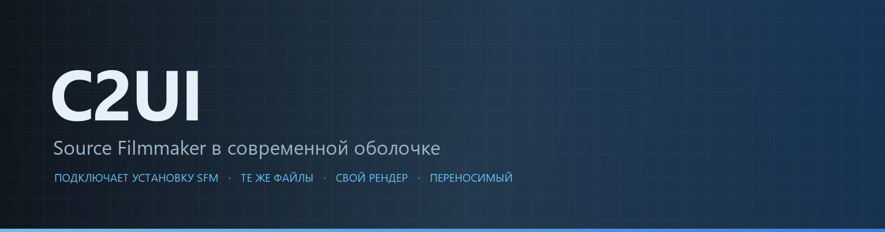

<p align="center"></p>

<details align="center"><summary>&nbsp;🌐 <b>🇷🇺 Русский</b> &nbsp;·&nbsp; <sub>Language · Язык · 語言 · Idioma · Sprache · भाषा · لغة</sub></summary>

<table align="center">
<tr><td align="center"><b>🇷🇺<br>Русский</b></td><td align="center"><a href="EN-en.md">🇬🇧<br>English</a></td><td align="center"><a href="PL-pl.md">🇵🇱<br>Polski</a></td><td align="center"><a href="UK-ua.md">🇺🇦<br>Українська</a></td><td align="center"><a href="DE-de.md">🇩🇪<br>Deutsch</a></td><td align="center"><a href="RO-md.md">🇲🇩<br>Moldovenească</a></td><td align="center"><a href="SL-si.md">🇸🇮<br>Slovenščina</a></td><td align="center"><a href="BE-by.md">🇧🇾<br>Беларуская</a></td></tr>
<tr><td align="center"><a href="KK-kz.md">🇰🇿<br>Қазақша</a></td><td align="center"><a href="JA-jp.md">🇯🇵<br>日本語</a></td><td align="center"><a href="ZH-cn.md">🇨🇳<br>中文</a></td><td align="center"><a href="SV-se.md">🇸🇪<br>Svenska</a></td><td align="center"><a href="ES-es.md">🇪🇸<br>Español</a></td><td align="center"><a href="HI-in.md">🇮🇳<br>हिन्दी</a></td><td align="center"><a href="PT-pt.md">🇵🇹<br>Português</a></td><td align="center"><a href="BN-bd.md">🇧🇩<br>বাংলা</a></td></tr>
<tr><td align="center"><a href="FR-fr.md">🇫🇷<br>Français</a></td><td align="center"><a href="TE-in.md">🇮🇳<br>తెలుగు</a></td><td align="center"><a href="MR-in.md">🇮🇳<br>मराठी</a></td><td align="center"><a href="TA-in.md">🇮🇳<br>தமிழ்</a></td><td align="center"><a href="TR-tr.md">🇹🇷<br>Türkçe</a></td><td align="center"><a href="UR-pk.md">🇵🇰<br>اردو</a></td><td align="center"><a href="VI-vn.md">🇻🇳<br>Tiếng Việt</a></td><td align="center"><a href="GU-in.md">🇮🇳<br>ગુજરાતી</a></td></tr>
<tr><td align="center"><a href="IT-it.md">🇮🇹<br>Italiano</a></td><td align="center"><a href="KO-kr.md">🇰🇷<br>한국어</a></td><td align="center"><a href="AR-sa.md">🇸🇦<br>العربية</a></td><td align="center"><a href="JV-id.md">🇮🇩<br>Basa Jawa</a></td><td align="center"><a href="ML-in.md">🇮🇳<br>മലയാളം</a></td><td align="center"><a href="NE-np.md">🇳🇵<br>नेपाली</a></td><td align="center"><a href="UZ-uz.md">🇺🇿<br>Oʻzbekcha</a></td><td align="center"><a href="OR-in.md">🇮🇳<br>ଓଡ଼ିଆ</a></td></tr>
</table>

</details>

<p align="center">
  
  
  
  
  <a href="../../Testing"></a>
  
</p>

<p align="center"><b>C2UI</b> — <i>Custom to User Interface</i> — — редактор Source Filmmaker в современной оболочке: тот же контент, тот же формат сессий, та же модель данных, интерфейс в духе библиотеки Steam и редактора Unreal Engine 5.</p>

---

## Готовность

<p align="center"></p>

<p align="center"> <b>Общая готовность к релизу: 51%</b></p>

<p align="center"><a href="../assets/RU-ru/sidebar.md"></a></p>

## Идея

Source Filmmaker — сильный инструмент, интерфейс которого остался в 2012 году. C2UI не заменяет его и не переделывает: задача — сделать SFM немного современнее и удобнее.

Редактор находит установленный SFM, подключает его как библиотеку контента — модели, материалы, текстуры, сессии — и работает с теми же файлами в том же формате. Всё, что сделано в SFM, открывается в C2UI, и наоборот.

Первая цель — полная совместимость с SFM, включая кости и риги. Дальше — то, чего в SFM не хватало.

```
  ┌──────────────┐    "где SFM?"    ┌──────────────────────────────┐
  │   C2UI       │ ─────────────────────▶│  SourceFilmmaker/game/       │
  │              │                       │    usermod/gameinfo.txt      │
  │  свой UI     │ ◀───── монтирует ───────│    tf/  hl2/  tf_movies/ …   │
  │  свой рендер │      только чтение      │    models/ materials/ dmx    │
  └──────────────┘                       └──────────────────────────────┘
```

<p align="center"><br><sub>Редактор сегодня: открыта сессия Valve «Meet the Heavy» — шоты и звук на таймлайне, дерево сессии, первый шот через его собственную камеру, персонажи в позах и с лицами из сессии.</sub></p>

## Чем отличается

- **Переносимый.** Ничего не пишется вне папки программы: настройки в `App/User`, кэш в `App/Cache`, временное в `App/Temporary`. Удалили папку — не осталось следа.
- **Не запускает SFM.** Нет процесса, которым надо управлять, нет окон, которые надо перехватывать. Установка читается как пакет контента.
- **Форматы проверены, а не предположены.** Каждая читалка сверена с настоящей установкой; там, где формат делает что-то неочевидное, код об этом говорит.
- **Сохранение точное.** Сессия, прочитанная и записанная без изменений, — тот же самый файл.
- **Ядро без зависимостей.** `Core/` и все тесты работают на голом Python; Qt и OpenGL нужны только окну.

## Запуск

Нужны Windows, Python 3.13 и установленный Source Filmmaker.

```bash
git clone https://github.com/Arkomiko/SFM_C2UI.git
cd SFM_C2UI
python -m venv .venv
.venv/Scripts/python.exe -m pip install -r Tools/Launcher/requirements.txt
.venv/Scripts/python.exe Tools/Launcher/c2ui.py
```

При первом запуске SFM ищется через Steam; если не нашёлся — программа спросит. <kbd>Ctrl</kbd>+<kbd>O</kbd> открывает сессию, <kbd>Space</kbd> — воспроизведение, <kbd>C</kbd> — камера шота, <kbd>T</kbd>/<kbd>R</kbd> — перемещение/поворот, <kbd>M</kbd> — motion editor, <kbd>G</kbd> — graph editor, <kbd>Ctrl</kbd>+<kbd>Z</kbd> — отмена, <kbd>Ctrl</kbd>+<kbd>S</kbd> — сохранить. Камера как в SFM: правая кнопка — осмотр, с зажатой правой <kbd>W</kbd><kbd>A</kbd><kbd>S</kbd><kbd>D</kbd> <kbd>Z</kbd><kbd>X</kbd> — полёт (<kbd>Shift</kbd> быстрее), средняя — панорама, колесо — наезд, <kbd>Alt</kbd>+левая — орбита. Клик по персонажу выбирает кость под курсором (или её ручку рига). Панели перетаскиваются за заголовок. Тесты не требуют ничего:

```bash
python Testing/run.py
```

## Структура

```
C2UI_SDK/
├── README.md
├── Core/              ядро: форматы, виртуальная ФС, индекс, мосты к установкам
├── App/               редактор: библиотека контента, рендер, окно
├── Tools/             локализация, инструменты UI, плагины (позже)
│   └── Launcher/      лаунчер
├── Testing/           тесты, побайтовые фикстуры, один раннер
└── GIT&DOCK/          этот README на других языках
```

## Дорожная карта

1. **Шейдинг Source** — VertexLitGeneric как рисует SFM: phong, rim, lightwarp, освещение сцены.
2. **Карты** — `.bsp` для фона.
3. **Экспорт** — изображение и видео.
4. **Плагины** — формат `.c2plg`; затем темы и рабочие пространства.

## Лицензия и благодарности

Собственный код C2UI распространяется по **лицензии C2UI**: свободно для личных и некоммерческих нужд; коммерческое использование — только по письменному согласию автора; при модификации — ссылка на оригинальный проект и автора Arkomiko. Плагины и аддоны — по лицензии **C2UI — Plugins & Addons (C2UI‑Pl&AD)**.

Source Filmmaker, Team Fortress 2 и движок Source принадлежат Valve; проект читает их форматы, не содержит их файлов и работает только с вашей копией SFM из Steam.

<p align="center"><a href="../LICENSE/RU-ru.md"></a></p>

<p align="center"><br><sub>Шестьдесят четыре случайные модели из установки, нарисованные собственным рендерером C2UI.</sub></p>
