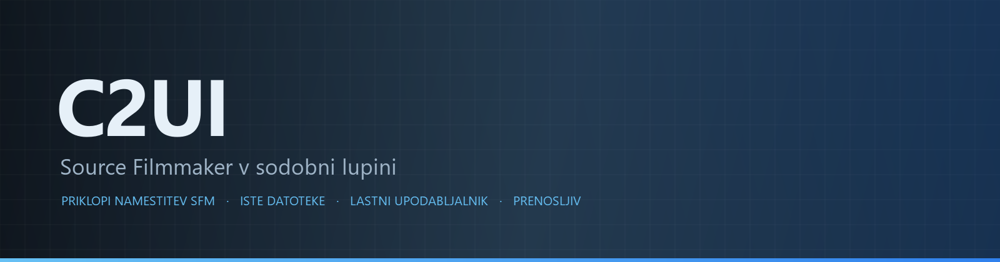

<p align="center"></p>

<p align="center"><a href="../../README.md">🇷🇺 Русский</a> · <a href="EN-en.md">🇬🇧 English</a> · <a href="PL-pl.md">🇵🇱 Polski</a> · <a href="UK-ua.md">🇺🇦 Українська</a> · <a href="DE-de.md">🇩🇪 Deutsch</a> · <a href="RO-md.md">🇲🇩 Moldovenească</a> · <b>🇸🇮 Slovenščina</b> · <a href="BE-by.md">🇧🇾 Беларуская</a> · <a href="KK-kz.md">🇰🇿 Қазақша</a> · <a href="JA-jp.md">🇯🇵 日本語</a> · <a href="ZH-cn.md">🇨🇳 中文</a> · <a href="SV-se.md">🇸🇪 Svenska</a> · <a href="ES-es.md">🇪🇸 Español</a> · <a href="HI-in.md">🇮🇳 हिन्दी</a> · <a href="PT-pt.md">🇵🇹 Português</a> · <a href="BN-bd.md">🇧🇩 বাংলা</a> · <a href="FR-fr.md">🇫🇷 Français</a> · <a href="TE-in.md">🇮🇳 తెలుగు</a> · <a href="MR-in.md">🇮🇳 मराठी</a> · <a href="TA-in.md">🇮🇳 தமிழ்</a> · <a href="TR-tr.md">🇹🇷 Türkçe</a> · <a href="UR-pk.md">🇵🇰 اردو</a> · <a href="VI-vn.md">🇻🇳 Tiếng Việt</a> · <a href="GU-in.md">🇮🇳 ગુજરાતી</a> · <a href="IT-it.md">🇮🇹 Italiano</a> · <a href="KO-kr.md">🇰🇷 한국어</a> · <a href="AR-sa.md">🇸🇦 العربية</a> · <a href="JV-id.md">🇮🇩 Basa Jawa</a> · <a href="ML-in.md">🇮🇳 മലയാളം</a> · <a href="NE-np.md">🇳🇵 नेपाली</a> · <a href="UZ-uz.md">🇺🇿 Oʻzbekcha</a> · <a href="OR-in.md">🇮🇳 ଓଡ଼ିଆ</a></p>

<p align="center">
  
  
  
  
  <a href="../../Testing"></a>
  
</p>

<p align="center"><b>C2UI</b> — <i>Custom to User Interface</i> — — urejevalnik Source Filmmaker v sodobni lupini: ista vsebina, isti format seje, isti podatkovni model, vmesnik v duhu knjižnice Steam in urejevalnika Unreal Engine 5.</p>

---

## Pripravljenost

<p align="center"></p>

<p align="center"> <b>Skupna pripravljenost za izdajo: 41%</b></p>

<p align="center"><a href="../assets/SL-si/sidebar.md"></a></p>

## Zamisel

Source Filmmaker je močno orodje, katerega vmesnik je ostal v letu 2012. C2UI ga ne nadomešča in ne predeluje: cilj je preprosto narediti SFM malo sodobnejši in udobnejši.

Urejevalnik najde nameščeni SFM, ga priključi kot knjižnico vsebine — modeli, materiali, teksture, seje — in dela z istimi datotekami v istem formatu. Vse, kar je nastalo v SFM, se odpre v C2UI, in obratno.

Prvi cilj je polna združljivost s SFM, vključno s kostmi in rigi. Potem tisto, česar je SFM manjkalo.

```
  ┌──────────────┐    "kje je SFM?"    ┌──────────────────────────────┐
  │   C2UI       │ ─────────────────────▶│  SourceFilmmaker/game/       │
  │              │                       │    usermod/gameinfo.txt      │
  │  lastni UI   │ ◀─────  priklop  ───────│    tf/  hl2/  tf_movies/ …   │
  │  lastni render │      samo branje      │    models/ materials/ dmx    │
  └──────────────┘                       └──────────────────────────────┘
```

<p align="center"><br><sub>Urejevalnik danes, z odprto Valvovo sejo »Meet the Heavy«: posnetki in zvok na časovnici, drevo seje, prvi posnetek skozi lastno kamero, liki v pozah in z obrazi iz seje.</sub></p>

## Po čem se razlikuje

- **Prenosljiv.** Nič se ne zapiše zunaj mape programa: nastavitve v `App/User`, predpomnilnik v `App/Cache`, začasno v `App/Temporary`. Izbrišite mapo in ni sledu.
- **Nikoli ne zažene SFM.** Ni procesa za krmiljenje, ni oken za prevzem. Namestitev se bere kot paket vsebine.
- **Formati preverjeni, ne predpostavljeni.** Vsak bralnik je bil preverjen na pravi namestitvi; kjer format naredi kaj presenetljivega, koda to pove.
- **Shranjevanje je natančno.** Seja, prebrana in zapisana nespremenjena, je ista datoteka.
- **Pogon nima odvisnosti.** `Core/` in vsi testi tečejo na golem Pythonu; le okno potrebuje Qt in OpenGL.

## Zagon

Potrebuje Windows, Python 3.13 in nameščen Source Filmmaker.

```bash
git clone https://github.com/Arkomiko/SFM_C2UI.git
cd SFM_C2UI
python -m venv .venv
.venv/Scripts/python.exe -m pip install -r Tools/Launcher/requirements.txt
.venv/Scripts/python.exe Tools/Launcher/c2ui.py
```

Ob prvem zagonu se SFM poišče prek Steama; če ga ne najde, program vpraša. <kbd>Ctrl</kbd>+<kbd>O</kbd> odpre sejo, <kbd>Preslednica</kbd> predvaja, <kbd>C</kbd> pogleda skozi kamero posnetka, <kbd>T</kbd>/<kbd>R</kbd> premik/vrtenje, <kbd>M</kbd> motion editor, <kbd>Ctrl</kbd>+<kbd>Z</kbd> razveljavi, <kbd>Ctrl</kbd>+<kbd>S</kbd> shrani. Plošče se vlečejo za naslov. Testi ne potrebujejo ničesar:

```bash
python Testing/run.py
```

## Zgradba

```
C2UI_SDK/
├── README.md
├── Core/              pogon: formati, navidezni datotečni sistem, kazalo, mostovi
├── App/               urejevalnik: knjižnica vsebine, upodabljalnik, okno
├── Tools/             lokalizacija, orodja UI, vtičniki (pozneje)
│   └── Launcher/      zaganjalnik
├── Testing/           testi, bajtno natančne fiksture, en zaganjalnik
└── GIT&DOCK/          ta README v drugih jezikih
```

## Načrt

1. **Senčenje Source** — VertexLitGeneric, kot ga riše SFM: phong, rim, lightwarp, luči prizora.
2. **Zemljevidi** — `.bsp` za ozadje.
3. **Izvoz** — slika in video.
4. **Vtičniki** — format `.c2plg`; nato teme in delovni prostori.

## Licenca in zasluge

Lastna koda C2UI je pod **licenco C2UI**: prosto za osebno in nekomercialno rabo; komercialna raba le s pisnim soglasjem avtorja; spremenjene različice morajo navesti izvirni projekt in njegovega avtorja Arkomiko. Vtičniki in dodatki so pod licenco **C2UI — Plugins & Addons (C2UI‑Pl&AD)**.

Source Filmmaker, Team Fortress 2 in pogon Source so Valvovi; projekt bere njihove formate, ne vsebuje njihovih datotek in deluje le z vašo kopijo SFM iz Steama.

<p align="center"><a href="../LICENSE/SL-si.md"></a></p>

<p align="center"><br><sub>Štiriinšestdeset naključnih modelov iz namestitve, ki jih je narisal lastni upodabljalnik C2UI.</sub></p>
