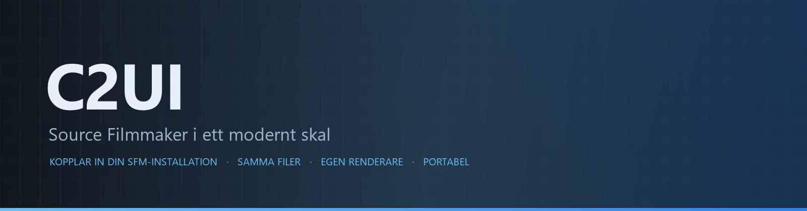

<details align="center"><summary>&nbsp;🌐 <b>🇸🇪 Svenska</b> &nbsp;·&nbsp; <sub>Language · Язык · 語言 · Idioma · Sprache · भाषा · لغة</sub></summary>

<table align="center">
<tr><td align="center"><a href="../../README.md">🇷🇺<br>Русский</a></td><td align="center"><a href="../README/EN-en.md">🇬🇧<br>English</a></td><td align="center"><a href="../README/PL-pl.md">🇵🇱<br>Polski</a></td><td align="center"><a href="../README/UK-ua.md">🇺🇦<br>Українська</a></td><td align="center"><a href="../README/DE-de.md">🇩🇪<br>Deutsch</a></td><td align="center"><a href="../README/RO-md.md">🇲🇩<br>Moldovenească</a></td><td align="center"><a href="../README/SL-si.md">🇸🇮<br>Slovenščina</a></td><td align="center"><a href="../README/BE-by.md">🇧🇾<br>Беларуская</a></td></tr>
<tr><td align="center"><a href="../README/KK-kz.md">🇰🇿<br>Қазақша</a></td><td align="center"><a href="../README/JA-jp.md">🇯🇵<br>日本語</a></td><td align="center"><a href="../README/ZH-cn.md">🇨🇳<br>中文</a></td><td align="center"><b>🇸🇪<br>Svenska</b></td><td align="center"><a href="../README/ES-es.md">🇪🇸<br>Español</a></td><td align="center"><a href="../README/HI-in.md">🇮🇳<br>हिन्दी</a></td><td align="center"><a href="../README/PT-pt.md">🇵🇹<br>Português</a></td><td align="center"><a href="../README/BN-bd.md">🇧🇩<br>বাংলা</a></td></tr>
<tr><td align="center"><a href="../README/FR-fr.md">🇫🇷<br>Français</a></td><td align="center"><a href="../README/TE-in.md">🇮🇳<br>తెలుగు</a></td><td align="center"><a href="../README/MR-in.md">🇮🇳<br>मराठी</a></td><td align="center"><a href="../README/TA-in.md">🇮🇳<br>தமிழ்</a></td><td align="center"><a href="../README/TR-tr.md">🇹🇷<br>Türkçe</a></td><td align="center"><a href="../README/UR-pk.md">🇵🇰<br>اردو</a></td><td align="center"><a href="../README/VI-vn.md">🇻🇳<br>Tiếng Việt</a></td><td align="center"><a href="../README/GU-in.md">🇮🇳<br>ગુજરાતી</a></td></tr>
<tr><td align="center"><a href="../README/IT-it.md">🇮🇹<br>Italiano</a></td><td align="center"><a href="../README/KO-kr.md">🇰🇷<br>한국어</a></td><td align="center"><a href="../README/AR-sa.md">🇸🇦<br>العربية</a></td><td align="center"><a href="../README/JV-id.md">🇮🇩<br>Basa Jawa</a></td><td align="center"><a href="../README/ML-in.md">🇮🇳<br>മലയാളം</a></td><td align="center"><a href="../README/NE-np.md">🇳🇵<br>नेपाली</a></td><td align="center"><a href="../README/UZ-uz.md">🇺🇿<br>Oʻzbekcha</a></td><td align="center"><a href="../README/OR-in.md">🇮🇳<br>ଓଡ଼ିଆ</a></td></tr>
</table>

</details>

<p align="center"></p>

<p align="center">
  
  
  
  
  
  <a href="../../Testing"></a>
  
  <a href="../LICENSE/SV-se.md"></a>
</p>

<p align="center"><b>C2UI</b> — <i>Custom to User Interface</i> — Source Filmmakers redigerare i ett modernt skal: samma innehåll, samma sessionsformat, samma datamodell, ett gränssnitt i Steam-bibliotekets och Unreal Engine 5-redigerarens anda.</p>

> [!IMPORTANT]
> **Utvecklingen är pausad.** Förrådet förblir öppet: koden, dokumentationen och historiken finns kvar, och allt som beskrivs nedan fungerar som beskrivet. Färdighetssiffrorna, ärendena och färdplanen visar läget vid pausen.

---

## Mognad

<p align="center"></p>

<p align="center"><a href="../READINESS/SV-se.md"></a></p>

## Idén

Source Filmmaker är ett starkt verktyg vars gränssnitt stannade i 2012. C2UI ersätter det inte och gör inte om det: målet är helt enkelt att göra SFM lite modernare och bekvämare.

Redigeraren hittar det installerade SFM, kopplar in det som ett innehållsbibliotek — modeller, material, texturer, sessioner — och arbetar med samma filer i samma format. Allt som gjorts i SFM öppnas i C2UI, och tvärtom.

Första målet är full kompatibilitet med SFM, ben och riggar inräknade. Därefter det som SFM saknade.

```
  ┌──────────────┐                         ┌──────────────────────────────┐
  │   C2UI       │ ──── "var är SFM?" ────▶│  SourceFilmmaker/game/       │
  │              │                         │    usermod/gameinfo.txt      │
  │  eget UI     │ ◀────── monterad ───────│    tf/  hl2/  tf_movies/ …   │
  │  egen render │      skrivskyddad       │    models/ materials/ dmx    │
  └──────────────┘                         └──────────────────────────────┘
```

- **Portabel.** Inget skrivs utanför programmappen: inställningar under `App/User`, cache under `App/Cache`, tillfälligt under `App/Temporary`. Ta bort mappen och den är borta.
- **Kör aldrig SFM.** Ingen process att styra, inga fönster att kapa. Installationen läses som ett innehållspaket.
- **Format verifierade, inte antagna.** Varje läsare kontrollerades mot den riktiga installationen; där ett format gör något överraskande säger koden det.
- **Sparningen är exakt.** En session som läses och skrivs oförändrad är samma fil.
- **Motorn har inga beroenden.** `Core/` och hela testsviten körs på ren Python; bara fönstret behöver Qt och OpenGL.

## Struktur

```
C2UI_SDK/
├── README.md
├── Core/               motor: format, virtuellt filsystem, index, bryggor
│   ├── API/            kontraktet för redigeraren, verktygen och plugin
│   ├── Code/           motor: animation, operatorer, ansikten, redigering
│   │   └── formats/    Valve-läsare: mdl vvd vtx vmt vtf dmx bsp
│   └── dev-kit/        SDK-platser (tomma) och bryggor till installationer
├── Launcher/           startaren
├── App/                redigeraren: innehållsbibliotek, renderare, fönster
│   ├── Code/           innehållsbibliotek, fönster, inställningar
│   │   ├── render/     scen, OpenGL-renderare, shaders, kamera
│   │   └── ui/         tidslinje, sessionsträd, inspektör, grafredigerare, dockning
│   ├── Data/           programresurser, skrivskyddade
│   ├── User/           användardata — raderas aldrig
│   └── Cache/          innehållsindex, shaders, miniatyrer
├── Tools/              lokalisering, UI-verktyg, insticksprogram (senare)
│   ├── Market Load/    marknadsklient för plugin (senare)
│   ├── Localization/   skapa översättningar
│   ├── NewPlugins/     skapa plugin
│   └── UI/             teman och arbetsytor
├── Testing/            tester, byteexakta fixturer, en körare
│   ├── core/           motorn
│   ├── app/            redigeraren
│   └── fixtures/       låtsasinstallation, modeller, texturer
└── GIT&DOCK/           README, färdighet och licens på 32 språk
```

### Så fungerar det

Vägen från ”var är Source Filmmaker?” till en bildruta på skärmen går genom fem lager; varje lager känner bara till det under sig.

1. **Bryggan** (`Core/dev-kit/bridge_sfm`) hittar installationen via Steam, läser `gameinfo.txt` och returnerar innehållssökvägarna i motorns ordning. `sfm.exe` startas aldrig.
2. **Det virtuella filsystemet och indexet** (`Core/Code/vfs.py`, `content_index.py`) lagrar sökvägarna som Source gör: den först hittade filen vinner. Indexet är en SQLite-fil i `App/Cache`, så genomgången av 70 000 filer görs en gång.
3. **Formaten** (`Core/Code/formats`) läser Valves filer utan tredjepartsbibliotek: `.mdl` `.vvd` `.vtx` är en modell, `.vmt` `.vtf` ett material och dess textur, `.dmx` en session, `.bsp` en karta. Varje läsare är kontrollerad mot hela installationen; en session skrivs tillbaka byte för byte.
4. **Sessionen** är en graf av DMX-element. `animation.py` utvärderar kanalerna vid en tidpunkt, `operators.py` kör uttryck och riggbegränsningar, `flex.py` rör ansiktena, `pose.py` bygger benmatriserna. Varje ändring går genom `editing.py` som ett ångringsbart kommando.
5. **Redigeraren** (`App/Code`) gör det till en scen (`render/scene.py`) och ritar den med sin egen OpenGL 3.3-renderare (`renderer.py`, `shaders.py`): sessionsljus, lightmaps och kartans belysning — bilden är ännu långt från SFM:s och arbetas på. Panelerna (`ui/`) är tidslinjen, sessionsträdet, inspektören, grafredigeraren och dockning i UE5-stil.

Allt programmet skriver stannar i dess mapp: `App/User` för inställningar, `App/Cache` för index och cache, `App/Temporary` för loggen. `Core/` skriver inget och är oberoende av Qt, så motorn och testerna kör på ren Python; Qt och OpenGL behövs bara av fönstret. Verktygen i `Tools/` byggs strikt på `Core/API` — så bevisas att API:et räcker även för tredjepartsplugin.

### Köra

Kräver Windows, Python 3.13 och en Source Filmmaker-installation.

```bash
git clone https://github.com/Arkomiko/SFM_C2UI.git
cd SFM_C2UI
python -m venv .venv
.venv/Scripts/python.exe -m pip install -r Launcher/requirements.txt
.venv/Scripts/python.exe Launcher/launcher.py
```

Det öppnar startaren: ett litet fönster med tre knappar. Utseendet är tillfälligt — det skrivs om när App finns, och fönstret är än så länge bara på ryska.

<p align="center"><a href="../LAUNCHER/SV-se.md"></a></p>

Vid första start söks SFM via Steam; hittas det inte frågar programmet. <kbd>Ctrl</kbd>+<kbd>O</kbd> öppnar en session, <kbd>Mellanslag</kbd> spelar, <kbd>C</kbd> tittar genom shotkameran, <kbd>T</kbd>/<kbd>R</kbd> flytta/rotera, <kbd>M</kbd> motion editor, <kbd>Ctrl</kbd>+<kbd>Z</kbd> ångrar, <kbd>Ctrl</kbd>+<kbd>S</kbd> sparar. Paneler dras i sin titel. Testerna behöver ingenting alls:

```bash
python Testing/run.py
```

### Planerat

**Härnäst**
- Kartans utseende: vatten, prop_dynamic, gobo-texturer för ljus, `$bumpmap` och `$envmap`, skuggor från sessionsljus.
- Ljud i exporterade filmer.
- `.c2plg`-plugin och marknadsklienten i `Tools/Market Load`; därefter teman och arbetsytor.
- Ljud på tidslinjen, partiklar, wrinkle maps, förinställningar och lager i motion editor, tangenter i grafredigeraren.

**Senare**
- Prestanda på fulla kartor: instansierade statiska props, cachade poser.
- Omarbetning av motorn: nya kartkompileringsparametrar för bättre ljus och skuggor, en kartgräns på 120 000 enheter.
- En paketerad launcher med egen Python och självuppdatering; lokalisering av redigeraren.

## Licens och tack

C2UI:s egen kod är under **C2UI-licensen**: fri för personligt och icke-kommersiellt bruk; kommersiellt bruk endast med upphovspersonens skriftliga medgivande; ändrade versioner måste ange originalprojektet och dess upphovsperson Arkomiko. Insticksprogram och tillägg är under licensen **C2UI — Plugins & Addons (C2UI‑Pl&AD)**.

Source Filmmaker, Team Fortress 2 och Source-motorn tillhör Valve; projektet läser deras format, innehåller inga av deras filer och fungerar bara med din egen kopia av SFM från Steam.

<p align="center"><a href="../LICENSE/SV-se.md"></a></p>
