<p align="center"></p>

<details align="center"><summary>&nbsp;🌐 <b>🇮🇳 தமிழ்</b> &nbsp;·&nbsp; <sub>Language · Язык · 語言 · Idioma · Sprache · भाषा · لغة</sub></summary>

<table align="center">
<tr><td align="center"><a href="../../README.md">🇷🇺<br>Русский</a></td><td align="center"><a href="EN-en.md">🇬🇧<br>English</a></td><td align="center"><a href="PL-pl.md">🇵🇱<br>Polski</a></td><td align="center"><a href="UK-ua.md">🇺🇦<br>Українська</a></td><td align="center"><a href="DE-de.md">🇩🇪<br>Deutsch</a></td><td align="center"><a href="RO-md.md">🇲🇩<br>Moldovenească</a></td><td align="center"><a href="SL-si.md">🇸🇮<br>Slovenščina</a></td><td align="center"><a href="BE-by.md">🇧🇾<br>Беларуская</a></td></tr>
<tr><td align="center"><a href="KK-kz.md">🇰🇿<br>Қазақша</a></td><td align="center"><a href="JA-jp.md">🇯🇵<br>日本語</a></td><td align="center"><a href="ZH-cn.md">🇨🇳<br>中文</a></td><td align="center"><a href="SV-se.md">🇸🇪<br>Svenska</a></td><td align="center"><a href="ES-es.md">🇪🇸<br>Español</a></td><td align="center"><a href="HI-in.md">🇮🇳<br>हिन्दी</a></td><td align="center"><a href="PT-pt.md">🇵🇹<br>Português</a></td><td align="center"><a href="BN-bd.md">🇧🇩<br>বাংলা</a></td></tr>
<tr><td align="center"><a href="FR-fr.md">🇫🇷<br>Français</a></td><td align="center"><a href="TE-in.md">🇮🇳<br>తెలుగు</a></td><td align="center"><a href="MR-in.md">🇮🇳<br>मराठी</a></td><td align="center"><b>🇮🇳<br>தமிழ்</b></td><td align="center"><a href="TR-tr.md">🇹🇷<br>Türkçe</a></td><td align="center"><a href="UR-pk.md">🇵🇰<br>اردو</a></td><td align="center"><a href="VI-vn.md">🇻🇳<br>Tiếng Việt</a></td><td align="center"><a href="GU-in.md">🇮🇳<br>ગુજરાતી</a></td></tr>
<tr><td align="center"><a href="IT-it.md">🇮🇹<br>Italiano</a></td><td align="center"><a href="KO-kr.md">🇰🇷<br>한국어</a></td><td align="center"><a href="AR-sa.md">🇸🇦<br>العربية</a></td><td align="center"><a href="JV-id.md">🇮🇩<br>Basa Jawa</a></td><td align="center"><a href="ML-in.md">🇮🇳<br>മലയാളം</a></td><td align="center"><a href="NE-np.md">🇳🇵<br>नेपाली</a></td><td align="center"><a href="UZ-uz.md">🇺🇿<br>Oʻzbekcha</a></td><td align="center"><a href="OR-in.md">🇮🇳<br>ଓଡ଼ିଆ</a></td></tr>
</table>

</details>

<p align="center">
  
  
  
  
  <a href="../../Testing"></a>
  
</p>

<p align="center"><b>C2UI</b> — <i>Custom to User Interface</i> — — நவீன ஓட்டில் Source Filmmaker எடிட்டர்: அதே உள்ளடக்கம், அதே அமர்வு வடிவம், அதே தரவு மாதிரி, Steam நூலகம் மற்றும் Unreal Engine 5 எடிட்டர் பாணியிலான இடைமுகம்.</p>

---

## தயார்நிலை

<p align="center"></p>

<p align="center"> <b>வெளியீட்டுக்கான மொத்த தயார்நிலை: 51%</b></p>

<p align="center"><a href="../assets/TA-in/sidebar.md"></a></p>

## யோசனை

Source Filmmaker ஒரு வலுவான கருவி, ஆனால் அதன் இடைமுகம் 2012-லேயே தங்கிவிட்டது. C2UI அதை மாற்றவோ மீண்டும் உருவாக்கவோ இல்லை: நோக்கம் SFM ஐ சற்று நவீனமாகவும் வசதியாகவும் ஆக்குவதே.

எடிட்டர் நிறுவப்பட்ட SFM ஐக் கண்டறிந்து, அதை உள்ளடக்க நூலகமாக இணைக்கிறது — மாதிரிகள், பொருட்கள், அமைப்புகள், அமர்வுகள் — அதே கோப்புகளுடன் அதே வடிவத்தில் வேலை செய்கிறது. SFM இல் செய்த அனைத்தும் C2UI இல் திறக்கும், மறுபுறமும் அப்படியே.

முதல் இலக்கு எலும்புகள் மற்றும் ரிக்குகள் உட்பட SFM உடன் முழு இணக்கம். அதன் பிறகு — SFM இல் இல்லாதவை.

```
  ┌──────────────┐    "SFM எங்கே?"    ┌──────────────────────────────┐
  │   C2UI       │ ─────────────────────▶│  SourceFilmmaker/game/       │
  │              │                       │    usermod/gameinfo.txt      │
  │  சொந்த UI     │ ◀─────   ஏற்றம்    ───────│    tf/  hl2/  tf_movies/ …   │
  │  சொந்த ரெண்டர்  │      படிக்க மட்டும்      │    models/ materials/ dmx    │
  └──────────────┘                       └──────────────────────────────┘
```

<p align="center"><br><sub>இன்றைய எடிட்டர், Valve இன் Meet the Heavy திறந்து: காலக்கோட்டில் ஷாட்கள் மற்றும் ஒலி, அமர்வு மரம், முதல் ஷாட் அதன் சொந்த கேமரா வழியாக, அமர்வின்படி நிலை மற்றும் முகங்களுடன் கதாபாத்திரங்கள்.</sub></p>

## என்ன வேறுபாடு

- **கையடக்கம்.** பயன்பாட்டு கோப்புறைக்கு வெளியே எதுவும் எழுதப்படாது: அமைப்புகள் `App/User`, கேஷ் `App/Cache`, தற்காலிகம் `App/Temporary`. கோப்புறையை நீக்குங்கள், தடயம் இல்லை.
- **SFM ஐ ஒருபோதும் இயக்காது.** இயக்க செயல்முறை இல்லை, கைப்பற்ற சாளரங்கள் இல்லை. நிறுவல் உள்ளடக்க தொகுப்பாகப் படிக்கப்படுகிறது.
- **வடிவங்கள் சரிபார்க்கப்பட்டன, ஊகிக்கப்படவில்லை.** ஒவ்வொரு ரீடரும் உண்மையான நிறுவலுடன் சரிபார்க்கப்பட்டது; வடிவம் ஆச்சரியமானதைச் செய்யும் இடத்தில், குறியீடு சொல்கிறது.
- **சேமிப்பு துல்லியம்.** மாற்றமின்றி படித்து எழுதிய அமர்வு அதே கோப்பு.
- **எஞ்சினுக்கு சார்புகள் இல்லை.** `Core/` மற்றும் முழு சோதனைத் தொகுப்பும் தூய Python இல் இயங்கும்; சாளரத்திற்கு மட்டும் Qt மற்றும் OpenGL தேவை.

## இயக்குதல்

Windows, Python 3.13 மற்றும் Source Filmmaker நிறுவல் தேவை.

```bash
git clone https://github.com/Arkomiko/SFM_C2UI.git
cd SFM_C2UI
python -m venv .venv
.venv/Scripts/python.exe -m pip install -r Tools/Launcher/requirements.txt
.venv/Scripts/python.exe Tools/Launcher/c2ui.py
```

முதல் தொடக்கத்தில் Steam வழியாக SFM ஐத் தேடுகிறது; கிடைக்காவிட்டால் கேட்கிறது. <kbd>Ctrl</kbd>+<kbd>O</kbd> அமர்வைத் திறக்கிறது, <kbd>Space</kbd> ப்ளே, <kbd>C</kbd> ஷாட் கேமரா, <kbd>T</kbd>/<kbd>R</kbd> நகர்த்து/சுழற்று, <kbd>M</kbd> மோஷன் எடிட்டர், <kbd>Ctrl</kbd>+<kbd>Z</kbd> செயல்தவிர், <kbd>Ctrl</kbd>+<kbd>S</kbd> சேமி. பேனல்கள் தலைப்பால் இழுக்கப்படுகின்றன. சோதனைகளுக்கு எதுவும் தேவையில்லை:

```bash
python Testing/run.py
```

## அமைப்பு

```
C2UI_SDK/
├── README.md
├── Core/              எஞ்சின்: வடிவங்கள், மெய்நிகர் கோப்பு முறைமை, அட்டவணை, பாலங்கள்
├── App/               எடிட்டர்: உள்ளடக்க நூலகம், ரெண்டரர், சாளரம்
├── Tools/             உள்ளூர்மயமாக்கல், UI கருவிகள், செருகுநிரல்கள் (பின்னர்)
│   └── Launcher/      லாஞ்சர்
├── Testing/           சோதனைகள், பைட்-துல்லிய ஃபிக்ஸ்சர்கள், ஒரு ரன்னர்
└── GIT&DOCK/          இந்த README பிற மொழிகளில்
```

## வழித்திட்டம்

1. **Source ஷேடிங்** — SFM வரைவது போல VertexLitGeneric: phong, rim, lightwarp, காட்சி ஒளிகள்.
2. **வரைபடங்கள்** — பின்னணிக்கு `.bsp`.
3. **வெளியீடு** — படம் மற்றும் வீடியோ ஏற்றுமதி.
4. **செருகுநிரல்கள்** — `.c2plg` வடிவம்; பின்னர் தீம்கள் மற்றும் பணியிடங்கள்.

## உரிமம் மற்றும் நன்றி

C2UI இன் சொந்தக் குறியீடு **C2UI உரிமத்தின்** கீழ்: தனிப்பட்ட மற்றும் வணிகமற்ற பயன்பாட்டுக்கு இலவசம்; வணிகப் பயன்பாடு ஆசிரியரின் எழுத்துப்பூர்வ ஒப்புதலுடன் மட்டுமே; மாற்றப்பட்ட பதிப்புகள் அசல் திட்டத்தையும் ஆசிரியர் Arkomiko ஐயும் குறிப்பிட வேண்டும். செருகுநிரல்களும் துணை நிரல்களும் **C2UI — Plugins & Addons (C2UI‑Pl&AD)** உரிமத்தின் கீழ்.

Source Filmmaker, Team Fortress 2, Source எஞ்சின் Valve க்கு சொந்தம்; திட்டம் அவற்றின் வடிவங்களைப் படிக்கிறது, அவற்றின் கோப்புகளைச் சேர்க்காது, Steam இல் உங்கள் சொந்த SFM நகலுடன் மட்டுமே வேலை செய்கிறது.

<p align="center"><a href="../LICENSE/TA-in.md"></a></p>

<p align="center"><br><sub>நிறுவலிலிருந்து சீரற்று தேர்ந்தெடுத்த அறுபத்து நான்கு மாதிரிகள், C2UI இன் சொந்த ரெண்டரரால் வரையப்பட்டவை.</sub></p>
