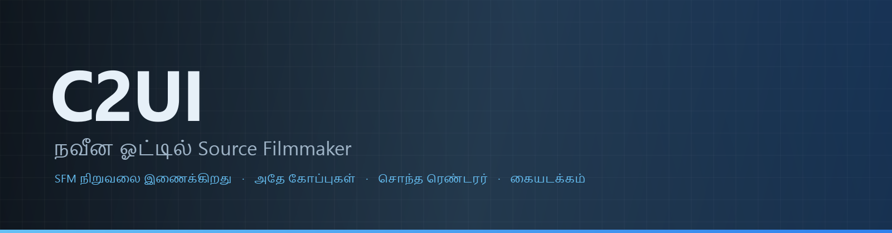

<details align="center"><summary>&nbsp;🌐 <b>🇮🇳 தமிழ்</b> &nbsp;·&nbsp; <sub>Language · Язык · 語言 · Idioma · Sprache · भाषा · لغة</sub></summary>

<table align="center">
<tr><td align="center"><a href="../../README.md">🇷🇺<br>Русский</a></td><td align="center"><a href="../README/EN-en.md">🇬🇧<br>English</a></td><td align="center"><a href="../README/PL-pl.md">🇵🇱<br>Polski</a></td><td align="center"><a href="../README/UK-ua.md">🇺🇦<br>Українська</a></td><td align="center"><a href="../README/DE-de.md">🇩🇪<br>Deutsch</a></td><td align="center"><a href="../README/RO-md.md">🇲🇩<br>Moldovenească</a></td><td align="center"><a href="../README/SL-si.md">🇸🇮<br>Slovenščina</a></td><td align="center"><a href="../README/BE-by.md">🇧🇾<br>Беларуская</a></td></tr>
<tr><td align="center"><a href="../README/KK-kz.md">🇰🇿<br>Қазақша</a></td><td align="center"><a href="../README/JA-jp.md">🇯🇵<br>日本語</a></td><td align="center"><a href="../README/ZH-cn.md">🇨🇳<br>中文</a></td><td align="center"><a href="../README/SV-se.md">🇸🇪<br>Svenska</a></td><td align="center"><a href="../README/ES-es.md">🇪🇸<br>Español</a></td><td align="center"><a href="../README/HI-in.md">🇮🇳<br>हिन्दी</a></td><td align="center"><a href="../README/PT-pt.md">🇵🇹<br>Português</a></td><td align="center"><a href="../README/BN-bd.md">🇧🇩<br>বাংলা</a></td></tr>
<tr><td align="center"><a href="../README/FR-fr.md">🇫🇷<br>Français</a></td><td align="center"><a href="../README/TE-in.md">🇮🇳<br>తెలుగు</a></td><td align="center"><a href="../README/MR-in.md">🇮🇳<br>मराठी</a></td><td align="center"><b>🇮🇳<br>தமிழ்</b></td><td align="center"><a href="../README/TR-tr.md">🇹🇷<br>Türkçe</a></td><td align="center"><a href="../README/UR-pk.md">🇵🇰<br>اردو</a></td><td align="center"><a href="../README/VI-vn.md">🇻🇳<br>Tiếng Việt</a></td><td align="center"><a href="../README/GU-in.md">🇮🇳<br>ગુજરાતી</a></td></tr>
<tr><td align="center"><a href="../README/IT-it.md">🇮🇹<br>Italiano</a></td><td align="center"><a href="../README/KO-kr.md">🇰🇷<br>한국어</a></td><td align="center"><a href="../README/AR-sa.md">🇸🇦<br>العربية</a></td><td align="center"><a href="../README/JV-id.md">🇮🇩<br>Basa Jawa</a></td><td align="center"><a href="../README/ML-in.md">🇮🇳<br>മലയാളം</a></td><td align="center"><a href="../README/NE-np.md">🇳🇵<br>नेपाली</a></td><td align="center"><a href="../README/UZ-uz.md">🇺🇿<br>Oʻzbekcha</a></td><td align="center"><a href="../README/OR-in.md">🇮🇳<br>ଓଡ଼ିଆ</a></td></tr>
</table>

</details>

<p align="center"></p>

<p align="center">
  
  
  
  
  <a href="../../Testing"></a>
  
  <a href="../LICENSE/TA-in.md"></a>
</p>

<p align="center"><b>C2UI</b> — <i>Custom to User Interface</i> — நவீன ஓட்டில் Source Filmmaker எடிட்டர்: அதே உள்ளடக்கம், அதே அமர்வு வடிவம், அதே தரவு மாதிரி, Steam நூலகம் மற்றும் Unreal Engine 5 எடிட்டர் பாணியிலான இடைமுகம்.</p>

---

## தயார்நிலை

<p align="center"></p>

<p align="center"><a href="../READINESS/TA-in.md"></a></p>

## யோசனை

Source Filmmaker ஒரு வலுவான கருவி, ஆனால் அதன் இடைமுகம் 2012-லேயே தங்கிவிட்டது. C2UI அதை மாற்றவோ மீண்டும் உருவாக்கவோ இல்லை: நோக்கம் SFM ஐ சற்று நவீனமாகவும் வசதியாகவும் ஆக்குவதே.

எடிட்டர் நிறுவப்பட்ட SFM ஐக் கண்டறிந்து, அதை உள்ளடக்க நூலகமாக இணைக்கிறது — மாதிரிகள், பொருட்கள், அமைப்புகள், அமர்வுகள் — அதே கோப்புகளுடன் அதே வடிவத்தில் வேலை செய்கிறது. SFM இல் செய்த அனைத்தும் C2UI இல் திறக்கும், மறுபுறமும் அப்படியே.

முதல் இலக்கு எலும்புகள் மற்றும் ரிக்குகள் உட்பட SFM உடன் முழு இணக்கம். அதன் பிறகு — SFM இல் இல்லாதவை.

```
  ┌──────────────┐                       ┌──────────────────────────────┐
  │   C2UI       │ ──── "SFM எங்கே?" ────▶│  SourceFilmmaker/game/       │
  │              │                       │    usermod/gameinfo.txt      │
  │  சொந்த UI     │ ◀─────── ஏற்றம் ────────│    tf/  hl2/  tf_movies/ …   │
  │  சொந்த ரெண்டர்  │      படிக்க மட்டும்      │    models/ materials/ dmx    │
  └──────────────┘                       └──────────────────────────────┘
```

- **கையடக்கம்.** பயன்பாட்டு கோப்புறைக்கு வெளியே எதுவும் எழுதப்படாது: அமைப்புகள் `App/User`, கேஷ் `App/Cache`, தற்காலிகம் `App/Temporary`. கோப்புறையை நீக்குங்கள், தடயம் இல்லை.
- **SFM ஐ ஒருபோதும் இயக்காது.** இயக்க செயல்முறை இல்லை, கைப்பற்ற சாளரங்கள் இல்லை. நிறுவல் உள்ளடக்க தொகுப்பாகப் படிக்கப்படுகிறது.
- **வடிவங்கள் சரிபார்க்கப்பட்டன, ஊகிக்கப்படவில்லை.** ஒவ்வொரு ரீடரும் உண்மையான நிறுவலுடன் சரிபார்க்கப்பட்டது; வடிவம் ஆச்சரியமானதைச் செய்யும் இடத்தில், குறியீடு சொல்கிறது.
- **சேமிப்பு துல்லியம்.** மாற்றமின்றி படித்து எழுதிய அமர்வு அதே கோப்பு.
- **எஞ்சினுக்கு சார்புகள் இல்லை.** `Core/` மற்றும் முழு சோதனைத் தொகுப்பும் தூய Python இல் இயங்கும்; சாளரத்திற்கு மட்டும் Qt மற்றும் OpenGL தேவை.

<p align="center"><br><sub>இன்றைய எடிட்டர், Valve இன் Meet the Heavy திறந்து: காலக்கோட்டில் ஷாட்கள் மற்றும் ஒலி, அமர்வு மரம், முதல் ஷாட் அதன் சொந்த கேமரா வழியாக, அமர்வின்படி நிலை மற்றும் முகங்களுடன் கதாபாத்திரங்கள்.</sub></p>

## அமைப்பு

```
C2UI_SDK/
├── README.md
├── Core/               எஞ்சின்: வடிவங்கள், மெய்நிகர் கோப்பு முறைமை, அட்டவணை, பாலங்கள்
│   ├── API/            திருத்தி, கருவிகள், செருகுநிரல்களுக்கான ஒப்பந்தம்
│   ├── Code/           எஞ்சின்: அனிமேஷன், ஆபரேட்டர்கள், முகங்கள், திருத்தம்
│   │   └── formats/    Valve படிப்பான்கள்: mdl vvd vtx vmt vtf dmx bsp
│   └── dev-kit/        SDK இடங்கள் (வெற்று) மற்றும் நிறுவல் பாலங்கள்
├── App/                எடிட்டர்: உள்ளடக்க நூலகம், ரெண்டரர், சாளரம்
│   ├── Code/           உள்ளடக்க நூலகம், சாளரம், அமைப்புகள்
│   │   ├── render/     காட்சி, OpenGL ரெண்டரர், ஷேடர்கள், கேமரா
│   │   └── ui/         காலவரிசை, அமர்வு மரம், ஆய்வாளர், வரைபடத் திருத்தி, டாக்கிங்
│   ├── Data/           நிரல் வளங்கள், படிக்க மட்டும்
│   ├── User/           பயனர் தரவு — ஒருபோதும் நீக்கப்படாது
│   └── Cache/          உள்ளடக்க அட்டவணை, ஷேடர்கள், சிறுபடங்கள்
├── Tools/              உள்ளூர்மயமாக்கல், UI கருவிகள், செருகுநிரல்கள் (பின்னர்)
│   ├── Launcher/       லாஞ்சர்
│   ├── Market Load/    செருகுநிரல் சந்தை கிளையண்ட் (பின்னர்)
│   ├── Localization/   மொழிபெயர்ப்புகளை உருவாக்குதல்
│   ├── NewPlugins/     செருகுநிரல்களை உருவாக்குதல்
│   └── UI/             தீம்களும் பணியிடங்களும்
├── Testing/            சோதனைகள், பைட்-துல்லிய ஃபிக்ஸ்சர்கள், ஒரு ரன்னர்
│   ├── core/           எஞ்சின்
│   ├── app/            திருத்தி
│   └── fixtures/       போலி நிறுவல், மாதிரிகள், அமைப்புகள்
└── GIT&DOCK/           README, தயார்நிலை, உரிமம் 32 மொழிகளில்
```

### இது எப்படி வேலை செய்கிறது

«Source Filmmaker எங்கே?» என்பதிலிருந்து திரையில் ஒரு பிரேம் வரையிலான பாதை ஐந்து அடுக்குகள் வழியாகச் செல்கிறது; ஒவ்வொரு அடுக்கும் தனக்குக் கீழுள்ள அடுக்கை மட்டுமே அறியும்.

1. **பாலம்** (`Core/dev-kit/bridge_sfm`) Steam வழியாக நிறுவலைக் கண்டறிந்து, `gameinfo.txt` ஐப் படித்து, எஞ்சின் வரிசையில் உள்ளடக்கப் பாதைகளைத் தருகிறது. `sfm.exe` ஒருபோதும் இயக்கப்படுவதில்லை.
2. **மெய்நிகர் கோப்பு முறைமையும் அட்டவணையும்** (`Core/Code/vfs.py`, `content_index.py`) அந்தப் பாதைகளை Source போலவே அடுக்குகின்றன: முதலில் கிடைத்த கோப்பு வெல்லும். அட்டவணை `App/Cache` இல் ஒரே ஒரு SQLite கோப்பு, எனவே 70 000 கோப்புகளின் சுற்று ஒருமுறை மட்டுமே.
3. **வடிவங்கள்** (`Core/Code/formats`) மூன்றாம் தரப்பு நூலகங்கள் இன்றி Valve கோப்புகளைப் படிக்கின்றன: `.mdl` `.vvd` `.vtx` ஒரு மாதிரி, `.vmt` `.vtf` பொருளும் அமைப்பும், `.dmx` ஒரு அமர்வு, `.bsp` ஒரு வரைபடம். ஒவ்வொரு படிப்பானும் முழு நிறுவலிலும் சரிபார்க்கப்பட்டது; அமர்வு பைட்டுக்கு பைட் அப்படியே திரும்ப எழுதப்படுகிறது.
4. **அமர்வு** என்பது DMX உறுப்புகளின் வரைபடம். `animation.py` ஒரு கணத்தில் சேனல்களைக் கணக்கிடுகிறது, `operators.py` கோவைகளையும் ரிக் கட்டுப்பாடுகளையும் இயக்குகிறது, `flex.py` முகங்களை அசைக்கிறது, `pose.py` எலும்பு அணிகளை உருவாக்குகிறது. ஒவ்வொரு திருத்தமும் `editing.py` வழியாக மீளக்கூடிய கட்டளையாகச் செல்கிறது.
5. **திருத்தி** (`App/Code`) இதிலிருந்து ஒரு காட்சியை (`render/scene.py`) உருவாக்கி, தனது சொந்த OpenGL 3.3 ரெண்டரரால் (`renderer.py`, `shaders.py`) வரைகிறது: அமர்வு விளக்குகள், லைட்மேப்கள், வரைபட ஒளி — SFM காட்டுவது போலவே. பலகங்கள் (`ui/`): காலவரிசை, அமர்வு மரம், ஆய்வாளர், வரைபடத் திருத்தி, UE5 பாணி டாக்கிங்.

நிரல் எழுதும் அனைத்தும் அதன் கோப்புறையிலேயே இருக்கும்: அமைப்புகள் `App/User` இல், அட்டவணையும் தற்காலிகச் சேமிப்பும் `App/Cache` இல், பதிவு `App/Temporary` இல். `Core/` எதையும் எழுதுவதில்லை, Qt ஐச் சார்ந்திருப்பதுமில்லை; எனவே எஞ்சினும் சோதனைகளும் வெறும் Python இல் இயங்குகின்றன; Qt உம் OpenGL உம் சாளரத்திற்கு மட்டுமே தேவை. `Tools/` இல் உள்ள கருவிகள் கண்டிப்பாக `Core/API` மீது கட்டப்பட்டுள்ளன — அந்த API மூன்றாம் தரப்பு செருகுநிரல்களுக்கும் போதுமானது என்பது இப்படியே நிரூபிக்கப்படுகிறது.

<p align="center"><br><sub>நிறுவலிலிருந்து சீரற்று தேர்ந்தெடுத்த அறுபத்து நான்கு மாதிரிகள், C2UI இன் சொந்த ரெண்டரரால் வரையப்பட்டவை.</sub></p>

### இயக்குதல்

Windows, Python 3.13 மற்றும் Source Filmmaker நிறுவல் தேவை.

```bash
git clone https://github.com/Arkomiko/SFM_C2UI.git
cd SFM_C2UI
python -m venv .venv
.venv/Scripts/python.exe -m pip install -r Tools/Launcher/requirements.txt
.venv/Scripts/python.exe Tools/Launcher/c2ui.py
```

முதல் தொடக்கத்தில் Steam வழியாக SFM ஐத் தேடுகிறது; கிடைக்காவிட்டால் கேட்கிறது. <kbd>Ctrl</kbd>+<kbd>O</kbd> அமர்வைத் திறக்கிறது, <kbd>Space</kbd> ப்ளே, <kbd>C</kbd> ஷாட் கேமரா, <kbd>T</kbd>/<kbd>R</kbd> நகர்த்து/சுழற்று, <kbd>M</kbd> மோஷன் எடிட்டர், <kbd>Ctrl</kbd>+<kbd>Z</kbd> செயல்தவிர், <kbd>Ctrl</kbd>+<kbd>S</kbd> சேமி. பேனல்கள் தலைப்பால் இழுக்கப்படுகின்றன. சோதனைகளுக்கு எதுவும் தேவையில்லை:

```bash
python Testing/run.py
```

### திட்டத்தில்

**அடுத்து**
- வரைபடத்தின் தோற்றம்: நீர், prop_dynamic, விளக்குகளின் கோபோ அமைப்புகள், `$bumpmap` மற்றும் `$envmap`, அமர்வு விளக்குகளின் நிழல்கள்.
- ஏற்றுமதி செய்த திரைப்படங்களில் ஒலி.
- `.c2plg` செருகுநிரல்களும் `Tools/Market Load` இல் சந்தை கிளையண்டும்; பின்னர் தீம்களும் பணியிடங்களும்.
- காலவரிசையில் ஒலி, துகள்கள், சுருக்க வரைபடங்கள், மோஷன் திருத்தியின் முன்னமைவுகளும் அடுக்குகளும், வரைபடத் திருத்தியில் தொடுகோடுகள்.

**பின்னர்**
- முழு வரைபடங்களில் செயல்திறன்: நிலையான ப்ராப் இன்ஸ்டன்சிங், போஸ் தற்காலிகச் சேமிப்பு.
- எஞ்சின் மறுசீரமைப்பு: மேம்பட்ட ஒளியும் நிழலும் தரும் புதிய வரைபடத் தொகுப்பு அளவுருக்கள், 120 000 அலகு வரைபட வரம்பு.
- சொந்த Python உடனும் தன்னிச்சையான புதுப்பிப்புடனும் தொகுக்கப்பட்ட துவக்கி; திருத்தியின் மொழிபெயர்ப்பு.

## உரிமம் மற்றும் நன்றி

C2UI இன் சொந்தக் குறியீடு **C2UI உரிமத்தின்** கீழ்: தனிப்பட்ட மற்றும் வணிகமற்ற பயன்பாட்டுக்கு இலவசம்; வணிகப் பயன்பாடு ஆசிரியரின் எழுத்துப்பூர்வ ஒப்புதலுடன் மட்டுமே; மாற்றப்பட்ட பதிப்புகள் அசல் திட்டத்தையும் ஆசிரியர் Arkomiko ஐயும் குறிப்பிட வேண்டும். செருகுநிரல்களும் துணை நிரல்களும் **C2UI — Plugins & Addons (C2UI‑Pl&AD)** உரிமத்தின் கீழ்.

Source Filmmaker, Team Fortress 2, Source எஞ்சின் Valve க்கு சொந்தம்; திட்டம் அவற்றின் வடிவங்களைப் படிக்கிறது, அவற்றின் கோப்புகளைச் சேர்க்காது, Steam இல் உங்கள் சொந்த SFM நகலுடன் மட்டுமே வேலை செய்கிறது.

<p align="center"><a href="../LICENSE/TA-in.md"></a></p>
