<p align="center"></p>

<details align="center"><summary>&nbsp;🌐 <b>🇮🇳 తెలుగు</b> &nbsp;·&nbsp; <sub>Language · Язык · 語言 · Idioma · Sprache · भाषा · لغة</sub></summary>

<table align="center">
<tr><td align="center"><a href="../../README.md">🇷🇺<br>Русский</a></td><td align="center"><a href="EN-en.md">🇬🇧<br>English</a></td><td align="center"><a href="PL-pl.md">🇵🇱<br>Polski</a></td><td align="center"><a href="UK-ua.md">🇺🇦<br>Українська</a></td><td align="center"><a href="DE-de.md">🇩🇪<br>Deutsch</a></td><td align="center"><a href="RO-md.md">🇲🇩<br>Moldovenească</a></td><td align="center"><a href="SL-si.md">🇸🇮<br>Slovenščina</a></td><td align="center"><a href="BE-by.md">🇧🇾<br>Беларуская</a></td></tr>
<tr><td align="center"><a href="KK-kz.md">🇰🇿<br>Қазақша</a></td><td align="center"><a href="JA-jp.md">🇯🇵<br>日本語</a></td><td align="center"><a href="ZH-cn.md">🇨🇳<br>中文</a></td><td align="center"><a href="SV-se.md">🇸🇪<br>Svenska</a></td><td align="center"><a href="ES-es.md">🇪🇸<br>Español</a></td><td align="center"><a href="HI-in.md">🇮🇳<br>हिन्दी</a></td><td align="center"><a href="PT-pt.md">🇵🇹<br>Português</a></td><td align="center"><a href="BN-bd.md">🇧🇩<br>বাংলা</a></td></tr>
<tr><td align="center"><a href="FR-fr.md">🇫🇷<br>Français</a></td><td align="center"><b>🇮🇳<br>తెలుగు</b></td><td align="center"><a href="MR-in.md">🇮🇳<br>मराठी</a></td><td align="center"><a href="TA-in.md">🇮🇳<br>தமிழ்</a></td><td align="center"><a href="TR-tr.md">🇹🇷<br>Türkçe</a></td><td align="center"><a href="UR-pk.md">🇵🇰<br>اردو</a></td><td align="center"><a href="VI-vn.md">🇻🇳<br>Tiếng Việt</a></td><td align="center"><a href="GU-in.md">🇮🇳<br>ગુજરાતી</a></td></tr>
<tr><td align="center"><a href="IT-it.md">🇮🇹<br>Italiano</a></td><td align="center"><a href="KO-kr.md">🇰🇷<br>한국어</a></td><td align="center"><a href="AR-sa.md">🇸🇦<br>العربية</a></td><td align="center"><a href="JV-id.md">🇮🇩<br>Basa Jawa</a></td><td align="center"><a href="ML-in.md">🇮🇳<br>മലയാളം</a></td><td align="center"><a href="NE-np.md">🇳🇵<br>नेपाली</a></td><td align="center"><a href="UZ-uz.md">🇺🇿<br>Oʻzbekcha</a></td><td align="center"><a href="OR-in.md">🇮🇳<br>ଓଡ଼ିଆ</a></td></tr>
</table>

</details>

<p align="center">
  
  
  
  
  <a href="../../Testing"></a>
  
</p>

<p align="center"><b>C2UI</b> — <i>Custom to User Interface</i> — — ఆధునిక షెల్‌లో Source Filmmaker ఎడిటర్: అదే కంటెంట్, అదే సెషన్ ఫార్మాట్, అదే డేటా మోడల్, Steam లైబ్రరీ మరియు Unreal Engine 5 ఎడిటర్ శైలిలో ఇంటర్‌ఫేస్.</p>

---

## సిద్ధత

<p align="center"></p>

<p align="center"> <b>విడుదలకు మొత్తం సిద్ధత: 49%</b></p>

<p align="center"><a href="../assets/TE-in/sidebar.md"></a></p>

## ఆలోచన

Source Filmmaker బలమైన సాధనం, కానీ దాని ఇంటర్‌ఫేస్ 2012లోనే ఉండిపోయింది. C2UI దాన్ని భర్తీ చేయదు, తిరిగి తయారు చేయదు: లక్ష్యం SFM ను కొంచెం ఆధునికంగా, సౌకర్యవంతంగా చేయడమే.

ఎడిటర్ ఇన్‌స్టాల్ చేసిన SFM ను కనుగొని, దాన్ని కంటెంట్ లైబ్రరీగా జతచేస్తుంది — మోడల్స్, మెటీరియల్స్, టెక్స్చర్లు, సెషన్లు — అదే ఫైళ్లతో అదే ఫార్మాట్‌లో పనిచేస్తుంది. SFM లో చేసినదంతా C2UI లో తెరుచుకుంటుంది, తిరిగి కూడా.

మొదటి లక్ష్యం ఎముకలు, రిగ్‌లతో సహా SFM తో పూర్తి అనుకూలత. తర్వాత — SFM లో లోపించినవి.

```
  ┌──────────────┐    "SFM ఎక్కడ?"    ┌──────────────────────────────┐
  │   C2UI       │ ─────────────────────▶│  SourceFilmmaker/game/       │
  │              │                       │    usermod/gameinfo.txt      │
  │  సొంత UI     │ ◀─────   మౌంట్    ───────│    tf/  hl2/  tf_movies/ …   │
  │  సొంత రెండర్  │      చదవడం మాత్రమే      │    models/ materials/ dmx    │
  └──────────────┘                       └──────────────────────────────┘
```

<p align="center"><br><sub>నేటి ఎడిటర్, Valve యొక్క Meet the Heavy తెరిచి: టైమ్‌లైన్‌లో షాట్లు మరియు ధ్వని, సెషన్ ట్రీ, మొదటి షాట్ దాని సొంత కెమెరా ద్వారా, సెషన్ ప్రకారం భంగిమలు మరియు ముఖాలతో పాత్రలు.</sub></p>

## ఏది భిన్నం

- **పోర్టబుల్.** అప్లికేషన్ ఫోల్డర్ వెలుపల ఏమీ రాయబడదు: సెట్టింగ్‌లు `App/User`, క్యాష్ `App/Cache`, తాత్కాలికం `App/Temporary`. ఫోల్డర్ తొలగించండి, ఆనవాళ్లు లేవు.
- **SFM ను ఎప్పుడూ నడపదు.** నడిపించే ప్రాసెస్ లేదు, స్వాధీనం చేసుకునే విండోలు లేవు. ఇన్‌స్టాలేషన్ కంటెంట్ ప్యాక్ లాగా చదవబడుతుంది.
- **ఫార్మాట్లు ధృవీకరించబడ్డాయి, ఊహించలేదు.** ప్రతి రీడర్ నిజమైన ఇన్‌స్టాలేషన్‌తో తనిఖీ చేయబడింది; ఫార్మాట్ ఆశ్చర్యకరమైనది చేస్తే, కోడ్ చెబుతుంది.
- **సేవ్ ఖచ్చితం.** మార్పు లేకుండా చదివి రాసిన సెషన్ అదే ఫైల్.
- **ఇంజిన్‌కు డిపెండెన్సీలు లేవు.** `Core/` మరియు మొత్తం టెస్ట్ సూట్ స్వచ్ఛమైన Python పై నడుస్తాయి; విండోకు మాత్రమే Qt మరియు OpenGL కావాలి.

## నడపడం

Windows, Python 3.13 మరియు Source Filmmaker ఇన్‌స్టాలేషన్ అవసరం.

```bash
git clone https://github.com/Arkomiko/SFM_C2UI.git
cd SFM_C2UI
python -m venv .venv
.venv/Scripts/python.exe -m pip install -r Tools/Launcher/requirements.txt
.venv/Scripts/python.exe Tools/Launcher/c2ui.py
```

మొదటి ప్రారంభంలో Steam ద్వారా SFM ను వెతుకుతుంది; దొరకకపోతే అడుగుతుంది. <kbd>Ctrl</kbd>+<kbd>O</kbd> సెషన్ తెరుస్తుంది, <kbd>Space</kbd> ప్లే, <kbd>C</kbd> షాట్ కెమెరా, <kbd>T</kbd>/<kbd>R</kbd> మూవ్/రొటేట్, <kbd>M</kbd> మోషన్ ఎడిటర్, <kbd>Ctrl</kbd>+<kbd>Z</kbd> అన్‌డు, <kbd>Ctrl</kbd>+<kbd>S</kbd> సేవ్. ప్యానెల్‌లు శీర్షిక ద్వారా లాగబడతాయి. పరీక్షలకు ఏమీ అవసరం లేదు:

```bash
python Testing/run.py
```

## నిర్మాణం

```
C2UI_SDK/
├── README.md
├── Core/              ఇంజిన్: ఫార్మాట్లు, వర్చువల్ ఫైల్ సిస్టమ్, ఇండెక్స్, బ్రిడ్జ్‌లు
├── App/               ఎడిటర్: కంటెంట్ లైబ్రరీ, రెండరర్, విండో
├── Tools/             స్థానికీకరణ, UI టూల్స్, ప్లగిన్‌లు (తర్వాత)
│   └── Launcher/      లాంచర్
├── Testing/           పరీక్షలు, బైట్-ఖచ్చిత ఫిక్స్చర్లు, ఒక రన్నర్
└── GIT&DOCK/          ఈ README ఇతర భాషల్లో
```

## రోడ్‌మ్యాప్

1. **Source షేడింగ్** — SFM గీసినట్లు VertexLitGeneric: phong, rim, lightwarp, సీన్ లైట్లు.
2. **మ్యాప్‌లు** — నేపథ్యాల కోసం `.bsp`.
3. **అవుట్‌పుట్** — చిత్రం మరియు వీడియో ఎగుమతి.
4. **ప్లగిన్‌లు** — `.c2plg` ఫార్మాట్; తర్వాత థీమ్‌లు మరియు వర్క్‌స్పేస్‌లు.

## లైసెన్స్ మరియు కృతజ్ఞతలు

C2UI సొంత కోడ్ **C2UI లైసెన్స్** కింద ఉంది: వ్యక్తిగత, వాణిజ్యేతర ఉపయోగానికి స్వేచ్ఛ; వాణిజ్య ఉపయోగం రచయిత లిఖిత అనుమతితో మాత్రమే; మార్చిన వెర్షన్లు మూల ప్రాజెక్ట్‌ను, రచయిత Arkomiko ను పేర్కొనాలి. ప్లగిన్‌లు, యాడాన్‌లు **C2UI — Plugins & Addons (C2UI‑Pl&AD)** లైసెన్స్ కింద.

Source Filmmaker, Team Fortress 2, Source ఇంజిన్ Valve వి; ప్రాజెక్ట్ వాటి ఫార్మాట్లు చదువుతుంది, వాటి ఫైళ్లు చేర్చదు, Steam నుండి మీ సొంత SFM కాపీతో మాత్రమే పనిచేస్తుంది.

<p align="center"><a href="../LICENSE/TE-in.md"></a></p>

<p align="center"><br><sub>ఇన్‌స్టాలేషన్ నుండి యాదృచ్ఛికంగా ఎంచుకున్న అరవై నాలుగు మోడల్స్, C2UI సొంత రెండరర్‌తో గీసినవి.</sub></p>
